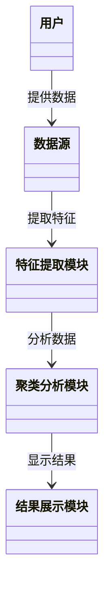
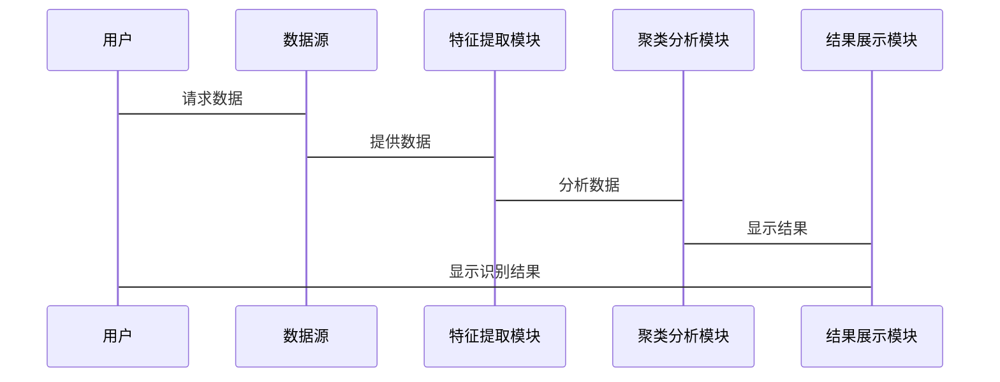

                 


# 运用AI智能体群体识别巴菲特式的行业领导者

## 关键词：AI智能体、行业领导者、巴菲特投资理念、群体识别、数据驱动投资、AI算法

## 摘要：  
本文详细探讨了如何利用AI智能体群体识别巴菲特式的行业领导者。通过分析巴菲特的投资理念，结合AI技术的最新进展，提出了基于聚类分析和深度学习的行业领导者识别算法。文章内容涵盖问题背景、核心概念、算法原理、系统设计和项目实战，为读者提供了一套完整的解决方案。

---

## 第1章：问题背景与描述

### 1.1 问题背景

#### 1.1.1 传统投资分析的局限性  
传统投资分析依赖于分析师的个人经验和主观判断，难以应对海量数据和复杂市场环境的变化。这种方法在面对新兴行业和快速变化的市场时显得力不从心。

#### 1.1.2 AI技术在投资领域的应用潜力  
AI技术能够处理海量数据，识别复杂模式，提供实时反馈，为投资决策提供支持。通过机器学习和深度学习，AI可以发现人类难以察觉的市场趋势和机会。

#### 1.1.3 巴菲特投资理念的可量化特征  
巴菲特的投资理念强调企业护城河、长期盈利能力和社会责任。这些理念可以通过财务数据、市场表现和公司治理等指标进行量化分析。

### 1.2 问题描述

#### 1.2.1 什么是巴菲特式的行业领导者  
巴菲特式的行业领导者是指那些在各自行业中具有强大竞争优势、持续盈利能力和社会责任感的企业。

#### 1.2.2 AI智能体群体识别的目标与意义  
目标是通过AI技术，识别出具有巴菲特式特征的行业领导者。意义在于提高投资决策的科学性和准确性，降低人为判断的误差。

#### 1.2.3 当前行业领导者识别的痛点与难点  
痛点包括数据复杂性、市场动态变化和个体经验的局限性。难点在于如何将巴菲特的投资理念转化为可量化的指标，并利用AI技术进行识别。

### 1.3 问题解决

#### 1.3.1 AI智能体在行业领导者识别中的作用  
AI智能体能够处理海量数据，发现潜在模式，提供实时反馈，帮助投资者识别行业领导者。

#### 1.3.2 数据驱动的投资决策方法  
通过分析企业的财务数据、市场表现和行业地位，利用AI技术进行数据驱动的决策。

#### 1.3.3 群体智能与个体智慧的结合  
群体智能通过多个智能体的协同工作，提高识别的准确性和鲁棒性，个体智能则提供个性化分析。

### 1.4 问题的边界与外延

#### 1.4.1 行业领导者识别的适用范围  
适用于科技、金融、制造等行业，帮助投资者识别具有长期竞争优势的企业。

#### 1.4.2 AI智能体群体识别的边界条件  
数据质量、模型泛化能力、计算资源等是AI智能体识别的边界条件。

#### 1.4.3 相关概念的对比与区分  
群体智能与个体智能的区分，AI智能体与传统算法的区别。

---

## 第2章：核心概念与联系

### 2.1 AI智能体的核心原理

#### 2.1.1 AI智能体的基本架构  
AI智能体由感知层、决策层和执行层组成，能够感知环境、做出决策并执行动作。

#### 2.1.2 群体智能与个体智能的协同机制  
通过多个智能体的协同工作，群体智能能够做出更优的决策。

#### 2.1.3 智能体的决策过程与学习机制  
基于强化学习和监督学习，智能体能够不断优化决策策略。

### 2.2 巴菲特投资理念的可量化特征

#### 2.2.1 企业护城河的量化指标  
包括市场占有率、品牌价值、技术壁垒等。

#### 2.2.2 企业竞争优势的评估模型  
构建财务指标、市场表现和行业地位的综合评估模型。

### 2.3 AI智能体与巴菲特理念的结合

#### 2.3.1 智能体在企业竞争优势评估中的应用  
通过分析企业数据，识别具有竞争优势的企业。

#### 2.3.2 群体智能在投资决策中的优势  
群体智能能够发现潜在的投资机会，降低决策风险。

#### 2.3.3 AI智能体群体识别的实现路径  
通过数据采集、特征提取、智能体协同分析，最终识别出行业领导者。

### 2.4 核心概念对比表格

| 概念 | 定义 | 特征 | 应用 |
|------|------|------|------|
| AI智能体 | 具备感知和决策能力的实体 | 数据驱动、自适应 | 投资决策 |
| 巴菲特理念 | 以企业护城河为核心的投资策略 | 长期价值、安全性 | 投资评估 |

---

## 第3章：算法原理

### 3.1 基于聚类分析的行业领导者识别算法

#### 3.1.1 聚类分析流程  
通过数据预处理、特征提取、聚类分析和结果分析，识别出具有相似特征的企业群体。

#### 3.1.2 Python代码实现  
```python
from sklearn.cluster import KMeans
import pandas as pd

# 数据预处理
data = pd.read_csv('entreprise.csv')
features = data[['市盈率', 'ROE', '收入增长率']].values

# 聚类分析
kmeans = KMeans(n_clusters=3, random_state=42)
clusters = kmeans.fit_predict(features)

# 结果分析
print('聚类结果:', clusters)
```

#### 3.1.3 数学模型  
K-means算法的目标函数为：$$\arg \min_{k} \sum_{i=1}^{k} \sum_{j=1}^{n_i} \|x_j - c_i\|^2$$

### 3.2 基于深度学习的领导者识别模型

#### 3.2.1 LSTM网络结构  
通过LSTM模型分析时间序列数据，预测企业的未来表现。

#### 3.2.2 PyTorch代码实现  
```python
import torch
import torch.nn as nn

# 定义模型
class LSTM(nn.Module):
    def __init__(self, input_size, hidden_size):
        super(LSTM, self).__init__()
        self.lstm = nn.LSTM(input_size, hidden_size, batch_first=True)
        self.fc = nn.Linear(hidden_size, 1)

    def forward(self, x):
        out, _ = self.lstm(x)
        out = self.fc(out[:, -1, :])
        return out

# 训练模型
model = LSTM(3, 5)
criterion = nn.MSELoss()
optimizer = torch.optim.Adam(model.parameters(), lr=0.001)

# 模型训练
for epoch in range(100):
    outputs = model(inputs)
    loss = criterion(outputs, labels)
    optimizer.zero_grad()
    loss.backward()
    optimizer.step()
```

#### 3.2.3 模型优势  
LSTM能够捕捉时间序列中的长期依赖关系，适合分析企业的长期表现。

---

## 第4章：系统分析与架构设计

### 4.1 问题场景介绍  
系统旨在帮助投资者识别具有巴菲特式特征的行业领导者，提升投资决策的科学性。

### 4.2 项目介绍  
项目名称：AI智能体群体识别系统。目标：识别行业领导者。范围：科技、金融等行业。主要功能包括数据采集、特征提取、智能分析和结果展示。

### 4.3 系统功能设计  
使用Mermaid类图展示系统功能模块之间的关系。



### 4.4 系统架构设计  
使用Mermaid架构图展示系统的分层架构。


### 4.5 系统接口设计  
定义API接口，包括数据接口、算法接口和结果接口。

### 4.6 系统交互设计  
使用Mermaid序列图展示用户与系统的主要交互流程。



---

## 第5章：项目实战

### 5.1 环境安装  
安装Python、NumPy、Scikit-learn、PyTorch。

### 5.2 系统核心实现

#### 5.2.1 数据预处理代码  
```python
import pandas as pd

data = pd.read_csv('entreprise.csv')
data.head()
```

#### 5.2.2 聚类分析代码  
```python
from sklearn.cluster import KMeans
import pandas as pd

features = data[['市盈率', 'ROE', '收入增长率']].values
kmeans = KMeans(n_clusters=3, random_state=42)
clusters = kmeans.fit_predict(features)
print('聚类结果:', clusters)
```

#### 5.2.3 深度学习模型代码  
```python
import torch
import torch.nn as nn

class LSTM(nn.Module):
    def __init__(self, input_size, hidden_size):
        super(LSTM, self).__init__()
        self.lstm = nn.LSTM(input_size, hidden_size, batch_first=True)
        self.fc = nn.Linear(hidden_size, 1)

    def forward(self, x):
        out, _ = self.lstm(x)
        out = self.fc(out[:, -1, :])
        return out

model = LSTM(3, 5)
criterion = nn.MSELoss()
optimizer = torch.optim.Adam(model.parameters(), lr=0.001)

for epoch in range(100):
    outputs = model(inputs)
    loss = criterion(outputs, labels)
    optimizer.zero_grad()
    loss.backward()
    optimizer.step()
```

### 5.3 代码应用解读  
解释代码的功能和作用，帮助读者理解每一步骤的实现。

### 5.4 实际案例分析  
以科技行业为例，使用代码分析，识别出具有巴菲特式特征的企业，展示结果。

### 5.5 项目小结  
总结项目成果，指出优势和局限性，为后续优化提供方向。

---

## 第6章：最佳实践与总结

### 6.1 最佳实践tips  
数据质量的重要性，模型调优的技巧，结果验证的方法。

### 6.2 小结  
回顾文章内容，强调AI技术在识别行业领导者中的作用。

### 6.3 注意事项  
数据隐私问题，模型泛化能力，避免过度拟合。

### 6.4 拓展阅读  
推荐相关书籍和资源，如《Python机器学习》和《深度学习》。

---

## 第7章：参考文献与致谢

### 参考文献  
1. 书籍：《Python机器学习》
2. 在线资源：Kaggle数据集
3. 论文：深度学习领域的最新研究

### 致谢  
感谢读者的支持和建议，感谢在撰写过程中提供帮助的同事和朋友。

---

## 作者：AI天才研究院 & 禅与计算机程序设计艺术

