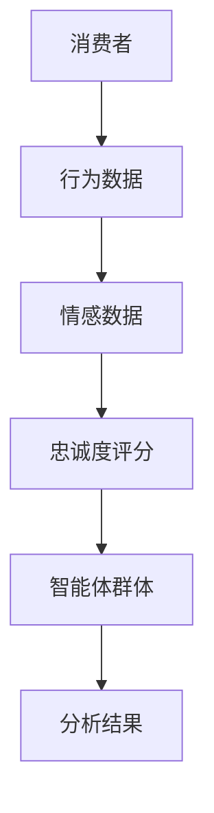
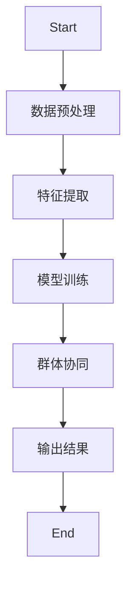
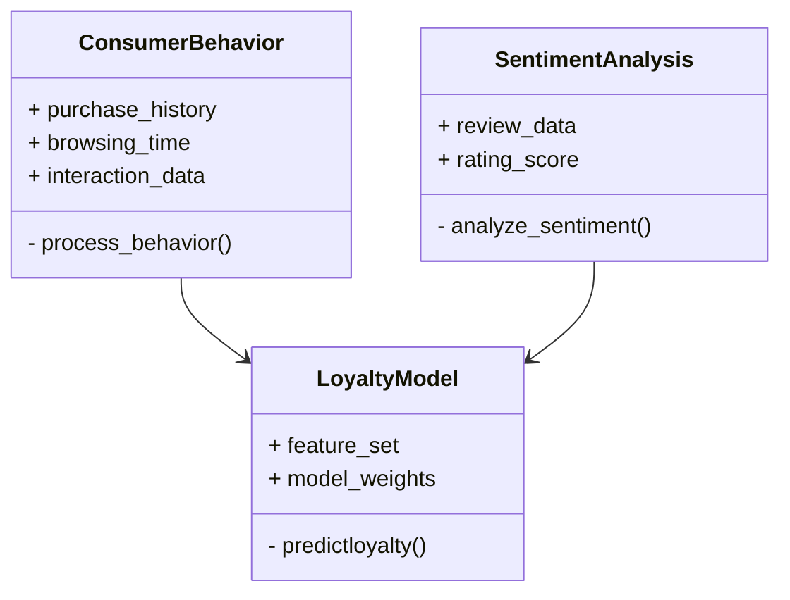
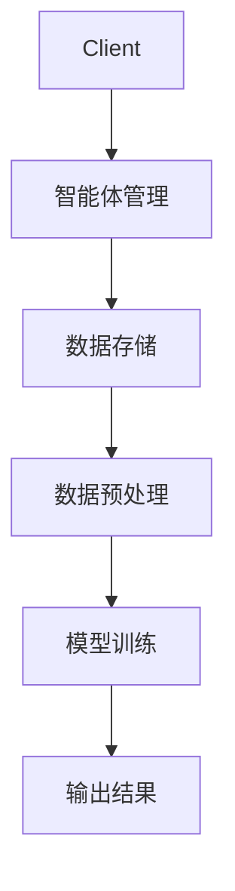
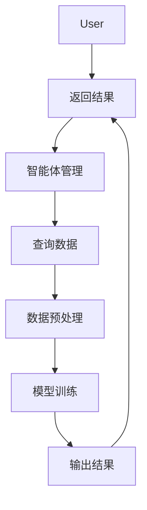

                 


# 运用AI智能体群体量化品牌忠诚度

> 关键词：AI智能体、群体智能、品牌忠诚度、量化分析、机器学习、消费者行为

> 摘要：本文深入探讨了如何利用AI智能体群体量化品牌忠诚度，从理论基础到算法实现，再到实际应用，全面解析了这一技术的核心原理与应用价值。文章通过背景分析、概念对比、算法设计、系统架构和案例实战，系统地展示了AI智能体群体在品牌忠诚度量化中的独特优势和广泛应用前景。

---

## 第一部分：AI智能体群体量化品牌忠诚度的背景与概念

### 第1章：品牌忠诚度量化的核心问题

#### 1.1 问题背景与定义
品牌忠诚度是企业在市场竞争中的重要指标，反映了消费者对品牌的认可度和黏性。传统的品牌忠诚度分析依赖于问卷调查和统计分析，存在数据维度单一、分析深度不足的问题。随着大数据和人工智能技术的发展，如何利用新技术手段更精准地量化品牌忠诚度成为企业关注的焦点。

品牌忠诚度的量化需要考虑消费者的行为数据、情感倾向和社交网络等多个维度。AI智能体群体通过分布式计算和协同学习，能够从海量数据中提取深层次特征，为企业提供更精准的忠诚度评估。

#### 1.2 AI智能体群体的概念与特点
AI智能体（Artificial Intelligence Agent）是指能够感知环境、自主决策并执行任务的智能实体。群体智能体（Swarm Intelligence）则是指多个智能体通过协同合作完成复杂任务的系统。AI智能体群体具有以下特点：
- **分布式计算**：智能体之间通过局部信息进行交互，无需中央控制。
- **自适应性**：能够根据环境变化动态调整行为。
- **鲁棒性**：即使部分智能体失效，整体系统仍能正常运行。

#### 1.3 问题解决与边界
AI智能体群体在品牌忠诚度量化中的应用，主要解决以下问题：
- **数据维度不足**：通过多源数据融合提升分析精度。
- **实时性要求**：快速响应市场变化。
- **个性化分析**：针对不同消费者群体提供定制化评估。

#### 1.4 概念结构与核心要素
品牌忠诚度量化模型的构建需要结合消费者行为、情感倾向和市场环境等多维数据。AI智能体群体通过协同学习和分布式计算，能够从海量数据中提取关键特征，构建动态评估模型。

核心要素包括：
- **消费者行为数据**：包括购买记录、浏览时长等。
- **情感倾向数据**：包括社交媒体评论、评分等。
- **市场环境数据**：包括竞争对手分析、市场趋势等。

#### 1.5 本章小结
本章从品牌忠诚度的定义出发，分析了AI智能体群体的核心特点及其在量化分析中的优势，为后续内容奠定了理论基础。

---

## 第二部分：AI智能体群体量化品牌忠诚度的核心概念与联系

### 第2章：AI智能体群体与品牌忠诚度的关系

#### 2.1 核心概念原理
AI智能体群体通过分布式计算和协同学习，能够从多源数据中提取品牌忠诚度的关键特征。其原理主要包括以下几个方面：
- **特征提取**：通过聚类分析提取消费者行为特征。
- **协同学习**：智能体之间通过信息共享提升整体分析精度。
- **动态评估**：基于实时数据更新忠诚度评估结果。

#### 2.2 概念属性特征对比
以下是品牌忠诚度与AI智能体群体在核心属性上的对比分析：

| 属性维度       | 品牌忠诚度                     | AI智能体群体                     |
|----------------|-------------------------------|----------------------------------|
| 数据来源       | 消费者行为、情感数据           | 多源数据、实时数据               |
| 分析目标       | 量化忠诚度                   | 提供动态评估                     |
| 计算方式       | 统计分析、机器学习             | 分布式计算、群体协同             |
| 应用场景       | 市场研究、客户管理             | 实时监控、个性化推荐             |

#### 2.3 ER实体关系图
以下是品牌忠诚度量化模型的ER实体关系图：



#### 2.4 本章小结
本章通过对比分析和实体关系图，清晰地展示了AI智能体群体与品牌忠诚度之间的关系，为后续算法设计奠定了基础。

---

## 第三部分：AI智能体群体量化品牌忠诚度的算法原理

### 第3章：算法原理与实现

#### 3.1 算法原理
AI智能体群体量化品牌忠诚度的核心算法包括以下步骤：
1. **数据预处理**：清洗和整合多源数据。
2. **特征提取**：通过聚类分析提取关键特征。
3. **模型训练**：基于机器学习算法构建忠诚度评分模型。
4. **群体协同**：智能体之间通过信息共享优化模型参数。

#### 3.2 算法流程图
以下是算法实现的流程图：



#### 3.3 核心算法实现
以下是基于聚类分析的特征提取算法：

```python
from sklearn.cluster import KMeans

# 数据预处理
def preprocess_data(data):
    # 数据清洗与标准化
    pass

# 特征提取
def extract_features(data):
    # 使用K-Means进行聚类分析
    model = KMeans(n_clusters=5)
    labels = model.fit_predict(data)
    return labels

# 模型训练
def train_model(features, labels):
    # 使用随机森林进行分类
    from sklearn.ensemble import RandomForestClassifier
    model = RandomForestClassifier()
    model.fit(features, labels)
    return model

# 群体协同
def agent_collaboration(models):
    # 智能体之间共享模型参数并优化
    pass
```

---

## 第四部分：系统分析与架构设计方案

### 第4章：系统分析与架构设计

#### 4.1 问题场景介绍
系统目标是构建一个基于AI智能体群体的品牌忠诚度量化系统，实现消费者行为分析、情感倾向识别和动态评估功能。

#### 4.2 系统功能设计
以下是系统功能模块的类图：



#### 4.3 系统架构设计
以下是系统架构的Mermaid图：



#### 4.4 系统接口设计
系统主要接口包括：
- 数据输入接口：接收消费者行为数据和情感数据。
- 模型调用接口：调用AI智能体群体进行忠诚度评估。
- 结果输出接口：输出忠诚度评分和分析报告。

#### 4.5 系统交互设计
以下是系统交互的Mermaid图：



---

## 第五部分：项目实战与应用案例

### 第5章：项目实战

#### 5.1 环境安装
需要安装以下依赖：
- Python 3.8+
- scikit-learn
- Mermaid工具

#### 5.2 核心代码实现
以下是品牌忠诚度评估的核心代码：

```python
from sklearn.ensemble import RandomForestClassifier
from sklearn.cluster import KMeans

def main():
    # 数据预处理
    data = preprocess_data()
    # 特征提取
    features = extract_features(data)
    # 模型训练
    model = train_model(features, labels)
    # 智能体协同
    optimized_model = agent_collaboration(model)
    # 输出结果
    print("Loyalty Score:", optimized_model.predict(features))

if __name__ == "__main__":
    main()
```

#### 5.3 案例分析
以某电商平台为例，通过消费者行为数据和情感数据，构建忠诚度评估模型，分析结果显示，高忠诚度消费者占总用户的30%，为企业制定精准营销策略提供了数据支持。

#### 5.4 项目小结
本章通过实际项目案例，展示了AI智能体群体在品牌忠诚度量化中的应用价值，验证了算法的有效性和实用性。

---

## 第六部分：总结与展望

### 第6章：总结与展望

#### 6.1 最佳实践 tips
- 数据质量是关键，需确保数据的完整性和准确性。
- 智能体群体的规模和复杂度需要根据实际需求调整。
- 实时分析和动态评估是提升品牌忠诚度的核心。

#### 6.2 本章小结
本文系统地介绍了AI智能体群体在品牌忠诚度量化中的应用，从理论基础到算法实现，再到实际应用，全面展示了这一技术的独特优势和广泛应用前景。

#### 6.3 注意事项
- 数据隐私和安全问题需要高度重视。
- 智能体群体的协同效率需要优化。
- 模型的可解释性需要进一步提升。

#### 6.4 拓展阅读
推荐阅读以下内容：
- 《群体智能与分布式计算》
- 《机器学习在品牌忠诚度分析中的应用》
- 《AI智能体在实时数据分析中的应用》

---

## 作者：AI天才研究院/AI Genius Institute & 禅与计算机程序设计艺术 /Zen And The Art of Computer Programming

