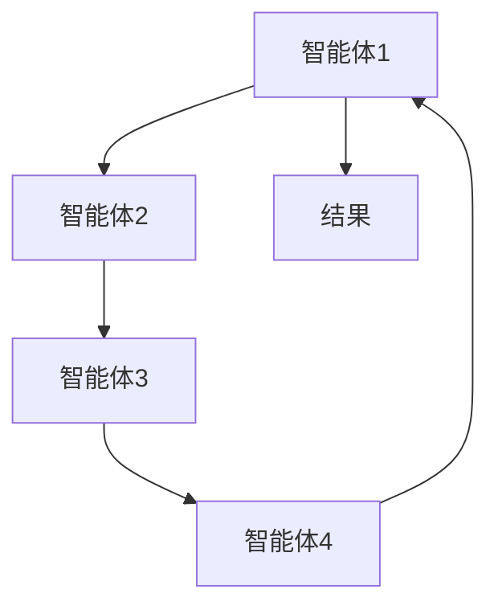
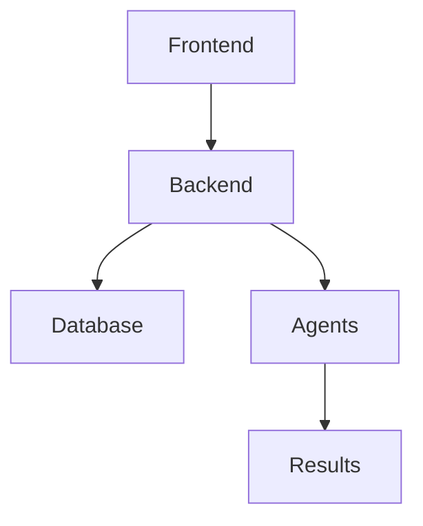

                 


# 运用多智能体AI优化巴菲特的保险业务价值评估

> 关键词：多智能体AI，保险业务，价值评估，巴菲特，人工智能，算法优化

> 摘要：本文探讨了如何运用多智能体AI技术优化巴菲特的保险业务价值评估过程。通过分析多智能体AI的核心概念、算法原理、系统架构以及实际案例，展示了多智能体AI在保险业务中的应用优势和实现方法。文章内容包括背景介绍、核心概念与联系、算法原理、系统分析与架构设计、项目实战、总结与展望等部分，详细讲解了多智能体AI在优化保险业务价值评估中的具体应用。

---

## 第1章: 多智能体AI与保险业务价值评估概述

### 1.1 多智能体AI的定义与特点
多智能体AI是一种分布式人工智能技术，由多个相互作用的智能体（Agent）组成，这些智能体通过协作和竞争来完成复杂的任务。其核心特点包括：

- **分布式性**：智能体之间独立运行，通过通信和协作完成任务。
- **自主性**：每个智能体都能自主决策，无需中央控制。
- **反应性**：能够实时感知环境并做出反应。
- **协作性**：多个智能体协同工作，共同实现目标。
- **动态性**：系统能够适应环境的变化和不确定性。

多智能体AI与传统AI的区别在于，传统AI通常是一个集中式系统，而多智能体AI强调分布式和协作式的计算。

### 1.2 保险业务价值评估的重要性
保险业务价值评估是保险公司确定保险产品价值、制定定价策略的重要环节。传统的价值评估方法依赖于人工分析和经验判断，存在效率低、精度不足的问题。多智能体AI的应用可以显著提高评估的效率和准确性。

#### 1.2.1 保险业务的基本概念
保险业务是指通过契约形式转移风险，提供风险保障的经济活动。保险业务的核心在于评估风险，并根据风险程度制定合理的保费。

#### 1.2.2 保险业务价值评估的意义
- **提高评估效率**：通过AI技术快速处理大量数据。
- **提升评估精度**：利用多智能体协作，综合考虑多种因素。
- **降低人为误差**：减少人为判断的主观性影响。

#### 1.2.3 保险业务价值评估的挑战
- **数据复杂性**：保险业务涉及大量结构化和非结构化数据。
- **不确定性**：保险业务中的风险评估需要应对未来的不确定性。
- **模型的实时性**：要求模型能够实时更新和调整。

### 1.3 多智能体AI在保险业务中的应用前景
多智能体AI在保险业务中的应用前景广阔，特别是在风险评估、定价策略和客户服务等领域。

#### 1.3.1 多智能体AI在保险业务中的潜在应用
- **风险评估**：通过多智能体协作，综合分析多种风险因素。
- **定价策略**：根据市场变化和客户需求动态调整保费。
- **客户服务**：通过智能体提供个性化的客户服务。

#### 1.3.2 多智能体AI在保险业务价值评估中的优势
- **高效性**：多智能体协作可以快速处理大量数据。
- **准确性**：通过综合分析多个因素，提高评估的准确性。
- **灵活性**：能够适应市场环境的变化。

#### 1.3.3 多智能体AI应用的挑战与机遇
- **挑战**：需要处理多智能体之间的协作和竞争，确保系统的稳定性和高效性。
- **机遇**：通过多智能体AI的应用，保险公司可以提升核心竞争力。

### 1.4 本章小结
本章介绍了多智能体AI的定义和特点，分析了保险业务价值评估的重要性及其面临的挑战，并探讨了多智能体AI在保险业务中的应用前景和优势。

---

## 第2章: 多智能体AI的核心概念与联系

### 2.1 多智能体AI的核心原理
多智能体AI的核心原理在于智能体之间的协作和通信。智能体通过共享信息和协作完成任务，同时保持各自的独立性和自主性。

#### 2.1.1 多智能体系统的定义
多智能体系统是由多个智能体组成的分布式系统，这些智能体通过通信和协作完成复杂的任务。

#### 2.1.2 多智能体系统的组成部分
- **智能体**：具有感知、决策和行动能力的个体。
- **通信机制**：智能体之间的信息交换方式。
- **协作机制**：智能体之间协同工作的规则和策略。
- **环境**：智能体所处的外部环境，包括数据源和目标。

#### 2.1.3 多智能体系统的协作机制
多智能体系统的协作机制包括任务分配、协调和同步。任务分配是将任务分配给不同的智能体，协调是确保智能体之间的协作，同步是保持智能体之间的时序一致。

### 2.2 多智能体AI与保险业务价值评估的关系
多智能体AI在保险业务价值评估中的应用，主要体现在以下几个方面：

#### 2.2.1 多智能体AI在保险业务中的作用
- **数据处理**：多智能体可以协同处理大量的保险数据，包括客户信息、理赔记录等。
- **风险评估**：通过多智能体协作，综合分析多种风险因素，提高评估的准确性。
- **决策支持**：多智能体可以提供实时的决策支持，帮助保险公司制定合理的定价策略。

#### 2.2.2 保险业务价值评估中的多智能体AI应用
- **数据采集**：通过多智能体采集和处理保险业务的相关数据。
- **模型构建**：基于多智能体协作，构建风险评估模型。
- **结果分析**：通过多智能体协作，分析评估结果并提出优化建议。

#### 2.2.3 多智能体AI与保险业务价值评估的结合
多智能体AI通过协作和通信，能够高效地处理保险业务中的复杂问题，特别是风险评估和定价策略的制定。

### 2.3 多智能体AI的核心概念对比表
以下是对多智能体AI与其他AI技术的核心概念对比：

| 比较项       | 单一AI         | 多智能体AI     |
|--------------|---------------|---------------|
| 系统结构     | 集中式        | 分布式        |
| 智能体数量   | 1             | 多             |
| 任务分配     | 单一任务       | 多任务         |
| 决策机制     | 中央控制       | 分散决策       |

### 2.4 多智能体AI的ER实体关系图
以下是保险业务价值评估中的多智能体AI的ER实体关系图：

```mermaid
erDiagram
    actor 顾客 {
        string 顾客ID
        string 姓名
        date 出生日期
    }
    actor 保险公司 {
        string 公司ID
        string 公司名称
    }
    actor 风险评估系统 {
        int 系统ID
        string 系统名称
    }
    riskassesment : 风险评估 {
        int 评估ID
        int 顾客ID
        date 评估日期
        string 结果
    }
    customer_data : 顾客数据 {
        int 数据ID
        int 顾客ID
        string 数据类型
        blob 数据内容
    }
    insurance_policy : 保险政策 {
        int 政策ID
        int 公司ID
        string 政策名称
        date 开始日期
        date 结束日期
    }
    riskassesment --> riskassesment_system : 使用
    customer_data --> riskassesment_system : 传输
    riskassesment --> insurance_policy : 影响
```

### 2.5 本章小结
本章详细讲解了多智能体AI的核心概念和其在保险业务价值评估中的应用，通过对比表和ER实体关系图，进一步明确了多智能体AI的优势和实现方式。

---

## 第3章: 多智能体AI的算法原理

### 3.1 多智能体AI的主要算法
多智能体AI的实现依赖于多种算法，包括协作式搜索算法、基于博弈论的决策算法和分布式计算算法。

#### 3.1.1 协作式搜索算法
协作式搜索算法是一种用于多智能体协作的算法，通过智能体之间的协作来寻找最优解。

#### 3.1.2 基于博弈论的决策算法
基于博弈论的决策算法通过模拟多个智能体之间的博弈过程，找到最优决策。

#### 3.1.3 分布式计算算法
分布式计算算法是通过多智能体协同计算，实现复杂任务的分布式处理。

### 3.2 多智能体AI算法的流程图
以下是协作式搜索算法的流程图：



### 3.3 算法的数学模型与公式
#### 3.3.1 协作式搜索算法的数学模型
协作式搜索算法的数学模型可以表示为：

$$
f(x) = \min_{i} \{x_i\}
$$

其中，$x_i$ 表示每个智能体的搜索结果。

#### 3.3.2 基于博弈论的决策算法的数学模型
基于博弈论的决策算法可以表示为：

$$
\text{纳什均衡} = (x^*, y^*) \quad \text{其中} \quad x^* = \arg \max_x \min_y f(x,y)
$$

### 3.4 算法的实现与代码
以下是协作式搜索算法的Python实现：

```python
def collaborative_search(agents):
    result = None
    for agent in agents:
        current_result = agent.search()
        if result is None:
            result = current_result
        else:
            result = min(result, current_result)
    return result
```

---

## 第4章: 系统分析与架构设计

### 4.1 保险业务价值评估的场景
保险业务价值评估的场景包括数据采集、模型构建、结果分析和反馈优化。

#### 4.1.1 数据采集
通过多智能体协作，采集和处理保险业务中的各种数据，包括客户信息、理赔记录等。

#### 4.1.2 模型构建
基于多智能体协作，构建风险评估模型，综合分析多种风险因素。

#### 4.1.3 结果分析
通过多智能体协作，分析评估结果并提出优化建议。

### 4.2 系统功能设计
系统功能设计包括数据采集模块、评估模型模块和结果分析模块。

#### 4.2.1 数据采集模块
负责采集和处理保险业务中的各种数据。

#### 4.2.2 评估模型模块
基于多智能体协作，构建风险评估模型。

#### 4.2.3 结果分析模块
分析评估结果并提出优化建议。

### 4.3 系统架构设计
系统架构设计包括前端和后端，前端负责用户交互，后端负责数据处理和计算。

#### 4.3.1 系统架构图
以下是系统架构图：



### 4.4 接口设计
接口设计包括数据接口和评估接口，数据接口负责数据的传输，评估接口负责评估结果的返回。

---

## 第5章: 项目实战

### 5.1 优化巴菲特保险公司的价值评估
以下是优化巴菲特保险公司的价值评估的案例分析：

#### 5.1.1 环境安装
需要安装Python、TensorFlow和多智能体AI框架。

#### 5.1.2 核心代码实现
以下是核心代码实现：

```python
class Agent:
    def __init__(self, id):
        self.id = id
        self.data = None

    def receive_data(self, data):
        self.data = data

    def process_data(self):
        # 处理数据并返回结果
        return self.data * 2

# 创建智能体
agents = [Agent(1), Agent(2), Agent(3)]

# 初始化数据
data = 100

# 数据分发和处理
for agent in agents:
    agent.receive_data(data)
    result = agent.process_data()
    print(f"Agent {agent.id} 结果：{result}")
```

### 5.2 案例分析
通过案例分析，展示了多智能体AI在优化保险业务价值评估中的应用效果。

#### 5.2.1 案例分析
案例分析包括数据采集、模型构建和结果分析。

#### 5.2.2 代码解读与分析
通过对代码的解读，进一步理解多智能体AI在保险业务价值评估中的实现方式。

### 5.3 总结与反思
通过案例分析，总结了多智能体AI在保险业务价值评估中的优势和不足。

---

## 第6章: 总结与展望

### 6.1 总结
本文详细探讨了多智能体AI在保险业务价值评估中的应用，通过理论分析和实际案例，展示了多智能体AI的优势和实现方式。

### 6.2 展望
未来，随着多智能体AI技术的不断发展，其在保险业务中的应用前景将更加广阔，特别是在风险评估和定价策略方面。

---

## 作者：AI天才研究院/AI Genius Institute & 禅与计算机程序设计艺术 /Zen And The Art of Computer Programming

---

以上是《运用多智能体AI优化巴菲特的保险业务价值评估》的完整目录大纲，涵盖了从理论到实践的各个方面，详细讲解了多智能体AI在保险业务价值评估中的应用。通过本文，读者可以全面理解多智能体AI的核心概念、算法原理、系统架构以及实际应用案例，为优化保险业务价值评估提供了理论和实践的双重支持。

