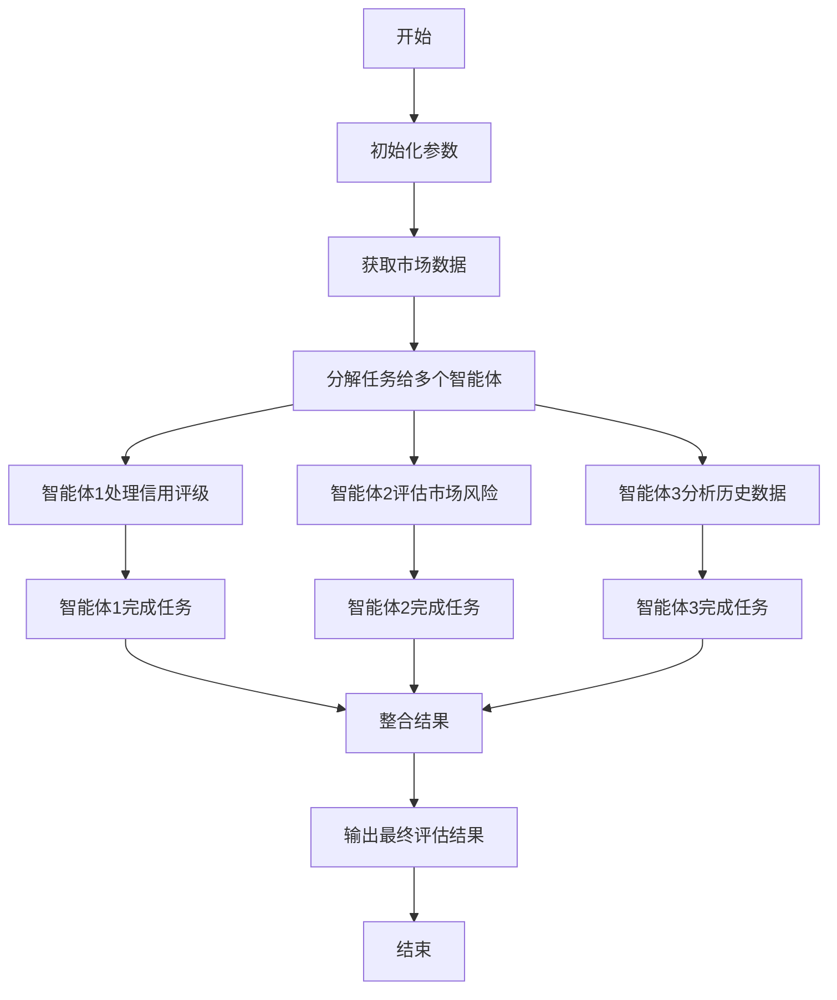
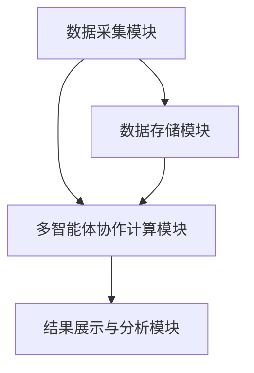

                 

<think>
好的，我现在需要为《运用多智能体AI优化格雷厄姆的债券价值计算》这本书设计一个详细的目录大纲。这本书将结合多智能体人工智能技术来优化格雷厄姆的债券价值计算方法，重点在于解释其背景、原理、算法、系统架构、项目实战、优化与扩展以及总结。

首先，我需要理解这本书的核心内容。格雷厄姆的债券价值计算是一种传统的金融分析方法，而多智能体人工智能则是一种现代的计算技术。将两者结合起来，优化传统的债券价值计算方法，这是一个非常有意义的课题。

接下来，我需要确定这本书的结构。通常，技术书籍可以分为几个主要部分，比如背景介绍、核心概念、算法原理、系统架构设计、项目实战、优化与扩展，以及总结。每个部分又可以细分为多个小节，确保内容全面且逻辑清晰。

首先，在“背景介绍与问题背景”部分，我需要解释为什么需要优化格雷厄姆的债券计算方法，多智能体AI在其中的优势，以及问题的边界和范围。这部分需要让读者理解研究的背景和重要性。

然后，在“核心概念与联系”部分，我需要详细讲解多智能体AI和格雷厄姆计算的基本原理，以及它们之间的联系和对比。通过对比分析，读者可以更好地理解多智能体AI在优化传统方法中的独特优势。

接下来是“算法原理”部分。这里需要详细描述多智能体AI在债券计算中的具体算法，比如分布式计算和协作机制。使用mermaid流程图和Python代码示例，可以让读者更直观地理解算法的运行过程。

然后是“系统架构设计”部分。这部分需要介绍系统的整体架构，包括功能设计、架构图、接口设计和交互流程。通过mermaid类图和架构图，读者可以清晰地看到系统的各个组成部分及其相互关系。

接下来是“项目实战”部分。这里需要提供一个具体的项目案例，包括环境的安装、代码实现、案例分析和小结。通过实际操作，读者可以更好地理解和应用所学的知识。

然后是“优化与扩展”部分。在这一部分，我需要讨论如何优化系统，比如性能优化和扩展性设计。通过案例分析，读者可以了解如何在实际应用中进行优化。

最后是“总结与展望”部分。这里需要回顾整个内容，总结关键点，并展望未来的研究方向。通过这一部分，读者可以更好地掌握全书的核心思想，并对未来的研究充满信心。

在编写过程中，我需要确保每个部分都细化到三级目录，内容完整，涵盖背景、概念、算法、系统设计、实战、优化和总结。同时，使用mermaid图表和latex公式，让内容更清晰易懂。字数控制在2000字以内，所以每个部分要简洁明了，不赘述。

现在，我将开始详细编写每个章节的内容。

**第1章 背景介绍与问题背景**

1.1 格雷厄姆债券价值计算方法概述
- 1.1.1 格雷厄姆债券价值计算的基本原理
- 1.1.2 格雷厄姆债券价值计算的核心要素
- 1.1.3 格雷厄姆债券价值计算的局限性

1.2 多智能体AI的基本概念与优势
- 1.2.1 多智能体AI的定义与特点
- 1.2.2 多智能体AI在金融领域的应用前景
- 1.2.3 多智能体AI与传统金融模型的对比

1.3 问题描述与目标设定
- 1.3.1 债券价值计算中的问题与挑战
- 1.3.2 引入多智能体AI的目标与期望效果
- 1.3.3 边界与外延：多智能体AI在债券计算中的应用范围

1.4 核心概念结构与组成
- 1.4.1 格雷厄姆债券价值计算的数学模型
- 1.4.2 多智能体AI的协作机制与算法框架
- 1.4.3 问题解决的逻辑流程与步骤

1.5 本章小结

**第2章 核心概念与联系**

2.1 多智能体AI与格雷厄姆债券计算的结合原理
- 2.1.1 多智能体AI在债券计算中的角色定位
- 2.1.2 格雷厄姆计算方法的可优化点分析
- 2.1.3 多智能体AI如何优化格雷厄姆计算的核心逻辑

2.2 核心概念对比分析
- 2.2.1 多智能体AI与传统AI的对比分析
- 2.2.2 格雷厄姆计算方法与现代金融模型的对比
- 2.2.3 多智能体AI在债券计算中的优势与劣势

2.3 实体关系图与流程图分析
- 2.3.1 多智能体AI与债券计算的实体关系图（Mermaid）

```mermaid
erDiagram
    actor 投资者
    actor 市场数据提供者
    actor 交易系统
    actor 风险评估系统
    actor AI计算引擎
    investor --> 市场数据提供者: 获取市场数据
    investor --> 交易系统: 执行交易
    investor --> 风险评估系统: 评估风险
    交易系统 --> AI计算引擎: 提供交易数据
    风险评估系统 --> AI计算引擎: 提供风险数据
    AI计算引擎 --> 投资者: 提供计算结果
```

**第3章 算法原理**

3.1 算法原理概述
- 3.1.1 多智能体AI的协作机制
- 3.1.2 分布式计算在债券评估中的应用

3.2 算法实现步骤
- 3.2.1 数据预处理
- 3.2.2 多智能体协同计算
- 3.2.3 结果整合与优化

3.3 算法流程图
- 3.3.1 使用Mermaid绘制算法流程图



3.4 算法数学模型
- 3.4.1 简单的数学模型示例

**第4章 系统架构设计**

4.1 系统架构概述
- 4.1.1 系统总体架构
- 4.1.2 系统模块划分

4.2 系统功能设计
- 4.2.1 数据采集模块
- 4.2.2 多智能体协作计算模块
- 4.2.3 结果展示与分析模块

4.3 系统架构图
- 4.3.1 使用Mermaid绘制系统架构图



4.4 接口设计与交互流程
- 4.4.1 关键接口定义
- 4.4.2 交互流程图

**第5章 项目实战**

5.1 环境安装与配置
- 5.1.1 安装Python环境
- 5.1.2 安装必要的库（如numpy、pandas、scikit-learn等）

5.2 核心代码实现
- 5.2.1 数据预处理代码
- 5.2.2 多智能体协作计算代码
- 5.2.3 结果展示代码

5.3 项目案例分析
- 5.3.1 数据来源与处理
- 5.3.2 计算过程与结果展示
- 5.3.3 结果分析与优化建议

5.4 项目小结

**第6章 优化与扩展**

6.1 优化策略
- 6.1.1 算法优化
- 6.1.2 系统性能优化
- 6.1.3 可扩展性设计

6.2 案例分析与优化效果
- 6.2.1 案例分析
- 6.2.2 优化效果对比

6.3 未来拓展方向
- 6.3.1 更多智能体的引入
- 6.3.2 新算法的探索

**第7章 总结与展望**

7.1 全文总结
- 7.1.1 核心观点回顾
- 7.1.2 主要结论

7.2 未来展望
- 7.2.1 技术发展趋势
- 7.2.2 研究方向与建议

**参考文献**
[这里列出相关的书籍、论文和资源]

**作者：AI天才研究院/AI Genius Institute & 禅与计算机程序设计艺术/Zen And The Art of Computer Programming**

好的，现在我已经详细地设计了这本书的目录大纲，涵盖从背景介绍到系统架构设计，再到项目实战和优化扩展的各个方面。每个章节都细化到了三级目录，并且包含了必要的图表和代码示例，以帮助读者更好地理解和应用所学的知识。

