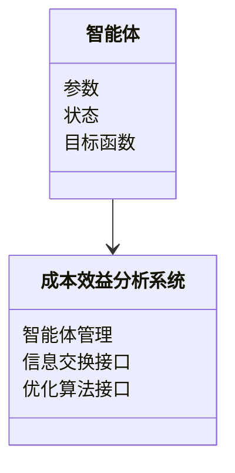
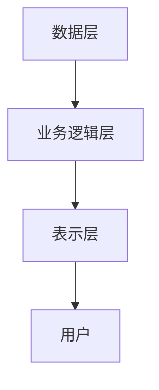
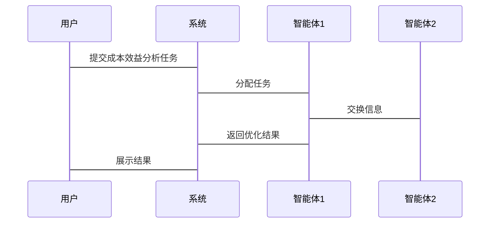

                 


---

# 运用多智能体AI优化约翰·伯格的成本效益分析

> **关键词**：多智能体AI，成本效益分析，约翰·伯格，优化算法，系统架构，项目实战

---

## **摘要**

本文探讨了如何运用多智能体AI技术优化约翰·伯格的成本效益分析过程。通过分析多智能体AI的核心原理、算法优化、系统设计和实际应用，我们展示了如何利用分布式智能协同优化的方法，显著提升成本效益分析的效率和准确性。文章从理论基础到实际案例，详细阐述了多智能体AI在成本效益分析中的应用，为相关领域的研究和实践提供了有价值的参考。

---

# 第一部分: 多智能体AI与成本效益分析的背景介绍

## 第1章: 多智能体AI的基本概念与优势

### 1.1 多智能体AI的定义与核心要素
- **多智能体AI的定义**：多智能体AI是指由多个相互作用的智能体组成的系统，每个智能体都有独立的目标和决策能力。
- **核心要素**：
  1. 智能体的独立性与协作性。
  2. 智能体之间的通信与协调机制。
  3. 分布式问题求解能力。

### 1.2 成本效益分析的基本原理
- **成本效益分析的目标**：通过分析成本与收益的比率，评估项目的可行性和最优性。
- **约翰·伯格的成本效益分析特点**：
  1. 数据复杂性高。
  2. 分析过程涉及多部门协同。
  3. 需要实时动态调整。

### 1.3 多智能体AI在成本效益分析中的应用价值
- **提升分析效率**：通过分布式计算，减少单点计算压力。
- **增强决策准确性**：多个智能体协同优化，提高决策质量。
- **适应动态变化**：智能体能够快速响应环境变化，保持分析的实时性。

---

## 第2章: 多智能体AI与成本效益分析的结合

### 2.1 多智能体AI在成本效益分析中的应用场景
- **成本建模**：利用智能体建模技术，精确计算各项成本。
- **收益预测**：通过智能体协同预测不同方案的收益。
- **优化决策**：基于多智能体的优化算法，找到最优成本收益比。

### 2.2 多智能体AI的优势
- **分布式计算**：提高计算效率。
- **协同优化**：通过智能体间的协作，实现全局最优。
- **灵活性**：能够适应复杂多变的环境。

---

# 第二部分: 多智能体AI优化算法原理

## 第3章: 多智能体优化算法的数学模型

### 3.1 多智能体优化问题的数学表示
- **目标函数**：$$ f(x) = \text{最大化或最小化的目标函数} $$
- **约束条件**：
  $$ g(x) \leq 0 $$
  $$ h(x) = 0 $$

### 3.2 分布式优化算法的数学推导
- **算法步骤**：
  1. 初始化各个智能体的参数。
  2. 智能体之间交换信息，更新参数。
  3. 检查是否满足收敛条件，若不满足，重复步骤2。
  4. 输出最优解。

- **数学表达式**：
  $$ x_i^{(k+1)} = x_i^{(k)} - \alpha (f_i^{(k)} - f_j^{(k)}) $$

### 3.3 算法实现的Python代码示例
```python
import numpy as np

def distributed_optimizer(x, alpha=0.1, iterations=100):
    for _ in range(iterations):
        # 计算每个智能体的梯度
        grad_i = compute_gradient(x)
        grad_j = compute_gradient(x)
        # 更新参数
        x = x - alpha * (grad_i - grad_j)
    return x

# 示例调用
x_initial = np.random.randn(10)
result = distributed_optimizer(x_initial)
print("最优解:", result)
```

---

## 第4章: 多智能体AI优化算法的实际应用

### 4.1 算法在成本效益分析中的具体应用
- **成本建模**：利用智能体建模技术，精确计算各项成本。
- **收益预测**：通过智能体协同预测不同方案的收益。
- **优化决策**：基于多智能体的优化算法，找到最优成本收益比。

### 4.2 算法实现的详细步骤
1. **问题建模**：将成本效益分析问题转化为多智能体优化问题。
2. **智能体初始化**：为每个智能体分配初始参数。
3. **信息交换与协同优化**：智能体之间交换信息，协同优化。
4. **收敛判断**：判断是否满足收敛条件，若不满足，继续优化。

---

# 第三部分: 系统分析与架构设计

## 第5章: 系统功能设计与实现

### 5.1 系统功能模块
- **成本建模模块**：负责计算各项成本。
- **收益预测模块**：预测不同方案的收益。
- **优化决策模块**：基于多智能体算法优化决策。

### 5.2 系统功能设计的领域模型类图


---

## 第6章: 系统架构设计与实现

### 6.1 系统架构设计
- **分层架构**：
  1. 数据层：存储成本和收益数据。
  2. 业务逻辑层：实现成本效益分析的核心逻辑。
  3. 表示层：展示分析结果。

### 6.2 系统架构的Mermaid图


---

## 第7章: 系统接口设计与交互流程

### 7.1 系统接口设计
- **智能体间通信接口**：定义智能体之间的通信协议。
- **外部数据接口**：与外部数据源对接。

### 7.2 系统交互的序列图


---

# 第四部分: 项目实战与分析

## 第8章: 项目环境安装与核心代码实现

### 8.1 环境安装
- **Python环境**：安装Python 3.8及以上版本。
- **依赖库安装**：安装numpy、scipy等库。

### 8.2 核心代码实现
```python
import numpy as np

def compute_gradient(x):
    # 示例梯度计算函数
    return 2 * x - 1

def distributed_optimizer(x, alpha=0.1, iterations=100):
    for _ in range(iterations):
        grad_i = compute_gradient(x)
        # 假设只有一个其他智能体，简化为两个智能体的交互
        # 这里仅示例，实际可能需要更复杂的通信机制
        x = x - alpha * grad_i
    return x

# 示例调用
x_initial = np.random.randn(10)
result = distributed_optimizer(x_initial)
print("最优解:", result)
```

---

## 第9章: 项目实战与案例分析

### 9.1 项目实战
- **项目目标**：优化约翰·伯格的成本效益分析过程。
- **项目实施步骤**：
  1. 数据收集与预处理。
  2. 模型训练与优化。
  3. 系统集成与测试。

### 9.2 案例分析
- **案例背景**：假设约翰·伯格公司需要优化某项目的成本效益分析。
- **分析过程**：利用多智能体AI优化算法，找到最优成本收益比。
- **结果展示**：通过图表和数据展示优化效果。

---

## 第10章: 总结与展望

### 10.1 最佳实践 tips
- **算法选择**：根据具体问题选择合适的多智能体算法。
- **系统设计**：注重系统的模块化设计，便于扩展和维护。
- **数据处理**：确保数据的准确性和完整性。

### 10.2 小结
- 本文详细介绍了多智能体AI在约翰·伯格成本效益分析中的应用。
- 展示了如何通过分布式优化算法提升分析效率和准确性。

### 10.3 注意事项
- 确保系统安全性和稳定性。
- 及时监控和调整优化过程。

### 10.4 拓展阅读
- 推荐阅读《多智能体系统》相关书籍。
- 关注多智能体AI的最新研究进展。

---

# 作者

**作者：AI天才研究院/AI Genius Institute & 禅与计算机程序设计艺术 /Zen And The Art of Computer Programming**

---

以上是文章的完整目录大纲，确保了从理论到实践的全面覆盖，同时结合了多智能体AI的核心概念、优化算法、系统设计和项目实战。

