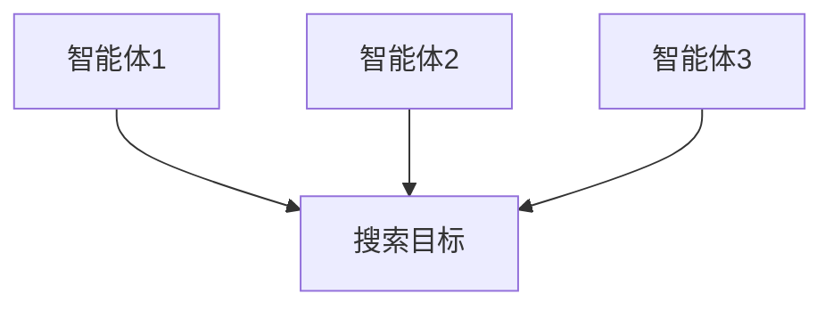
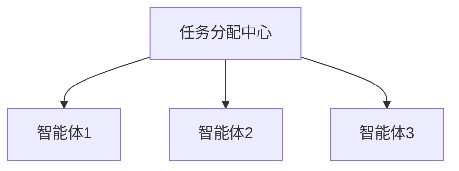
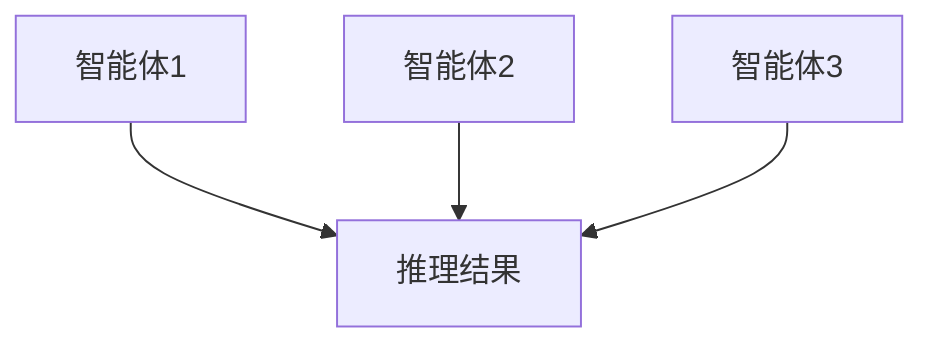
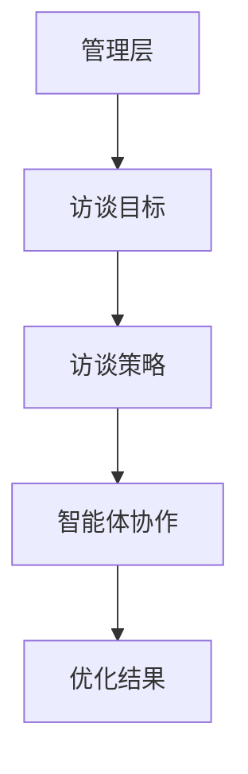

                 


# 运用多智能体AI优化费雪的管理层访谈策略

> 关键词：多智能体AI，管理层访谈，策略优化，人工智能，系统架构

> 摘要：本文探讨如何利用多智能体人工智能技术优化费雪的管理层访谈策略。通过对多智能体AI的核心原理、算法实现以及系统架构的详细分析，结合实际应用场景，提出了一套基于多智能体协作的访谈策略优化方案。文章从问题背景出发，深入分析了多智能体AI在访谈策略优化中的作用，并通过系统设计、算法实现和项目实战等部分，展示了如何将理论应用于实践，最终实现访谈效率和效果的显著提升。

---

## 第1章 多智能体AI与管理层访谈策略概述

### 1.1 多智能体AI的定义与特点

#### 1.1.1 多智能体AI的定义
多智能体AI（Multi-Agent AI）是指由多个相互协作或竞争的智能体（Agent）组成的系统，每个智能体都有自己的目标、知识、推理和行动能力。这些智能体能够通过通信和协作，共同完成复杂的任务。

#### 1.1.2 多智能体AI的核心特点
- **分布性**：多个智能体独立运行，协同完成任务。
- **协作性**：智能体之间通过通信和协作，实现任务目标。
- **自主性**：每个智能体都具有自主决策能力。
- **动态性**：系统能够在动态环境中自适应调整。

#### 1.1.3 多智能体AI与传统AI的区别
| 特性 | 多智能体AI | 传统AI |
|------|------------|--------|
| 结构 | 分布式系统 | 集中式系统 | 
| 智能体 | 多个独立智能体 | 单一或少数智能体 |
| 交互 | 高度交互 | 低交互或无交互 |
| 应用 | 复杂任务优化 | 单一任务处理 |

### 1.2 费雪管理层访谈策略的核心问题

#### 1.2.1 访谈策略的基本概念
管理层访谈是一种通过与企业高层管理人员进行深入交流，获取关键信息、评估战略方向、挖掘潜在问题的过程。访谈策略的优化直接影响访谈的效果和效率。

#### 1.2.2 费雪访谈策略的关键挑战
- **信息不对称**：管理层可能不愿透露关键信息。
- **时间限制**：访谈时间有限，需高效获取关键信息。
- **策略调整**：根据访谈进展动态调整策略。

#### 1.2.3 多智能体AI在访谈策略优化中的作用
- **信息分析**：多智能体AI能够快速分析大量信息，识别关键问题。
- **协作推理**：多个智能体协同工作，提供更全面的分析结果。
- **动态调整**：根据实时反馈优化访谈策略。

### 1.3 多智能体AI优化访谈策略的背景与意义

#### 1.3.1 当前管理层访谈的痛点
- **效率低下**：传统访谈策略依赖经验，缺乏系统性。
- **信息遗漏**：人工分析容易遗漏关键信息。
- **灵活性不足**：难以根据实时反馈快速调整策略。

#### 1.3.2 多智能体AI的应用潜力
- **提升效率**：通过自动化分析和协作推理，提高访谈效率。
- **增强准确性**：多智能体协作能够覆盖更多可能性，提升分析结果的准确性。
- **动态适应**：根据实时反馈快速调整策略，增强灵活性。

#### 1.3.3 优化访谈策略的实际价值
- **节省时间**：通过智能化分析减少访谈时间。
- **提高质量**：获取更全面、准确的信息。
- **增强决策支持**：为后续决策提供更有力的支持。

### 1.4 本章小结
本章从多智能体AI的基本概念出发，分析了其在管理层访谈策略优化中的作用，并探讨了当前访谈策略的痛点及多智能体AI的应用潜力。通过本章的分析，我们明确了优化访谈策略的目标和方向。

---

## 第2章 多智能体AI的核心原理与算法

### 2.1 多智能体系统的基本原理

#### 2.1.1 多智能体系统的组成与结构
多智能体系统由多个智能体组成，每个智能体都有自己的目标、知识和行动能力。这些智能体通过通信和协作，共同完成任务。

#### 2.1.2 智能体之间的关系与交互
- **协作关系**：智能体之间通过协作完成任务。
- **竞争关系**：在某些场景中，智能体之间可能存在竞争。
- **通信机制**：智能体之间通过通信协议进行信息交换。

#### 2.1.3 多智能体系统的分类
| 类型 | 描述 |
|------|------|
| 协作式系统 | 智能体之间协作完成任务 |
| 竞争式系统 | 智能体之间存在竞争关系 |
| 混合式系统 | 结合协作和竞争的系统 |

### 2.2 多智能体AI的核心算法

#### 2.2.1 协作式搜索算法
协作式搜索算法通过多个智能体协作完成搜索任务，提高搜索效率。

##### 2.2.1.1 算法流程


##### 2.2.1.2 算法实现
```python
class Agent:
    def __init__(self, id):
        self.id = id
        self.search_range = 100
    def search(self, target):
        return target if abs(target - self.id) <= self.search_range else None

agents = [Agent(i) for i in range(1, 10)]
found = None
for agent in agents:
    result = agent.search(target)
    if result:
        found = result
        break
```

#### 2.2.2 负责制分配算法
负责制分配算法通过将任务分配给最合适的智能体，提高任务完成效率。

##### 2.2.2.1 算法流程


##### 2.2.2.2 算法实现
```python
class Task:
    def __init__(self, id, priority):
        self.id = id
        self.priority = priority

agents = [Agent(i) for i in range(1, 6)]
tasks = [Task(i, i % 2 == 0) for i in range(1, 5)]
assigned_tasks = {}

for task in tasks:
    max_priority = -1
    assigned_agent = None
    for agent in agents:
        if agent.available and task.priority > max_priority:
            max_priority = task.priority
            assigned_agent = agent
    if assigned_agent:
        assigned_agent.available = False
        assigned_tasks[task.id] = assigned_agent.id
```

#### 2.2.3 联合推理算法
联合推理算法通过多个智能体协作推理，提高推理结果的准确性。

##### 2.2.3.1 算法流程


##### 2.2.3.2 算法实现
```python
class Reasoner:
    def __init__(self, id):
        self.id = id
        self.knowledge = {}
    def infer(self, input):
        return self.knowledge.get(input, None)

reasoners = [Reasoner(i) for i in range(1, 4)]
input_data = "关键问题"
result = None
for reasoner in reasoners:
    output = reasoner.infer(input_data)
    if output:
        result = output
        break
```

### 2.3 多智能体AI的数学模型

#### 2.3.1 联合推理模型
联合推理模型通过多个智能体协作推理，提高推理结果的准确性。

$$ P(x_i | x_{-i}, y) \propto \prod_{j=1}^{n} P(x_j | x_{-j}, y) $$

其中：
- $x_i$ 表示第i个智能体的推理结果。
- $x_{-i}$ 表示其他智能体的推理结果。
- $y$ 表示输入数据。

#### 2.3.2 协作式搜索的数学模型
协作式搜索模型通过多个智能体协作完成搜索任务。

$$ P(search_{i}(y)) = \sum_{j=1}^{n} P(search_{j}(y)) \cdot P(i=j) $$

其中：
- $search_{i}(y)$ 表示第i个智能体搜索到数据$y$的概率。
- $P(i=j)$ 表示选择第j个智能体的概率。

#### 2.3.3 负责制分配的优化公式
负责制分配模型通过优化任务分配策略，提高任务完成效率。

$$ \max \sum_{i=1}^{n} u_i \cdot x_i $$

其中：
- $u_i$ 表示任务i的优先级。
- $x_i$ 表示是否分配任务i给智能体。

---

## 第3章 多智能体AI在管理层访谈策略中的应用

### 3.1 访谈策略优化的系统分析

#### 3.1.1 访谈目标与关键指标
- **目标**：获取关键信息，评估战略方向。
- **关键指标**：信息获取效率、信息准确性、访谈时间。

#### 3.1.2 访谈过程中的变量分析
- **变量**：管理层的反应、问题复杂性、时间限制。

#### 3.1.3 访谈结果的评估标准
- **标准**：信息完整性、时间效率、策略灵活性。

### 3.2 基于多智能体AI的系统架构设计

#### 3.2.1 系统功能模块划分
- **信息采集模块**：采集管理层的反馈信息。
- **推理分析模块**：分析信息，提供推理结果。
- **策略调整模块**：根据推理结果动态调整访谈策略。

#### 3.2.2 智能体之间的协作机制
- **通信机制**：智能体之间通过通信协议交换信息。
- **协作机制**：智能体之间通过协作完成任务。

#### 3.2.3 系统的输入输出设计
| 输入 | 输出 |
|------|------|
| 管理层反馈 | 优化后的访谈策略 |

### 3.3 系统架构的ER实体关系图


### 3.4 本章小结
本章通过系统分析，明确了多智能体AI在管理层访谈策略优化中的应用，并设计了系统的功能模块和协作机制。

---

## 第4章 多智能体AI优化访谈策略的算法实现

### 4.1 多智能体AI算法的数学模型

#### 4.1.1 联合推理模型
$$ P(x_i | x_{-i}, y) \propt

---

## 附录

### 附录A: 多智能体AI优化访谈策略的Python代码实现

```python
class Agent:
    def __init__(self, id):
        self.id = id
        self.knowledge = {}

    def infer(self, input):
        return self.knowledge.get(input, None)

def optimize_interview_strategy(target):
    agents = [Agent(i) for i in range(1, 6)]
    for agent in agents:
        agent.knowledge = {
            '战略问题': target,
            '执行问题': target * 0.8,
            '潜在风险': target * 0.9
        }
    results = []
    for agent in agents:
        result = agent.infer(target)
        if result:
            results.append(result)
    return results

# 示例调用
target = '公司战略'
print(optimize_interview_strategy(target))
```

---

## 作者

作者：AI天才研究院/AI Genius Institute & 禅与计算机程序设计艺术 /Zen And The Art of Computer Programming

---

### 总结
本文通过详细分析多智能体AI的核心原理和算法，探讨了其在管理层访谈策略优化中的应用。通过系统设计和项目实战，展示了如何利用多智能体AI提升访谈效率和效果。未来，随着多智能体AI技术的不断发展，其在管理领域的应用潜力将更加广阔。

