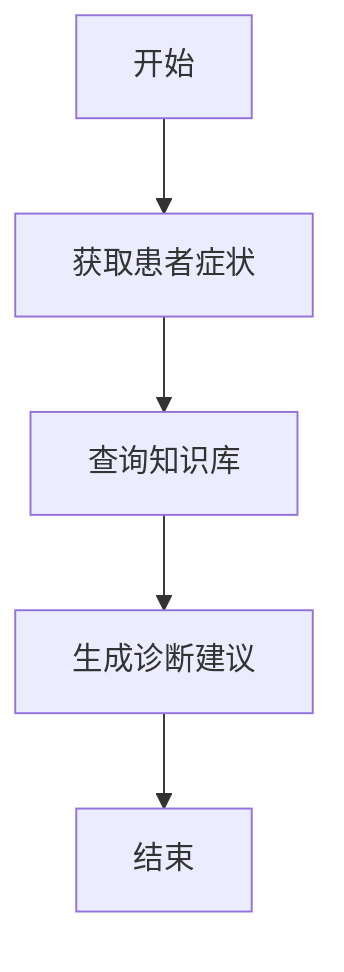
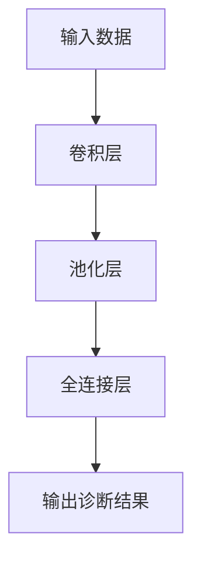
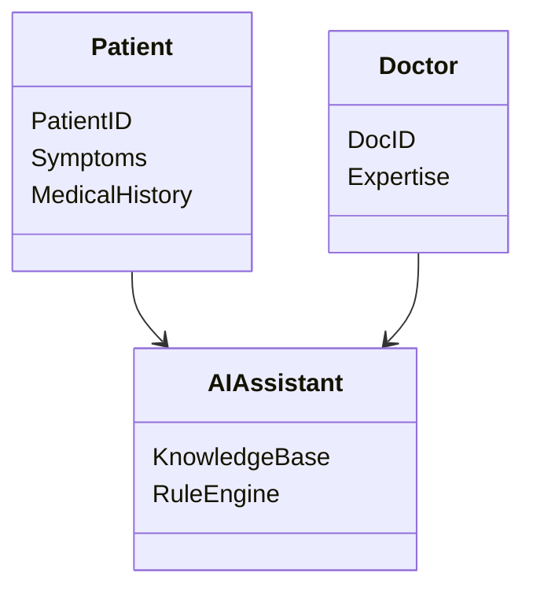

                 


# 远程医疗中的AI Agent诊断助手

> 关键词：远程医疗，AI Agent，诊断助手，人工智能，医疗诊断

> 摘要：本文将详细介绍AI Agent在远程医疗中的应用，探讨其在医疗诊断中的潜力和挑战。通过分析AI Agent的核心概念、算法原理、系统架构，以及实际案例，为读者提供一个全面的视角，理解AI Agent如何在远程医疗中发挥重要作用。

---

## 第一部分：远程医疗中的AI Agent诊断助手概述

### 第1章：远程医疗与AI Agent的背景介绍

#### 1.1 远程医疗的发展现状

##### 1.1.1 远程医疗的定义与特点

远程医疗是一种通过通信技术实现患者与医疗专业人员之间远程医疗互动的医疗服务模式。其特点包括：

- **便捷性**：患者无需到医院即可获得诊断和治疗建议。
- **覆盖广**：能够覆盖偏远地区，解决医疗资源不足的问题。
- **高效性**：通过数字化工具快速传递医疗信息，提高诊断效率。

##### 1.1.2 远程医疗的典型应用场景

- **慢性病管理**：通过远程监测设备，实时跟踪患者健康状况。
- **疾病诊断**：医生通过远程会诊系统进行病情分析。
- **医疗培训**：利用虚拟现实技术进行医学教育和培训。

##### 1.1.3 远程医疗的技术优势与挑战

- **优势**：
  - 提高医疗资源的利用率。
  - 降低患者的医疗成本。
  - 促进医疗信息的共享与协作。

- **挑战**：
  - 数据隐私与安全问题。
  - 远程诊断的准确性和可靠性。
  - 技术设备的普及与兼容性。

#### 1.2 AI Agent在远程医疗中的作用

##### 1.2.1 AI Agent的定义与核心功能

AI Agent（人工智能代理）是一种能够感知环境、自主决策并执行任务的智能系统。在远程医疗中，AI Agent作为诊断助手，具有以下核心功能：

- **数据采集与处理**：收集患者的医疗数据并进行预处理。
- **诊断推理**：基于医疗知识库进行病情分析和诊断建议。
- **人机交互**：通过自然语言处理技术与患者和医生进行互动。

##### 1.2.2 AI Agent在医疗诊断中的应用潜力

- **辅助诊断**：通过分析患者的症状、病史和检查结果，提供诊断建议。
- **个性化治疗方案**：结合患者个体特征，制定个性化的治疗计划。
- **实时监测**：对患者的健康状况进行实时监控，并及时发出预警。

##### 1.2.3 远程医疗中AI Agent的边界与外延

AI Agent诊断助手在远程医疗中的应用范围主要集中在辅助诊断和健康管理，其边界包括：

- 不直接进行医疗决策，而是提供诊断建议。
- 不处理复杂的医疗伦理问题，主要专注于技术层面的辅助。

#### 1.3 AI Agent诊断助手与传统医疗诊断的对比

##### 1.3.1 AI Agent诊断助手的定义

AI Agent诊断助手是一种通过AI技术辅助医生进行远程诊断的智能工具，能够快速处理医疗数据并提供诊断建议。

##### 1.3.2 AI Agent诊断助手的核心要素

- **医疗知识库**：包含丰富的医学知识和诊断标准。
- **数据处理能力**：能够处理多种格式的医疗数据。
- **推理引擎**：基于知识库进行逻辑推理，生成诊断建议。
- **人机交互界面**：提供友好的用户界面，方便医生和患者的使用。

##### 1.3.3 AI Agent诊断助手与传统医疗诊断的对比

| 对比维度         | 传统医疗诊断       | AI Agent诊断助手         |
|------------------|--------------------|--------------------------|
| 诊断速度         | 较慢               | 较快                     |
| 诊断准确性       | 取决于医生经验     | 取决于知识库的完善性     |
| 适用场景         | 适用于面对面诊断   | 适用于远程诊断           |
| 诊断范围         | 有限               | 更广泛                   |

---

## 第2章：AI Agent诊断助手的核心概念与联系

### 2.1 AI Agent的基本原理

#### 2.1.1 知识表示与推理机制

知识表示是AI Agent的核心，通常采用符号逻辑或概率模型。推理机制则基于这些表示进行逻辑推导，生成诊断建议。

#### 2.1.2 自然语言处理在AI Agent中的应用

通过NLP技术，AI Agent能够理解患者的症状描述，并将其转化为结构化的医疗数据。

#### 2.1.3 AI Agent的推理与决策机制

推理机制基于知识库和输入数据，通过逻辑推理生成诊断结果。决策机制则根据推理结果，提供具体的治疗建议。

### 2.2 核心概念对比与ER实体关系图

#### 2.2.1 核心概念对比表格

| 核心概念         | 传统诊断          | AI Agent诊断助手         |
|------------------|-------------------|--------------------------|
| 诊断速度         | 较慢               | 较快                     |
| 诊断准确性       | 取决于医生经验     | 取决于知识库的完善性     |
| 诊断范围         | 有限               | 更广泛                   |

#### 2.2.2 ER实体关系图的Mermaid展示

```mermaid
erd
    title ER图
    Hospital {
        HospID
        HospName
    }
    Doctor {
        DocID
        DocName
        Specialty
    }
    Patient {
        PatientID
        PatientName
        Age
    }
    remote_diagnosis {
        HospID
        DocID
        PatientID
        DiagnosisDate
        DiagnosisResult
    }
    Hospital -< many -> remote_diagnosis
    Doctor -< many -> remote_diagnosis
    Patient -< many -> remote_diagnosis
```

---

## 第3章：AI Agent诊断助手的算法原理

### 3.1 基于规则的推理算法

#### 3.1.1 算法流程图的Mermaid展示



#### 3.1.2 基于规则的推理算法实现代码示例

```python
def diagnose_symptoms(symptoms):
    # 知识库中的规则
    rules = {
        "症状1和症状2": "疾病A",
        "症状3或症状4": "疾病B"
    }
    for rule in rules:
        if eval(rule):
            return rules[rule]
    return "无法确定"
```

### 3.2 基于机器学习的诊断算法

#### 3.2.1 机器学习算法的数学模型与公式

模型训练过程如下：

$$
\text{预测概率} = \frac{1}{1 + e^{-x}}
$$

其中，$x$ 是输入特征的线性组合。

#### 3.2.2 诊断算法的Python实现与代码解读

```python
import numpy as np
from sklearn.linear_model import LogisticRegression

# 训练模型
model = LogisticRegression()
model.fit(X_train, y_train)

# 预测诊断
y_pred = model.predict(X_test)
```

### 3.3 基于深度学习的诊断算法

#### 3.3.1 深度学习算法的数学模型与公式

模型结构如下：

$$
\text{输出} = \text{激活函数}(\text{输入} \times \text{权重} + \text{偏置})
$$

其中，激活函数可以是ReLU或sigmoid。

#### 3.3.2 深度学习算法的Mermaid流程图展示



---

## 第4章：AI Agent诊断助手的系统分析与架构设计

### 4.1 问题场景与项目介绍

#### 4.1.1 远程医疗中的诊断问题场景

患者通过远程设备发送症状和检查结果，AI Agent诊断助手进行分析并提供诊断建议。

#### 4.1.2 AI Agent诊断助手的项目目标与范围

- **目标**：辅助医生快速诊断远程患者的病情。
- **范围**：支持多种疾病诊断，包括常见病和慢性病。

### 4.2 系统功能设计

#### 4.2.1 领域模型的Mermaid类图展示



#### 4.2.2 系统功能模块划分与交互流程

- **模块划分**：
  - 患者数据采集模块
  - 知识库管理模块
  - 推理引擎模块
  - 人机交互模块

### 4.3 系统架构设计

#### 4.3.1 系统架构的Mermaid架构图

```mermaid
archi
    title 系统架构图
    Client --> API Gateway
    API Gateway --> AI诊断引擎
    AI诊断引擎 --> Knowledge Database
    Knowledge Database --> Monitoring System
```

---

## 总结

本文详细介绍了AI Agent在远程医疗中的应用，从背景介绍到系统设计，为读者提供了全面的技术视角。通过分析AI Agent的核心概念、算法原理和系统架构，展示了其在远程诊断中的巨大潜力。未来，随着AI技术的不断发展，AI Agent诊断助手将在远程医疗中发挥越来越重要的作用。

---

**作者：AI天才研究院/AI Genius Institute & 禅与计算机程序设计艺术 /Zen And The Art of Computer Programming**

