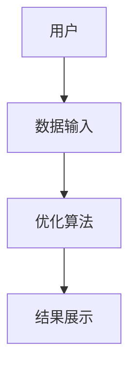
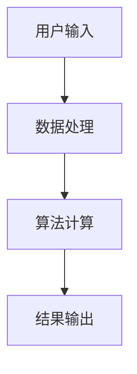

                 


# 退休计划优化算法

> 关键词：退休计划，优化算法，线性规划，动态规划，遗传算法，模拟退火

> 摘要：退休计划优化算法是一门结合数学建模和计算机算法的学科，旨在通过科学的方法帮助个人或家庭制定最优的退休财务规划。本文将从退休计划的核心目标、优化算法的基本概念入手，详细讲解线性规划、动态规划、遗传算法和模拟退火算法在退休计划中的应用，并通过实际案例展示如何利用这些算法实现退休财务的最优化配置。

---

## 第一部分：退休计划优化算法概述

### 第1章：退休计划与优化算法概述

#### 1.1 退休计划的重要性

- **1.1.1 退休计划的核心目标**
  - 确保退休后有足够的资金支持生活质量。
  - 实现资产保值与增值的平衡。
  - 应对突发的财务风险。

- **1.1.2 退休计划的常见挑战**
  - 通货膨胀对购买力的影响。
  - 投资收益的不确定性。
  - 长期护理费用的不可预见性。

- **1.1.3 优化算法在退休计划中的作用**
  - 帮助确定最优的投资组合。
  - 优化支出计划，确保资金的可持续性。
  - 应对多种不确定性因素，制定灵活的调整方案。

#### 1.2 优化算法的基本概念

- **1.2.1 优化算法的定义与特点**
  - 定义：优化算法是通过数学方法寻找问题最优解的一类算法。
  - 特点：全局性、高效性、适应性。

- **1.2.2 优化算法的分类**
  - 精确算法：线性规划、动态规划。
  - 近似算法：遗传算法、模拟退火算法。

- **1.2.3 优化算法在退休计划中的应用**
  - 投资组合优化。
  - 支出计划优化。
  - 风险管理。

#### 1.3 退休计划优化的数学模型

- **1.3.1 退休计划的变量与约束**
  - 变量：投资金额、支出金额、时间跨度。
  - 约束：资金不能为负，支出不能超过可用资金。

- **1.3.2 退休计划的目标函数**
  - 最大化退休后的生活质量。
  - 最小化财务风险。

- **1.3.3 数学模型的构建与优化**
  - 线性规划模型：目标函数和约束条件均为线性。
  - 非线性模型：考虑投资组合的非线性收益。

#### 1.4 本章小结

---

## 第二部分：退休计划优化算法的核心原理

### 第2章：线性规划与动态规划算法

#### 2.1 线性规划算法

- **2.1.1 线性规划的定义与特点**
  - 定义：在线性约束条件下寻找目标函数的极值。
  - 特点：简单高效，适用于线性问题。

- **2.1.2 线性规划在退休计划中的应用**
  - 投资组合优化：确定最优的投资比例。
  - 支出计划优化：合理分配每月支出。

- **2.1.3 线性规划的数学模型与求解方法**
  - 数学模型：
    - 目标函数：Maximize 或 Minimize。
    - 约束条件：$ax + by \leq c$。
  - 求解方法：单纯形法。

#### 2.2 动态规划算法

- **2.2.1 动态规划的定义与特点**
  - 定义：将问题分解为子问题，逐层解决。
  - 特点：适用于多阶段决策问题。

- **2.2.2 动态规划在退休计划中的应用**
  - 多阶段投资决策。
  - 长期支出规划。

- **2.2.3 动态规划的数学模型与求解方法**
  - 数学模型：
    - 状态转移方程：$s_{t+1} = f(s_t, a_t)$。
    - 目标函数：$J(s_T)$。
  - 求解方法：递归法或迭代法。

#### 2.3 线性规划与动态规划的比较

- **2.3.1 算法特点对比**
  | 算法 | 线性规划 | 动态规划 |
  |------|----------|----------|
  | 适用性 | 单一阶段 | 多阶段 |
  | 约束条件 | 线性 | 线性或非线性 |

- **2.3.2 应用场景对比**
  - 线性规划：简单优化问题。
  - 动态规划：复杂多阶段问题。

- **2.3.3 优缺点分析**
  - 线性规划：简单高效，但仅适用于线性问题。
  - 动态规划：灵活性高，但计算复杂。

### 第3章：遗传算法与模拟退火算法

#### 3.1 遗传算法

- **3.1.1 遗传算法的基本原理**
  - 生成初始种群。
  - 适应度评估。
  - 选择、交叉、变异。

- **3.1.2 遗传算法在退休计划中的应用**
  - 复杂投资组合优化。
  - 应对不确定性较高的问题。

- **3.1.3 遗传算法的实现步骤**
  1. 初始化种群。
  2. 计算适应度。
  3. 选择父代。
  4. 交叉和变异。
  5. 代际进化。

#### 3.2 模拟退火算法

- **3.2.1 模拟退火算法的基本原理**
  - 从高温到低温逐步降温。
  - 接受更差解的概率随温度降低而减小。

- **3.2.2 模拟退火算法在退休计划中的应用**
  - 解决复杂的非线性优化问题。
  - 应对多约束条件下的优化。

- **3.2.3 模拟退火算法的实现步骤**
  1. 初始化当前解。
  2. 设置初始温度。
  3. 进行降温循环。
  4. 随机扰动解。
  5. 计算能量变化。
  6. 决策是否接受新解。

#### 3.3 遗传算法与模拟退火算法的比较

- **3.3.1 算法特点对比**
  | 算法 | 遗传算法 | 模拟退火 |
  |------|----------|----------|
  | 解空间 | 多点搜索 | 单点搜索 |
  | 全局最优 | 可能 | 可能 |

- **3.3.2 应用场景对比**
  - 遗传算法：适合离散解空间。
  - 模拟退火：适合连续解空间。

- **3.3.3 优缺点分析**
  - 遗传算法：收敛速度快，但实现复杂。
  - 模拟退火：实现简单，但收敛速度慢。

---

## 第三部分：退休计划优化算法的系统架构与实现

### 第4章：退休计划优化系统的架构设计

#### 4.1 系统功能需求分析

- **4.1.1 用户需求分析**
  - 用户输入：年龄、收入、支出、资产。
  - 用户输出：最优退休计划。

- **4.1.2 功能模块划分**
  - 数据输入模块。
  - 优化算法模块。
  - 结果展示模块。

- **4.1.3 系统输入输出分析**
  - 输入：用户基本信息、财务状况。
  - 输出：投资建议、支出计划。

#### 4.2 系统架构设计

- **4.2.1 系统架构图**


- **4.2.2 数据流图**


#### 4.3 系统接口设计

- **4.3.1 用户接口设计**
  - 界面友好，输入简单。
  - 结果展示直观。

- **4.3.2 系统内部接口设计**
  - 数据接口：输入数据格式化。
  - 算法接口：算法模块调用。

### 第5章：退休计划优化系统的实现

#### 5.1 环境安装与配置

- **5.1.1 开发环境选择**
  - Python编程环境。
  - 优化算法库（如SciPy）。

- **5.1.2 依赖库安装**
  - pip install numpy scipy。

- **5.1.3 开发工具配置**
  - 配置Jupyter Notebook。

#### 5.2 核心算法实现

- **5.2.1 线性规划算法实现**
  ```python
  from scipy.optimize import linprog

  c = [-1, -1]
  A = [[1, 1]]
  b = [2]
  x = linprog(c, A_ub=A, b_ub=b).x
  print(x)
  ```

- **5.2.2 动态规划算法实现**
  ```python
  def dynamic_planning():
      # 初始化状态
      states = [0]
      # 过渡方程
      next_states = [s + 1 for s in states]
      # 更新状态
      states = next_states
      return states[-1]
  ```

- **5.2.3 遗传算法实现**
  ```python
  import random

  def genetic_algorithm():
      # 初始化种群
      population = [random.randint(0, 100) for _ in range(10)]
      # 适应度函数
      def fitness(x):
          return x
      # 选择
      selected = [x for x in population if fitness(x) > 50]
      # 交叉
      offspring = [(x + y) // 2 for x, y in zip(selected, selected[1:])]
      return offspring
  ```

- **5.2.4 模拟退火算法实现**
  ```python
  import random

  def simulated_annealing():
      current = random.randint(0, 100)
      temperature = 1000
      while temperature > 0:
          neighbor = current + random.randint(-1, 1)
          if neighbor > current:
              current = neighbor
          else:
              if random.random() < 0.1:
                  current = neighbor
          temperature -= 1
      return current
  ```

#### 5.3 项目实战

- **5.3.1 实际案例分析**
  - 案例：某人计划在60岁退休，目前资产100万，年支出30万，通胀率3%。
  - 使用线性规划确定最优投资比例。

- **5.3.2 代码实现与解读**
  ```python
  from scipy.optimize import linprog

  # 定义目标函数系数
  c = [-0.05, -0.03]  # 股票和债券的预期收益
  # 定义约束条件
  A = [[0.1, 0.05]]    # 风险约束
  b = [0.04]           # 最大风险承受
  # 求解
  result = linprog(c, A_ub=A, b_ub=b)
  # 输出结果
  print("最优投资比例：", result.x)
  ```

#### 5.4 最佳实践与注意事项

- **5.4.1 最佳实践**
  - 定期调整退休计划。
  - 结合实际市场情况。

- **5.4.2 注意事项**
  - 算法模型的局限性。
  - 数据的准确性和及时性。

---

## 第四部分：总结与展望

### 第6章：总结与展望

#### 6.1 本章总结

- 系统地介绍了退休计划优化算法的核心概念和实现方法。
- 通过实际案例展示了算法的应用效果。

#### 6.2 未来展望

- 研究更复杂的优化算法。
- 结合人工智能技术，提升算法的智能化水平。

---

## 作者信息

作者：AI天才研究院/AI Genius Institute & 禅与计算机程序设计艺术 /Zen And The Art of Computer Programming

---

通过本文，读者可以系统地了解退休计划优化算法的基本原理和实现方法，掌握如何利用这些算法制定最优的退休财务计划。同时，文章结合实际案例，帮助读者更好地理解和应用这些算法。

