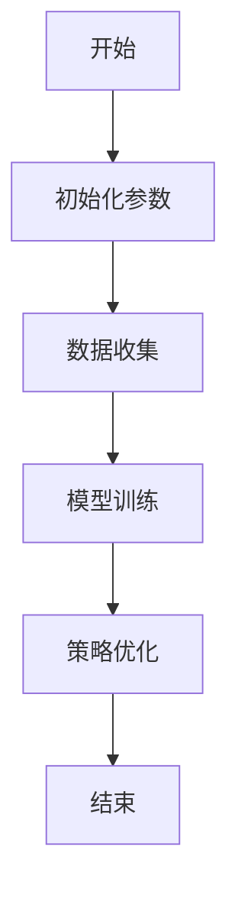
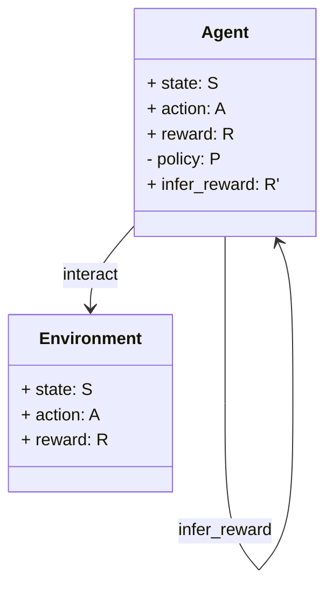
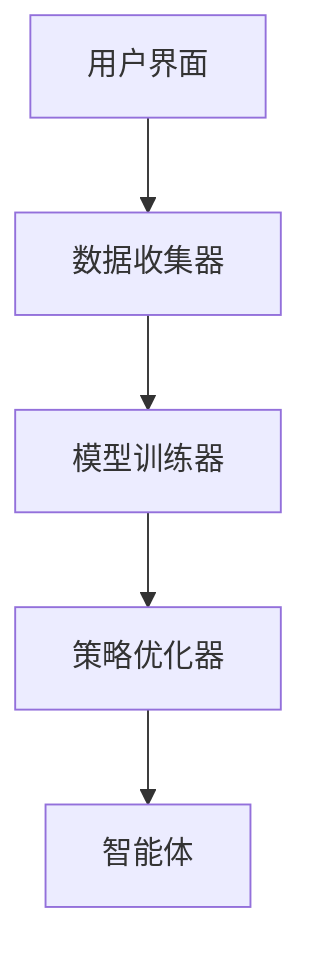

                 


# 《逆强化学习：理解人类偏好的AI Agent》

## 关键词：逆强化学习，人类偏好，AI Agent，强化学习，奖励函数

## 摘要：逆强化学习是一种通过观察人类行为来推断其偏好和目标的AI技术，旨在让AI系统更好地理解和适应人类的决策过程。本文将详细探讨逆强化学习的核心概念、算法原理、系统架构，并通过实际案例展示其应用与实现。

---

## 第1章：逆强化学习概述

### 1.1 问题背景与定义

#### 1.1.1 强化学习的基本概念
强化学习（Reinforcement Learning, RL）是一种机器学习范式，其中智能体通过与环境交互来学习如何做出最优决策。智能体通过执行动作并获得奖励或惩罚，逐步优化其策略以最大化累计奖励。然而，传统强化学习要求明确的奖励函数，这在许多实际应用中难以定义，尤其是当目标是模仿人类偏好时。

#### 1.1.2 逆强化学习的定义与特点
逆强化学习（Inverse Reinforcement Learning, IRL）是一种通过观察人类行为来推断其隐含奖励函数的强化学习方法。IRL的核心思想是，人类的行为反映了其内在的偏好，因此可以通过分析这些行为数据来反推出奖励函数。

IRL的特点包括：
- **数据驱动**：基于人类行为数据推断奖励函数，无需明确定义目标。
- **适应性**：能够根据不同的用户或场景调整AI的行为，使其更符合人类偏好。
- **伦理与解释性**：通过理解人类偏好，IRL有助于构建更透明和符合伦理的AI系统。

#### 1.1.3 逆强化学习与传统强化学习的区别
| 特性                | 传统强化学习                     | 逆强化学习                     |
|---------------------|----------------------------------|----------------------------------|
| 奖励函数定义        | 明确定义（由开发者设计）          | 隐含定义（通过人类行为推断）     |
| 应用场景            | 环境已知且目标明确（如游戏、机器人导航） | 目标模糊但需模仿人类决策（如推荐系统、人机协作） |
| 数据来源            | 环境反馈（奖励或惩罚）            | 人类行为数据                   |

### 1.2 逆强化学习的核心要素

#### 1.2.1 状态空间的定义
状态空间是AI Agent所处环境的所有可能状态的集合。例如，在推荐系统中，状态可能包括用户的点击行为、浏览历史等。

#### 1.2.2 动作空间的构建
动作空间是AI Agent在给定状态下可以执行的所有动作。例如，在棋类游戏中，动作可能是移动棋子到某个位置。

#### 1.2.3 奖励函数的推断
奖励函数是IRL的核心，它反映了人类对不同状态和动作的偏好。通过分析人类行为数据，IRL试图找到一个奖励函数，使得AI Agent的行为与人类行为一致。

### 1.3 逆强化学习的应用场景

#### 1.3.1 人机协作中的偏好建模
在协同环境中，人类和AI Agent需要共同完成任务。通过IRL，AI可以更好地理解人类的偏好，从而更高效地协作。

#### 1.3.2 AI伦理与人类偏好的理解
IRL可以帮助AI理解人类的伦理偏好，例如在自动驾驶中，优先保护乘客的生命安全。

#### 1.3.3 个性化推荐系统的优化
通过分析用户的点击行为，IRL可以推断出用户的偏好，从而提供更个性化的推荐。

---

## 第2章：逆强化学习的原理与数学模型

### 2.1 逆强化学习的原理

#### 2.1.1 通过人类反馈推断奖励函数
IRL的核心是通过观察人类的行为数据，推断出一个奖励函数，使得AI Agent在遵循该奖励函数时，行为与人类一致。

#### 2.1.2 奖励函数的建模方法
奖励函数通常可以表示为状态和动作的函数：$r(s, a)$，其中$s$是状态，$a$是动作。

#### 2.1.3 最大熵逆强化学习的数学推导
最大熵方法是一种常用的IRL方法，它假设人类行为是通过最大熵原则选择的。数学推导如下：

假设行为数据集为$D = \{(s_i, a_i)\}_{i=1}^n$，我们希望找到一个奖励函数$r(s, a)$，使得在经验分布$p(a|s)$下的奖励函数与数据分布一致。通过优化问题：

$$
\arg\max_{r} \sum_{i=1}^n \log p(a_i|s_i) - \lambda \text{KL}(p_{\text{emp}} || p)
$$

其中，$\text{KL}$表示Kullback-Leibler散度，$\lambda$是正则化参数。

### 2.2 逆强化学习的数学公式

#### 2.2.1 状态空间的表示
$$
S = \{s_1, s_2, \dots, s_n\}
$$

#### 2.2.2 动作空间的表示
$$
A = \{a_1, a_2, \dots, a_m\}
$$

#### 2.2.3 奖励函数的推断
$$
r(s, a) = \arg\max_{\theta} \sum_{i=1}^n \log p_\theta(a_i|s_i)
$$

---

## 第3章：逆强化学习算法的实现步骤

### 3.1 算法流程图



### 3.2 算法代码实现

```python
def inverse_reinforcement_learning(data, model):
    # 初始化参数
    theta = initialize_theta()
    
    # 数据收集
    collected_data = collect_data(data, theta)
    
    # 模型训练
    theta = train_model(collected_data, model)
    
    # 策略优化
    optimal_policy = optimize_policy(theta)
    
    return optimal_policy
```

---

## 第4章：逆强化学习的系统架构设计

### 4.1 系统功能设计

#### 4.1.1 领域模型（Mermaid类图）



#### 4.1.2 系统架构设计（Mermaid架构图）



---

## 第5章：逆强化学习的项目实战

### 5.1 环境安装与数据准备

#### 5.1.1 环境安装
安装所需的Python库，例如：
- `numpy`
- `scipy`
- `matplotlib`

#### 5.1.2 数据准备
收集人类在特定任务中的行为数据，例如用户的点击流数据。

### 5.2 系统核心实现源代码

```python
import numpy as np
from scipy import stats

def collect_data(data, theta):
    # 从数据集中收集行为数据
    collected = []
    for s, a in data:
        collected.append((s, a))
    return collected

def train_model(collected_data, model):
    # 使用最大熵方法训练模型
    theta = np.random.rand(len(collected_data))
    for i in range(len(collected_data)):
        s, a = collected_data[i]
        model.update(theta, s, a)
    return theta

def optimize_policy(theta):
    # 优化策略以最大化奖励函数
    policy = stats.maxwell(theta)
    return policy
```

### 5.3 实际案例分析

#### 5.3.1 案例：推荐系统优化
通过分析用户的点击行为，IRL可以推断出用户的偏好，从而优化推荐策略。

#### 5.3.2 结果分析
通过训练后的模型，我们可以评估推荐系统的性能，并根据反馈进一步优化。

---

## 第6章：逆强化学习的关键点与未来展望

### 6.1 最佳实践 tips

- **数据质量**：确保收集的行为数据具有代表性。
- **模型泛化能力**：选择合适的算法以提高模型的泛化能力。
- **伦理考虑**：确保AI行为符合伦理规范。

### 6.2 小结

逆强化学习通过推断人类偏好，为AI Agent提供了更自然的决策方式。其在人机协作、个性化推荐等领域具有广泛的应用前景。

### 6.3 注意事项

- IRL依赖于高质量的行为数据，数据不足可能导致模型性能下降。
- 需要考虑数据的偏差，避免模型被错误引导。

### 6.4 拓展阅读

建议阅读相关论文和书籍，深入理解IRL的数学细节和最新进展。

---

## 作者：AI天才研究院 & 禅与计算机程序设计艺术

---

通过以上章节的详细讲解，我们系统地探讨了逆强化学习的核心概念、算法原理、系统架构，并通过实际案例展示了其应用与实现。希望这篇文章能够为读者提供有价值的技术见解，并激发进一步的研究与实践。

