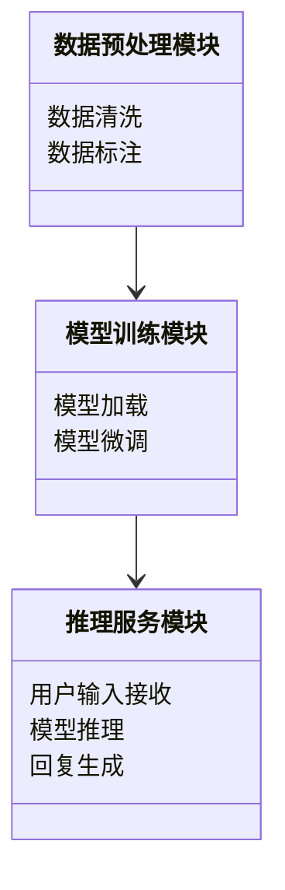

                 


# 《选择合适的LLM：开源 vs 商业模型的对比》

## 关键词：大语言模型, LLM, 开源模型, 商业模型, 对比分析, 技术原理, 系统架构

## 摘要：  
本文全面对比了开源和商业大语言模型（LLM）的优缺点，从技术原理、系统架构、数学模型、成本效益等多维度进行深入分析，帮助读者根据实际需求选择最合适的模型。文章结合理论与实践，通过具体的项目案例和代码实现，为读者提供了清晰的思路和实用的指导。

---

# 第一部分: 选择合适的LLM：开源与商业模型的对比概述

## 第1章: 什么是大语言模型（LLM）

### 1.1 大语言模型的定义与核心概念  
#### 1.1.1 什么是大语言模型  
大语言模型（Large Language Models, LLMs）是指基于深度学习技术构建的、具有大规模参数的自然语言处理模型，能够理解和生成人类语言。  

#### 1.1.2 LLM的核心特点  
- **大规模参数**：通常包含 billions 级别的参数，能够捕捉语言的复杂性。  
- **多任务能力**：支持多种自然语言处理任务，如文本生成、问答系统、机器翻译等。  
- **自我学习能力**：通过大量数据训练，模型能够从经验中“学习”并改进性能。  

#### 1.1.3 LLM的应用场景  
- **文本生成**：用于创意写作、新闻报道生成等。  
- **问答系统**：用于智能客服、知识问答平台。  
- **机器翻译**：支持多种语言的实时翻译。  
- **代码生成与补全**：辅助程序员快速编写代码。  

### 1.2 LLM的发展背景与现状  
#### 1.2.1 LLM的起源与发展  
LLM的发展始于2010年代，标志性的模型包括BERT、GPT系列、T5等。这些模型推动了自然语言处理技术的快速发展。  

#### 1.2.2 当前主流的LLM模型  
- **开源模型**：如GPT-3（由OpenAI开发，但目前未开源）、Hugging Face的开源模型（如Bert、RoBERTa）。  
- **商业模型**：如Salesforce的GPT-3、Amazon的Pablo、微软的ChatGPT等。  

#### 1.2.3 LLM技术的未来趋势  
未来，LLM将更加注重多模态能力（结合视觉、听觉等）、实时性、轻量化部署以及针对特定领域的优化。  

### 1.3 选择合适的LLM的重要性  
#### 1.3.1 不同场景下的LLM需求  
- **通用场景**：如通用文本生成、问答系统，适合选择商业模型。  
- **定制化需求**：如特定领域的文本生成，适合选择开源模型并进行微调。  

#### 1.3.2 LLM选择的常见误区  
- 过度追求模型参数数量，而忽视实际需求。  
- 忽视模型的可扩展性和部署成本。  

#### 1.3.3 如何评估LLM的性能与适用性  
- **性能评估**：通过基准测试（如BLEU、ROUGE分数）评估生成质量。  
- **成本评估**：考虑计算资源、部署成本和维护成本。  

---

## 第2章: 开源LLM与商业LLM的核心对比

### 2.1 开源LLM的优势与劣势  
#### 2.1.1 开源LLM的灵活性与可定制性  
开源模型允许用户根据具体需求进行修改和优化，适合定制化场景。  

#### 2.1.2 开源LLM的成本优势  
开源模型通常免费或成本较低，适合预算有限的团队或个人开发者。  

#### 2.1.3 开源LLM的维护与社区支持  
开源模型通常有活跃的社区支持，用户可以分享经验、解决问题。  

### 2.2 商业LLM的优势与劣势  
#### 2.2.1 商业LLM的成熟度与稳定性  
商业模型通常经过大量数据训练，性能稳定，适合快速部署。  

#### 2.2.2 商业LLM的服务与技术支持  
商业模型提供方通常提供完善的技术支持和文档，适合企业用户。  

#### 2.2.3 商业LLM的成本与商业模式  
商业模型通常采用订阅制或按API调用次数收费，成本较高但性能有保障。  

### 2.3 开源与商业LLM的对比分析  
#### 2.3.1 技术性能对比  
| 对比维度 | 开源LLM | 商业LLM |  
|----------|---------|---------|  
| 模型参数 | 中小规模 | 大规模 |  
| 训练数据 | 数据量较小 | 数据量庞大 |  
| 模型更新 | 用户自行优化 | 提供方定期更新 |  

#### 2.3.2 成本效益对比  
- **开源LLM**：适合预算有限、需要高度定制化的场景。  
- **商业LLM**：适合需要快速部署、性能稳定的场景。  

#### 2.3.3 使用场景对比  
| 场景 | 开源LLM适用 | 商业LLM适用 |  
|------|------------|------------|  
| 特定领域任务 | 是 | 否 |  
| 快速部署 | 否 | 是 |  

---

## 第3章: 开源与商业LLM的技术原理

### 3.1 开源LLM的技术架构  
#### 3.1.1 开源LLM的训练流程  
1. 数据预处理：清洗、标注、格式化。  
2. 模型训练：使用开源框架（如PyTorch、TensorFlow）训练模型。  
3. 模型优化：调整超参数、剪枝、量化。  

#### 3.1.2 开源LLM的模型结构  
- **Transformer架构**：基于自注意力机制，适合处理长文本。  
- **多层编码器-解码器结构**：支持序列到序列的生成任务。  

#### 3.1.3 开源LLM的优化策略  
- **参数剪枝**：减少不必要的参数，降低计算成本。  
- **模型蒸馏**：通过知识蒸馏技术，将大模型的知识迁移到小模型。  

### 3.2 商业LLM的技术架构  
#### 3.2.1 商业LLM的训练流程  
1. 数据收集：整合海量多样的数据。  
2. 模型训练：使用先进的训练策略和硬件加速。  
3. 模型优化：通过多次迭代优化性能。  

#### 3.2.2 商业LLM的模型结构  
- **多模态能力**：部分商业模型已开始支持视觉、音频等多模态输入。  
- **动态调整机制**：根据输入内容自动调整生成策略。  

#### 3.2.3 商业LLM的优化策略  
- **分布式训练**：利用多GPU/TPU加速训练。  
- **持续学习**：通过不断吸收新数据优化模型。  

### 3.3 开源与商业LLM的技术对比  
#### 3.3.1 模型参数与训练数据的对比  
- 开源模型通常参数较少，训练数据有限，但灵活性高。  
- 商业模型参数众多，训练数据庞大，但定制化能力较弱。  

#### 3.3.2 模型训练与推理效率的对比  
- 开源模型训练效率低，但推理成本低。  
- 商业模型训练效率高，但推理成本高。  

#### 3.3.3 模型性能与适用性的对比  
- 开源模型适合小规模部署和定制化需求。  
- 商业模型适合大规模部署和通用需求。  

---

## 第4章: LLM的数学模型与算法原理

### 4.1 LLM的训练目标函数  
#### 4.1.1 交叉熵损失函数  
交叉熵损失函数是训练LLM的核心目标函数，定义如下：  
$$ \text{loss} = -\frac{1}{N} \sum_{i=1}^{N} \sum_{j=1}^{M} y_{i,j} \log p(y_{i,j}|y_{i,1},...,y_{i,j-1})) $$  
其中，$N$ 是训练样本数，$M$ 是序列长度，$y_{i,j}$ 是目标概率分布。  

#### 4.1.2 优化目标函数的数学表达  
通常使用Adam优化器优化损失函数：  
$$ \theta_{t+1} = \theta_t - \eta \frac{\partial \mathcal{L}}{\partial \theta_t} $$  
其中，$\theta$ 是模型参数，$\eta$ 是学习率。  

### 4.2 LLM的模型结构与参数  
#### 4.2.1 Transformer模型的结构  
Transformer模型由编码器和解码器组成，编码器负责输入序列的表示，解码器负责生成输出序列。  

#### 4.2.2 注意力机制的数学表达  
自注意力机制的计算公式如下：  
$$ \text{Attention}(Q,K,V) = \text{softmax}\left(\frac{QK^T}{\sqrt{d_k}}\right)V $$  
其中，$Q$ 是查询向量，$K$ 是键向量，$V$ 是值向量，$d_k$ 是维度。  

---

## 第5章: 系统分析与架构设计

### 5.1 问题场景介绍  
假设我们需要开发一个智能客服系统，选择合适的LLM模型是关键。  

### 5.2 系统功能设计  
#### 5.2.1 功能模块  
- **数据预处理模块**：清洗和标注客服对话数据。  
- **模型训练模块**：训练或微调LLM模型。  
- **推理服务模块**：接收用户输入，生成回复。  

#### 5.2.2 领域模型（mermaid类图）  


### 5.3 系统架构设计（mermaid架构图）  


---

## 第6章: 项目实战

### 6.1 环境安装  
#### 6.1.1 安装Python与相关库  
```bash
pip install torch transformers
```

### 6.2 核心实现源代码  
#### 6.2.1 开源模型的训练与推理  
```python
import torch
from transformers import AutoTokenizer, AutoModelForCausalLM

# 加载开源模型
tokenizer = AutoTokenizer.from_pretrained("gpt2")
model = AutoModelForCausalLM.from_pretrained("gpt2")

# 推理过程
inputs = tokenizer("这是一个测试", return_tensors="pt")
outputs = model.generate(**inputs, max_length=100)
print(tokenizer.decode(outputs[0]))
```

#### 6.2.2 商业模型的调用（以OpenAI为例）  
```python
import openai

# 初始化API客户端
openai.api_key = "your-api-key"

# 调用商业模型
response = openai.Completion.create(
    model="gpt-3",
    prompt="这是一个测试",
    max_tokens=100
)
print(response.choices[0].message.content)
```

### 6.3 案例分析与详细解读  
#### 6.3.1 案例1：开源模型的本地部署  
- **优势**：部署成本低，可以进行二次开发。  
- **挑战**：需要自行处理数据和模型优化。  

#### 6.3.2 案例2：商业模型的API调用  
- **优势**：快速部署，性能稳定。  
- **挑战**：成本较高，灵活性差。  

---

## 第7章: 总结与展望

### 7.1 最佳实践 tips  
- 根据实际需求选择模型。  
- 开源模型适合定制化需求，商业模型适合快速部署。  

### 7.2 小结  
本文通过技术原理、系统架构、项目实战等多个维度，全面对比了开源与商业LLM的优缺点，为读者提供了选择合适模型的思路和方法。  

### 7.3 注意事项  
- 开源模型需要自行维护和优化。  
- 商业模型需注意API调用的合规性。  

### 7.4 拓展阅读  
- 《大语言模型的训练与优化》  
- 《开源与商业模型的融合与创新》  

---

## 作者：AI天才研究院/AI Genius Institute & 禅与计算机程序设计艺术 /Zen And The Art of Computer Programming

