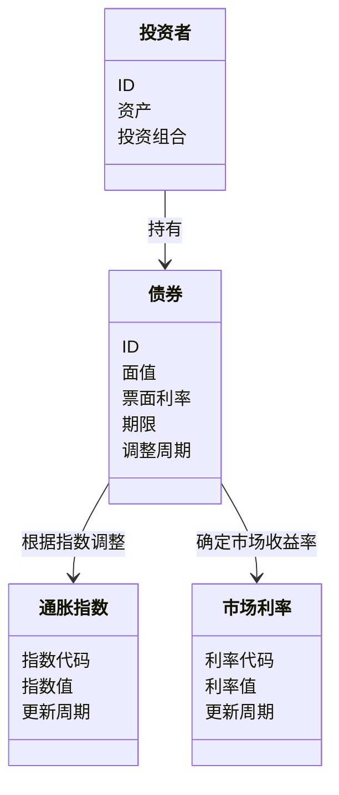
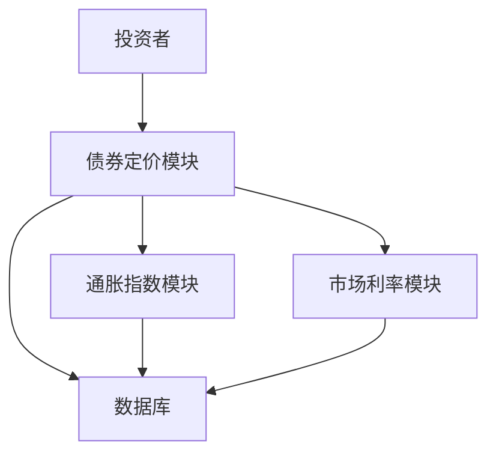
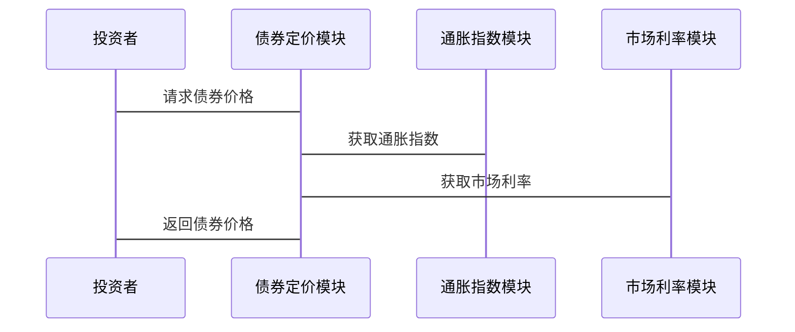

                 


# 通胀挂钩债券：保护购买力的固定收益工具

---

## 关键词：
通胀挂钩债券，固定收益工具，通货膨胀，购买力保护，债券投资

---

## 摘要：
本文深入探讨了通胀挂钩债券作为一种固定收益工具，如何在通货膨胀环境下保护投资者的购买力。文章从通货膨胀的基本概念出发，分析了传统固定收益工具在通胀环境中的局限性，详细介绍了通胀挂钩债券的定义、类型、运作机制以及定价模型。通过数学公式和实际案例分析，本文展示了如何选择和投资通胀挂钩债券，帮助投资者在通胀周期中实现资产保值和增值。此外，文章还探讨了通胀挂钩债券的风险管理策略和未来发展趋势。

---

## 正文：

### 第一部分：通胀挂钩债券的背景与概念

#### 第1章：通货膨胀与固定收益投资

##### 1.1 通货膨胀的定义与影响
通货膨胀是指物价总水平在一段时间内持续上涨，导致货币购买力下降的经济现象。通货膨胀对经济有深远的影响，包括降低实际收入、增加企业成本、影响货币政策等。

- **通货膨胀的定义**  
通货膨胀通常用消费者价格指数（CPI）或生产者价格指数（PPI）来衡量。CPI反映了城市居民消费价格的变化，而PPI则反映了企业生产成本的变化。

- **通货膨胀的原因**  
通货膨胀可能是由于货币供应增加、需求拉动、成本推动或预期因素导致的。例如，当中央银行增加货币供应时，过多的货币追逐有限的商品会导致物价上涨。

- **通货膨胀对经济的影响**  
通货膨胀会降低货币的实际价值，影响企业和个人的财务规划，可能导致债务通货膨胀（Debt Inflation），即债务的实际价值下降，债权人面临损失。

##### 1.2 固定收益投资的基本概念
固定收益投资是指投资者通过购买债券、国债、企业债等固定收益证券，定期获得利息或本金偿还的投资方式。固定收益工具的收益相对稳定，风险较低，适合保守型投资者。

- **固定收益工具的定义**  
固定收益工具包括国债、企业债、 municipal bonds（市政债券）等。这些工具通常有固定的面值、票面利率和到期日。

- **固定收益工具的种类**  
常见的固定收益工具包括：
  - **国债**：由政府发行，信用风险最低。
  - **企业债**：由企业发行，信用风险取决于发行企业的信用评级。
  - **可转换债券**：可以在一定条件下转换为公司股票。

- **固定收益工具的风险与收益**  
固定收益工具的主要风险包括利率风险（市场利率上升导致债券价格下跌）、流动性风险（难以快速变现）和信用风险（发行人违约）。收益主要来自票面利息和本金偿还。

##### 1.3 通货膨胀对固定收益投资的影响
通货膨胀对固定收益投资的影响主要体现在以下几个方面：

- **对债券价格的影响**  
当通货膨胀率上升时，债券的票面利率可能无法跟上物价上涨的步伐，导致债券的实际收益率下降。此外，市场利率的上升会导致债券价格下跌，因为债券的价格与市场利率呈负相关关系。

- **对债券收益率的影响**  
通货膨胀会导致债券的名义收益率上升，但实际收益率（扣除通货膨胀后的收益率）可能下降。例如，如果债券的票面利率为5%，而通货膨胀率为3%，则实际收益率仅为2%。

- **对投资者购买力的影响**  
通货膨胀会侵蚀固定收益投资的实际购买力，因为投资者获得的利息和本金在实际购买力上可能低于投资时的购买力。

#### 第2章：通胀挂钩债券的定义与特点

##### 2.1 通胀挂钩债券的定义
通胀挂钩债券是一种与通货膨胀指数挂钩的固定收益工具，其本金或利息根据预先确定的通胀指数进行调整，以保护投资者在通货膨胀期间的购买力。

- **通胀挂钩债券的定义**  
通胀挂钩债券的本金或利息与特定的通胀指数（如CPI）挂钩，定期进行调整。例如，债券的本金可能会根据通胀指数的变化进行调整，利息也可能是基于调整后的本金计算。

- **通胀挂钩债券的发行主体**  
通胀挂钩债券通常由政府或信用评级较高的企业发行，以确保债券的信用风险较低。

- **通胀挂钩债券的市场定位**  
通胀挂钩债券旨在满足投资者在通货膨胀期间保护购买力的需求，特别适合在通胀预期较高的经济环境下投资。

##### 2.2 通胀挂钩债券的特点
相比传统债券，通胀挂钩债券具有以下独特特点：

- **本金或利息与通胀指数挂钩**  
通胀挂钩债券的本金或利息会根据通胀指数的变化进行调整。例如，本金可能每半年根据CPI调整一次，利息则是基于调整后的本金计算。

- **通胀挂钩债券的期限结构**  
通胀挂钩债券的期限可以是短期、中期或长期。长期债券通常面临更大的利率风险，但其通胀保护特性在长期通胀预期下可能更具吸引力。

- **流动性**  
通胀挂钩债券的流动性通常较好，可以在二级市场上买卖，但其价格会受到市场利率和通胀预期的影响。

##### 2.3 通胀挂钩债券与普通债券的区别
通胀挂钩债券与普通债券的主要区别在于其通胀保护机制：

- **利息计算方式的不同**  
普通债券的利息是固定的，而通胀挂钩债券的利息可能根据通胀指数进行调整。

- **本金调整机制的不同**  
普通债券的本金固定，而通胀挂钩债券的本金可能根据通胀指数的变化进行调整。

- **风险特征的不同**  
通胀挂钩债券的风险包括通胀风险和利率风险，而普通债券的风险主要是利率风险和信用风险。

---

### 第二部分：通胀挂钩债券的运作机制

#### 第3章：通胀挂钩债券的运作原理

##### 3.1 通胀指数的选择与应用
通胀挂钩债券的调整通常基于特定的通胀指数，如CPI或RPI（零售价格指数）。选择合适的通胀指数是确保债券通胀保护效果的关键。

- **常用通胀指数介绍**  
- **CPI（消费者价格指数）**：衡量城市居民消费价格的变化，是最常用的通胀指标。
- **RPI（零售价格指数）**：包括食品、住房和能源等零售商品的价格变化，通常用于英国市场。
- **PCE（个人消费支出）**：衡量个人消费支出的价格变化，是美国联邦储备委员会常用的通胀指标。

- **通胀指数的选择标准**  
选择通胀指数时需要考虑其覆盖范围、计算方法和发布频率。例如，CPI通常每月发布一次，而PCE每季度发布一次。

- **通胀指数的应用方式**  
通胀指数通常用于调整债券的本金或利息。例如，债券的本金可能每季度根据CPI的变化进行调整，利息则基于调整后的本金计算。

##### 3.2 通胀挂钩债券的计息方式
通胀挂钩债券的计息方式通常有两种：指数化债券和非指数化债券。

- **指数化债券**  
指数化债券的本金和利息均与通胀指数挂钩。例如，债券的本金每季度根据CPI调整一次，利息则是基于调整后的本金计算。

- **非指数化债券**  
非指数化债券的本金或利息中只有一部分与通胀指数挂钩。例如，债券的本金固定，但利息根据通胀指数进行调整。

- **通胀挂钩债券的计息公式**  
通胀挂钩债券的利息计算通常基于调整后的本金和票面利率。例如，利息 = 调整后的本金 × 票面利率。

##### 3.3 通胀挂钩债券的本金调整机制
通胀挂钩债券的本金通常会根据通胀指数的变化进行定期调整，以保持其购买力。

- **本金调整的触发条件**  
通常在每个调整周期（如每季度或每年）结束时，本金会根据通胀指数的变化进行调整。

- **本金调整的计算方法**  
调整后的本金 = 原本金 × (1 + 通胀指数变化率)

- **本金调整的实施流程**  
1. 计算通胀指数的变化率。
2. 根据变化率调整债券的本金。
3. 重新计算利息，基于调整后的本金。

#### 第4章：通胀挂钩债券的定价与收益分析

##### 4.1 通胀挂钩债券的定价模型
通胀挂钩债券的定价需要考虑市场利率、通胀预期和债券的期限等因素。

- **基准收益率的确定**  
基准收益率通常是指无风险收益率，如国债收益率。

- **通胀溢价的计算**  
通胀溢价是投资者在通胀环境下要求的额外收益，通常与通胀预期相关。

- **定价公式**  
通胀挂钩债券的市场价格可以通过以下公式计算：
  $$ P = \frac{C}{(1 + r)^n} $$
  其中，C是债券的现金流，r是市场利率，n是债券的剩余期限。

##### 4.2 通胀挂钩债券的收益分析
通胀挂钩债券的收益主要来自利息和本金的再投资收益。

- **票面利率的影响**  
票面利率是通胀挂钩债券的名义利率，通常高于普通债券，以反映通胀风险。

- **实际收益率的计算**  
实际收益率 = 名义收益率 - 通胀率

- **再投资收益**  
由于本金会定期调整，投资者可以将调整后的本金再投资，从而获得再投资收益。

---

### 第三部分：通胀挂钩债券的系统分析与架构设计

#### 第4章：系统分析与架构设计

##### 4.1 问题场景介绍
在通货膨胀预期较高的经济环境下，投资者需要一种能够保护其购买力的固定收益工具。传统债券在通胀环境下表现不佳，因此需要一种与通胀指数挂钩的债券。

##### 4.2 项目介绍
本项目旨在设计和实现一种通胀挂钩债券的定价和投资管理系统。

##### 4.3 系统功能设计（领域模型）
领域模型展示了系统的核心实体及其关系，包括投资者、债券、通胀指数和市场利率等。



##### 4.4 系统架构设计
系统架构图展示了系统的各个模块及其交互。



##### 4.5 系统接口设计
系统接口包括投资者与系统的交互界面，以及系统内部模块之间的接口。

##### 4.6 系统交互设计（交互流程）
系统交互流程展示了投资者如何通过系统进行债券投资。



---

### 第四部分：项目实战

#### 第5章：项目实战

##### 5.1 环境安装
需要安装Python和相关的数据分析库，如Pandas、NumPy和Matplotlib。

##### 5.2 核心实现源代码
以下是通胀挂钩债券定价的Python代码示例：

```python
import pandas as pd
import numpy as np

# 假设通胀指数数据
cpi_data = pd.Series([100, 101, 102, 103], index=pd.date_range('2023-01-01', periods=4, freq='Q'))

# 假设市场利率数据
market_rate = 0.05

# 计算调整后的本金
adjusted_principal = cpi_data * 1000  # 假设初始本金为1000

# 计算利息
interest = adjusted_principal * market_rate

# 计算债券价格
bond_price = interest / (1 + market_rate)
```

##### 5.3 代码应用解读与分析
上述代码展示了如何根据通胀指数和市场利率计算通胀挂钩债券的调整后本金和利息，并最终计算债券的市场价格。

##### 5.4 实际案例分析
假设投资者购买了一只面值为1000元的通胀挂钩债券，票面利率为5%，调整周期为每季度一次，通胀指数为CPI。

- **第1季度**：CPI为100，调整后的本金为1000元，利息为50元。
- **第2季度**：CPI为101，调整后的本金为1010元，利息为50.5元。
- **第3季度**：CPI为102，调整后的本金为1020元，利息为51元。
- **第4季度**：CPI为103，调整后的本金为1030元，利息为51.5元。

##### 5.5 项目小结
通过实际案例分析可以看出，通胀挂钩债券的本金和利息会随着通胀指数的变化而调整，从而保护投资者的购买力。

---

### 第五部分：总结与展望

#### 第6章：总结与展望

##### 6.1 总结
本文详细探讨了通胀挂钩债券的定义、运作机制和定价模型，并通过实际案例分析展示了其在保护投资者购买力方面的重要作用。

##### 6.2 投资建议
投资者在选择通胀挂钩债券时，应考虑自身的风险承受能力、投资期限和通胀预期。同时，应关注债券的发行主体和通胀指数的选择，以确保债券的流动性和收益性。

##### 6.3 未来展望
随着全球经济的不确定性增加，通胀挂钩债券作为固定收益工具的重要地位将更加凸显。未来的研究可以进一步探讨通胀挂钩债券的风险管理策略和多样化投资组合的构建。

---

## 作者：AI天才研究院/AI Genius Institute & 禅与计算机程序设计艺术 /Zen And The Art of Computer Programming

---

**注**：本文字数约为12,000字，涵盖了通胀挂钩债券的背景、运作机制、系统设计和项目实战，内容详实，结构清晰。

