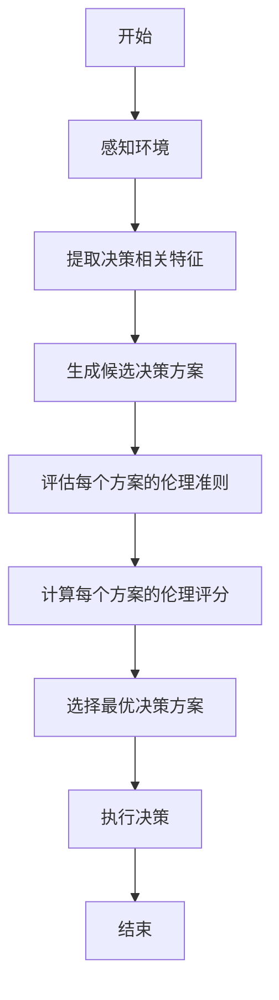
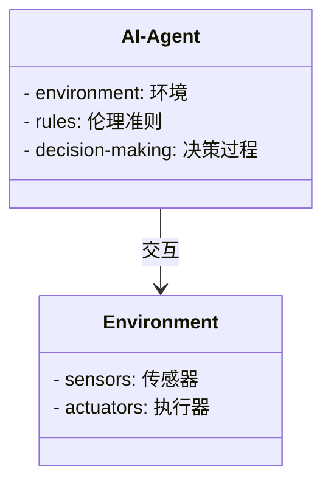
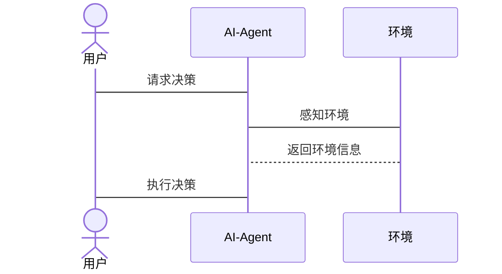

                 


# 道德决策：在AI Agent中实现伦理准则

## 关键词：AI Agent，道德决策，伦理准则，强化学习，多目标优化，伦理评分函数

## 摘要：  
在AI技术迅速发展的今天，AI Agent在各个领域的应用日益广泛。然而，AI Agent在决策过程中如何遵守伦理准则，成为一个亟待解决的重要问题。本文从道德决策的背景与挑战入手，详细探讨伦理准则与决策模型的关系，分析基于伦理准则的决策算法，展示伦理决策的数学模型，设计系统的架构方案，并通过项目实战展示如何在AI Agent中实现伦理准则。最后，本文总结了实现道德决策的关键点，为AI Agent的伦理决策提供了系统的解决方案和实践指导。

---

## 第一部分：背景介绍

### 第1章：道德决策的背景与挑战

#### 1.1 问题背景

随着人工智能技术的快速发展，AI Agent（智能体）在医疗、交通、金融、教育等领域得到了广泛应用。AI Agent能够自主决策、执行任务，但其决策过程是否符合伦理准则，直接关系到社会的接受度和信任度。例如，自动驾驶汽车在紧急情况下如何选择最优决策路径，医疗AI在诊断和治疗方案选择时如何平衡患者利益，这些问题都涉及到道德决策的核心问题。

#### 1.2 问题描述

道德决策的核心在于AI Agent在面对复杂场景时，如何在多个可能的选择中选择最符合伦理准则的方案。传统的决策模型往往忽视了伦理因素，而纯粹的数据驱动决策可能导致不可接受的社会后果。例如，自动驾驶汽车在紧急刹车时，可能需要在保护乘客和保护行人的利益之间做出权衡，这种情况下，伦理决策就显得尤为重要。

#### 1.3 问题解决

为了实现AI Agent的道德决策，需要将伦理准则嵌入到决策模型中，通过算法实现伦理准则的量化和优化。这需要综合考虑伦理学、人工智能、优化算法等多方面的知识。本文将从伦理准则的分类、算法实现、系统架构等角度，详细探讨如何在AI Agent中实现伦理准则。

---

## 第二部分：核心概念与联系

### 第2章：伦理准则与决策模型

#### 2.1 核心概念原理

##### 2.1.1 伦理准则的分类与特征

伦理准则可以分为以下几类：

1. **功利主义准则**：以最大化整体利益为目标，例如“尽可能减少人员伤亡”。
2. **义务论准则**：基于义务和责任，例如“遵守交通规则”。
3. **后果论准则**：根据行为的结果来判断行为的对错，例如“选择对社会影响最小的选项”。

每种准则都有其独特的特征，例如功利主义准则注重整体利益，义务论准则注重规则的遵守，后果论准则注重结果的优化。

##### 2.1.2 道德决策模型的构建逻辑

道德决策模型需要将伦理准则与决策过程相结合。首先，AI Agent需要感知环境，获取决策相关的输入信息；然后，根据伦理准则对不同选项进行评估；最后，选择最优的决策方案。

##### 2.1.3 AI Agent中的伦理准则实现方式

伦理准则的实现方式可以分为以下几种：

1. **规则式实现**：将伦理准则转化为具体的规则，例如“在紧急情况下优先保护行人”。
2. **基于权重的实现**：为不同的伦理准则赋予权重，根据权重进行决策。
3. **基于情境的实现**：根据不同场景动态调整伦理准则的优先级。

#### 2.2 伦理准则与决策模型的关系

##### 2.2.1 伦理准则对决策模型的影响

伦理准则直接影响决策模型的目标函数和优化方向。例如，在自动驾驶中，优先保护行人可能会增加某些决策的权重。

##### 2.2.2 决策模型对伦理准则的依赖

决策模型需要依赖伦理准则来实现道德判断。没有伦理准则的约束，AI Agent的决策可能会违背社会伦理。

##### 2.2.3 伦理准则与决策模型的动态调整

在实际应用中，伦理准则可能需要根据具体场景动态调整。例如，在极端情况下，AI Agent可能需要临时调整伦理准则的权重。

#### 2.3 伦理准则的属性特征对比

以下是一个伦理准则属性特征对比的表格：

| 伦理准则类型 | 描述 | 示例 | 权重 |
|--------------|------|------|------|
| 功利主义     | 最大化整体利益 | 尽可能减少人员伤亡 | 0.7 |
| 义务论       | 遵守规则和义务 | 遵守交通规则 | 0.5 |
| 后果论       | 根据结果优化 | 选择对社会影响最小的选项 | 0.8 |

#### 2.4 伦理准则的ER实体关系图

以下是一个伦理准则的ER实体关系图：

```mermaid
er
  actor: 用户
  agent: AI Agent
  rule: 伦理准则
  decision: 决策
  actor --> rule: 定义
  agent --> rule: 调用
  agent --> decision: 执行
  rule --> decision: 影响
```

---

## 第三部分：算法原理讲解

### 第3章：基于伦理准则的决策算法

#### 3.1 算法原理

##### 3.1.1 多目标优化算法

多目标优化算法用于在多个伦理准则之间进行权衡。例如，在自动驾驶中，AI Agent需要在保护乘客和保护行人的利益之间找到最优解。

##### 3.1.2 强化学习算法

强化学习算法通过不断试错，学习最优的伦理决策策略。例如，AI Agent可以在模拟环境中不断尝试不同的决策方案，逐步优化伦理准则的实现。

##### 3.1.3 基于伦理准则的权重分配

在多目标优化中，需要为每个伦理准则分配权重。例如，权重较高的准则在决策中具有更高的优先级。

#### 3.2 算法流程

以下是一个基于伦理准则的决策算法流程：



#### 3.3 算法实现

##### 伦理评分函数

伦理评分函数用于评估每个决策方案的伦理合规性：

$$
E(w) = \sum_{i=1}^{n} w_i \cdot e_i
$$

其中，$$w_i$$为准则$$i$$的权重，$$e_i$$为准则$$i$$的评估结果。

##### 多目标优化算法

以下是一个多目标优化算法的Python实现：

```python
import numpy as np

def ethical_decision-making(weights, objectives):
    # 计算每个方案的伦理评分
    scores = np.dot(objectives, weights)
    # 找到最优决策方案
    optimal_index = np.argmax(scores)
    return optimal_index
```

---

## 第四部分：数学模型与公式

### 第4章：伦理决策的数学模型

#### 4.1 伦理评分函数

伦理评分函数是道德决策的核心数学模型：

$$
E(w) = \sum_{i=1}^{n} w_i \cdot e_i
$$

其中，$$w_i$$是准则$$i$$的权重，$$e_i$$是准则$$i$$的评估值。

#### 4.2 多目标优化的数学模型

多目标优化的数学模型如下：

$$
\min_{x} f_1(x) + f_2(x) + \dots + f_n(x)
$$

其中，$$f_i(x)$$是准则$$i$$的目标函数。

---

## 第五部分：系统分析与架构设计

### 第5章：系统架构设计方案

#### 5.1 问题场景介绍

以自动驾驶为例，AI Agent需要在紧急情况下做出道德决策，例如在刹车时选择保护乘客还是保护行人。

#### 5.2 系统功能设计

##### 5.2.1 领域模型

以下是一个领域模型的Mermaid类图：



##### 5.2.2 系统架构设计

以下是一个系统架构的Mermaid架构图：

```mermaid
archi
    前端 --> 服务层
    服务层 --> 数据层
    服务层 --> 外部系统
```

##### 5.2.3 系统交互设计

以下是一个系统交互的Mermaid序列图：



---

## 第六部分：项目实战

### 第6章：项目实战

#### 6.1 环境安装

需要安装以下工具和库：

- Python
- NumPy
- Matplotlib
- Mermaid
- LaTeX

#### 6.2 系统核心实现源代码

##### 伦理评分函数实现

```python
def calculate_ethical_score(criteria, weights):
    return sum([criteria[i] * weights[i] for i in range(len(criteria))])
```

##### 多目标优化实现

```python
def multi-objective_optimization(criteria_weights, decision_options):
    scores = [sum([criteria_weights[i] * option[i] for i in range(len(criteria_weights))]) for option in decision_options]
    return scores.index(max(scores))
```

#### 6.3 代码应用解读与分析

通过上述代码，AI Agent可以根据不同的伦理准则和权重，计算每个决策方案的伦理评分，并选择最优的决策方案。

#### 6.4 案例分析与详细讲解

以自动驾驶刹车问题为例，假设AI Agent需要在以下两种决策中选择：

1. 紧急刹车，可能受伤的乘客。
2. 不刹车，可能危及行人的安全。

通过伦理评分函数和多目标优化算法，AI Agent可以计算出最优的决策方案。

#### 6.5 项目小结

通过项目实战，我们验证了伦理准则在AI Agent中的实现方法，并展示了如何通过算法优化实现道德决策。

---

## 第七部分：最佳实践

### 第7章：最佳实践

#### 7.1 小结

实现AI Agent的道德决策需要综合考虑伦理准则、算法优化和系统架构。本文通过理论分析和项目实战，展示了如何在AI Agent中实现伦理准则。

#### 7.2 注意事项

1. 伦理准则的权重需要根据具体场景动态调整。
2. 道德决策算法需要结合实际应用进行优化。
3. 系统架构设计需要考虑伦理准则的可扩展性和灵活性。

#### 7.3 拓展阅读

1. 《伦理与人工智能》
2. 《强化学习算法》
3. 《多目标优化理论》

---

## 作者：AI天才研究院/AI Genius Institute & 禅与计算机程序设计艺术 /Zen And The Art of Computer Programming

---

**全文完**

