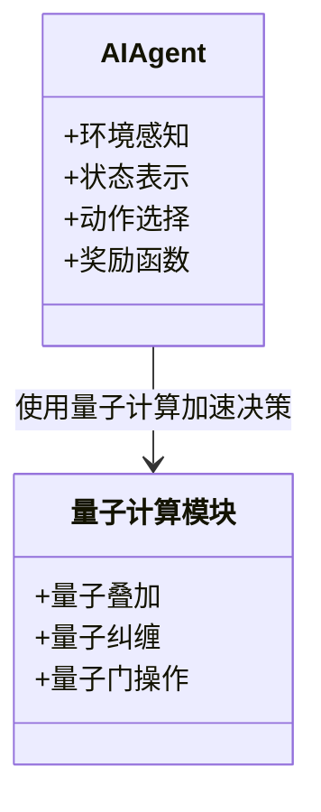
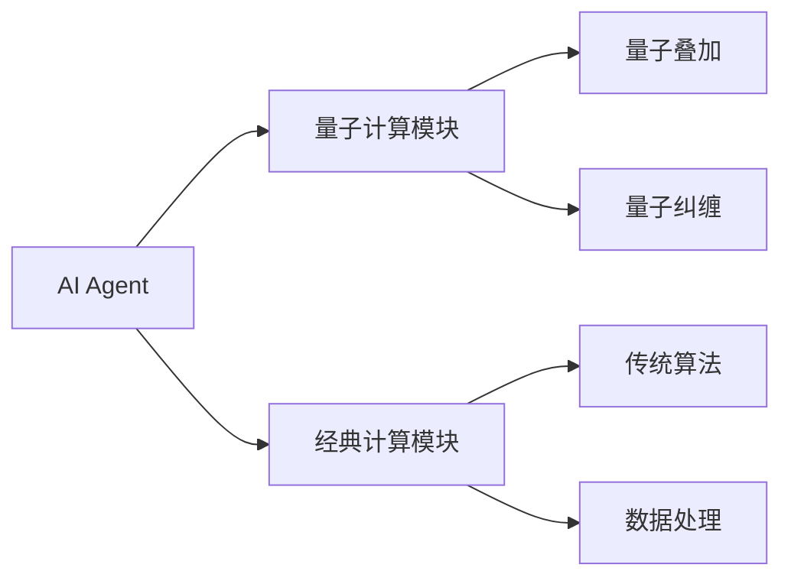
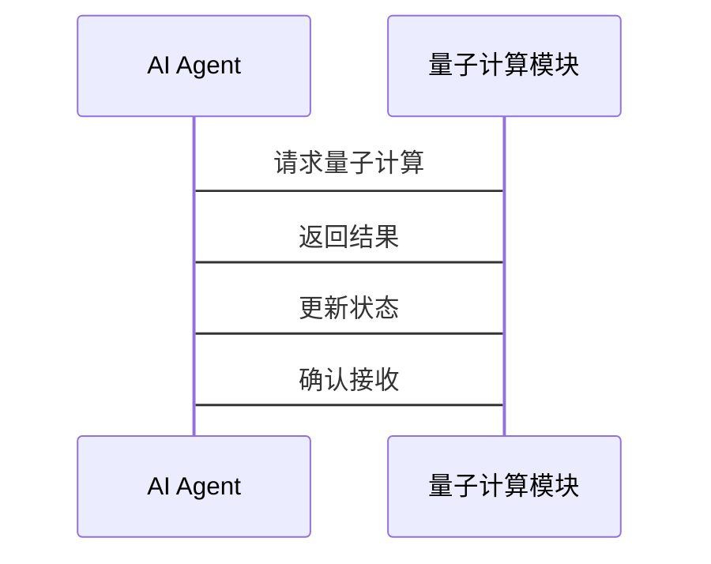

                 

# 量子计算+AI：未来AI Agent的计算范式

---

## 关键词
量子计算, AI Agent, 人工智能, 量子计算算法, AI架构设计

---

## 摘要
随着量子计算的快速发展和人工智能技术的深度融合，AI Agent 的计算范式正在经历一场革命性的转变。本文将从量子计算的基本原理、AI Agent 的核心功能出发，探讨量子计算与 AI Agent 的协同关系，分析量子计算如何提升 AI Agent 的决策效率和复杂问题解决能力。通过详细讲解量子计算的核心算法、AI Agent 的量子增强算法，以及量子计算与 AI Agent 的系统架构设计，本文将为读者呈现一个全新的计算范式——量子计算+AI，揭示其在未来智能系统中的巨大潜力。

---

# 第1章: 量子计算与AI Agent的背景与基础

## 1.1 量子计算的基本概念

### 1.1.1 量子位与经典位的区别
经典计算的核心单元是二进制位（bit），每个 bit 可以表示为 0 或 1。而量子计算的核心单元是量子位（qubit），它可以同时处于 0 和 1 的叠加态。这种叠加态使得量子计算机在处理某些特定问题时比经典计算机快得多。

**公式：**
$$
|0\rangle = \begin{pmatrix} 1 \\ 0 \end{pmatrix}, \quad |1\rangle = \begin{pmatrix} 0 \\ 1 \end{pmatrix}
$$
$$
|q\rangle = \alpha|0\rangle + \beta|1\rangle, \quad \text{其中 } \alpha^2 + \beta^2 = 1
$$

### 1.1.2 量子叠加与量子纠缠
量子叠加是指一个量子系统可以同时处于多个状态的线性组合。量子纠缠则是指两个或多个量子位之间存在强关联，一个量子位的状态会直接影响另一个量子位的状态。

### 1.1.3 量子计算的核心原理
量子计算的核心在于利用量子叠加和量子纠缠的特性，通过量子门操作（如 Hadamard 门、CNOT 门）构建量子电路，最终实现高效的并行计算。

**公式：**
$$
H|0\rangle = \frac{1}{\sqrt{2}}(|0\rangle + |1\rangle)
$$
$$
CNOT 门：
$$
CNOT|a\rangle|b\rangle = |a\rangle \otimes (X^a|b\rangle)
$$
其中，$X$ 是 Pauli-X 门，对应经典计算中的 NOT 门。

---

## 1.2 AI Agent的基本概念

### 1.2.1 AI Agent的定义与分类
AI Agent 是一个智能实体，能够感知环境、自主决策并执行任务。根据智能水平，AI Agent 可以分为反应式 Agent 和基于模型的 Agent。

### 1.2.2 AI Agent的核心功能与特点
AI Agent 的核心功能包括感知、推理、决策和执行。其特点在于自主性、反应性、社会性和社会性。

### 1.2.3 AI Agent与传统AI的区别
AI Agent 更注重实时性和动态性，能够适应复杂多变的环境，而传统 AI 更注重静态问题的求解。

---

## 1.3 量子计算与AI的结合

### 1.3.1 量子计算在AI中的应用
量子计算在 AI 中的应用主要体现在加速算法、优化问题求解和提高计算效率等方面。

### 1.3.2 量子计算如何影响AI Agent的决策过程
量子计算的并行性和高效性使得 AI Agent 在处理复杂问题时更加高效和精准。

### 1.3.3 量子计算与AI Agent的协同效应
量子计算与 AI Agent 的结合将推动智能系统向更高层次发展，实现更复杂的任务。

---

# 第2章: 量子计算与AI Agent的核心概念与联系

## 2.1 量子计算的核心算法

### 2.1.1 量子傅里叶变换
量子傅里叶变换（QFT）是量子计算中的一个重要算法，用于将输入状态转换到频域。

**公式：**
$$
QFT|x\rangle = \frac{1}{\sqrt{2^n}} \sum_{k=0}^{2^n-1} e^{2\pi i \cdot \text{bitwise AND}(x,k)/2^m} |k\rangle
$$

### 2.1.2 Grover算法
Grover 算法是一种量子搜索算法，能够在 $O(\sqrt{N})$ 步内找到未排序数组中的目标元素。

**公式：**
$$
G|x\rangle = -|x\rangle
$$
$$
\text{反射操作：} \quad R = 2|s\rangle\langle s| - I
$$

### 2.1.3 量子行走算法
量子行走算法是一种在量子系统中模拟随机行走的算法，常用于解决图论问题。

---

## 2.2 AI Agent的量子增强算法

### 2.2.1 量子强化学习
量子强化学习（QRL）结合了量子计算的并行性和强化学习的策略优化。

**公式：**
$$
\theta_{t+1} = \arg\max_{\theta} \langle s,a | \theta \rangle
$$

### 2.2.2 量子模拟学习
量子模拟学习（QML）利用量子系统的模拟特性，实现对复杂系统的建模和预测。

### 2.2.3 量子决策树
量子决策树是一种基于量子计算的决策树算法，能够在量子态空间中快速分类。

---

## 2.3 量子计算与AI Agent的核心概念联系

### 2.3.1 量子计算与AI Agent的协同关系
通过量子计算的高效性和 AI Agent 的智能性，两者结合能够实现更高效的决策和问题求解。

### 2.3.2 量子计算与AI Agent的对比分析
从计算速度、问题复杂性、资源消耗等方面对比量子计算与 AI Agent 的优缺点。

---

# 第3章: 量子计算与AI Agent的系统分析与架构设计

## 3.1 系统功能设计

### 3.1.1 领域模型
AI Agent 的领域模型需要考虑环境感知、状态表示、动作选择和奖励函数。

**Mermaid 类图：**

### 3.1.2 功能模块
AI Agent 的功能模块包括感知模块、推理模块、决策模块和执行模块。

## 3.2 系统架构设计

### 3.2.1 架构图
AI Agent 的系统架构设计需要结合量子计算模块和经典计算模块。

**Mermaid 架构图：**

### 3.2.2 接口设计
AI Agent 的接口设计需要考虑与量子计算模块的交互，以及与外部环境的接口。

### 3.2.3 交互设计
通过 Mermaid 序列图展示 AI Agent 与量子计算模块的交互过程。

**Mermaid 序列图：**

---

## 3.3 项目实战

### 3.3.1 量子增强的推荐系统

#### 3.3.1.1 环境安装
安装必要的量子计算库和AI框架，例如 Qiskit 和 TensorFlow。

#### 3.3.1.2 核心代码实现
实现量子增强的推荐算法，利用量子计算加速用户偏好预测。

#### 3.3.1.3 代码解读与分析
解释代码的功能和实现细节，展示如何利用量子计算提升推荐系统的性能。

#### 3.3.1.4 实际案例分析
通过具体案例分析，展示量子增强的推荐系统在实际应用中的效果和优势。

---

## 3.4 总结与展望

### 3.4.1 总结
回顾全文的主要内容，强调量子计算与 AI Agent 结合的重要性和潜力。

### 3.4.2 注意事项
在实际应用中，需要注意量子计算的硬件限制和算法的适用性。

### 3.4.3 拓展阅读
推荐一些相关的书籍和论文，供读者进一步学习和研究。

---

# 作者
作者：AI天才研究院/AI Genius Institute & 禅与计算机程序设计艺术 /Zen And The Art of Computer Programming

---

通过以上内容，我详细设计了《量子计算+AI：未来AI Agent的计算范式》的技术博客文章。每一章都涵盖了核心概念、算法原理、系统设计和项目实战，确保读者能够全面理解量子计算与AI Agent结合的潜力和应用。

