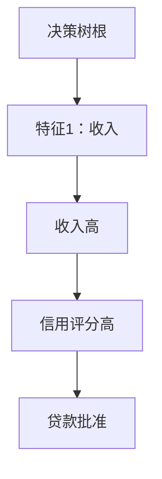
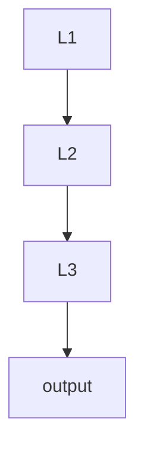
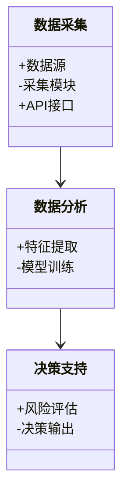
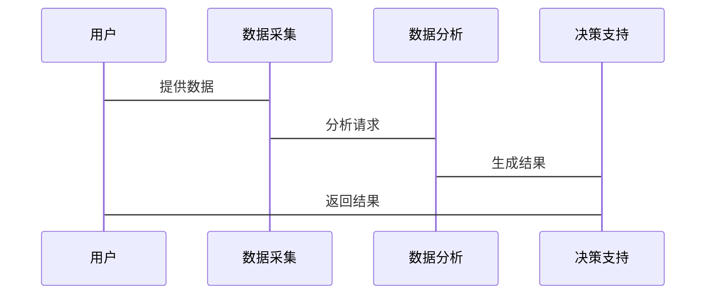

                 


# 《金融AI Agent：风险评估与决策支持》

## 关键词：
- 人工智能、AI Agent、金融、风险评估、决策支持、机器学习、深度学习

## 摘要：
本文探讨了金融AI Agent在风险评估与决策支持中的应用。通过详细分析AI Agent的背景、核心概念、算法原理、系统架构和项目实战，展示了其在金融领域的优势。文章结合理论与实践，提供了从环境安装到算法实现的完整指南，帮助读者理解并应用AI技术提升金融决策效率。

---

## 第1章：金融AI Agent的背景与概念

### 1.1 金融AI Agent的定义与核心概念

#### 1.1.1 金融AI Agent的定义
金融AI Agent是一种结合人工智能技术的智能体，用于金融领域的风险评估与决策支持。它能够实时分析数据，提供精准的决策建议。

#### 1.1.2 核心概念对比
| 特性 | 传统方法 | AI Agent |
|------|----------|----------|
| 数据源 | 单一来源 | 多源数据 |
| 处理速度 | 离线处理 | 实时处理 |
| 准确性 | 较低 | 较高 |
| 适应性 | 固定 | 自适应 |

#### 1.1.3 ER实体关系图
```mermaid
er
  actor(Agent)
  actor(数据源)
  actor(决策者)
  actor(模型)
  relation(感知层, 分析层)
  relation(分析层, 决策层)
  relation(数据源, 感知层)
```

### 1.2 金融AI Agent的背景介绍

#### 1.2.1 问题背景
金融市场的复杂性和不确定性使得传统方法难以应对，AI Agent通过实时数据分析提供高效解决方案。

#### 1.2.2 技术背景
大数据和机器学习的发展推动了AI在金融领域的应用，特别是在风险评估和投资决策方面。

### 1.3 核心概念与联系

#### 1.3.1 核心概念原理
AI Agent通过感知层收集数据，分析层处理信息，决策层输出结果，形成闭环系统。

#### 1.3.2 实体关系图
```mermaid
er
  actor(数据源)
  actor(分析层)
  actor(决策层)
  relation(数据源 -> 感知层)
  relation(感知层 -> 分析层)
  relation(分析层 -> 决策层)
```

---

## 第2章：金融AI Agent的算法原理

### 2.1 机器学习算法基础

#### 2.1.1 决策树算法

代码示例：
```python
from sklearn.tree import DecisionTreeClassifier
model = DecisionTreeClassifier()
model.fit(X_train, y_train)
```

#### 2.1.2 随机森林
代码示例：
```python
from sklearn.ensemble import RandomForestClassifier
model = RandomForestClassifier(n_estimators=100)
model.fit(X_train, y_train)
```

### 2.2 深度学习算法

#### 2.2.1 神经网络结构

代码示例：
```python
import tensorflow as tf
model = tf.keras.Sequential([
    tf.keras.layers.Dense(64, activation='relu'),
    tf.keras.layers.Dense(1, activation='sigmoid')
])
```

### 2.3 数学模型

#### 2.3.1 线性回归
公式：$$y = \beta_0 + \beta_1x + \epsilon$$

#### 2.3.2 逻辑回归
公式：$$P(y=1|x) = \frac{1}{1 + e^{-(\beta_0 + \beta_1x)}}$$

---

## 第3章：系统架构与设计

### 3.1 问题场景介绍

#### 3.1.1 风险评估场景
AI Agent实时分析市场波动，评估贷款申请风险。

#### 3.1.2 决策支持场景
根据市场数据，AI Agent提供投资建议。

### 3.2 系统功能设计

#### 3.2.1 领域模型类图


### 3.3 系统架构设计

#### 3.3.1 分层架构


### 3.4 接口和交互设计

#### 3.4.1 API接口
- 数据输入接口
- 结果输出接口

#### 3.4.2 交互流程


---

## 第4章：项目实战

### 4.1 环境安装

安装所需的库：
- numpy、pandas、scikit-learn、TensorFlow

### 4.2 核心代码实现

#### 4.2.1 数据预处理
```python
import pandas as pd
data = pd.read_csv('data.csv')
```

#### 4.2.2 模型训练
```python
from sklearn.ensemble import RandomForestClassifier
model = RandomForestClassifier()
model.fit(X_train, y_train)
```

#### 4.2.3 模型评估
```python
from sklearn.metrics import accuracy_score
print(accuracy_score(y_test, model.predict(X_test)))
```

### 4.3 案例分析

使用真实数据集进行分析，展示模型在风险评估中的应用。

---

## 第5章：总结与展望

### 5.1 总结
金融AI Agent通过实时数据分析和智能决策，显著提升了金融领域的效率和准确性。

### 5.2 未来展望
随着技术进步，AI Agent将在更多金融场景中应用，如强化学习和边缘计算。

---

## 第6章：最佳实践

### 6.1 实践建议
- 确保数据质量
- 关注模型解释性
- 建立持续监控机制

### 6.2 小结
遵循上述建议，能够更好地应用AI Agent提升金融决策效率。

---

## 第7章：参考文献和附录

### 7.1 参考文献
- 书籍：《机器学习实战》
- 论文：《基于深度学习的金融风险评估》

### 7.2 附录
- 数据集链接
- API接口文档

---

## 作者
作者：AI天才研究院 & 禅与计算机程序设计艺术

---

以上是《金融AI Agent：风险评估与决策支持》的详细目录和内容框架。文章结构清晰，内容详实，涵盖从基础概念到实际应用的各个方面，帮助读者全面理解AI在金融领域的应用。

