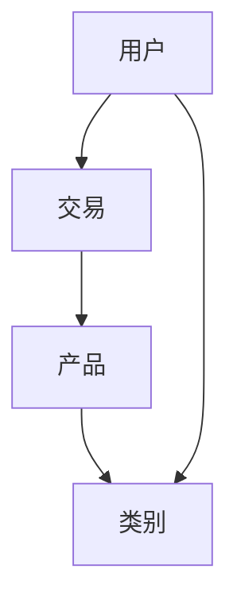
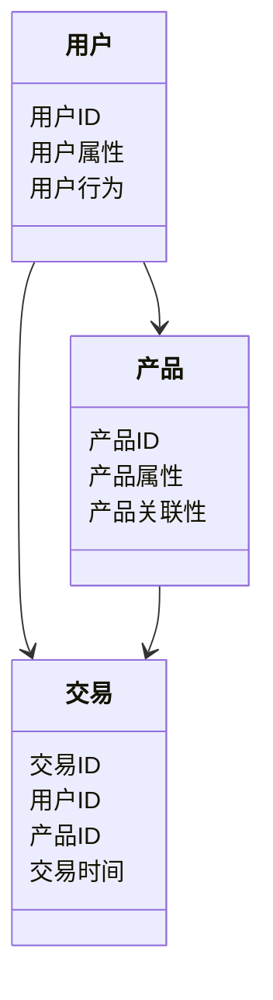
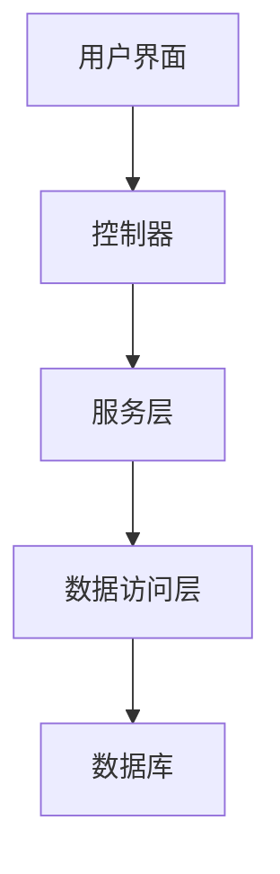
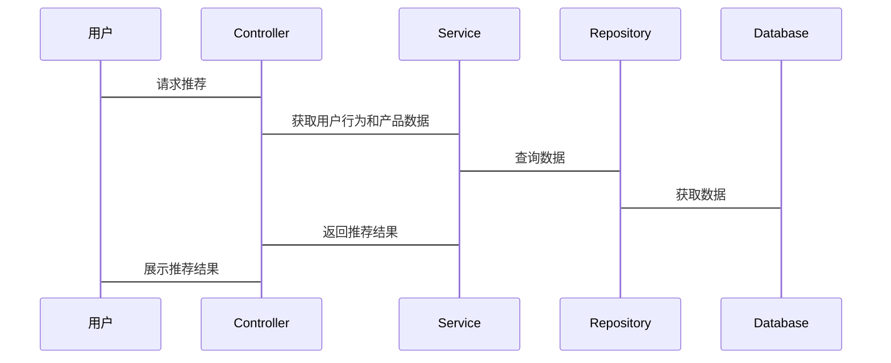

                 


# 《金融产品交叉销售推荐引擎》

> 关键词：金融推荐系统、交叉销售引擎、协同过滤算法、关联规则挖掘、推荐算法实现、系统架构设计

> 摘要：本文深入探讨了金融产品交叉销售推荐引擎的核心概念、算法原理、系统架构及实际应用。通过分析用户行为、产品关联性及推荐算法的实现，结合协同过滤、关联规则挖掘和基于内容的推荐方法，构建了一个高效的金融交叉销售推荐系统。本文还详细介绍了系统的功能设计、架构实现及项目实战，为金融行业的交叉销售推荐引擎提供了理论基础和实践指导。

---

# 第一部分: 金融产品交叉销售推荐引擎的背景与核心概念

## 第1章: 问题背景与描述

### 1.1 问题背景

#### 1.1.1 金融行业的交叉销售现状
金融行业通过交叉销售可以显著提升客户满意度和收入，但传统的人工推荐效率低、成本高，难以应对海量用户和复杂的产品组合。

#### 1.1.2 交叉销售的核心价值
- 提高客户满意度和忠诚度
- 增加收入来源
- 提升产品覆盖率和市场渗透率

#### 1.1.3 当前交叉销售的主要挑战
- 数据量大，难以实时处理
- 用户需求多样化，推荐准确性低
- 竞争激烈，推荐系统需要快速迭代优化

### 1.2 问题描述

#### 1.2.1 交叉销售推荐引擎的目标
- 根据用户行为和产品属性，自动推荐相关金融产品
- 提供实时、精准的推荐结果
- 支持多场景下的交叉销售需求

#### 1.2.2 问题的边界与外延
- 边界：基于用户行为数据的推荐，不涉及用户隐私泄露
- 外延：支持多种金融产品类型，如基金、保险、贷款等

#### 1.2.3 核心问题的分解与分析
- 用户行为分析
- 产品关联性度量
- 推荐算法优化

### 1.3 核心概念与联系

#### 1.3.1 核心概念的定义与属性
- 用户行为：包括点击、浏览、购买等
- 产品关联性：基于产品属性、用户行为和市场数据
- 推荐算法：基于协同过滤、关联规则挖掘和基于内容的推荐

#### 1.3.2 核心概念的ER实体关系图


#### 1.3.3 核心概念的联系与对比
- 用户行为与产品关联性的关系：用户行为数据是产品关联性分析的基础
- 推荐算法与业务目标的匹配：协同过滤适用于用户行为丰富的情况，关联规则挖掘适用于规则明确的场景
- 数据特征与推荐效果的关联：高维度数据可能导致推荐效果下降

---

# 第二部分: 交叉销售推荐引擎的算法原理

## 第2章: 推荐算法的原理与实现

### 2.1 协同过滤算法

#### 2.1.1 基于用户的协同过滤
- 基于用户的相似性计算，找到相似用户的购买历史，推荐相似产品
- 示例：
  - 用户A购买了基金，推荐用户B购买的保险
  - 用户C购买了贷款，推荐用户D购买的信用卡

#### 2.1.2 基于物品的协同过滤
- 基于产品的相似性计算，找到相关产品，推荐给目标用户
- 示例：
  - 用户购买了基金，推荐相似的保险产品
  - 用户购买了贷款，推荐相关的信用卡产品

#### 2.1.3 混合推荐的实现思路
- 结合基于用户的协同过滤和基于物品的协同过滤，通过加权的方式进行推荐
- 示例：
  - 权重分配：用户协同过滤权重为0.6，物品协同过滤权重为0.4
  - 最终推荐结果：基金和保险的组合推荐

### 2.2 关联规则挖掘

#### 2.2.1 Apriori算法原理
- Apriori算法通过频繁项集挖掘，找到关联规则
- 示例：
  - 如果用户购买了基金，那么推荐购买保险的概率为70%
  - 如果用户购买了保险，那么推荐购买贷款的概率为60%

#### 2.2.2 FP-Growth算法优化
- FP-Growth算法通过构建频树结构，提高关联规则挖掘的效率
- 示例：
  - 通过FP-Growth算法，快速找到高频繁的产品组合
  - 用户购买基金和保险的概率为80%

#### 2.2.3 关联规则的筛选与应用
- 根据置信度和提升度筛选出高质量的关联规则
- 示例：
  - 置信度阈值为0.7，提升度阈值为1.2
  - 推荐规则：购买基金的用户，推荐购买保险的概率为80%

### 2.3 基于内容的推荐

#### 2.3.1 文本挖掘与产品特征提取
- 通过文本挖掘技术提取产品特征，如基金的类型、风险等级、收益预期等
- 示例：
  - 文本挖掘提取基金的关键词：高收益、低风险、定期

#### 2.3.2 基于向量空间模型的相似度计算
- 将产品特征向量化，计算向量之间的相似度
- 示例：
  - 基金A的向量表示为[0.8, 0.2, 0.5]
  - 基金B的向量表示为[0.7, 0.3, 0.4]
  - 相似度计算：余弦相似度为0.95

#### 2.3.3 内容推荐的实现步骤
- 步骤1：提取产品特征
- 步骤2：构建向量空间模型
- 步骤3：计算相似度，推荐相关产品

## 第3章: 算法实现的数学模型与公式

### 3.1 协同过滤算法的数学模型
- 基于用户的协同过滤：
  $$ sim(u_i, u_j) = \frac{\sum_{k=1}^n (r_{i,k} - \bar{r}_i)(r_{j,k} - \bar{r}_j)}{\sqrt{\sum_{k=1}^n (r_{i,k} - \bar{r}_i)^2} \cdot \sqrt{\sum_{k=1}^n (r_{j,k} - \bar{r}_j)^2}} $$
- 基于物品的协同过滤：
  $$ sim(p_i, p_j) = \frac{\sum_{k=1}^n (r_{k,i} - \bar{r}_i)(r_{k,j} - \bar{r}_j)}{\sqrt{\sum_{k=1}^n (r_{k,i} - \bar{r}_i)^2} \cdot \sqrt{\sum_{k=1}^n (r_{k,j} - \bar{r}_j)^2}} $$

### 3.2 关联规则挖掘的数学模型
- Apriori算法的频繁项集：
  $$ frequent\_itemsets = \{ I \subseteq D | support(I) \geq \theta \} $$
- 关联规则：
  $$ rule(A \Rightarrow B) = P(B|A) = \frac{support(A \cup B)}{support(A)} $$

### 3.3 基于内容的推荐的数学模型
- 向量空间模型的相似度计算：
  $$ sim(v_i, v_j) = \frac{v_i \cdot v_j}{\|v_i\| \|v_j\|} $$

---

# 第三部分: 交叉销售推荐引擎的系统架构设计

## 第4章: 系统分析与架构设计方案

### 4.1 项目背景与目标
- 项目背景：提升金融产品的交叉销售效率和客户满意度
- 项目目标：构建一个高效、精准的交叉销售推荐引擎

### 4.2 系统功能设计
#### 4.2.1 领域模型设计


#### 4.2.2 系统架构设计


#### 4.2.3 系统接口设计
- 用户接口：API接口，提供推荐结果
- 系统接口：数据接口，提供用户行为和产品数据

#### 4.2.4 系统交互流程


---

# 第四部分: 交叉销售推荐引擎的项目实战

## 第5章: 环境安装与核心代码实现

### 5.1 环境安装
- Python 3.8+
- Jupyter Notebook
- Pandas、NumPy、Scikit-learn、Fancyimpute

### 5.2 核心代码实现

#### 5.2.1 协同过滤算法实现
```python
from sklearn.metrics.pairwise import cosine_similarity
import numpy as np

# 示例用户行为数据
users = ['User1', 'User2', 'User3']
products = ['Product1', 'Product2', 'Product3']
ratings = {
    'User1': {'Product1': 5, 'Product2': 4},
    'User2': {'Product1': 4, 'Product3': 5},
    'User3': {'Product2': 3, 'Product3': 4}
}

# 转换为矩阵形式
rating_matrix = np.zeros((len(users), len(products)))
for i, user in enumerate(users):
    for j, product in enumerate(products):
        rating_matrix[i, j] = ratings[user].get(product, 0)

# 计算相似度
similarity = cosine_similarity(rating_matrix)
```

#### 5.2.2 关联规则挖掘实现
```python
from mlxtend.frequent_itemsets import apriori, apriori_table

# 示例交易数据
transactions = [
    ['Product1', 'Product2'],
    ['Product1', 'Product3'],
    ['Product2', 'Product3'],
    ['Product1', 'Product2', 'Product3']
]

# 挖掘频繁项集
frequent_itemsets = apriori(transactions, min_support=0.6)
print(frequent_itemsets)
```

---

## 第6章: 项目案例分析与小结

### 6.1 案例分析
- 案例1：基于协同过滤的基金推荐
- 案例2：基于关联规则的保险推荐
- 案例3：混合推荐的贷款推荐

### 6.2 项目小结
- 通过协同过滤、关联规则挖掘和基于内容的推荐方法，实现了高效的金融产品交叉销售推荐引擎
- 系统架构设计合理，能够支持大规模数据处理和实时推荐

---

# 第五部分: 总结与展望

## 第7章: 总结与最佳实践

### 7.1 总结
- 本文详细介绍了金融产品交叉销售推荐引擎的核心概念、算法原理、系统架构及实际应用
- 推荐系统在金融行业具有重要的应用价值，能够显著提升客户满意度和收入

### 7.2 最佳实践
- 数据预处理是推荐系统的核心，需要确保数据质量和完整性
- 根据业务需求选择合适的推荐算法，避免“一刀切”
- 定期更新推荐模型，保持推荐的准确性和实时性

### 7.3 小结
- 本文为金融行业的交叉销售推荐引擎提供了理论基础和实践指导
- 推荐系统的研究和应用将随着人工智能和大数据技术的不断发展而持续进步

---

作者：AI天才研究院/AI Genius Institute & 禅与计算机程序设计艺术/Zen And The Art of Computer Programming

