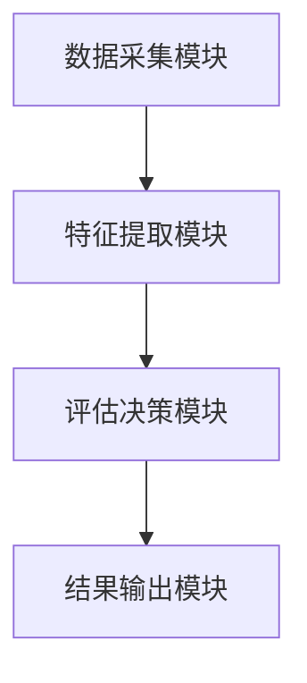

                 


# 《金融产品创新评估框架》

---

## 关键词
金融创新、评估框架、机器学习、系统架构、创新评估、风险管理、收益分析

---

## 摘要
本文系统地介绍了金融产品创新评估框架的设计与实现，从背景、核心概念、算法原理、系统架构到实际案例进行了详细阐述。文章首先分析了金融创新的背景与现状，明确了评估框架的重要性。接着，定义了核心概念，构建了创新性、风险性、可行性和收益性的评估模型。然后，基于机器学习算法，提出了创新性评估的数学模型，并通过决策树算法进行了实现。最后，设计了完整的系统架构，包括数据采集、特征提取和评估决策三个模块，并提供了实际案例和代码实现。本文为金融产品的创新评估提供了理论基础和实践指导，具有重要的参考价值。

---

# 第一部分: 金融产品创新评估框架的背景与核心概念

## 第1章: 金融产品创新评估框架的背景介绍

### 1.1 金融创新的背景与现状
金融创新是金融行业发展的重要驱动力，随着科技的进步和市场需求的变化，金融创新呈现出多样化、数字化和智能化的趋势。传统的金融产品已难以满足现代市场的需求，创新成为金融机构竞争力的核心来源。

#### 1.1.1 金融创新的定义与特征
- **定义**：金融创新是指在金融领域中，通过引入新技术、新方法或新模式，创造出具有更高价值或更好风险收益比的金融产品或服务。
- **特征**：
  - 复杂性：涉及多个领域，如风险管理、收益分析等。
  - 风险性：创新往往伴随着较高的不确定性。
  - 可持续性：创新需要长期投入和持续优化。

#### 1.1.2 当前金融创新的主要趋势
- 数字化金融：如区块链、人工智能在金融领域的应用。
- 个性化服务：基于大数据的客户画像和定制化产品。
- 可持续金融：绿色金融、ESG投资等。

#### 1.1.3 金融创新中的问题与挑战
- 创新成本高：技术研发和市场推广需要大量投入。
- 风险控制难：创新产品可能带来未知风险。
- 监管滞后：创新速度往往快于监管政策的调整。

### 1.2 金融产品创新评估框架的重要性
金融产品创新评估框架是确保创新有序进行的关键工具，它能够帮助金融机构科学评估创新的可行性、风险性和收益性。

#### 1.2.1 为什么需要评估框架
- 确保创新的合规性：符合监管要求，避免法律风险。
- 提高创新效率：通过系统化评估减少试错成本。
- 优化资源配置：合理分配资源到最有潜力的创新项目。

#### 1.2.2 评估框架在金融创新中的作用
- **风险管理**：通过评估框架识别和控制创新中的潜在风险。
- **决策支持**：为管理层提供数据支持，辅助决策。
- **创新激励**：通过评估结果激励创新团队。

#### 1.2.3 评估框架的核心目标与价值
- **核心目标**：量化创新的价值，优化创新流程。
- **价值**：提高创新的成功率，降低创新成本。

### 1.3 问题背景与问题描述
金融产品创新评估需要解决的核心问题是：如何科学评估创新的可行性、风险性和收益性。

#### 1.3.1 金融产品创新中的关键问题
- 创新是否符合市场需求。
- 创新是否具有可持续性。
- 创新是否能够带来超额收益。

#### 1.3.2 问题的边界与外延
- **边界**：仅关注创新的直接相关因素，如市场、技术和监管。
- **外延**：延伸至创新后的推广和维护。

#### 1.3.3 核心概念与组成要素
- 核心概念：创新性、风险性、可行性和收益性。
- 组成要素：市场需求分析、技术实现难度、监管合规性、收益预测模型。

---

## 第2章: 金融产品创新评估框架的核心概念

### 2.1 核心概念的定义与原理
金融产品创新评估框架的核心概念包括创新性、风险性、可行性和收益性。

#### 2.1.1 创新性
- **定义**：创新性是评估金融产品是否具有新颖性、独特性和领先性的指标。
- **评估方法**：基于市场调研和竞争分析，判断产品是否具有独特的价值主张。

#### 2.1.2 风险性
- **定义**：风险性是评估金融产品可能面临的技术风险、市场风险和法律风险的指标。
- **评估方法**：通过风险矩阵和蒙特卡洛模拟进行量化分析。

#### 2.1.3 可行性
- **定义**：可行性是评估金融产品在技术、市场和资源等方面的实现可能性。
- **评估方法**：基于项目管理方法论，分析资源、时间和成本的可行性。

#### 2.1.4 收益性
- **定义**：收益性是评估金融产品预期的收益能力。
- **评估方法**：通过财务模型和收益预测模型进行分析。

### 2.2 核心概念的属性特征对比
通过对比分析，明确各核心概念的差异与联系。

#### 2.2.1 创新性与风险性的对比分析
- **创新性高**：可能带来更高的收益，但风险也更大。
- **创新性低**：风险较低，但收益有限。

#### 2.2.2 可行性与收益性的对比分析
- **可行性高**：更容易实现，但收益可能有限。
- **可行性低**：需要更多资源，但可能带来更高收益。

### 2.3 ER实体关系图架构
通过ER图展示金融产品创新评估框架的核心实体及其关系。

```mermaid
erDiagram
    actor 金融机构 {
        +id : number
        +名称 : string
    }
    actor 产品创新团队 {
        +id : number
        +名称 : string
    }
    actor 监管机构 {
        +id : number
        +名称 : string
    }
    actor 评估框架 {
        +id : number
        +名称 : string
    }
    金融机构 --> 产品创新团队 : 提交创新申请
    产品创新团队 --> 评估框架 : 提供创新方案
    评估框架 --> 监管机构 : 提交评估报告
    评估框架 --> 金融机构 : 提供评估结果
```

---

## 第3章: 金融产品创新评估框架的算法原理

### 3.1 算法原理概述
基于机器学习的创新性评估算法，通过数据驱动的方式量化金融产品的创新性。

#### 3.1.1 评估模型的构建方法
- 数据采集：收集市场、技术和监管数据。
- 特征提取：提取创新性相关的特征，如技术复杂度、市场需求等。
- 模型训练：使用决策树、随机森林等算法进行分类或回归分析。

#### 3.1.2 算法的核心思想
- 使用决策树算法对创新性进行分类，基于特征的重要性进行排序。

#### 3.1.3 创新性评估的数学模型
创新性评分公式：
$$
\text{创新性评分} = \sum_{i=1}^{n} w_i \cdot f_i
$$
其中，$w_i$ 是特征 $f_i$ 的权重。

---

## 第4章: 金融产品创新评估框架的系统分析与架构设计

### 4.1 系统功能设计
- 数据采集模块：收集市场、技术和监管数据。
- 特征提取模块：提取创新性相关的特征。
- 评估决策模块：基于算法生成评估结果。

### 4.2 系统架构设计


### 4.3 系统接口设计
- 数据接口：与市场数据源对接。
- 用户接口：供金融机构提交创新申请。

---

## 第5章: 项目实战

### 5.1 环境安装与配置
- 安装Python和相关库（如scikit-learn、pandas）。

### 5.2 核心实现代码
```python
from sklearn.tree import DecisionTreeClassifier
from sklearn.metrics import accuracy_score

# 示例数据
X = [[...], ...]  # 特征矩阵
y = [0, 1, 0, 1]  # 标签

# 模型训练
model = DecisionTreeClassifier()
model.fit(X, y)

# 预测与评估
y_pred = model.predict(X)
print("准确率:", accuracy_score(y, y_pred))
```

---

## 第6章: 最佳实践与总结

### 6.1 小结
本文详细阐述了金融产品创新评估框架的设计与实现，为金融机构提供了科学的评估方法。

### 6.2 注意事项
- 数据质量是评估结果的关键。
- 模型需要不断优化和更新。

### 6.3 扩展阅读
推荐阅读相关领域的书籍和论文，深入学习机器学习和金融创新的结合。

---

## 作者
作者：AI天才研究院 & 禅与计算机程序设计艺术

---

希望这篇文章能够为读者提供有价值的参考，帮助理解金融产品创新评估框架的设计与实现。

