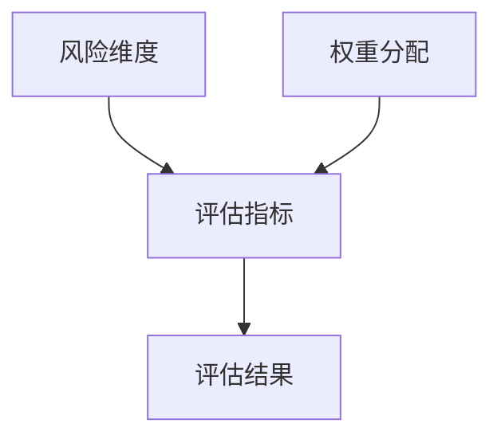
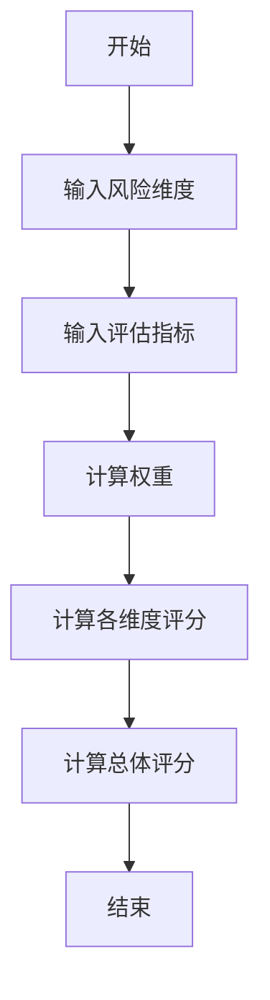
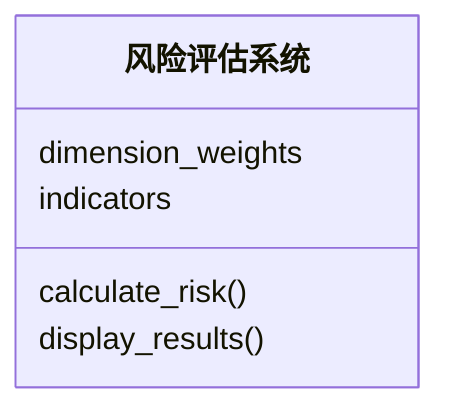

                 


# 《金融产品创新风险评估矩阵》

## 关键词：金融产品创新、风险评估矩阵、风险管理、金融创新、风险矩阵

## 摘要：  
本文构建了一个系统化的金融产品创新风险评估矩阵，通过分析风险来源、构建评估模型、设计系统架构，并结合实际案例，提供了一套完整的金融创新风险管理解决方案。

---

# 第1章: 金融产品创新风险评估矩阵的背景与意义

## 1.1 问题背景与问题描述

### 1.1.1 金融产品创新的背景  
金融创新是推动金融市场发展的核心动力。随着科技的进步和市场需求的变化，金融机构不断推出新的金融产品，如区块链、人工智能驱动的投资工具等。然而，创新也伴随着高风险，包括市场风险、操作风险、法律风险等。

### 1.1.2 创新中的风险来源与影响  
金融创新的风险主要来源于以下几个方面：
1. **市场需求不确定性**：新产品可能无法获得预期的市场反应。
2. **技术风险**：依赖新技术的产品可能因技术问题失败。
3. **监管风险**：新产品可能不符合监管要求，导致合规问题。
4. **操作风险**：新产品的推出可能涉及复杂的操作流程，容易出错。

这些风险可能影响金融机构的声誉、财务状况，甚至引发系统性风险。

### 1.1.3 传统风险评估方法的局限性  
传统风险评估方法通常基于经验判断或简单的指标分析，存在以下问题：
1. **主观性**：依赖评估者的经验，缺乏客观性。
2. **维度单一**：难以全面覆盖所有风险来源。
3. **动态性不足**：无法实时更新和调整评估结果。

## 1.2 问题解决与创新思路

### 1.2.1 风险评估矩阵的核心目标  
金融产品创新风险评估矩阵的核心目标是：
- 提供一个系统化、结构化的风险评估工具。
- 通过多维度分析，全面识别和量化风险。
- 为决策者提供数据支持，优化产品设计和风险管理。

### 1.2.2 矩阵方法的优势与创新点  
矩阵方法的优势在于：
1. **多维度分析**：从多个维度（如市场、技术、法律）评估风险。
2. **量化评估**：通过数学模型量化风险程度。
3. **动态调整**：根据实时数据更新评估结果。

创新点在于将金融创新的各个因素有机结合起来，形成一个动态的风险评估系统。

### 1.2.3 矩阵的适用范围与边界  
适用范围：
- 新产品研发阶段的风险评估。
- 创新产品的市场推广前的评估。
- 现有产品的风险监控。

边界：
- 仅关注创新过程中的风险，不涉及产品运营后的风险。
- 不考虑非金融类产品的风险评估。

## 1.3 概念结构与核心要素

### 1.3.1 矩阵的构成要素  
矩阵由以下要素构成：
1. **风险维度**：如市场风险、技术风险、法律风险。
2. **评估指标**：如市场需求、技术可行性、监管合规性。
3. **权重分配**：各维度的重要性评分。
4. **评估结果**：综合各维度的评估结果。

### 1.3.2 核心要素的定义与属性  
| 要素 | 定义 | 属性 |
|------|------|------|
| 风险维度 | 不同类型的风险来源 | 市场、技术、法律等 |
| 评估指标 | 具体衡量风险的指标 | 需求匹配度、技术成熟度、监管合规性 |
| 权重分配 | 各维度的重要性评分 | 0-10分，根据经验确定 |

### 1.3.3 要素之间的关系与依赖  


---

## 1.4 本章小结  
本章介绍了金融产品创新风险评估矩阵的背景和意义，分析了传统方法的局限性，并提出了矩阵的核心目标和创新点。矩阵的构建为金融创新提供了系统化的风险管理工具。

---

# 第2章: 风险评估矩阵的核心概念与联系

## 2.1 核心概念的原理与特征

### 2.1.1 风险评估的基本原理  
风险评估的核心原理是通过多维度分析，量化各维度的风险程度，并综合得出总体风险。

### 2.1.2 矩阵模型的数学基础  
矩阵模型基于线性代数和概率论，通过加权平均计算总体风险。

### 2.1.3 核心概念的属性特征对比  
| 特征 | 风险维度 | 评估指标 | 权重分配 | 评估结果 |
|------|----------|----------|----------|----------|
| 输入 | 市场风险 | 需求匹配度 | 市场权重 | 综合风险 |
| 输出 | 技术风险 | 技术成熟度 | 技术权重 | 各维度风险 |
| 作用 | 法律风险 | 监管合规性 | 法律权重 | 总体风险 |

## 2.2 核心要素的ER实体关系图

```mermaid
er
    actor(评估者) -[1..n]-> attribute(风险维度)
    attribute(风险维度) -[1..n]-> indicator(评估指标)
```

## 2.3 矩阵的构建逻辑

### 2.3.1 矩阵维度的确定  
根据金融产品的特点，确定市场、技术、法律三个主要维度。

### 2.3.2 矩阵权重的分配  
根据经验或专家意见，为各维度分配权重。例如：
- 市场维度权重：5
- 技术维度权重：3
- 法律维度权重：2

### 2.3.3 矩阵计算的流程  
1. 确定各维度的评估指标。
2. 对各指标进行评分（0-10分）。
3. 根据权重计算各维度的加权评分。
4. 综合各维度的加权评分，得出总体风险。

## 2.4 本章小结  
本章详细解释了风险评估矩阵的核心概念，并通过ER图展示了要素之间的关系，为后续的数学建模奠定了基础。

---

# 第3章: 风险评估矩阵的数学模型与算法原理

## 3.1 数学模型的构建

### 3.1.1 矩阵的基本结构  
风险评估矩阵由以下部分组成：
- 风险维度：$D = \{D_1, D_2, D_3\}$
- 评估指标：$I = \{I_1, I_2, I_3\}$
- 权重分配：$W = \{w_1, w_2, w_3\}$

### 3.1.2 风险评估的公式推导  
总体风险评分公式：
$$ R = \sum_{i=1}^{n} w_i \cdot I_i $$

其中：
- $w_i$ 是第i个维度的权重。
- $I_i$ 是第i个维度的评估指标。

### 3.1.3 模型的优化与改进  
通过引入动态权重调整，模型可以根据市场变化实时更新权重。

## 3.2 算法原理

### 3.2.1 算法流程图  


### 3.2.2 算法实现的Python代码  
```python
def calculate_risk(dimension_weights, indicators):
    risk_scores = []
    for i in range(len(dimension_weights)):
        score = dimension_weights[i] * indicators[i]
        risk_scores.append(score)
    total_risk = sum(risk_scores)
    return total_risk

# 示例
dimension_weights = [5, 3, 2]
indicators = [8, 6, 7]
total_risk = calculate_risk(dimension_weights, indicators)
print("总体风险评分:", total_risk)
```

## 3.3 本章小结  
本章通过数学模型和算法原理，详细讲解了风险评估矩阵的计算方法，并通过代码示例展示了模型的应用。

---

# 第4章: 系统分析与架构设计

## 4.1 系统功能设计

### 4.1.1 功能模块  
1. **输入模块**：输入风险维度、评估指标和权重。
2. **计算模块**：计算各维度的评分和总体风险。
3. **输出模块**：展示风险评估结果。

### 4.1.2 领域模型图  


## 4.2 系统架构设计

### 4.2.1 架构图  


## 4.3 接口设计与交互流程

### 4.3.1 接口设计  
1. **输入接口**：接受风险维度、评估指标和权重。
2. **输出接口**：返回风险评分。

### 4.3.2 交互流程  
1. 用户输入风险维度。
2. 用户输入评估指标。
3. 用户输入权重。
4. 系统计算各维度评分。
5. 系统输出总体风险评分。

## 4.4 本章小结  
本章通过系统分析与架构设计，展示了风险评估矩阵的实现方式，并提供了交互流程和架构图。

---

# 第5章: 项目实战

## 5.1 环境安装与配置

### 5.1.1 Python环境  
安装Python和必要的库（如numpy、pandas）。

### 5.1.2 数据集准备  
准备风险维度、评估指标和权重数据。

## 5.2 核心代码实现

### 5.2.1 风险评估函数  
```python
def risk_assessment(dimension_weights, indicators):
    total_risk = 0
    for i in range(len(dimension_weights)):
        total_risk += dimension_weights[i] * indicators[i]
    return total_risk

# 示例
dimension_weights = [5, 3, 2]
indicators = [8, 6, 7]
result = risk_assessment(dimension_weights, indicators)
print("风险评估结果:", result)
```

## 5.3 案例分析与解读

### 5.3.1 案例背景  
假设某金融机构推出一款基于区块链的理财产品。

### 5.3.2 案例分析  
- 风险维度：
  - 市场风险：市场需求高，评分为8。
  - 技术风险：技术成熟度高，评分为6。
  - 法律风险：合规性高，评分为7。
- 权重分配：
  - 市场权重：5
  - 技术权重：3
  - 法律权重：2

### 5.3.3 结果解读  
总体风险评分：
$$ R = 5 \times 8 + 3 \times 6 + 2 \times 7 = 40 + 18 + 14 = 72 $$

评分结果表明，该产品的总体风险较低，适合推出。

## 5.4 本章小结  
本章通过实际案例展示了风险评估矩阵的应用，并详细解读了评估结果。

---

# 第6章: 最佳实践与总结

## 6.1 小结  
金融产品创新风险评估矩阵为金融机构提供了系统化的风险管理工具。

## 6.2 注意事项  
1. 权重分配应根据实际情况调整。
2. 数据更新应保持实时性。
3. 结果应定期复审。

## 6.3 拓展阅读  
推荐学习金融风险管理、数据分析、系统架构设计等相关知识。

## 6.4 本章小结  
本章总结了矩阵的应用经验，并提供了实用的建议。

---

# 第7章: 附录

## 7.1 工具安装指南  
如何安装Python和相关库。

## 7.2 数据集说明  
风险维度、评估指标和权重的定义。

## 7.3 参考文献  
相关文献和资料的引用。

---

# 作者：AI天才研究院 & 禅与计算机程序设计艺术

---

通过以上目录大纲，您可以开始撰写完整的文章。每一章的内容需要详细展开，确保逻辑清晰、技术细节到位，并结合实际案例进行分析。

