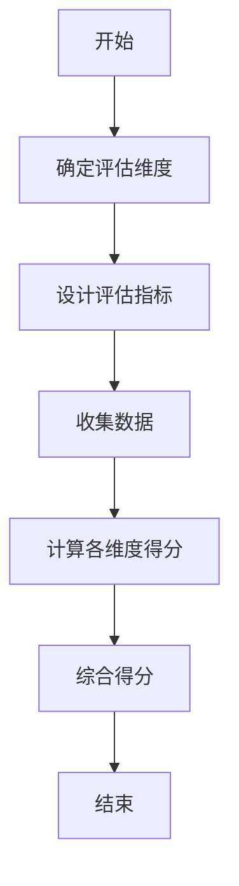
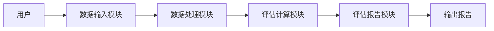

                 


# 《金融产品创新风险评估矩阵设计》

> 关键词：金融产品创新，风险评估，矩阵设计，系统架构，项目实战

> 摘要：本文旨在探讨金融产品创新过程中风险评估矩阵的设计方法。通过分析金融创新的核心挑战，提出一种基于矩阵的评估框架，结合概率论和统计学方法，构建系统化的风险评估模型，并通过实际案例展示其应用。本文还详细阐述了系统架构设计和项目实战，为读者提供全面的解决方案。

---

## 第一章: 金融产品创新风险评估矩阵的背景介绍

### 1.1 问题背景

#### 1.1.1 金融产品创新的现状与挑战
金融创新是推动金融行业发展的重要动力，但其复杂性和不确定性带来了显著的风险。传统的产品开发和风险管理方法难以应对日益复杂的市场环境，尤其是在数字化转型和金融科技快速发展的背景下，如何有效评估和控制金融创新风险成为亟待解决的问题。

#### 1.1.2 风险评估在金融创新中的重要性
金融创新涉及多种风险，包括市场风险、信用风险、操作风险和合规风险。这些风险可能影响产品的成功与否，甚至对整个机构的稳定性构成威胁。因此，建立有效的风险评估机制是确保创新成功的关键。

#### 1.1.3 矩阵评估方法的必要性
传统的线性评估方法难以全面捕捉金融创新中的多维度风险。矩阵评估方法通过构建多维评估框架，能够更全面地识别和量化风险，为决策者提供更准确的参考。

### 1.2 问题描述

#### 1.2.1 金融产品创新的主要风险类型
- 市场风险：产品是否符合市场需求。
- 技术风险：技术创新的可行性和稳定性。
- 法律风险：合规性问题。
- 操作风险：产品开发和运营中的潜在问题。

#### 1.2.2 矩阵评估方法的目标
- 统一化评估标准。
- 多维度量化风险。
- 提供决策支持。

#### 1.2.3 矩阵评估的适用范围与边界
适用于金融产品的全生命周期管理，从需求分析到产品上线后的监控。其边界在于不涉及具体的市场操作，而是提供风险评估的工具和方法。

### 1.3 问题解决

#### 1.3.1 矩阵评估方法的核心思想
通过构建多维评估框架，量化各个风险维度的影响程度，综合评估整体风险。

#### 1.3.2 矩阵评估方法的关键步骤
1. 确定评估维度。
2. 设计评估指标。
3. 收集和分析数据。
4. 综合评估结果。

#### 1.3.3 矩阵评估方法的创新点
引入概率论和统计学方法，结合领域知识，构建动态评估模型。

### 1.4 边界与外延

#### 1.4.1 矩阵评估方法的适用场景
- 新产品开发。
- 创新业务拓展。
- 风险管理优化。

#### 1.4.2 矩阵评估方法的局限性
- 数据依赖性强。
- 模型假设的简化可能导致评估误差。
- 仅提供评估工具，不解决具体实施问题。

#### 1.4.3 矩阵评估方法与其他评估方法的对比
对比传统线性评估方法和现代数据分析方法，矩阵评估方法在多维度分析和动态调整方面具有明显优势。

### 1.5 概念结构与核心要素

#### 1.5.1 矩阵评估模型的组成要素
- 评估维度：市场、技术、法律、操作。
- 评估指标：市场需求度、技术可行性、合规性、操作复杂度。
- 数据来源：市场调研、技术文档、法律法规、历史数据。

---

## 第二章: 核心概念与联系

### 2.1 核心概念的原理

#### 2.1.1 矩阵评估模型的核心思想
通过多维度评估，将各个风险因素量化，形成一个综合评分，帮助决策者识别高风险点并制定应对策略。

#### 2.1.2 矩阵评估模型的属性特征

| 属性 | 描述 |
|------|------|
| 维度多样性 | 包括多个评估维度，如市场、技术、法律等。 |
| 数据依赖性 | 需要大量数据支持评估结果。 |
| 动态调整性 | 根据市场变化和数据更新进行动态调整。 |

#### 2.1.3 矩阵评估模型的ER实体关系图

```mermaid
er
actor: 用户
model: 矩阵评估模型
dimension: 评估维度
indicator: 评估指标
data: 数据源
goal: 风险评估目标

actor --> model
model --> dimension
model --> indicator
dimension --> indicator
model --> data
data --> indicator
indicator --> goal
```

---

## 第三章: 算法原理讲解

### 3.1 算法原理

#### 3.1.1 算法流程图



#### 3.1.2 数学模型与公式

1. **指标权重计算**：
   $$ w_i = \frac{sum_{j=1}^{n} s_{ij}}{sum_{j=1}^{n} s_{ij}}} $$
   其中，$w_i$ 是第 $i$ 个维度的权重，$s_{ij}$ 是第 $j$ 个指标的得分。

2. **综合得分计算**：
   $$ S = \sum_{i=1}^{m} w_i \times score_i $$
   其中，$S$ 是综合得分，$m$ 是评估维度的数量，$score_i$ 是第 $i$ 个维度的得分。

#### 3.1.3 举例说明

假设评估维度为市场、技术和法律，权重分别为0.4、0.3和0.3。各维度得分分别为0.8、0.6和0.5。综合得分为：
$$ S = 0.4 \times 0.8 + 0.3 \times 0.6 + 0.3 \times 0.5 = 0.32 + 0.18 + 0.15 = 0.65 $$

---

## 第四章: 系统分析与架构设计方案

### 4.1 系统分析

#### 4.1.1 项目场景介绍
一个金融机构计划推出一款创新型理财产品，需要对产品进行全面风险评估。

#### 4.1.2 系统功能设计
- 用户输入评估维度和指标。
- 数据收集与处理。
- 计算各维度得分和综合得分。
- 输出评估报告。

#### 4.1.3 系统架构设计



#### 4.1.4 系统接口设计
- 输入接口：接收评估维度和指标。
- 输出接口：返回评估结果。

#### 4.1.5 系统交互流程图

```mermaid
sequenceDiagram
    actor 用户
    system 系统
    用户 -> 系统: 提交评估维度
    系统 -> 用户: 确认评估维度
    用户 -> 系统: 提交评估指标
    系统 -> 用户: 确认评估指标
    系统 -> 用户: 输出评估结果
```

---

## 第五章: 项目实战

### 5.1 环境安装

#### 5.1.1 系统环境
- 操作系统：Linux/Windows/MacOS
- 开发工具：Python 3.8+
- 库依赖：numpy, pandas, matplotlib

### 5.2 核心代码实现

#### 5.2.1 数据处理模块

```python
import numpy as np
import pandas as pd

def calculate_weights(scores):
    total = np.sum(scores, axis=0)
    weights = scores / total
    return weights

def calculate_scores(weights, indicators):
    scores = np.dot(weights, indicators)
    return scores

# 示例数据
scores = np.array([
    [0.8, 0.6, 0.5],  # 市场、技术、法律
    [0.7, 0.5, 0.6],  # 其他维度
])
indicators = np.array([0.4, 0.3, 0.3])

weights = calculate_weights(scores)
final_score = calculate_scores(weights, indicators)
print(final_score)
```

#### 5.2.2 评估报告模块

```python
import matplotlib.pyplot as plt

def generate_report(final_score):
    plt.figure(figsize=(10, 6))
    plt.bar(['综合得分'], final_score)
    plt.title('金融产品创新风险评估结果')
    plt.show()

generate_report(final_score)
```

### 5.3 案例分析

#### 5.3.1 案例背景
某创新型理财产品在市场、技术和法律三个维度上的得分分别为0.8、0.6和0.5。

#### 5.3.2 数据分析
- 市场得分：0.8（高）。
- 技术得分：0.6（中）。
- 法律得分：0.5（低）。

综合得分为0.65，属于中等风险。

#### 5.3.3 优化建议
- 加强技术实现的可行性分析。
- 确保产品合规性。

### 5.4 项目小结

---

## 第六章: 总结与展望

### 6.1 最佳实践 tips

#### 6.1.1 实践建议
- 数据质量是关键，确保数据的完整性和准确性。
- 定期更新模型，适应市场变化。
- 结合领域知识，优化评估维度和指标。

#### 6.1.2 注意事项
- 理解模型的局限性，避免过度依赖。
- 结合具体业务场景，灵活调整模型参数。

#### 6.1.3 拓展阅读
- 《风险管理与金融创新》。
- 《数据驱动的金融模型设计》。

---

## 附录: 作者信息

作者：AI天才研究院/AI Genius Institute & 禅与计算机程序设计艺术 /Zen And The Art of Computer Programming

---

以上是《金融产品创新风险评估矩阵设计》的技术博客文章的完整目录和部分章节内容。如需进一步扩展或调整，请随时告知！

