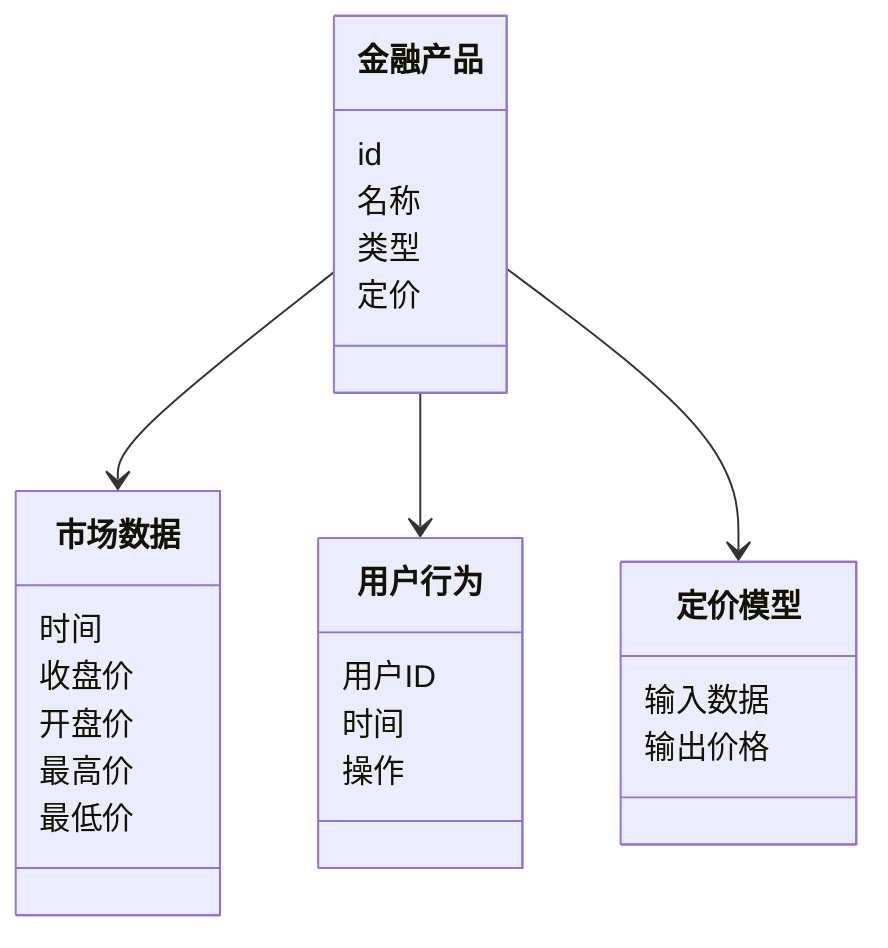
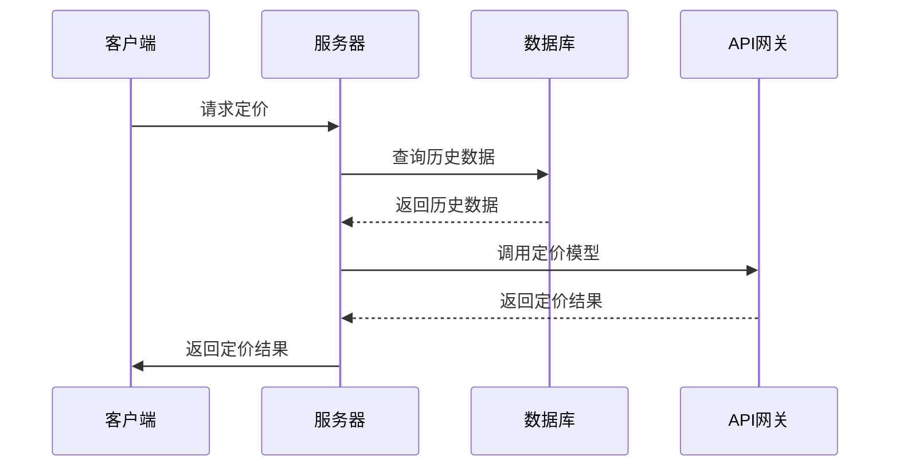

                 


# 《金融产品定价优化模型》

---

## 关键词：
- 金融产品定价
- 定价优化模型
- 优化算法
- 系统架构
- 项目实战

---

## 摘要：
本文系统地介绍了金融产品定价优化模型的核心概念、数学基础、算法实现、系统架构设计及实际应用。通过从基础概念到高级算法的逐步推导，结合实际案例分析，帮助读者深入理解金融产品定价优化的原理和方法。文章内容涵盖定价模型的构建、优化算法的选择与实现、系统架构的设计与实现，以及项目实战的详细解读，为读者提供从理论到实践的全面指导。

---

# 第一部分: 金融产品定价优化模型概述

# 第1章: 金融产品定价基础

## 1.1 金融产品定价的背景与意义
### 1.1.1 金融产品的定义与分类
- 金融产品的定义
- 金融产品的分类：股票、债券、基金、保险、衍生品等
- 定价在金融产品中的重要性

### 1.1.2 定价在金融产品中的核心作用
- 价格决定市场参与者的收益与风险
- 定价影响金融产品的市场流动性
- 定价是金融风险管理的基础

### 1.1.3 金融定价的基本原则
- 市场供需原则
- 风险补偿原则
- 时间价值原则

## 1.2 金融产品定价的核心问题
### 1.2.1 定价模型的基本要素
- 产品属性：期限、风险、流动性等
- 市场因素：利率、通货膨胀、市场风险
- 主体行为：投资者心理、市场参与者的策略

### 1.2.2 金融定价中的主要挑战
- 数据的不完全性与不确定性
- 模型的复杂性与可解释性
- 市场环境的动态变化

### 1.2.3 优化定价的目标与边界
- 最大化收益
- 降低风险
- 符合监管要求

## 1.3 金融定价的数学基础
### 1.3.1 概率论与统计学基础
- 随机变量与概率分布
- 统计推断与假设检验
- 时间序列分析

### 1.3.2 优化理论的基本概念
- 线性规划与非线性规划
- 凸函数与凸优化
- 对偶问题与对偶优化

### 1.3.3 定价模型的数学框架
- 定价模型的一般形式：$P = f(x, y, z)$
- 数据输入的特征工程：$x = (x_1, x_2, \dots, x_n)$
- 模型输出的目标函数：$f(x, y, z) = P$

---

# 第2章: 定价优化模型的核心概念

## 2.1 定价模型的原理与流程
### 2.1.1 数据收集与预处理
- 数据来源：历史交易数据、市场数据、用户行为数据
- 数据清洗：缺失值处理、异常值处理
- 数据特征提取：时间特征、市场特征、产品特征

### 2.1.2 模型构建与训练
- 模型选择：线性回归、随机森林、神经网络等
- 模型训练：监督学习、无监督学习
- 超参数调优：网格搜索、随机搜索

### 2.1.3 模型验证与优化
- 交叉验证：K折交叉验证
- 模型评估：均方误差、准确率、召回率
- 模型优化：基于梯度的优化算法

## 2.2 定价模型的关键属性
### 2.2.1 模型的准确性
- 定义：预测值与真实值的接近程度
- 度量：均方误差（MSE）、R平方值
- 影响因素：数据质量、模型复杂度

### 2.2.2 模型的可解释性
- 定义：模型输出的可解释性
- 影响因素：模型的复杂性、特征的重要性
- 提升方法：特征重要性分析、局部可解释性方法

### 2.2.3 模型的可扩展性
- 定义：模型在数据量和特征增加时的性能保持能力
- 影响因素：算法的时间复杂度、空间复杂度
- 提升方法：分布式计算、在线学习

## 2.3 模型的实体关系图
### 2.3.1 ER实体关系图的构建
```mermaid
erd
    entity 金融产品 {
        id
        名称
        类型
    }
    entity 市场数据 {
        时间
        收盘价
        开盘价
        最高价
        最低价
    }
    entity 用户行为 {
        用户ID
        时间
        操作
    }
    金融产品 -- 右：市场数据
    金融产品 -- 右：用户行为
```

### 2.3.2 实体关系图的分析
- 关系分析：金融产品与市场数据的关联性
- 关系分析：金融产品与用户行为的关联性
- 关系分析：市场数据与用户行为的关联性

### 2.3.3 实体关系图的优化
- 优化目标：提高数据的完整性和准确性
- 优化方法：增加外键约束、优化索引

---

# 第3章: 定价优化算法的数学模型

## 3.1 线性回归模型
### 3.1.1 线性回归的数学公式
$$
y = \beta_0 + \beta_1x_1 + \beta_2x_2 + \dots + \beta_nx_n + \epsilon
$$

### 3.1.2 线性回归的假设检验
- 正态性检验
- 方差齐性检验
- 独立性检验
- 线性检验

### 3.1.3 线性回归的优缺点
- 优点：简单、可解释性强
- 缺点：假设严格，适用范围有限

## 3.2 非线性回归模型
### 3.2.1 非线性回归的数学公式
$$
y = f(x, \beta) + \epsilon
$$

### 3.2.2 非线性回归的优化方法
- 最小二乘法
- 迭代法：牛顿法、高斯-牛顿法

### 3.2.3 非线性回归的应用场景
- 非线性关系显著的情况
- 数据分布不符合正态分布的情况

## 3.3 优化算法的数学推导
### 3.3.1 梯度下降法的数学推导
$$
\theta_{new} = \theta_{old} - \eta \nabla J(\theta_{old})
$$

### 3.3.2 随机梯度下降法的数学推导
$$
\theta_{new} = \theta_{old} - \eta \nabla J(\theta_{old}, X_i, y_i)
$$

### 3.3.3 其他优化算法的简要介绍
- Adam优化器
- AdaGrad优化器
- RMSprop优化器

## 3.4 算法的比较与选择
### 3.4.1 算法的性能对比
- 收敛速度
- 计算复杂度
- 稳定性

### 3.4.2 算法的选择标准
- 数据规模
- 数据分布
- 计算资源

### 3.4.3 算法的适用场景
- 线性回归适用于线性关系
- 非线性回归适用于非线性关系
- 高维数据适用深度学习模型

---

# 第4章: 定价优化模型的系统分析与架构设计

## 4.1 问题场景介绍
- 金融产品的定价系统需要考虑的因素
- 系统需要实现的功能

## 4.2 系统功能设计
### 4.2.1 领域模型mermaid类图


### 4.2.2 系统架构设计mermaid架构图


### 4.2.3 系统接口设计
- 输入接口：API接口定义
- 输出接口：返回格式和状态码

### 4.2.4 系统交互mermaid序列图


---

# 第5章: 项目实战

## 5.1 环境安装与配置
- 安装Python
- 安装NumPy、Pandas、Scikit-learn等库
- 安装Jupyter Notebook

## 5.2 核心实现源代码
### 5.2.1 数据预处理代码
```python
import pandas as pd
import numpy as np

# 数据加载
data = pd.read_csv('金融产品数据.csv')

# 数据清洗
data.dropna()
data = data[~data.duplicated()]

# 特征提取
features = data[['市场数据', '用户行为']]
label = data['定价']
```

### 5.2.2 模型训练代码
```python
from sklearn.linear_model import LinearRegression
from sklearn.model_selection import train_test_split

# 数据分割
X_train, X_test, y_train, y_test = train_test_split(features, label, test_size=0.2)

# 模型训练
model = LinearRegression()
model.fit(X_train, y_train)

# 模型预测
y_pred = model.predict(X_test)
```

### 5.2.3 模型评估代码
```python
from sklearn.metrics import mean_squared_error, r2_score

# �均方误差
mse = mean_squared_error(y_test, y_pred)
print(f'MSE: {mse}')

# R平方值
r2 = r2_score(y_test, y_pred)
print(f'R²: {r2}')
```

## 5.3 实际案例分析
- 案例背景
- 数据收集与处理
- 模型选择与训练
- 模型评估与优化

## 5.4 项目小结
- 项目目标的实现
- 项目中的问题与解决
- 经验总结

---

# 第6章: 高级主题与未来趋势

## 6.1 机器学习在定价优化中的最新应用
- 深度学习模型的应用
- 强化学习的应用
- 图神经网络的应用

## 6.2 模型解释性与可解释性定价
- 解释性模型的优势
- 提升模型解释性的方法

## 6.3 实时定价与动态调整
- 实时定价的实现
- 动态调整的策略

## 6.4 风险管理与定价优化的结合
- 风险管理在定价中的作用
- 风险定价模型的构建

---

# 附录

## 附录A: 参考文献
- 经济学教材
- 金融数学教材
- 机器学习教材

## 附录B: 工具安装指南
- Python环境配置
- 数据处理工具安装
- 开发框架安装

## 附录C: 常见问题与解答
- 问题1：如何选择定价模型？
- 问题2：如何处理数据中的缺失值？
- 问题3：如何优化模型的性能？

---

# 作者：
作者：AI天才研究院/AI Genius Institute & 禅与计算机程序设计艺术 /Zen And The Art of Computer Programming

---

以上是《金融产品定价优化模型》的完整目录大纲，涵盖了从基础概念到高级应用的全部内容，确保读者能够系统地掌握金融产品定价优化模型的知识。

