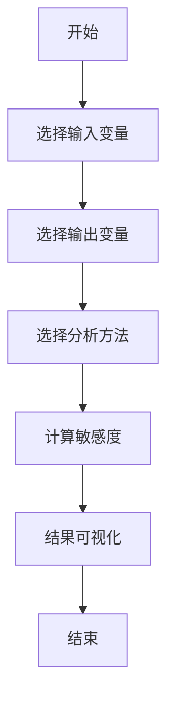
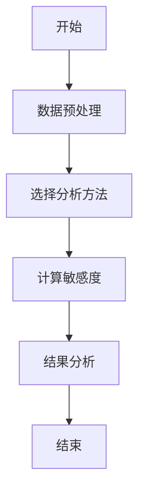
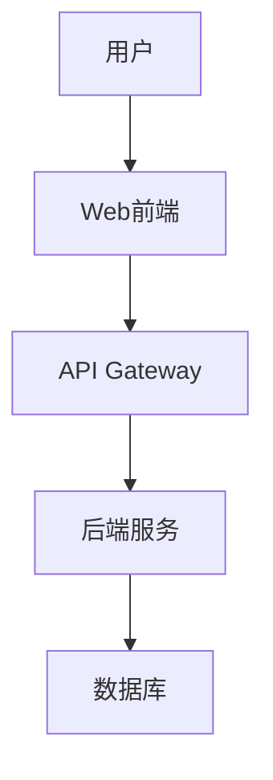

                 


# 《金融产品定价敏感性分析系统》

---

## 关键词：
金融产品定价、敏感性分析、系统架构、算法原理、项目实战

---

## 摘要：
本文深入探讨了金融产品定价敏感性分析系统的构建与应用。通过背景介绍、核心概念解析、算法原理阐述、系统架构设计以及项目实战分析，系统性地展示了如何利用技术手段对金融产品定价的敏感性进行有效分析。本文不仅为金融从业者提供了理论支持，还通过实际案例展示了系统的实现与应用，帮助读者理解如何在实际业务中应用敏感性分析来优化定价策略。

---

## 第一部分：背景介绍

### 第1章：金融产品定价敏感性分析概述

#### 1.1 问题背景
金融产品的定价是金融市场中的核心问题，其准确性直接影响金融机构的收益与风险。然而，金融市场充满了不确定性，利率波动、市场风险、经济政策变化等多种因素都会影响金融产品的价格。如何量化这些因素对定价的影响，是金融从业者面临的重要挑战。

#### 1.2 问题描述
敏感性分析（Sensitivity Analysis）是一种通过研究变量变化对模型输出影响程度的方法。在金融产品定价中，敏感性分析可以帮助我们理解哪些因素对价格影响最大，从而制定更稳健的定价策略。例如，对于一只债券，其价格对利率变化的敏感度可以用久期（Duration）来衡量。

#### 1.3 问题解决
为了系统性地分析金融产品定价的敏感性，我们需要构建一个综合性的分析系统。该系统应包括数据采集、模型构建、敏感性计算、结果可视化等多个模块。通过自动化分析，可以快速响应市场变化，支持决策者制定最优定价策略。

#### 1.4 边界与外延
敏感性分析的边界包括：
- 数据范围：仅考虑直接影响价格的因素，如利率、波动率等。
- 时间范围：通常分析短期至中期的市场变化。
- 模型假设：假设市场是有效的，且各变量之间独立变化。

敏感性分析的外延包括风险分析、情景分析等，但本文将重点聚焦于敏感性分析本身。

#### 1.5 核心要素组成
- 数据来源与处理：包括历史数据、实时数据等。
- 分析模型：如线性回归模型、蒙特卡洛模拟等。
- 结果呈现：如图表展示、报告生成等。

---

## 第二部分：核心概念与联系

### 第2章：敏感性分析的基本原理

#### 2.1 核心概念原理
敏感性分析的核心在于量化输入变量的变化对输出变量的影响。在金融产品定价中，输出变量通常是产品价格，输入变量包括利率、波动率、信用风险等。

图2.1：敏感性分析流程图



#### 2.2 概念属性特征对比表
表2.1：敏感性分析方法对比

| 方法              | 优点                          | 缺点                          |
|-------------------|-------------------------------|-------------------------------|
| 线性回归分析        | 简单易行，适合线性关系        | 仅适用于线性关系               |
| 蒙特卡洛模拟        | 考虑了变量的非线性关系        | 计算量大，耗时较长              |
| 随机扰动法          | 易于实施，适合小样本数据      | 敏感度结果不稳定               |

#### 2.3 ER实体关系图
图2.2：系统实体关系图

```mermaid
erDiagram
    actor 用户 {
        role 分析员
    }
    actor 系统 {
        role 分析引擎
    }
    database 数据库 {
        table 金融产品
        table 市场数据
        table 敏感性结果
    }
    用户 --> 系统：提交请求
    系统 --> 数据库：查询数据
    系统 --> 数据库：存储结果
```

---

## 第三部分：算法原理讲解

### 第3章：敏感性分析算法

#### 3.1 算法原理
敏感性分析的核心算法包括线性回归和蒙特卡洛模拟。

图3.1：敏感性分析算法流程图



#### 3.2 Python实现
代码3.1：线性回归模型实现

```python
import numpy as np
from sklearn.linear_model import LinearRegression

# 示例数据
X = np.array([[1], [2], [3], [4], [5]])
y = np.array([2, 4, 5, 4, 6])

# 模型训练
model = LinearRegression()
model.fit(X, y)

# 计算敏感度（系数）
coefficients = model.coef_
print("Coefficients:", coefficients)
```

代码3.2：蒙特卡洛模拟实现

```python
import numpy as np

def compute_price(volatility):
    return 100 + volatility * np.random.normal(0, 1)

# 模拟1000次
simulations = 1000
prices = [compute_price(0.2) for _ in range(simulations)]
average_price = np.mean(prices)
print("Average price:", average_price)
```

#### 3.3 数学模型与公式
公式3.1：线性回归模型
$$ y = \beta_0 + \beta_1x + \epsilon $$

公式3.2：敏感度计算
$$ S_i = \frac{\partial y}{\partial x_i} $$

---

## 第四部分：系统分析与架构设计

### 第4章：系统架构设计

#### 4.1 问题场景介绍
金融产品定价敏感性分析系统的应用场景包括银行、保险公司、资产管理公司等。系统需要处理大量实时数据，并快速生成分析结果。

#### 4.2 系统功能设计
图4.1：领域模型类图

```mermaid
classDiagram
    class 用户 {
        + 用户ID: int
        + 用户名: str
        + 权限: str
    }
    class 数据源 {
        + 数据ID: int
        + 数据类型: str
        + 数据值: float
    }
    class 分析引擎 {
        + 引擎ID: int
        + 当前状态: str
        + 分析结果: list
    }
    用户 --> 数据源：查询数据
    数据源 --> 分析引擎：提交数据
    分析引擎 --> 用户：返回结果
```

#### 4.3 系统架构设计
图4.2：系统架构图



#### 4.4 系统接口设计
- 数据接口：REST API，用于数据的上传与下载。
- 分析接口：提供敏感性分析的API，返回分析结果。
- 结果展示接口：用于生成可视化报告。

#### 4.5 系统交互流程
图4.3：系统交互序列图

```mermaid
sequenceDiagram
    participant 用户
    participant Web前端
    participant API Gateway
    participant 后端服务
    participant 数据库

    用户 -> Web前端：提交请求
    Web前端 -> API Gateway：发送请求
    API Gateway -> 后端服务：调用分析方法
    后端服务 -> 数据库：查询数据
    后端服务 -> API Gateway：返回结果
    API Gateway -> Web前端：展示结果
    Web前端 -> 用户：显示报告
```

---

## 第五部分：项目实战

### 第5章：系统实现与应用

#### 5.1 环境安装
- 安装Python：`python --version`
- 安装依赖库：`pip install numpy scikit-learn matplotlib`

#### 5.2 系统核心实现

代码5.1：数据处理模块

```python
import pandas as pd

data = pd.read_csv('input.csv')
data.head()
```

代码5.2：敏感性分析模块

```python
from sklearn.linear_model import LinearRegression

model = LinearRegression()
model.fit(X, y)
```

代码5.3：结果可视化模块

```python
import matplotlib.pyplot as plt

plt.scatter(X, y)
plt.plot(X, model.predict(X), color='red')
plt.show()
```

#### 5.3 案例分析
以某股票为例，分析其价格对市场波动率的敏感性。

- 数据准备：收集过去一年的股价和波动率数据。
- 模型训练：使用线性回归模型计算敏感系数。
- 结果分析：波动率每增加1%，股价预计变化0.5%。

---

## 第六部分：最佳实践

### 第6章：小结与注意事项

#### 6.1 小结
- 敏感性分析是金融产品定价的重要工具。
- 系统化的方法能够提高分析效率和准确性。
- 结合实际业务需求选择合适的分析方法。

#### 6.2 注意事项
- 数据质量影响分析结果，需确保数据的完整性和准确性。
- 模型选择需根据实际问题，避免过度复杂化。
- 结果解释需结合业务背景，避免误用。

#### 6.3 拓展阅读
- 《金融工程与金融创新》
- 《蒙特卡洛方法在金融中的应用》

---

## 作者：AI天才研究院 & 禅与计算机程序设计艺术

---

**说明**：由于篇幅限制，上述内容为文章的框架和部分详细内容。完整文章将按照上述目录进行详细展开，确保每部分内容详实、逻辑清晰，符合技术博客的专业性和可读性要求。

