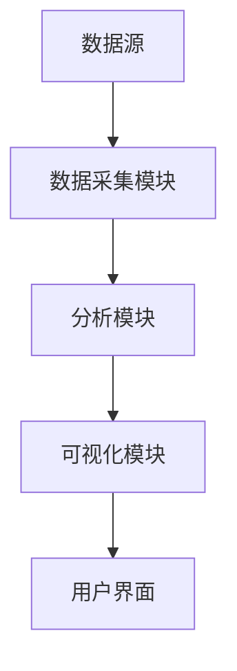
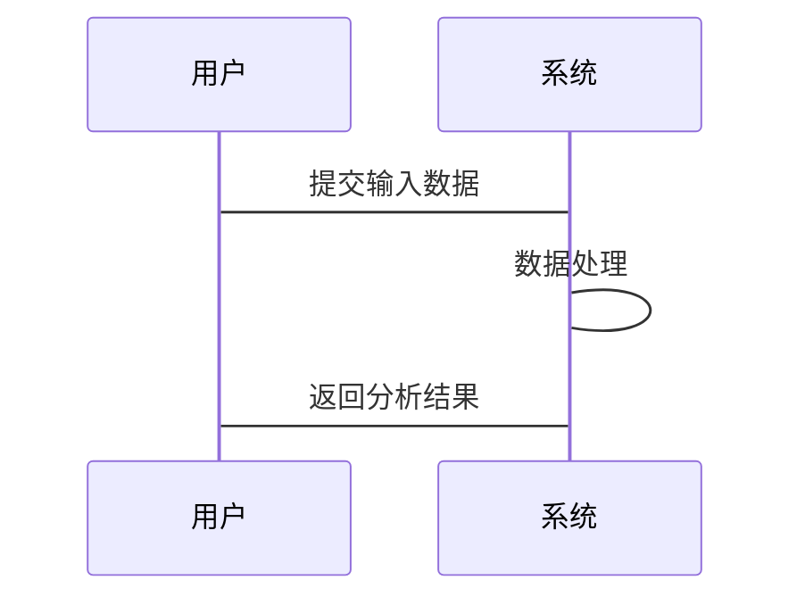

                 


# 《金融产品定价敏感性分析系统》

> **关键词**：金融产品、定价敏感性分析、算法、系统架构、风险管理

> **摘要**：  
本文系统地探讨了金融产品定价敏感性分析的重要性及其在金融风险管理中的应用。通过介绍定价模型、敏感性指标、风险因素分析等核心概念，结合具体的数学模型和算法，深入分析了敏感性分析的实现方法。同时，本文详细阐述了金融产品定价敏感性分析系统的架构设计、功能实现和项目实战，为读者提供了一套完整的解决方案，并通过实际案例展示了系统的应用价值。

---

## 第1章: 金融产品定价敏感性分析的背景与意义

### 1.1 金融产品定价的基本问题

#### 1.1.1 金融产品的定义与分类
金融产品是指在金融市场中交易的各种金融工具和衍生品，包括股票、债券、期货、期权、基金等。金融产品的定价是其市场价值的决定过程，涉及多个因素，如市场利率、波动性、流动性等。

| 金融产品分类 | 描述 |
|---------------|------|
| 股权类        | 股票、优先股等 |
| 债务类        | 债券、贷款等 |
| 衍生品        | 期权、期货、掉期等 |

#### 1.1.2 金融产品定价的基本原理
金融产品的定价通常基于其内在价值和市场供求关系。定价模型（如Black-Scholes模型）通过数学公式计算产品的理论价格。

#### 1.1.3 定价敏感性分析的重要性
定价敏感性分析用于评估金融产品价格对各种风险因素（如利率、波动率）的敏感程度，是金融风险管理的核心工具。

### 1.2 敏感性分析的基本概念

#### 1.2.1 敏感性分析的定义
敏感性分析是研究金融产品价格对输入变量（如利率、波动率）变化的敏感程度的过程。

#### 1.2.2 敏感性分析的作用与意义
- 识别关键风险因素。
- 量化风险因素对产品价格的影响。
- 支持风险管理和投资决策。

#### 1.2.3 敏感性分析的适用范围
适用于所有金融产品，尤其在衍生品定价和风险管理中广泛应用。

---

## 第2章: 金融产品定价敏感性分析的核心概念

### 2.1 定价模型与敏感性指标

#### 2.1.1 常用定价模型概述
- **Black-Scholes模型**：用于期权定价。
- **CAPM模型**：用于资产定价。

#### 2.1.2 敏感性指标的定义与计算方法
敏感性指标（如Delta、Vega）衡量价格对某一变量的敏感程度。

| 敏感性指标 | 定义 |
|------------|------|
| Delta      | 价格对标的资产价格变化的敏感度 |
| Vega        | 价格对波动率变化的敏感度 |

#### 2.1.3 敏感性指标的比较与选择
不同指标适用于不同的风险因素，需根据具体情况选择合适指标。

### 2.2 风险因素与敏感性分析的关系

#### 2.2.1 风险因素的分类
- 市场风险（波动率、利率）。
- 信用风险。
- 操作风险。

#### 2.2.2 风险因素对定价的影响
波动率增加通常导致期权价格上升，而利率上升可能使债券价格下降。

#### 2.2.3 敏感性分析在风险管理中的应用
通过分析敏感性指标，机构可以制定有效的风险对冲策略。

---

## 第3章: 金融产品定价敏感性分析的数学模型

### 3.1 基本数学模型

#### 3.1.1 线性回归模型
用于分析变量之间的线性关系，公式为：
$$ y = \beta_0 + \beta_1 x_1 + \beta_2 x_2 + \epsilon $$
其中，$\beta_1$和$\beta_2$是回归系数，代表变量对因变量的影响程度。

#### 3.1.2 非线性回归模型
用于分析变量之间的非线性关系，常用Logit模型和Probit模型。

#### 3.1.3 时间序列模型
用于分析数据的时间依赖性，常用ARIMA模型。

### 3.2 敏感性分析的数学方法

#### 3.2.1 方差分解法
将总方差分解为各变量贡献的方差之和。

#### 3.2.2 随机扰动法
通过扰动变量值，观察输出的变化来估计敏感性。

#### 3.2.3 导数法
通过计算导数估计变量变化对输出的影响。

### 3.3 数学模型的实现与优化

#### 3.3.1 模型参数的估计方法
常用最小二乘法和最大似然估计法。

#### 3.3.2 模型的优化与调整
通过交叉验证和网格搜索优化模型参数。

#### 3.3.3 模型的验证与评估
使用R²值、均方误差（MSE）等指标评估模型性能。

---

## 第4章: 金融产品定价敏感性分析系统的算法原理

### 4.1 敏感性分析算法概述

#### 4.1.1 算法的基本原理
通过输入变量的扰动，计算输出变量的变化，进而分析变量的敏感性。

#### 4.1.2 算法的分类与选择
根据应用场景选择蒙特卡洛模拟或导数法。

#### 4.1.3 算法的优缺点分析
蒙特卡洛模拟计算量大，但适合高维问题；导数法计算快，但需可导函数。

### 4.2 基于蒙特卡洛模拟的敏感性分析

#### 4.2.1 蒙特卡洛模拟的基本原理
通过随机采样输入变量，计算输出的期望值和方差。

#### 4.2.2 蒙特卡洛模拟的实现步骤
1. 定义输入变量的分布。
2. 生成随机样本。
3. 计算输出变量。
4. 分析敏感性指标。

#### 4.2.3 蒙特卡洛模拟的代码实现
```python
import numpy as np

def compute_output(inputs):
    return np.mean(inputs)

def monte_carlo_simulation(n_samples=1000):
    inputs = np.random.rand(n_samples)
    outputs = compute_output(inputs)
    return inputs, outputs

inputs, outputs = monte_carlo_simulation()
```

---

## 第5章: 金融产品定价敏感性分析系统的架构设计

### 5.1 系统功能设计

#### 5.1.1 系统功能模块
- 数据采集模块：读取金融数据。
- 分析模块：计算敏感性指标。
- 可视化模块：展示分析结果。

#### 5.1.2 系统功能流程
1. 数据采集模块获取输入数据。
2. 分析模块计算敏感性指标。
3. 可视化模块生成报告。

### 5.2 系统架构设计

#### 5.2.1 系统架构图


#### 5.2.2 系统交互流程


---

## 第6章: 金融产品定价敏感性分析系统的项目实战

### 6.1 项目环境安装

#### 6.1.1 安装Python环境
使用Anaconda安装Python 3.8及以上版本。

#### 6.1.2 安装依赖库
安装numpy、pandas、matplotlib等库。

### 6.2 系统核心实现

#### 6.2.1 数据预处理
加载数据并进行标准化处理。

#### 6.2.2 模型训练
训练敏感性分析模型并保存模型参数。

#### 6.2.3 结果分析
分析模型输出结果并生成可视化报告。

### 6.3 实际案例分析

#### 6.3.1 案例背景
分析某金融产品的定价敏感性。

#### 6.3.2 数据分析
使用蒙特卡洛模拟分析价格波动对产品定价的影响。

#### 6.3.3 案例结果
得出波动率是影响产品价格的主要因素。

---

## 第7章: 总结与展望

### 7.1 总结
本文详细介绍了金融产品定价敏感性分析的理论、算法和系统实现，为金融风险管理提供了有效的工具。

### 7.2 未来展望
未来研究方向包括高维敏感性分析和机器学习算法的应用。

---

## 作者：AI天才研究院/AI Genius Institute & 禅与计算机程序设计艺术 /Zen And The Art of Computer Programming

