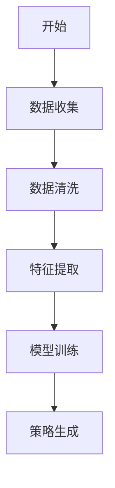
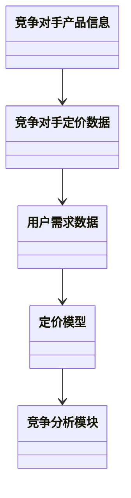

                 


# 《金融产品定价策略优化与竞争分析系统》

**关键词：** 金融产品定价，定价策略优化，竞争分析系统，人工智能，机器学习，数学模型，系统架构

**摘要：**  
本文深入探讨了金融产品定价策略优化与竞争分析系统的设计与实现。通过结合人工智能和机器学习技术，提出了一种基于数据驱动的定价策略优化方法，并构建了一个竞争分析系统来支持金融产品的市场定位和定价决策。本文首先介绍了定价策略优化的背景和意义，然后详细分析了竞争分析系统的核心原理和功能模块。接着，从算法原理、系统架构设计、项目实战等多个方面展开讨论，最后总结了最佳实践和未来的研究方向。

---

# 正文

## 第一部分：背景介绍

### 第1章：金融产品定价策略优化的背景

#### 1.1 金融产品定价的基本原理
金融产品定价是金融服务业中的核心环节，其准确性直接影响企业的利润和市场竞争力。传统定价方法依赖于经验判断和市场调研，但随着大数据和人工智能技术的发展，数据驱动的定价策略逐渐成为主流。

- **定价策略的核心要素**：
  - 成本：产品的生产或服务成本。
  - 市场需求：客户对产品的价格敏感度和购买意愿。
  - 竞争对手的价格：市场中类似产品的定价策略。
  - 利润目标：企业希望通过定价实现的利润率。

#### 1.2 定价策略优化的必要性
传统定价策略存在以下问题：
- 数据量有限，难以捕捉市场变化。
- 依赖主观判断，缺乏科学依据。
- 无法实时调整，错失市场机会。

通过优化定价策略，企业可以：
- 提高定价的科学性和准确性。
- 快速响应市场变化。
- 提升产品竞争力和市场份额。

### 第2章：竞争分析系统的重要性

#### 2.1 竞争分析的基本概念
竞争分析是对市场上竞争对手的产品、定价、市场份额等信息进行系统性分析，以帮助企业制定更具竞争力的市场策略。

- **竞争分析的关键指标**：
  - 竞争对手的产品特性。
  - 竞争对手的定价策略。
  - 市场份额和客户满意度。
  - 市场趋势和行业动态。

#### 2.2 竞争分析在定价策略中的作用
竞争分析为定价策略提供了重要的数据支持，帮助企业了解市场定位和竞争对手的定价策略，从而制定出更具竞争力的价格。

---

## 第二部分：核心概念与联系

### 第3章：定价策略优化的核心原理

#### 3.1 定价模型的数学基础

- **线性回归模型**：
  线性回归是一种简单而有效的预测模型，常用于预测产品价格与市场需求之间的关系。
  $$ y = \beta_0 + \beta_1x + \epsilon $$
  其中，$y$ 是目标变量（如价格），$x$ 是自变量（如市场需求），$\epsilon$ 是误差项。

- **神经网络模型**：
  神经网络是一种非线性模型，能够捕捉复杂的数据关系。
  $$ y = f(Wx + b) $$
  其中，$W$ 是权重矩阵，$x$ 是输入向量，$b$ 是偏置项，$f$ 是激活函数。

- **聚类分析模型**：
  聚类分析用于将竞争对手的产品分为不同的类别，便于分析其定价策略。
  $$ distance(x_i, x_j) = \sqrt{\sum_{k=1}^n (x_{ik} - x_{jk})^2} $$

#### 3.2 竞争分析系统的实体关系图
```mermaid
er
    actor 竞争对手
    actor 用户
    actor 系统管理员
    class 产品
    class 价格
    class 竞争数据
    class 系统日志
    竞争对手 --> 产品: 提供
    用户 --> 产品: 请求
    用户 --> 竞争数据: 查询
    系统管理员 --> 系统日志: 管理
    产品 --> 价格: 包含
    竞争数据 --> 价格: 关联
```

---

## 第三部分：算法原理

### 第4章：定价策略优化的算法实现

#### 4.1 梯度下降算法
梯度下降是一种常用优化算法，用于最小化损失函数。
$$ \text{损失函数} = \frac{1}{2m} \sum_{i=1}^m (y_i - \hat{y}_i)^2 $$
其中，$m$ 是样本数量，$y_i$ 是真实值，$\hat{y}_i$ 是预测值。



---

## 第四部分：系统分析与架构设计

### 第5章：系统架构设计

#### 5.1 系统功能模块


#### 5.2 系统架构图


---

## 第五部分：项目实战

### 第6章：环境安装与核心代码实现

#### 6.1 环境安装
```bash
pip install numpy pandas scikit-learn
```

#### 6.2 核心代码实现
```python
import numpy as np
from sklearn.linear_model import LinearRegression
from sklearn.metrics import mean_squared_error

# 数据准备
X = np.array([[1], [2], [3], [4]])
y = np.array([1, 2, 3, 4])

# 模型训练
model = LinearRegression()
model.fit(X, y)

# 预测
y_pred = model.predict(X)
print("预测值：", y_pred)
print("均方误差：", mean_squared_error(y, y_pred))
```

---

## 第六部分：总结与展望

### 第7章：最佳实践与小结

#### 7.1 小结
本文详细介绍了金融产品定价策略优化与竞争分析系统的构建过程，从背景介绍到系统实现，全面覆盖了定价策略优化的核心原理和竞争分析系统的功能设计。

#### 7.2 注意事项
- 数据质量直接影响模型的准确性，需确保数据的完整性和准确性。
- 竞争分析需结合市场实际情况，避免过度依赖模型预测。
- 系统上线后需定期更新和维护，以适应市场变化。

#### 7.3 拓展阅读
建议深入学习机器学习中的高级模型（如深度学习、强化学习）以及大数据处理技术，以进一步提升定价策略的优化效果。

---

**作者：AI天才研究院/AI Genius Institute & 禅与计算机程序设计艺术 /Zen And The Art of Computer Programming**

