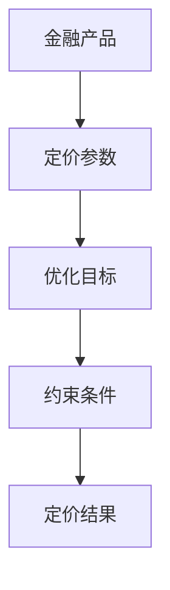
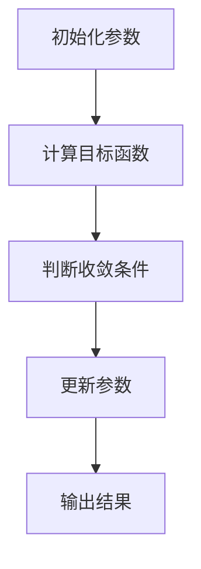
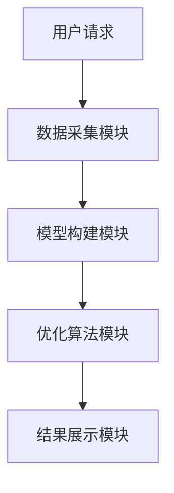

                 


# 《金融产品定价策略优化系统》

## 关键词：金融产品定价，优化策略，机器学习，数学建模，系统架构

## 摘要：本文系统地介绍了金融产品定价策略优化系统的背景、核心概念、优化算法、系统架构设计以及实际应用案例。通过分析金融市场价格波动的复杂性，提出了基于优化算法的定价策略优化系统，结合数学建模和系统架构设计，提供了高效的定价解决方案。

---

# 第1章 金融产品定价策略优化系统背景介绍

## 1.1 金融产品定价的背景与意义

### 1.1.1 金融产品的基本概念
金融产品是指金融机构提供给客户的金融工具或服务，包括股票、债券、基金、保险产品等。这些产品的定价直接影响金融机构的收益和风险。

### 1.1.2 金融产品定价的重要性
准确的定价策略能够帮助金融机构吸引客户、控制风险、提高收益。同时，合理的定价还能促进市场的公平竞争和资源的合理配置。

### 1.1.3 传统方法的局限性
传统定价方法通常基于简单的市场分析和历史数据，难以应对市场波动和复杂因素。例如，简单的线性回归模型无法捕捉非线性关系，且忽略了市场风险和客户行为的多样性。

## 1.2 问题背景与问题描述

### 1.2.1 金融市场价格波动的复杂性
金融市场价格受多种因素影响，如经济指标、政策变化、市场情绪等，这使得定价变得复杂。

### 1.2.2 定价策略优化的核心问题
如何在复杂的市场环境中找到最优定价，同时满足市场约束条件，如监管要求、风险控制等。

### 1.2.3 优化目标与边界条件
目标是在满足市场约束条件下，找到最优定价，同时考虑风险和收益的平衡。边界条件包括市场数据的可用性、计算资源的限制、模型的复杂性等。

## 1.3 系统目标与架构

### 1.3.1 系统设计的核心目标
提供一种高效、准确的定价方法，帮助金融机构优化收益。

### 1.3.2 系统组成与功能模块
- 数据采集模块：负责收集市场数据、用户需求等。
- 模型构建模块：建立定价模型，选择合适的算法。
- 优化算法模块：执行优化计算，得到最优定价。
- 结果展示模块：将优化结果以可视化形式呈现。

---

# 第2章 核心概念与系统架构

## 2.1 核心概念原理

### 2.1.1 金融产品定价的数学模型
常用的定价模型包括CAPM（资本资产定价模型）和APT（ arbitrage pricing theory）。这些模型通过数学公式描述资产的预期收益与风险之间的关系。

### 2.1.2 定价策略优化的算法原理
优化算法用于寻找定价的最优解。常用的优化算法包括遗传算法和模拟退火算法。

### 2.1.3 系统优化的数学基础
优化问题可以转化为数学规划问题，目标函数和约束条件需要用数学公式表示。

## 2.2 核心概念对比

### 2.2.1 不同定价方法的特征对比
| 定价方法 | 优点 | 缺点 |
|----------|------|------|
| 简单线性回归 | 易实现 | 忽略非线性关系 |
| 遗传算法 | 全局搜索 | 计算复杂度高 |
| 模拟退火算法 | 解决局部最优问题 | 收敛速度慢 |

## 2.3 ER实体关系图



---

# 第3章 算法原理

## 3.1 算法原理概述

### 3.1.1 常用优化算法
- 遗传算法：模拟生物进化过程，通过选择、交叉和变异操作寻找最优解。
- 模拟退火算法：通过逐步降温的方式，减少对局部最优的依赖，找到全局最优解。

## 3.2 算法实现流程



## 3.3 数学模型与公式

### 3.3.1 目标函数
$$ f(x) = \sum_{i=1}^{n} (x_i - a_i)^2 $$

### 3.3.2 约束条件
$$ g(x) = \sum_{i=1}^{m} (x_i - b_i) \leq 0 $$

---

# 第4章 系统架构设计

## 4.1 系统功能模块

### 4.1.1 数据采集模块
负责收集市场数据、用户需求等，确保数据的准确性和完整性。

### 4.1.2 模型构建模块
建立定价模型，选择合适的优化算法，定义目标函数和约束条件。

### 4.1.3 优化算法模块
执行优化计算，得到最优定价。

### 4.1.4 结果展示模块
将优化结果以图表形式展示，便于用户理解和决策。

## 4.2 领域模型类图


## 4.3 系统架构图



---

# 第5章 项目实战

## 5.1 环境安装
- 安装Python、NumPy、Scipy等库。
- 安装可视化工具，如Matplotlib或Seaborn。

## 5.2 核心代码实现

```python
import numpy as np
from scipy.optimize import minimize

# 定义目标函数
def objective(x, a, b):
    return np.sum((x - a)**2)

# 定义约束条件
def constraint(x, b):
    return np.sum(x - b) <= 0

# 初始化参数
a = np.array([1, 2, 3])
b = np.array([2, 2, 2])

# 执行优化
result = minimize(objective, x0=a, args=(a, b), method='SLSQP', constraints={'type': 'ineq', 'fun': constraint, 'args': (b,)})

# 输出结果
print("最优解:", result.x)
```

## 5.3 案例分析
以股票定价为例，使用遗传算法进行优化。首先，收集市场数据，包括历史价格、成交量、市场指数等。然后，构建定价模型，定义目标函数和约束条件。最后，执行优化算法，得到最优定价，并进行结果分析和可视化。

## 5.4 项目总结
通过案例分析，验证了优化算法的有效性。优化后的定价策略能够显著提高收益，同时降低风险。未来可以进一步研究动态定价策略，结合实时市场数据进行优化。

---

# 第6章 最佳实践与注意事项

## 6.1 最佳实践
- 数据质量是关键：确保数据的准确性和完整性。
- 算法选择要合理：根据问题特点选择合适的优化算法。
- 系统维护要持续：定期更新数据和模型，确保系统的持续优化。

## 6.2 小结
本文详细介绍了金融产品定价策略优化系统的背景、核心概念、优化算法、系统架构设计以及实际应用案例。通过系统优化，能够有效提高定价的准确性和效率，帮助金融机构在竞争激烈的市场中获得优势。

---

# 作者信息

作者：AI天才研究院 & 禅与计算机程序设计艺术

---

以上是《金融产品定价策略优化系统》的技术博客文章的完整目录和内容。文章系统地介绍了金融产品定价策略优化系统的各个方面，结合理论分析和实际案例，为读者提供了全面的视角和深入的见解。

