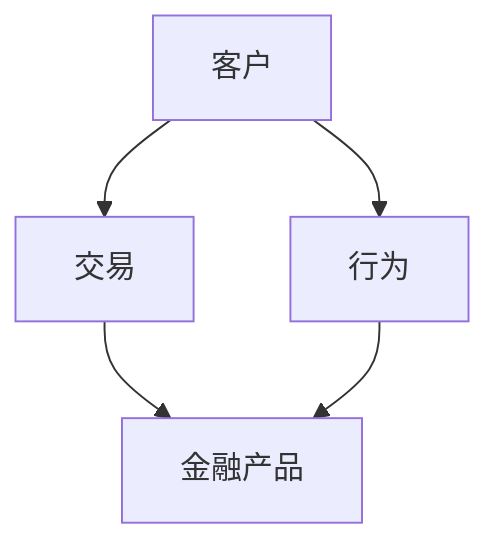
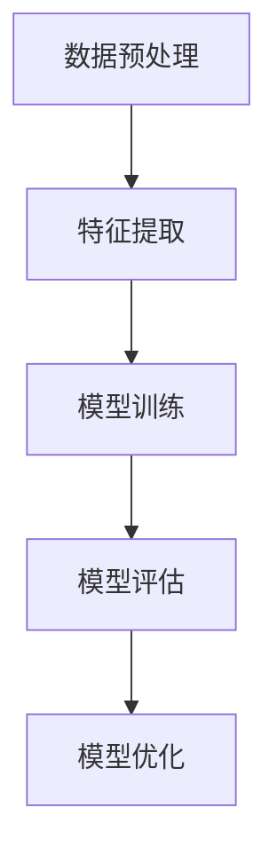
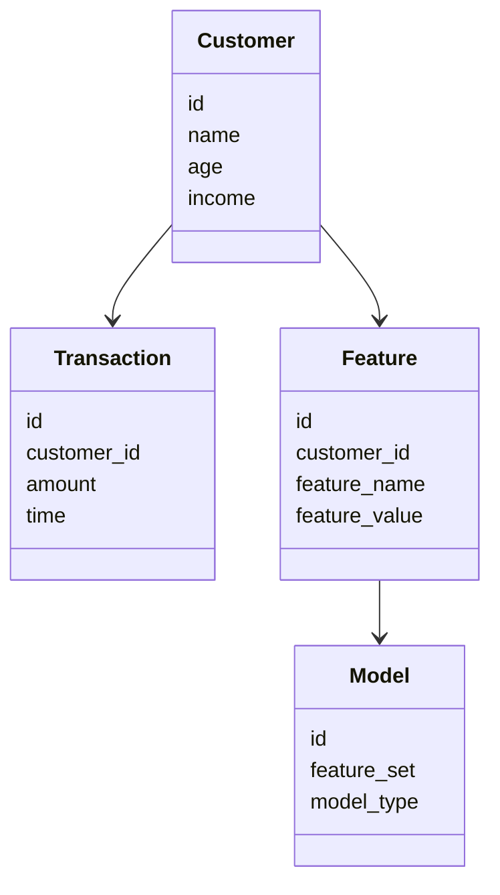
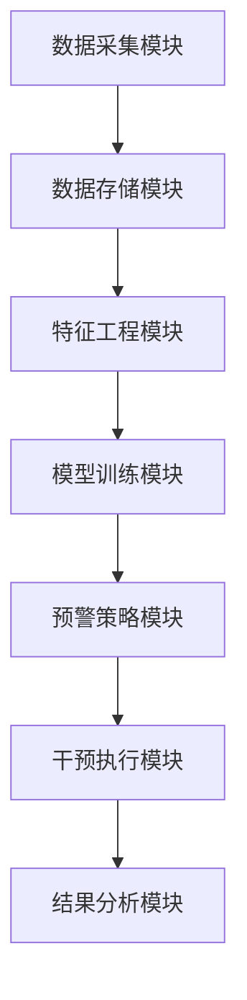

                 


# 《金融产品客户流失预警与干预系统》

## 关键词：
金融产品、客户流失、预警系统、机器学习、干预策略、风险管理

## 摘要：
本文将详细探讨如何利用现代数据分析和机器学习技术构建一个高效的金融产品客户流失预警与干预系统。通过系统化的分析和设计，结合实际案例和代码实现，我们展示了从数据采集到模型构建，再到系统实现的完整流程。本文旨在为金融行业提供一种创新的客户管理解决方案，帮助金融机构有效降低客户流失率，提升客户满意度和忠诚度。

---

# 第一部分: 金融产品客户流失预警与干预系统概述

# 第1章: 客户流失预警与干预系统背景介绍

## 1.1 问题背景与重要性
### 1.1.1 金融产品客户流失的背景
随着金融市场的竞争加剧，客户流失问题日益严重。客户流失不仅会导致收入减少，还会增加获客成本。通过提前预警和干预，可以有效降低客户流失率，提升企业盈利能力。

### 1.1.2 客户流失对企业的影响
- **收入损失**：流失客户带来的收入减少直接影响企业利润。
- **获客成本增加**：获取新客户成本远高于保留现有客户。
- **声誉影响**：客户流失可能影响企业的市场形象。

### 1.1.3 预警与干预的必要性
通过预测客户流失风险，企业可以提前采取措施，例如提供更好的服务、优化产品体验或调整营销策略，从而减少客户流失。

## 1.2 问题描述与目标
### 1.2.1 客户流失的定义与分类
客户流失是指客户停止使用企业的产品或服务。根据时间维度，可以分为短期流失和长期流失。

### 1.2.2 预警与干预的目标
- **提前识别流失风险**：通过数据分析，识别潜在流失客户。
- **制定干预策略**：根据客户特征制定个性化干预措施。
- **优化客户关系管理**：通过数据驱动的方式提升客户满意度。

## 1.3 核心概念与系统框架
### 1.3.1 系统的核心概念
- **客户行为分析**：通过分析客户的行为数据，预测其流失风险。
- **机器学习模型**：利用算法对客户数据进行建模，预测流失概率。
- **干预策略**：根据预测结果，制定相应的干预措施。

### 1.3.2 系统框架的组成
- **数据采集模块**：收集客户的基本信息、交易记录和行为数据。
- **特征工程模块**：对数据进行清洗、特征提取和标准化处理。
- **模型训练模块**：训练机器学习模型，预测客户流失概率。
- **预警策略模块**：根据模型预测结果，设定预警阈值。
- **干预执行模块**：根据预警结果，执行干预措施，如优惠活动、客户回访等。
- **结果分析模块**：评估干预效果，优化模型和策略。

## 1.4 本章小结
本章介绍了客户流失预警与干预系统的背景、重要性以及核心概念。通过系统框架的描述，为后续的算法实现和系统设计奠定了基础。

---

# 第2章: 客户流失预测的核心概念与联系

## 2.1 核心概念原理
### 2.1.1 数据驱动的客户行为分析
通过分析客户的交易频率、金额、时间间隔等行为数据，识别潜在流失客户。

### 2.1.2 机器学习在客户流失预测中的应用
机器学习算法（如逻辑回归、随机森林）可以有效处理非线性关系，提高预测准确率。

### 2.1.3 预警模型的构建与优化
通过特征选择、模型调参和评估指标优化，提升模型的预测性能。

## 2.2 核心概念属性特征对比
### 2.2.1 客户属性特征分析
- **年龄**：不同年龄段客户的流失风险不同。
- **性别**：性别可能影响消费习惯和流失概率。
- **收入水平**：高收入客户可能对价格敏感，流失风险较高。

### 2.2.2 行为特征与交易特征对比
- **行为特征**：如登录频率、页面浏览量。
- **交易特征**：如交易金额、交易频率。

### 2.2.3 时间序列特征的提取
通过分析客户的行为和交易的时间序列数据，识别潜在的流失信号。

## 2.3 ER实体关系图架构


## 2.4 本章小结
本章通过分析客户流失的核心概念和相关特征，为后续的算法实现提供了理论基础。

---

# 第3章: 客户流失预测算法原理与实现

## 3.1 算法原理概述
### 3.1.1 机器学习在客户流失预测中的应用
机器学习算法可以处理高维数据，发现潜在的流失模式。

### 3.1.2 常见算法对比与选择
- **逻辑回归**：适用于二分类问题。
- **随机森林**：适合特征较多的情况，具有较强的抗过拟合能力。
- **支持向量机**：适用于中小规模数据集。

## 3.2 算法流程图


## 3.3 算法数学模型与公式
### 3.3.1 逻辑回归模型
$$ P(y=1|x) = \frac{e^{w \cdot x + b}}{1 + e^{w \cdot x + b}} $$

### 3.3.2 随机森林模型
$$ y = \sum_{i=1}^{n} \text{Tree}(x_i) $$

## 3.4 算法实现与代码示例
### 3.4.1 数据预处理代码
```python
import pandas as pd
from sklearn.preprocessing import StandardScaler

data = pd.read_csv('customer_data.csv')
# 删除缺失值
data.dropna(inplace=True)
# 标准化处理
scaler = StandardScaler()
data[['age', 'income']] = scaler.fit_transform(data[['age', 'income']])
```

## 3.5 本章小结
本章详细介绍了客户流失预测算法的原理和实现过程，为后续的系统设计提供了技术基础。

---

# 第4章: 系统分析与架构设计方案

## 4.1 问题场景介绍
### 4.1.1 系统功能需求
- 数据采集与存储
- 特征工程与模型训练
- 预警与干预策略执行
- 结果分析与优化

## 4.2 系统功能设计
### 4.2.1 领域模型设计


### 4.2.2 系统架构设计


## 4.3 系统接口设计
### 4.3.1 数据接口
- 数据采集接口：从数据库获取客户数据。
- 数据存储接口：将处理后的数据存入数据库。

### 4.3.2 模型接口
- 模型训练接口：接收特征数据，返回训练好的模型。
- 模型预测接口：接收客户数据，返回流失概率。

## 4.4 本章小结
本章通过系统分析和架构设计，为后续的系统实现奠定了基础。

---

# 第5章: 项目实战——金融产品客户流失预警与干预系统实现

## 5.1 环境安装与配置
### 5.1.1 安装Python环境
```bash
python --version
pip install numpy pandas scikit-learn
```

### 5.1.2 数据库配置
```bash
pip install pymysql
```

## 5.2 系统核心实现
### 5.2.1 数据采集模块
```python
import pymysql

def get_customer_data():
    db = pymysql.connect(host='localhost', user='root', password='password', db='customer_db')
    cursor = db.cursor()
    cursor.execute('SELECT * FROM customers')
    data = cursor.fetchall()
    return data
```

### 5.2.2 特征工程模块
```python
from sklearn.preprocessing import StandardScaler

def preprocess_data(data):
    # 删除缺失值
    data.dropna(inplace=True)
    # 标准化处理
    scaler = StandardScaler()
    data[['age', 'income']] = scaler.fit_transform(data[['age', 'income']])
    return data
```

### 5.2.3 模型训练模块
```python
from sklearn.ensemble import RandomForestClassifier

def train_model(data, target):
    X = data.drop(target, axis=1)
    y = data[target]
    model = RandomForestClassifier(n_estimators=100, random_state=42)
    model.fit(X, y)
    return model
```

## 5.3 代码应用解读与分析
### 5.3.1 数据采集模块
- 从数据库中获取客户数据，包括基本信息、交易记录等。

### 5.3.2 特征工程模块
- 对数据进行清洗和标准化处理，确保模型输入的数据格式一致。

### 5.3.3 模型训练模块
- 使用随机森林算法训练模型，预测客户流失概率。

## 5.4 实际案例分析
### 5.4.1 案例背景
某银行希望通过预测客户流失概率，制定针对性的营销策略。

### 5.4.2 数据分析与模型训练
```python
data = pd.read_csv('bank_customer.csv')
model = train_model(data, 'churn')
```

## 5.5 本章小结
本章通过实际案例展示了如何利用Python和机器学习技术实现客户流失预警与干预系统。

---

# 第6章: 系统优化与最佳实践

## 6.1 系统优化建议
### 6.1.1 数据优化
- 增加特征维度：引入更多客户行为数据，如页面停留时间、点击率等。
- 数据实时更新：定期更新模型，确保预测结果准确。

### 6.1.2 算法优化
- 使用集成学习：如梯度提升树（XGBoost）提高模型性能。
- 调整模型参数：通过网格搜索优化模型参数。

## 6.2 最佳实践 tips
### 6.2.1 数据预处理注意事项
- 确保数据质量，处理缺失值和异常值。
- 对特征进行合理的工程化处理，提升模型性能。

### 6.2.2 模型评估与优化
- 使用准确率、召回率、F1分数等指标评估模型性能。
- 通过交叉验证优化模型。

## 6.3 本章小结
本章总结了系统优化的建议和最佳实践，帮助读者更好地应用客户流失预警与干预系统。

---

# 结语

通过本文的详细讲解，我们展示了如何利用机器学习技术构建一个高效的金融产品客户流失预警与干预系统。从数据采集到模型训练，再到系统实现，整个过程都进行了详细的分析和代码实现。希望本文能为金融行业的客户管理提供有价值的参考。

---

# 作者：AI天才研究院/AI Genius Institute & 禅与计算机程序设计艺术 /Zen And The Art of Computer Programming

