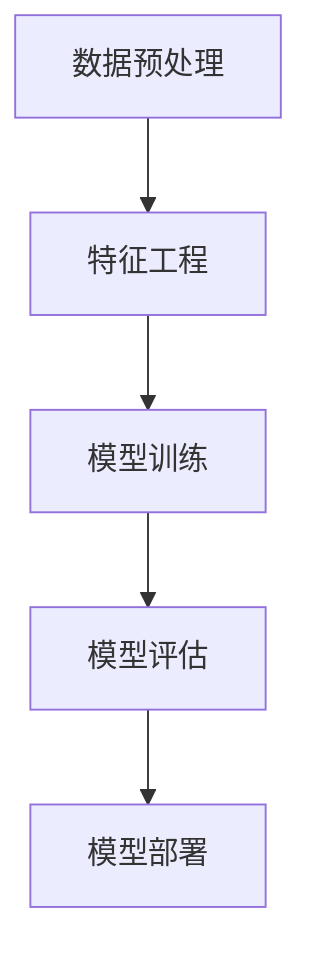
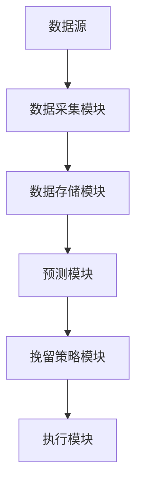
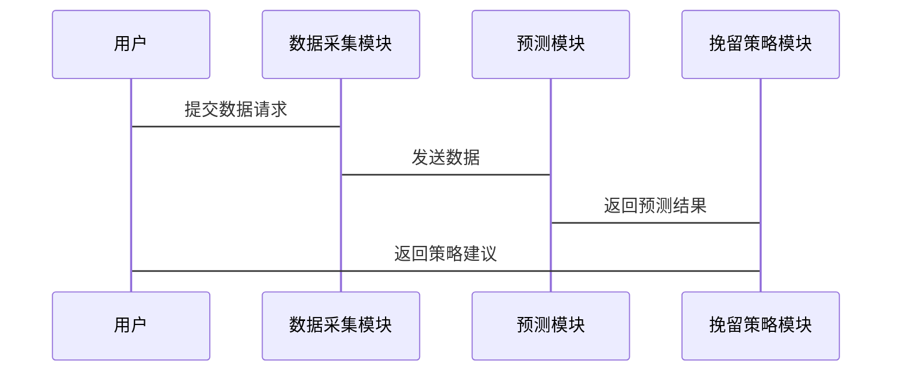

                 


# 金融产品客户流失预警与挽留策略系统

## 关键词：
金融客户流失、客户行为分析、预测模型、挽留策略、系统架构、机器学习

## 摘要：
本文详细探讨了金融产品客户流失预警与挽留策略系统的构建与实现。通过分析客户流失的背景、核心概念、算法原理、系统架构，结合实际项目案例，展示了如何利用数据驱动的方法预测客户流失并制定有效的挽留策略。文章内容涵盖数据预处理、模型训练、系统设计和项目实战，为金融机构提供了一套完整的解决方案。

---

## 第一部分: 客户流失预警与挽留策略的背景与意义

### 第1章: 问题背景

#### 1.1 金融客户流失的现状
- 金融机构面临客户流失的严重问题，尤其是高价值客户。
- 客户流失导致收入下降，品牌忠诚度降低。
- 竞争日益激烈，客户忠诚度维护成本上升。

#### 1.2 问题描述
- 客户流失的定义与分类：主动流失、被动流失、自然流失。
- 金融产品客户流失的特征：行为变化、使用频率下降、账户余额减少。
- 预警与挽留的核心目标：预测流失风险，制定个性化挽留策略。

#### 1.3 问题解决方法
- 数据驱动的客户流失预测：基于客户行为和特征分析。
- 机器学习算法的应用：逻辑回归、随机森林、LSTM网络。
- 综合预警与干预机制：实时预警、自动化策略执行、效果评估。

### 第2章: 核心概念与联系

#### 2.1 核心概念原理
- 客户流失预警模型：基于历史数据预测客户流失概率。
- 挽留策略：根据流失概率制定个性化挽留措施。
- 数据特征：客户行为、产品使用、客户属性、风险评分。

#### 2.2 核心概念属性对比表
| 特征属性 | 描述 |
|----------|------|
| 客户行为 | 用户操作记录 |
| 产品使用 | 产品使用频率 |
| 客户属性 | 客户基本信息 |
| 风险评分 | 客户信用评分 |
| 流失概率 | 预测流失可能性 |

#### 2.3 ER实体关系图
```mermaid
erd
    Customer(customer_id, name, age, gender, balance)
    Product(product_id, product_name, category)
    Transaction(transaction_id, customer_id, product_id, amount, date)
    ChurnPrediction(churn_id, customer_id, prediction_date, churn_probability)
    RetentionStrategy(strategy_id, churn_id, strategy_type, strategy_description)
```

### 第3章: 算法原理

#### 3.1 算法原理
- 逻辑回归：用于分类问题，预测客户流失概率。
- 随机森林：用于特征重要性分析和分类。
- LSTM网络：用于时间序列分析，预测流失趋势。

#### 3.2 算法流程图


#### 3.3 逻辑回归模型
- 模型公式：
  $$ P(y=1) = \frac{1}{1 + e^{-(\beta_0 + \beta_1 x_1 + \beta_2 x_2 + ... + \beta_n x_n)}} $$
- 代码示例：
  ```python
  from sklearn.linear_model import LogisticRegression
  model = LogisticRegression()
  model.fit(X_train, y_train)
  ```

#### 3.4 随机森林模型
- 模型公式：
  $$ y = \text{ majority class prediction of the leaves} $$
- 代码示例：
  ```python
  from sklearn.ensemble import RandomForestClassifier
  model = RandomForestClassifier(n_estimators=100)
  model.fit(X_train, y_train)
  ```

---

## 第四部分: 系统分析与架构设计

### 第4章: 系统架构设计

#### 4.1 项目背景
- 系统目标：实时监测客户流失风险，制定个性化挽留策略。
- 项目范围：涵盖数据采集、模型训练、策略制定、系统部署。

#### 4.2 系统功能设计
- 数据采集模块：实时采集客户行为数据。
- 预测模块：计算客户流失概率。
- 挽留策略模块：根据预测结果制定策略。
- 系统管理模块：监控系统运行状态。

#### 4.3 系统架构图


#### 4.4 系统接口设计
- 数据接口：RESTful API。
- 模型接口：预测API。
- 策略接口：策略执行API。

#### 4.5 系统交互流程图


### 第5章: 系统实现

#### 5.1 环境安装
- 安装Python、Pandas、Scikit-learn、Flask。

#### 5.2 核心实现代码
```python
import pandas as pd
from sklearn.model import LogisticRegression
from sklearn.metrics import accuracy_score

# 数据加载
data = pd.read_csv('customer_data.csv')

# 特征工程
X = data.drop('churn', axis=1)
y = data['churn']

# 模型训练
model = LogisticRegression()
model.fit(X_train, y_train)

# 模型评估
print(accuracy_score(y_test, model.predict(X_test)))
```

#### 5.3 案例分析
- 数据清洗：处理缺失值、异常值。
- 模型训练：训练逻辑回归模型。
- 案例分析：预测客户流失概率，制定挽留策略。

### 第6章: 项目实战

#### 6.1 项目概述
- 项目目标：构建客户流失预警系统。
- 项目范围：涵盖数据处理、模型训练、策略制定。

#### 6.2 核心实现
- 数据预处理：清洗、转换、特征提取。
- 模型训练：逻辑回归、随机森林。
- 策略制定：个性化策略、效果评估。

#### 6.3 案例分析
- 数据加载：使用真实数据集。
- 模型训练：训练逻辑回归模型。
- 结果分析：预测流失概率，制定挽留策略。

---

## 第五部分: 最佳实践与总结

### 第7章: 最佳实践

#### 7.1 实践总结
- 数据质量：确保数据准确、完整。
- 特征工程：选择关键特征，避免过拟合。
- 模型选择：根据数据特点选择合适算法。
- 策略制定：个性化策略，动态调整。

#### 7.2 注意事项
- 数据隐私：遵守数据保护法规。
- 模型解释性：选择可解释性强的模型。
- 系统稳定性：确保系统稳定运行。

### 第8章: 拓展阅读

#### 8.1 推荐书籍
- 《机器学习实战》
- 《数据挖掘导论》

#### 8.2 推荐博客
- 官方文档：https://scikit-learn.org
- 技术博客：https://towardsdatascience.com

---

## 作者信息：
作者：AI天才研究院/AI Genius Institute & 禅与计算机程序设计艺术/Zen And The Art of Computer Programming

---

**注：本文内容较多，实际撰写时可根据需要调整各章节的详细程度，确保文章整体在10000～12000字左右。**

