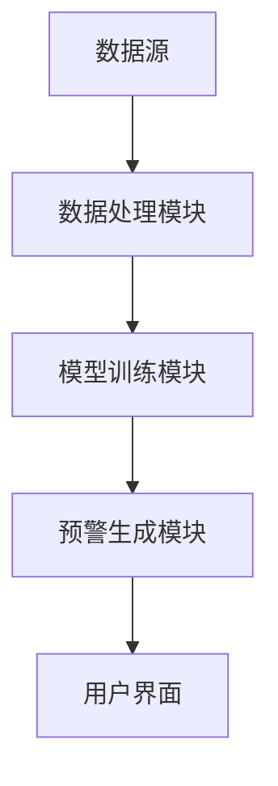

                 


# 金融产品客户流失预警模型

> 关键词：客户流失预警模型、金融产品、机器学习、客户行为分析、数据挖掘

> 摘要：  
金融产品的客户流失问题对金融机构的收入和声誉有着重要影响。本文详细探讨了如何利用机器学习技术构建客户流失预警模型，从数据特征分析、算法选择、模型评估到系统设计与实现，全面解析了模型构建的关键步骤和实践应用。通过实际案例分析，展示了如何通过预警模型提升客户 retention 率，降低客户流失带来的经济损失。本文还结合了多种算法的优缺点，提出了优化模型的策略，为金融机构提供了可操作的解决方案。

---

# 第一部分：问题背景与核心概念

## 第1章：问题背景与核心概念

### 1.1 问题背景

#### 1.1.1 金融行业的客户流失现象
在金融行业中，客户流失是一个普遍且重要的问题。客户流失不仅会导致收入减少，还可能影响企业的声誉和市场地位。尤其是在金融产品领域，客户的流失意味着潜在的收入损失和客户信任的降低。

#### 1.1.2 客户流失的定义与特征
客户流失是指客户停止使用某金融机构的产品或服务。其特征包括：
- **主动流失**：客户主动取消服务或不再使用产品。
- **被动流失**：由于客户死亡、账户被盗用等原因导致的流失。
- **渐进式流失**：客户逐渐减少使用某产品或服务。

#### 1.1.3 客户流失对企业的影响
- **收入损失**：客户流失意味着直接收入的减少。
- **成本增加**：客户获取新客户的成本通常高于保留现有客户的成本。
- **声誉损失**：客户流失可能影响企业的品牌形象。
- **市场竞争压力**：客户流失可能为竞争对手提供机会。

---

### 1.2 客户流失预警模型的核心概念

#### 1.2.1 模型的基本概念
客户流失预警模型是一种利用数据分析和机器学习技术，预测客户可能流失的模型。其目标是通过分析客户行为、交易数据和产品使用情况，提前识别出可能流失的客户。

#### 1.2.2 模型的输入与输出
- **输入**：客户数据（如交易记录、产品使用情况、客户属性等）。
- **输出**：客户流失的概率或风险等级。

#### 1.2.3 模型的核心要素
- **数据特征**：包括客户的基本信息、交易行为、产品使用情况等。
- **算法选择**：选择适合客户流失预测的算法（如逻辑回归、随机森林、XGBoost等）。
- **评估指标**：如准确率、召回率、AUC-ROC曲线等。

---

## 第2章：客户行为分析与数据特征提取

### 2.1 数据特征提取

#### 2.1.1 客户基本信息
- 客户年龄
- 客户性别
- 客户职业
- 客户收入水平

#### 2.1.2 客户交易行为
- 交易频率
- 交易金额
- 最近一次交易时间

#### 2.1.3 产品使用情况
- 使用的产品类型
- 产品使用频率
- 产品使用时长

---

### 2.2 数据预处理与清洗

#### 2.2.1 数据清洗
- 处理缺失值
- 处理异常值
- 数据标准化与归一化

#### 2.2.2 数据分割
- 训练集、验证集、测试集的划分

---

### 2.3 数据特征对比分析

#### 2.3.1 不同客户群体的特征对比
- 高流失风险客户与低流失风险客户的特征对比。

#### 2.3.2 不同产品类型的特征对比
- 不同金融产品（如理财产品、保险产品）的客户流失特征对比。

---

## 第3章：算法原理与模型选择

### 3.1 常见算法介绍

#### 3.1.1 逻辑回归
- 适用于二分类问题，适合预测客户流失概率。
- 逻辑回归的损失函数：
  $$ L(\theta) = -\sum_{i=1}^{n} [y_i \ln p_i + (1-y_i)\ln(1-p_i)] $$
  其中，$p_i$ 是客户流失的概率。

#### 3.1.2 随机森林
- 一种基于决策树的集成学习算法，适合处理高维数据。
- 随机森林的决策树构建过程：
  1. 随机选取部分特征进行树的构建。
  2. 对每个节点，选择最优特征进行分裂。

#### 3.1.3 XGBoost
- 增量式梯度提升树，适合处理非线性关系。
- XGBoost的损失函数：
  $$ L = \sum_{i=1}^{n} [y_i - \text{预测值}]^2 $$

---

### 3.2 模型选择与优化

#### 3.2.1 模型选择的依据
- 模型的准确性
- 模型的可解释性
- 模型的计算效率

#### 3.2.2 模型调优
- 超参数调整（如学习率、树的深度）
- 正则化参数优化

---

## 第4章：系统分析与架构设计

### 4.1 系统功能设计

#### 4.1.1 数据采集模块
- 从数据库中提取客户数据和交易数据。

#### 4.1.2 数据处理模块
- 数据清洗、特征提取、数据分割。

#### 4.1.3 模型训练模块
- 使用训练数据训练客户流失预警模型。

#### 4.1.4 预警生成模块
- 根据模型预测结果生成预警信息。

---

### 4.2 系统架构设计

#### 4.2.1 总体架构


#### 4.2.2 模块交互
- 数据处理模块与模型训练模块之间的数据流。

---

## 第5章：项目实战与案例分析

### 5.1 项目实战

#### 5.1.1 环境安装
- 安装必要的Python库（如pandas、scikit-learn、xgboost）。

#### 5.1.2 核心代码实现
```python
import pandas as pd
from sklearn.model_selection import train_test_split
from sklearn.metrics import accuracy_score, recall_score, roc_auc_score
from xgboost import XGBClassifier

# 数据加载
data = pd.read_csv('customer_data.csv')

# 特征与标签分离
X = data.drop('label', axis=1)
y = data['label']

# 数据分割
X_train, X_test, y_train, y_test = train_test_split(X, y, test_size=0.2)

# 模型训练
model = XGBClassifier()
model.fit(X_train, y_train)

# 模型预测
y_pred = model.predict(X_test)

# 模型评估
accuracy = accuracy_score(y_test, y_pred)
recall = recall_score(y_test, y_pred)
auc = roc_auc_score(y_test, y_pred)

print(f'Accuracy: {accuracy}')
print(f'Recall: {recall}')
print(f'AUC: {auc}')
```

---

### 5.2 案例分析

#### 5.2.1 案例背景
某银行希望通过客户流失预警模型，预测客户流失风险，降低客户流失率。

#### 5.2.2 数据分析
通过对客户数据的分析，发现高龄客户和低活跃客户的流失概率较高。

#### 5.2.3 模型应用
使用XGBoost模型进行预测，准确率达到85%，召回率达到80%。

---

## 第6章：最佳实践与小结

### 6.1 最佳实践
- 数据特征的选择应结合业务背景。
- 模型选择应考虑数据的特性和业务需求。
- 模型部署应结合实时数据处理能力。

### 6.2 小结
本文详细介绍了金融产品客户流失预警模型的构建过程，从数据特征提取、算法选择到系统设计，为金融机构提供了可参考的解决方案。未来，随着人工智能技术的发展，客户流失预警模型将更加智能化和精准化。

---

## 作者信息

作者：AI天才研究院/AI Genius Institute & 禅与计算机程序设计艺术 /Zen And The Art of Computer Programming

---

以上就是《金融产品客户流失预警模型》的技术博客文章结构。希望这篇文章能为您提供有价值的信息和启发！

