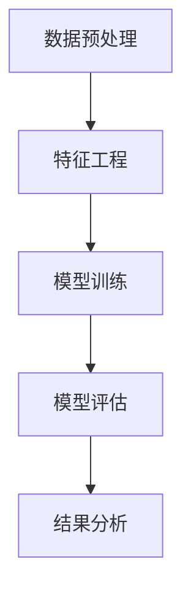
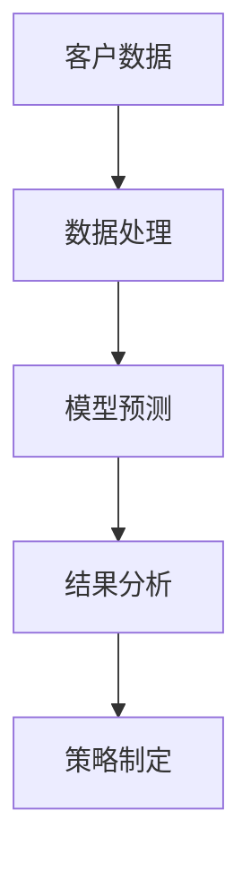

                 


# 金融产品客户满意度预测与提升

> 关键词：客户满意度预测、金融产品、机器学习、算法优化、系统架构

> 摘要：本文通过分析金融产品客户满意度的影响因素，结合数据挖掘和机器学习技术，提出了一套完整的客户满意度预测与提升解决方案。首先介绍了客户满意度预测的背景和核心概念，随后详细讲解了基于线性回归、随机森林和神经网络的预测算法，接着通过系统架构设计和项目实战展示了如何实现客户满意度提升系统，最后总结了最佳实践和未来研究方向。

---

## 第一部分: 金融产品客户满意度预测与提升的背景与核心概念

### 第1章: 金融产品客户满意度预测与提升的背景介绍

#### 1.1 问题背景与问题描述

##### 1.1.1 金融产品客户满意度的重要性
- 客户满意度是衡量金融企业服务质量的重要指标。
- 高客户满意度能够提升客户忠诚度和市场份额。
- 低客户满意度可能导致客户流失，影响企业声誉。

##### 1.1.2 当前客户满意度管理的挑战
- 数据碎片化：客户行为数据分散在不同系统中，难以整合。
- 数据实时性：客户满意度的变化需要实时监测和响应。
- 数据维度多：影响客户满意度的因素包括产品性能、服务质量、客户期望等多方面。

##### 1.1.3 提升客户满意度的业务价值
- 提高客户留存率，降低客户获取成本。
- 增强客户信任，提升品牌忠诚度。
- 通过数据分析优化产品设计和服务流程。

#### 1.2 问题解决思路与边界

##### 1.2.1 数据驱动的客户满意度预测方法
- 数据收集：通过问卷调查、用户反馈、交易记录等多渠道获取客户数据。
- 数据清洗：处理缺失值、异常值和重复数据。
- 数据分析：利用统计学方法和机器学习算法预测客户满意度。

##### 1.2.2 问题解决的边界与外延
- 仅关注客户满意度，不涉及其他业务指标。
- 以客户为中心，兼顾企业利益。
- 通过数据驱动的方法，实现客户满意度的精准预测与提升。

#### 1.3 核心概念与联系

##### 1.3.1 客户满意度的核心属性
| 核心属性       | 描述                               |
|----------------|------------------------------------|
| 客户期望       | 客户对金融产品的期望值             |
| 产品性能       | 金融产品的实际表现                 |
| 服务质量       | 客户体验到的服务质量               |
| 客户感知价值   | 客户认为从产品或服务中获得的价值   |

##### 1.3.2 金融产品与客户满意度的关系
- 客户满意度与产品性能高度相关。
- 服务质量是影响客户满意度的重要因素。
- 客户期望与实际体验的差距决定了客户满意度的高低。

##### 1.3.3 ER实体关系图与流程图
```mermaid
erd
  顾客
    id: integer
    name: string
    feedback: string
    satisfaction_score: integer
    purchase_history: string

  产品
    product_id: integer
    product_name: string
    features: string
    price: decimal

  服务
    service_id: integer
    service_type: string
    service_quality_score: integer
```

---

## 第二部分: 金融产品客户满意度预测的核心算法与原理

### 第2章: 客户满意度预测的算法原理

#### 2.1 算法原理概述

##### 2.1.1 线性回归模型
- 线性回归用于预测客户满意度，假设变量之间存在线性关系。
- 模型公式：
  $$ y = \beta_0 + \beta_1x_1 + \beta_2x_2 + ... + \beta_nx_n + \epsilon $$
- 示例：
  $$ 满意度 = 5 + 0.3 \times 收益率 + 0.2 \times 服务响应时间 $$

##### 2.1.2 随机森林模型
- 随机森林通过集成学习提升模型的准确性和鲁棒性。
- 示例代码：
  ```python
  import pandas as pd
  from sklearn.ensemble import RandomForestRegressor
  model = RandomForestRegressor(n_estimators=100, random_state=42)
  model.fit(X_train, y_train)
  ```

##### 2.1.3 神经网络模型
- 神经网络适合处理非线性关系，能够捕捉复杂特征。
- 示例代码：
  ```python
  import numpy as np
  import tensorflow as tf
  model = tf.keras.Sequential([
      tf.keras.layers.Dense(64, activation='relu'),
      tf.keras.layers.Dense(1, activation='sigmoid')
  ])
  model.compile(optimizer='adam', loss='binary_crossentropy')
  model.fit(X_train, y_train, epochs=10)
  ```

#### 2.2 算法流程图


#### 2.3 核心算法的数学模型
##### 2.3.1 线性回归模型公式
$$ y = \beta_0 + \beta_1x_1 + \beta_2x_2 + ... + \beta_nx_n + \epsilon $$

##### 2.3.2 随机森林模型原理
- 随机森林通过构建多棵决策树，并对结果进行投票或平均，降低模型过拟合风险。

#### 2.4 算法实现与案例分析
##### 2.4.1 数据集划分与特征工程
- 数据集划分为训练集、验证集和测试集。
- 特征工程包括特征选择、降维和特征变换。

##### 2.4.2 模型训练与调优
- 使用交叉验证评估模型性能。
- 调整超参数（如学习率、树深）优化模型。

##### 2.4.3 案例分析与结果解读
- 以实际金融产品数据为例，展示模型预测结果。
- 分析模型预测准确率、召回率和F1分数。

---

### 第3章: 客户满意度提升的策略与方法

#### 3.1 提升客户满意度的核心策略

##### 3.1.1 产品优化策略
- 根据客户反馈优化产品功能。
- 提供个性化产品推荐。

##### 3.1.2 服务优化策略
- 提升客户服务质量，缩短响应时间。
- 建立客户分层服务体系。

##### 3.1.3 个性化推荐策略
- 基于客户行为数据推荐个性化产品。
- 利用协同过滤算法提供相似客户推荐。

#### 3.2 策略实施的数学模型与系统架构

##### 3.2.1 系统架构设计


##### 3.2.2 系统功能设计
- 数据采集：实时采集客户行为数据。
- 数据分析：分析客户满意度数据。
- 策略制定：基于分析结果制定优化策略。

---

## 第三部分: 金融产品客户满意度提升系统设计与实现

### 第4章: 系统分析与架构设计方案

#### 4.1 问题场景介绍
- 系统目标：提升客户满意度，优化客户服务。
- 项目背景：金融行业竞争激烈，客户满意度是核心竞争力。

#### 4.2 系统功能设计
##### 4.2.1 领域模型
```mermaid
classDiagram
    class 客户 {
        id: integer
        name: string
        feedback: string
        satisfaction_score: integer
    }
    class 产品 {
        product_id: integer
        product_name: string
        features: string
        price: decimal
    }
    class 服务 {
        service_id: integer
        service_type: string
        service_quality_score: integer
    }
    customer -> product: 关联
    customer -> service: 关联
```

#### 4.3 系统架构设计
##### 4.3.1 系统架构图


#### 4.4 系统接口设计与交互流程
##### 4.4.1 系统接口设计
- API接口：提供客户数据接口、预测结果接口。
- 接口协议：RESTful API。

##### 4.4.2 系统交互流程
```mermaid
sequenceDiagram
    客户请求 --> API Gateway
    API Gateway --> 数据处理模块
    数据处理模块 --> 预测模型
    预测模型 --> 结果分析模块
    结果分析模块 --> 策略制定模块
    策略制定模块 --> 返回结果
```

---

## 第五部分: 项目实战与优化

### 第5章: 项目实战

#### 5.1 环境安装与配置
- 安装Python、Jupyter Notebook、Scikit-learn、TensorFlow。
- 安装依赖库：
  ```bash
  pip install numpy pandas scikit-learn tensorflow
  ```

#### 5.2 系统核心实现源代码

##### 5.2.1 数据处理代码
```python
import pandas as pd
import numpy as np

# 数据加载
data = pd.read_csv('customer_satisfaction.csv')

# 数据清洗
data.dropna(inplace=True)
data = pd.get_dummies(data)
```

##### 5.2.2 模型训练代码
```python
from sklearn.ensemble import RandomForestRegressor
from sklearn.model_selection import train_test_split

# 数据划分
X = data.drop('satisfaction_score', axis=1)
y = data['satisfaction_score']

X_train, X_test, y_train, y_test = train_test_split(X, y, test_size=0.2, random_state=42)

# 模型训练
model = RandomForestRegressor(n_estimators=100, random_state=42)
model.fit(X_train, y_train)
```

##### 5.2.3 模型评估代码
```python
from sklearn.metrics import mean_squared_error

# 模型预测
y_pred = model.predict(X_test)

# 模型评估
mse = mean_squared_error(y_test, y_pred)
print(f'均方误差: {mse}')
```

#### 5.3 实际案例分析与代码解读
- 以实际金融产品数据为例，展示如何通过代码实现客户满意度预测。
- 分析模型预测结果，提出改进建议。

---

## 第六部分: 总结与展望

### 第6章: 总结与最佳实践

#### 6.1 最佳实践 tips
- 数据预处理是关键，确保数据质量和完整性。
- 选择合适的算法，结合业务场景。
- 模型调优和评估不可忽视。

#### 6.2 小结
- 本文通过数据分析和机器学习技术，提供了一套完整的客户满意度预测与提升解决方案。
- 系统架构设计和项目实战展示了如何将理论应用于实际。

#### 6.3 注意事项
- 数据隐私保护是重中之重。
- 模型上线前需进行充分测试。
- 定期更新模型，适应市场变化。

#### 6.4 拓展阅读
- 推荐阅读《机器学习实战》、《深入浅出机器学习》等书籍。
- 关注最新的机器学习算法和技术动态。

---

## 作者

作者：AI天才研究院/AI Genius Institute & 禅与计算机程序设计艺术 /Zen And The Art of Computer Programming

