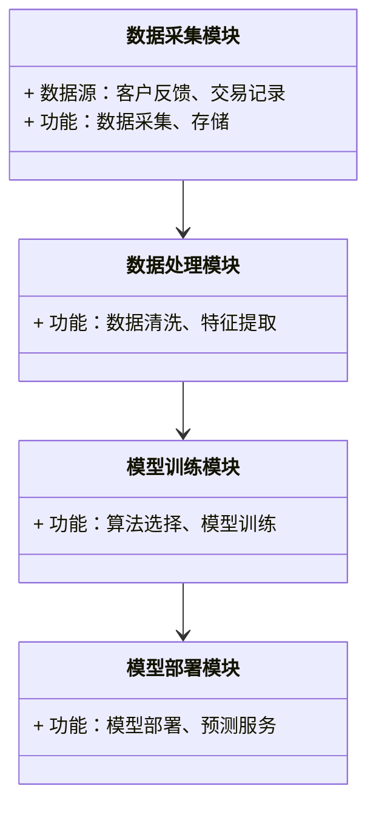

                 


# 金融产品客户满意度预测与提升模型

> **关键词**：金融产品，客户满意度，预测模型，机器学习，算法，系统设计

> **摘要**：  
> 本文旨在探讨如何通过机器学习算法和系统设计来预测和提升金融产品的客户满意度。文章从客户满意度预测的背景与意义出发，逐步分析了预测的核心概念、算法原理、系统架构设计以及实际案例。通过对多种算法的对比与应用，结合实际项目实战，本文提出了一个完整的客户满意度预测与提升模型，为金融行业提供了理论和实践上的双重参考。

---

## 第一章：金融产品客户满意度预测的背景与意义

### 1.1 金融产品的特点与客户满意度的重要性

#### 1.1.1 金融产品的核心属性
金融产品具有以下核心属性：
- **风险性**：产品的收益与风险密切相关，客户对风险的敏感度直接影响满意度。
- **流动性**：产品的流动性越高，客户资金周转的灵活性越大，客户满意度也越高。
- **收益性**：产品的收益能力是客户选择的重要依据，高收益通常会显著提升客户满意度。
- **定制化**：根据客户需求设计的产品更贴近客户预期，满意度更高。

#### 1.1.2 客户满意度在金融产品中的作用
客户满意度是衡量金融产品质量和服务水平的重要指标，具体作用如下：
- **客户忠诚度提升**：高满意度客户更倾向于长期使用该产品或服务。
- **产品改进方向**：通过满意度分析，可以识别产品和服务中的不足，针对性地进行优化。
- **市场竞争优势**：高客户满意度有助于提升品牌声誉，增强市场竞争力。

#### 1.1.3 金融行业客户满意度的现状分析
当前金融行业客户满意度的现状存在以下问题：
- **数据分散**：客户反馈分散在不同渠道，难以集中分析。
- **模型单一**：部分金融机构仍采用简单的统计方法，预测精度有限。
- **个性化不足**：客户需求差异大，现有模型难以满足个性化预测需求。

---

### 1.2 客户满意度预测的背景与问题描述

#### 1.2.1 什么是客户满意度
客户满意度是客户对产品或服务的实际体验与期望值之间的对比结果。具体而言，客户满意度 = （实际体验 - 期望值） / 期望值 × 100%。

#### 1.2.2 金融产品客户满意度预测的必要性
- **精准营销**：通过预测客户满意度，金融机构可以更精准地进行产品推荐和营销。
- **风险预警**：低满意度客户可能是潜在流失客户，提前预警有助于采取措施挽留客户。
- **产品优化**：通过分析满意度低的原因，优化产品设计和服务流程。

#### 1.2.3 当前客户满意度预测的主要挑战
- **数据多样性**：金融数据包括结构化数据（如交易记录）和非结构化数据（如客户反馈），处理难度较大。
- **模型复杂性**：客户满意度受多种因素影响，需要复杂的模型来捕捉这些关系。
- **实时性要求**：客户满意度可能实时变化，需要实时预测和响应。

---

### 1.3 客户满意度预测的目标与边界

#### 1.3.1 预测目标的设定
- **短期目标**：准确预测客户满意度，建立预测模型。
- **长期目标**：通过预测结果优化产品和服务，提升客户满意度。

#### 1.3.2 预测范围的界定
- **客户群体**：针对特定类型客户（如高净值客户）进行预测。
- **产品类型**：聚焦于某类金融产品（如理财产品）的满意度预测。
- **时间范围**：预测未来一定时间内的客户满意度变化。

#### 1.3.3 相关概念的外延与内涵
- **外延**：客户满意度预测不仅涉及数据科学，还与金融学、心理学等多个领域相关。
- **内涵**：通过分析客户的行为数据和反馈数据，挖掘潜在的满意度影响因素。

---

### 1.4 本章小结
本章从金融产品的特点出发，阐述了客户满意度的重要性，并分析了当前客户满意度预测的背景和问题。通过设定预测目标和界定范围，为后续模型构建奠定了基础。

---

## 第二章：客户满意度预测的核心概念与联系

### 2.1 客户满意度预测的核心概念

#### 2.1.1 客户满意度的定义与度量
客户满意度的度量通常采用评分制，如0-10分制。公式为：
$$
\text{满意度} = \frac{\text{实际体验} - \text{期望值}}{\text{期望值}} \times 100\%
$$
其中，实际体验是客户对产品或服务的真实感受，期望值是客户在购买前的预期。

#### 2.1.2 金融产品的核心特征与客户满意度的关系
金融产品的核心特征（如流动性、风险性）直接影响客户满意度。例如，高风险产品可能满足高风险偏好的客户，但对风险厌恶的客户可能满意度较低。

#### 2.1.3 数据特征与模型选择的关联性
数据特征（如连续型、分类型）影响模型选择。例如，线性回归适合线性关系，而随机森林适合复杂非线性关系。

---

### 2.2 客户满意度预测的核心要素分析

#### 2.2.1 数据特征分析
- **连续型变量**：如客户资产规模、交易频率。
- **分类变量**：如客户年龄、性别、职业。
- **文本数据**：如客户评论、反馈。

#### 2.2.2 模型选择的影响因素
- **数据规模**：样本量大时，选择复杂模型。
- **数据特征**：特征复杂时，选择非线性模型。
- **计算资源**：资源有限时，选择简单模型。

#### 2.2.3 业务目标与模型性能的平衡
- **精准度优先**：业务目标是精准预测时，选择复杂模型。
- **可解释性优先**：业务目标是解释模型时，选择线性回归等简单模型。

---

### 2.3 客户满意度预测的流程与框架

#### 2.3.1 数据采集与处理
- **数据来源**：客户反馈、交易记录、市场数据。
- **数据清洗**：处理缺失值、异常值。
- **数据预处理**：标准化、归一化。

#### 2.3.2 特征工程与模型训练
- **特征选择**：提取关键特征。
- **模型训练**：选择合适的算法进行训练。

#### 2.3.3 模型评估与优化
- **评估指标**：准确率、召回率、F1值。
- **优化方法**：调整超参数、特征工程。

---

### 2.4 本章小结
本章详细分析了客户满意度预测的核心概念，包括定义、数据特征、模型选择等，并提出了预测流程与框架，为后续章节的算法选择和系统设计奠定了基础。

---

## 第三章：常见客户满意度预测算法原理

### 3.1 线性回归模型

#### 3.1.1 线性回归的基本原理
线性回归是一种简单且常用的回归算法，假设因变量与自变量之间存在线性关系。

#### 3.1.2 线性回归的数学模型
$$
y = \beta_0 + \beta_1x + \epsilon
$$
其中，$y$ 是目标变量（客户满意度），$x$ 是自变量，$\beta_0$ 和 $\beta_1$ 是回归系数，$\epsilon$ 是误差项。

#### 3.1.3 线性回归的优缺点分析
- **优点**：简单、易于解释。
- **缺点**：无法处理非线性关系。

---

### 3.2 随机森林模型

#### 3.2.1 随机森林的基本原理
随机森林是一种基于决策树的集成算法，通过随机采样和特征选择来提高模型的泛化能力。

#### 3.2.2 随机森林的数学模型
随机森林通过构建多棵决策树，并对结果进行投票或平均，公式为：
$$
y = \text{median}(\{y_1, y_2, \dots, y_n\})
$$
其中，$y_i$ 是第 $i$ 棵树的预测结果。

#### 3.2.3 随机森林的优缺点分析
- **优点**：能够处理非线性关系，抗过拟合。
- **缺点**：计算复杂度较高。

---

### 3.3 神经网络模型

#### 3.3.1 神经网络的基本原理
神经网络是一种模拟人脑神经网络的深度学习算法，通过多层非线性变换来捕捉数据特征。

#### 3.3.2 神经网络的数学模型
神经网络的前向传播公式为：
$$
a^{(l+1)} = \sigma(w^{(l)}a^{(l)} + b^{(l)})
$$
其中，$a^{(l)}$ 是第 $l$ 层的激活值，$w^{(l)}$ 是权重，$b^{(l)}$ 是偏置，$\sigma$ 是激活函数。

#### 3.3.3 神经网络的优缺点分析
- **优点**：能够处理复杂的非线性关系，性能高。
- **缺点**：计算资源需求大，模型解释性差。

---

### 3.4 本章小结
本章介绍了三种常用的客户满意度预测算法：线性回归、随机森林和神经网络，分析了它们的原理、数学模型和优缺点，为后续的系统设计和项目实战提供了算法选择依据。

---

## 第四章：金融产品客户满意度预测的系统分析与架构设计

### 4.1 系统分析与需求定义

#### 4.1.1 问题场景介绍
金融产品客户满意度预测系统需要解决以下问题：
- 如何高效采集和处理客户数据。
- 如何选择合适的算法进行预测。
- 如何部署和维护预测模型。

#### 4.1.2 项目目标与范围
- **目标**：构建一个高精度的客户满意度预测模型。
- **范围**：限定于某类金融产品（如理财产品）的客户满意度预测。

---

### 4.2 系统架构设计

#### 4.2.1 系统架构的模块划分
系统架构主要包括以下模块：
- 数据采集模块：负责收集客户数据。
- 数据处理模块：对数据进行清洗和预处理。
- 模型训练模块：选择算法并训练模型。
- 模型部署模块：将模型部署到生产环境。

#### 4.2.2 系统功能设计

##### 4.2.2.1 领域模型（Mermaid 类图）


---

#### 4.2.3 系统架构（Mermaid 架构图）


---

### 4.3 系统接口设计

#### 4.3.1 系统接口设计
系统接口主要涉及数据输入和预测输出：
- 数据输入接口：接收客户数据和特征。
- 预测输出接口：返回客户满意度预测结果。

---

### 4.4 本章小结
本章通过系统分析与架构设计，明确了金融产品客户满意度预测系统的功能模块和整体架构，为后续的项目实战奠定了基础。

---

## 第五章：项目实战——基于神经网络的客户满意度预测模型

### 5.1 项目环境与数据准备

#### 5.1.1 环境安装
- 安装Python：`python --version`
- 安装深度学习库：`pip install numpy tensorflow`

#### 5.1.2 数据准备
从金融产品数据库中提取客户数据，包括客户资产、交易频率、产品类型等特征。

---

### 5.2 模型核心实现

#### 5.2.1 神经网络模型实现
```python
import tensorflow as tf
from tensorflow import keras

# 模型定义
model = keras.Sequential([
    keras.layers.Dense(64, activation='relu', input_shape=(n_features,)),
    keras.layers.Dense(1, activation='sigmoid')
])

# 模型编译
model.compile(optimizer='adam', loss='binary_crossentropy', metrics=['accuracy'])

# 模型训练
model.fit(X_train, y_train, epochs=100, batch_size=32)
```

---

### 5.3 代码应用解读与分析

#### 5.3.1 数据预处理
对客户数据进行标准化处理：
```python
from sklearn.preprocessing import StandardScaler

scaler = StandardScaler()
X_train_scaled = scaler.fit_transform(X_train)
X_test_scaled = scaler.transform(X_test)
```

#### 5.3.2 模型评估
评估模型在测试集上的表现：
```python
loss, accuracy = model.evaluate(X_test_scaled, y_test)
print(f"测试损失：{loss}, 测试准确率：{accuracy}")
```

---

### 5.4 实际案例分析

#### 5.4.1 理财产品满意度预测
以理财产品为例，分析客户满意度的预测过程，包括数据收集、特征提取、模型训练和结果分析。

---

### 5.5 项目小结
本章通过实际案例分析，详细讲解了如何基于神经网络构建客户满意度预测模型，展示了从数据准备到模型部署的完整流程。

---

## 第六章：总结与展望

### 6.1 本章总结
本文从背景介绍、核心概念、算法原理到系统设计，详细阐述了金融产品客户满意度预测模型的构建过程。通过对比不同算法，结合实际案例，提出了一个完整的预测与提升模型。

---

### 6.2 未来展望
未来可以进一步优化模型，例如：
- 引入实时数据，提升预测的实时性。
- 结合强化学习，优化客户满意度提升策略。

---

## 作者：AI天才研究院/AI Genius Institute & 禅与计算机程序设计艺术 /Zen And The Art of Computer Programming

