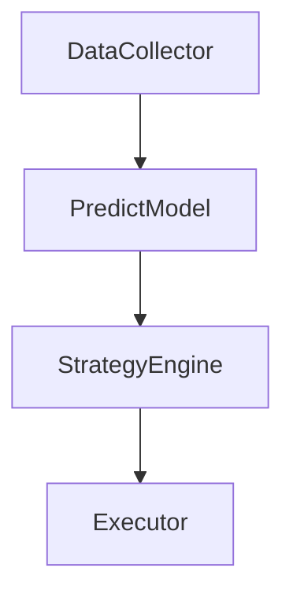

                 


# 《金融产品客户满意度预测与提升策略引擎》

---

## 关键词：客户满意度预测、提升策略引擎、机器学习、系统架构、金融产品

---

## 摘要

金融产品的客户满意度预测与提升策略引擎是一个结合了数据分析、机器学习和系统架构的复杂工程。本文旨在通过详细分析客户满意度的核心要素，结合先进的算法和系统设计，为金融机构提供一套高效的预测和提升策略解决方案。文章从背景、核心概念、算法原理到系统架构，再到项目实战和最佳实践，全面阐述了如何构建和优化客户满意度预测与提升的引擎，为金融机构在数字化转型中提供有力的技术支持。

---

## 第一部分: 背景与概述

### 第1章: 金融产品客户满意度预测与提升的背景

#### 1.1 问题背景与重要性

金融产品的客户满意度是衡量金融机构服务质量的重要指标，直接影响客户忠诚度和业务增长。随着市场竞争的加剧，客户对金融产品的期望越来越高，如何预测客户满意度并制定提升策略成为金融机构的核心挑战。

- **1.1.1 金融产品客户满意度的重要性**  
  客户满意度高的产品通常能带来更高的客户 retention 和更多的交叉销售机会，从而为金融机构创造更大的价值。

- **1.1.2 当前客户满意度管理的挑战**  
  数据分散、模型复杂、实时性要求高，以及客户期望的快速变化，都增加了客户满意度管理的难度。

- **1.1.3 提升客户满意度的业务价值**  
  提升客户满意度可以直接增加客户忠诚度，降低客户流失率，并间接提高市场份额和盈利能力。

#### 1.2 问题描述与目标

- **1.2.1 金融产品客户满意度预测的定义**  
  预测客户对金融产品的满意程度，通常通过定量指标（如NPS、CSAT）进行衡量。

- **1.2.2 提升客户满意度的目标**  
  通过分析客户反馈和行为数据，优化产品设计和服务流程，提高客户满意度。

- **1.2.3 预测与提升策略的边界与外延**  
  预测模型关注客户满意度的分数，而提升策略引擎则关注如何根据预测结果采取具体行动。

#### 1.3 核心概念与联系

- **1.3.1 客户满意度的核心要素**  
  包括产品功能、服务质量、用户体验、性价比等。

- **1.3.2 预测模型与提升策略的关系**  
  预测模型为提升策略提供数据支持，而提升策略则验证了预测模型的有效性。

- **1.3.3 系统架构的核心组成部分**  
  包括数据采集模块、预测模型模块、策略引擎模块和执行模块。

---

## 第二部分: 核心概念与理论基础

### 第2章: 客户满意度预测的核心概念

#### 2.1 客户满意度的定义与度量

- **2.1.1 客户满意度的定义**  
  客户满意度是客户对产品或服务的实际体验与其期望值之间的差距的度量。

- **2.1.2 客户满意度的度量方法**  
  常用的指标包括净推荐值（NPS）、客户满意度指数（CSAT）和客户努力度（CE）。

- **2.1.3 相关指标与属性对比**  
  通过表格对比NPS、CSAT和CE的计算方法和应用场景。

| 指标 | 计算方法 | 应用场景 |
|------|----------|----------|
| NPS  | (推荐者比例 - �批评者比例) | 衡量客户忠诚度 |
| CSAT | (满意客户比例 / 总客户数) | 衡量客户整体满意度 |
| CE   | (客户努力度总和 / 客户数) | 衡量服务效率 |

#### 2.2 影响客户满意度的因素

- **2.2.1 产品特性**  
  包括产品的功能完整性、易用性、性价比等。

- **2.2.2 服务质量**  
  包括响应速度、解决问题的能力、员工专业性等。

- **2.2.3 客户体验**  
  包括界面设计、操作流程、客户支持等。

#### 2.3 预测模型的基本原理

- **2.3.1 预测模型的输入输出**  
  输入：客户行为数据、产品特征、服务记录；输出：客户满意度评分。

- **2.3.2 数据特征与标签的关系**  
  特征工程通过数据清洗、特征选择和转换，将原始数据转化为适合模型输入的形式。

- **2.3.3 模型的评估指标**  
  包括准确率、召回率、F1值和AUC-ROC曲线。

---

## 第三部分: 算法原理与数学模型

### 第3章: 客户满意度预测的算法原理

#### 3.1 预测模型的选择与优化

- **3.1.1 机器学习模型的选择**  
  常用的模型包括逻辑回归、随机森林、支持向量机（SVM）和神经网络。

- **3.1.2 模型的训练与调优**  
  使用交叉验证和网格搜索进行参数调优，确保模型泛化能力。

- **3.1.3 模型评估与验证**  
  通过K折交叉验证评估模型性能，避免过拟合。

#### 3.2 特征工程与数据预处理

- **3.2.1 数据清洗与特征提取**  
  删除冗余特征，处理缺失值和异常值。

- **3.2.2 特征选择与降维**  
  使用主成分分析（PCA）或Lasso回归进行特征选择。

- **3.2.3 数据增强与平衡**  
  对于类别不平衡问题，采用过采样和欠采样的方法平衡数据。

#### 3.3 提升策略的算法实现

- **3.3.1 策略生成的规则引擎**  
  基于预测结果，制定个性化提升策略，例如优化产品功能或改进服务质量。

- **3.3.2 策略优化的数学模型**  
  使用强化学习优化策略，通过不断试错和反馈调整策略参数。

- **3.3.3 策略执行的流程图**  
  通过mermaid流程图展示策略生成、执行和反馈的流程。

---

## 第四部分: 系统架构与设计方案

### 第4章: 系统架构

#### 4.1 系统架构设计

- **4.1.1 系统功能模块**  
  包括数据采集模块、预测模型模块、策略引擎模块和执行模块。

- **4.1.2 系统架构图**  
  使用mermaid图展示各模块之间的交互关系。



- **4.1.3 系统交互序列图**  
  展示从数据采集到策略执行的完整流程。

---

## 第五部分: 项目实战与案例分析

### 第5章: 项目实战

#### 5.1 环境安装与数据准备

- **5.1.1 环境搭建**  
  安装Python、Pandas、Scikit-learn和XGBoost等工具。

- **5.1.2 数据清洗与特征工程**  
  使用Pandas进行数据清洗和特征处理。

#### 5.2 核心代码实现

- **5.2.1 预测模型实现**  
  使用逻辑回归实现客户满意度预测。

```python
from sklearn.linear_model import LogisticRegression
from sklearn.model_selection import train_test_split
from sklearn.metrics import accuracy_score

# 数据分割
X_train, X_test, y_train, y_test = train_test_split(X, y, test_size=0.2, random_state=42)

# 模型训练
model = LogisticRegression()
model.fit(X_train, y_train)

# 模型预测
y_pred = model.predict(X_test)
print("准确率:", accuracy_score(y_test, y_pred))
```

- **5.2.2 策略引擎实现**  
  基于预测结果生成提升策略。

```python
def generate_strategy(predict_scores):
    strategy = []
    for score in predict_scores:
        if score < 0.3:
            strategy.append("优化产品功能")
        elif score < 0.6:
            strategy.append("改进服务质量")
        else:
            strategy.append("维持现状")
    return strategy
```

#### 5.3 案例分析与解读

- **5.3.1 案例分析**  
  通过实际数据集训练模型，并分析预测结果。

- **5.3.2 案例解读**  
  展示如何根据预测结果制定具体的提升策略。

#### 5.4 项目总结

- **5.4.1 项目成果**  
  成功构建客户满意度预测模型，并制定提升策略。

- **5.4.2 经验总结**  
  数据预处理的重要性，模型调优的有效性，以及策略执行的可行性。

---

## 第六部分: 最佳实践与总结

### 第6章: 最佳实践

#### 6.1 最佳实践 tips

- 数据质量是模型性能的基础，确保数据清洗和特征工程的准确性。
- 模型选择要考虑业务场景和数据特点，避免盲目追求高精度。
- 策略执行要与业务流程结合，确保策略的有效实施。

#### 6.2 总结与展望

- 本文通过系统化的分析和设计，构建了一个完整的客户满意度预测与提升引擎。
- 未来的研究方向可以包括实时预测、动态调整策略和多模态数据融合。

---

## 作者：AI天才研究院 & 禅与计算机程序设计艺术

---

以上是《金融产品客户满意度预测与提升策略引擎》的技术博客文章，涵盖了从背景到系统实现的全过程，结合了理论与实践，为金融机构提供了实用的技术解决方案。

