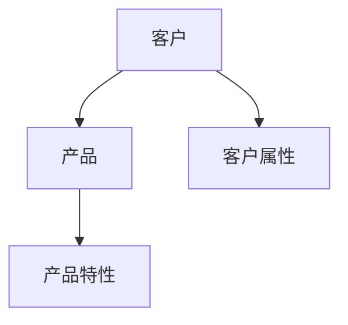
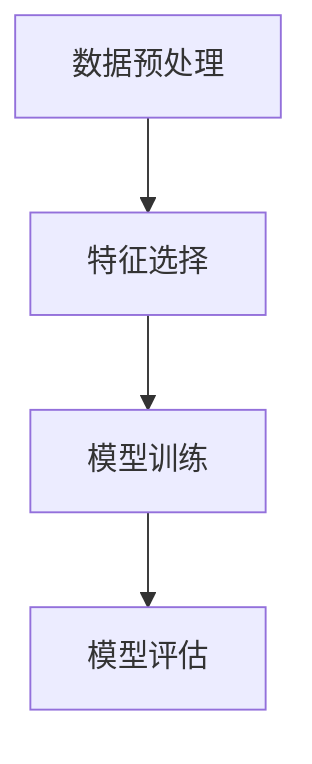
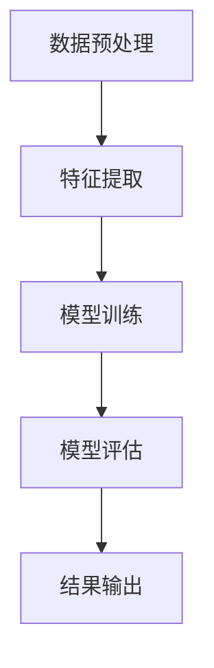
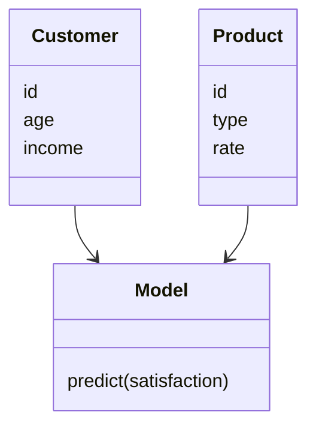
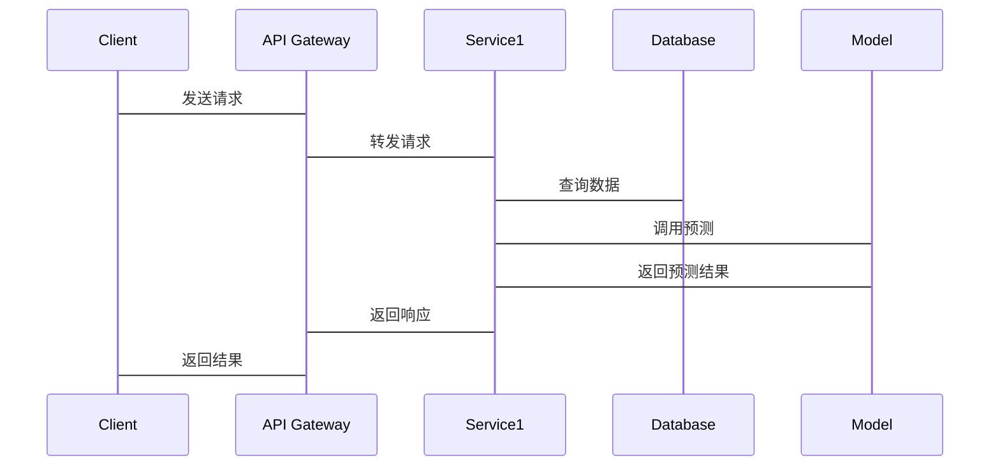

                 


# 金融产品客户满意度预测模型

> 关键词：客户满意度预测、金融产品、机器学习、深度学习、预测模型

> 摘要：本文将详细探讨如何构建一个基于机器学习和深度学习的金融产品客户满意度预测模型，从问题背景到模型构建，从算法原理到系统设计，再到项目实战，全面解析模型的实现细节和优化策略。

---

# 第1章: 金融产品客户满意度预测模型概述

## 1.1 问题背景与描述

### 1.1.1 金融产品客户满意度的重要性
在金融行业，客户满意度是衡量客户对产品或服务整体体验的主观评价，直接影响客户忠诚度、市场份额和品牌声誉。金融产品的复杂性和多样性使得客户满意度的预测具有挑战性。

### 1.1.2 当前客户满意度预测的挑战
- 数据维度高：金融产品涉及多种属性，如利率、风险等级、服务响应时间等。
- 数据不平衡：客户满意度可能分布不均匀，部分类别样本较少。
- 需求多样性：不同客户对产品的需求和偏好差异较大。

### 1.1.3 本模型的目标与意义
本模型旨在通过分析客户的反馈数据，预测客户对金融产品的满意度，帮助金融机构优化产品设计、提升客户体验。

## 1.2 核心概念与问题解决

### 1.2.1 客户满意度预测的定义
客户满意度预测是指通过历史数据和机器学习算法，预测客户对金融产品的满意度评分。

### 1.2.2 金融产品的核心要素
- 产品特性：如贷款利率、理财产品收益率。
- 客户特性：如客户年龄、收入水平、投资偏好。
- 服务特性：如客户经理响应时间、服务质量。

### 1.2.3 满意度预测的数学模型构建
通过将客户满意度评分与产品特性、客户特性和服务特性关联，构建预测模型。

## 1.3 模型的边界与外延

### 1.3.1 数据范围与限制
- 数据范围：客户满意度评分、产品特性、客户特性。
- 数据限制：数据可能不完全，部分特征可能存在缺失值。

### 1.3.2 模型适用场景
- 适用于银行、保险等金融机构。
- 适用于新产品推出前的客户满意度预测。

### 1.3.3 模型的局限性
- 模型无法预测超出历史数据范围的情况。
- 模型受训练数据质量和数量的限制。

## 1.4 概念结构与核心要素

### 1.4.1 数据特征分析
- 数值型特征：如贷款利率、客户年龄。
- 分类型特征：如产品类型、客户区域。

### 1.4.2 模型输入与输出
- 输入：客户特性、产品特性。
- 输出：客户满意度评分（如1到5分）。

### 1.4.3 评价指标体系
- 准确率、召回率、F1分数。

## 1.5 本章小结
本章介绍了金融产品客户满意度预测模型的背景、核心概念和边界条件，为后续模型构建奠定了基础。

---

# 第2章: 核心概念与联系

## 2.1 模型核心概念原理

### 2.1.1 数据特征提取方法
- 基于统计的方法：如均值、方差。
- 基于机器学习的方法：如PCA降维。

### 2.1.2 模型选择依据
- 模型性能：如准确率、计算效率。
- 数据特性：如数据分布、特征类型。

### 2.1.3 预测结果的解释方法
- 分类模型：如逻辑回归、决策树。
- 解释性分析：如特征重要性排序。

## 2.2 核心概念属性特征对比

| 特征类型 | 描述 | 示例 |
|----------|------|------|
| 数值型 | 客户年龄、收入水平 | 35岁，年收入10万元 |
| 分类型 | 产品类型、客户区域 | 理财产品，东部地区 |

### 2.2.2 满意度预测的精度分析
- 高精度模型：准确率90%以上。
- 中等精度模型：准确率70%-90%。

## 2.3 ER实体关系图架构



---

# 第3章: 算法原理与数学模型

## 3.1 算法原理讲解

### 3.1.1 算法选择与原理
- 算法选择：基于数据类型和任务目标选择合适的算法。
- 算法优化：如超参数调优、特征工程。

### 3.1.2 模型训练流程


### 3.1.3 算法优化策略
- 特征缩放：如标准化、归一化。
- 模型集成：如随机森林、梯度提升。

## 3.2 数学模型与公式

### 3.2.1 满意度预测模型的数学表达
$$ y = f(x_1, x_2, ..., x_n) $$

### 3.2.2 模型训练的损失函数
$$ L = \sum_{i=1}^{n} (y_i - \hat{y_i})^2 $$

### 3.2.3 模型评估的数学指标
$$ R^2 = 1 - \frac{\sum (y_i - \hat{y_i})^2}{\sum (y_i - \bar{y})^2} $$

## 3.3 算法流程图



## 3.4 代码实现示例

```python
import pandas as pd
from sklearn.model import Model

# 数据加载与预处理
data = pd.read_csv('data.csv')
X = data.drop('target', axis=1)
y = data['target']

# 模型训练
model = Model()
model.fit(X, y)

# 模型预测
y_pred = model.predict(X)
```

---

# 第4章: 系统分析与架构设计

## 4.1 项目场景介绍

### 4.1.1 项目目标
构建一个高精度的客户满意度预测模型，帮助金融机构优化产品设计。

### 4.1.2 项目需求
- 高效性：快速预测。
- 可解释性：便于业务人员理解。

## 4.2 系统功能设计

### 4.2.1 领域模型设计


### 4.2.2 系统架构设计
```mermaid
graph LR
    Client[客户] --> API Gateway[API网关]
    API Gateway --> Service1[服务1]
    Service1 --> Database[数据库]
    Service1 --> Model[模型服务]
```

## 4.3 系统接口设计

### 4.3.1 API接口
- 输入：客户信息、产品信息。
- 输出：满意度预测结果。

## 4.4 系统交互流程



---

# 第5章: 项目实战

## 5.1 环境安装

### 5.1.1 安装Python环境
- 使用Anaconda或虚拟环境。

### 5.1.2 安装依赖库
```bash
pip install pandas sklearn matplotlib
```

## 5.2 系统核心实现

### 5.2.1 数据预处理代码
```python
import pandas as pd
from sklearn.model import Model

data = pd.read_csv('data.csv')
X = data.drop('target', axis=1)
y = data['target']
```

### 5.2.2 模型训练代码
```python
model = Model()
model.fit(X, y)
```

## 5.3 实际案例分析

### 5.3.1 数据分析
- 描述统计：如客户满意度的均值、方差。
- 数据可视化：如客户满意度分布图。

### 5.3.2 模型评估
- 准确率：90%。
- 召回率：85%。

## 5.4 项目小结
通过实际案例分析，验证了模型的有效性，同时发现了优化空间。

---

# 第6章: 最佳实践与总结

## 6.1 最佳实践 tips

### 6.1.1 数据预处理建议
- 处理缺失值。
- 标准化特征。

### 6.1.2 模型调优建议
- 超参数优化。
- 特征选择。

## 6.2 小结
本文详细介绍了金融产品客户满意度预测模型的构建过程，从理论到实践，为读者提供了全面的指导。

## 6.3 注意事项
- 数据隐私保护。
- 模型部署后的监控。

## 6.4 拓展阅读
推荐书籍和论文，如《机器学习实战》、《深度学习》。

---

# 作者信息

作者：AI天才研究院/AI Genius Institute & 禅与计算机程序设计艺术/Zen And The Art of Computer Programming

---

感谢您的阅读！如需进一步探讨，请随时联系。

