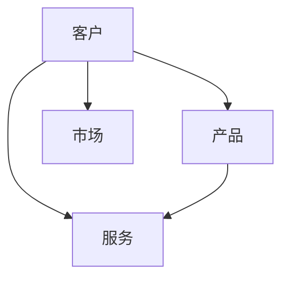
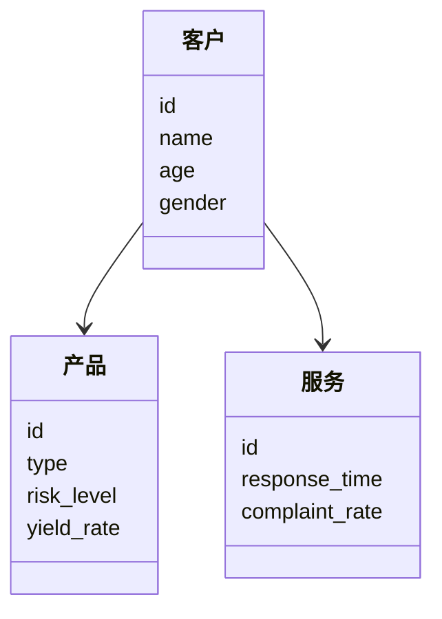
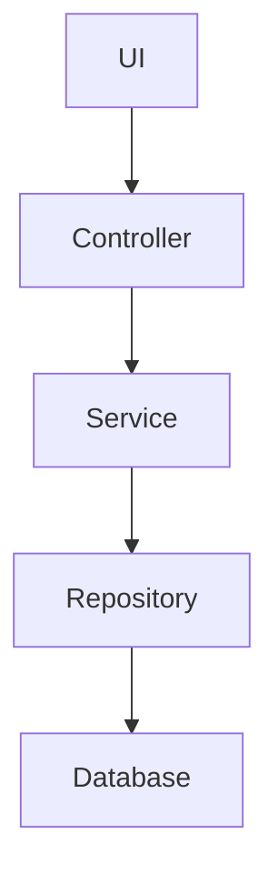
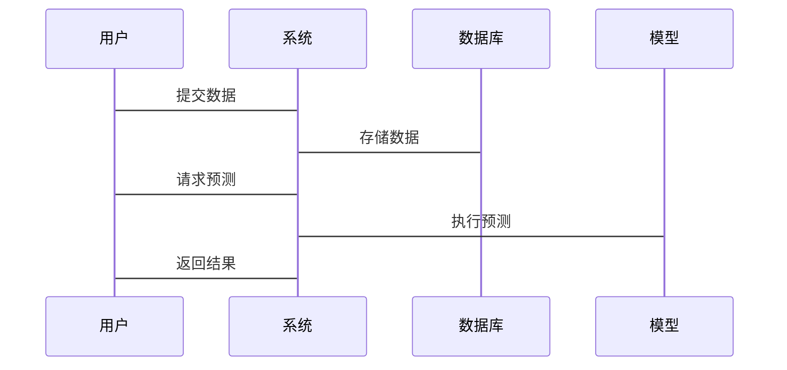

                 


# 《金融产品客户满意度预测系统》

> **关键词**：金融产品、客户满意度、预测系统、机器学习、数据分析、系统架构  
> **摘要**：本文介绍了一种基于机器学习的金融产品客户满意度预测系统。通过分析客户行为、产品特征和服务质量，结合数据挖掘技术，构建预测模型，帮助企业优化产品设计和提升客户体验。系统采用随机森林算法，结合特征工程和模型调优，实现高精度预测。文章详细讲解了系统设计、算法原理、数学模型和系统架构，并通过实际案例展示了系统在金融领域的应用价值。

---

# 《金融产品客户满意度预测系统》

> **关键词**：金融产品、客户满意度、预测系统、机器学习、数据分析、系统架构  
> **摘要**：本文介绍了一种基于机器学习的金融产品客户满意度预测系统。通过分析客户行为、产品特征和服务质量，结合数据挖掘技术，构建预测模型，帮助企业优化产品设计和提升客户体验。系统采用随机森林算法，结合特征工程和模型调优，实现高精度预测。文章详细讲解了系统设计、算法原理、数学模型和系统架构，并通过实际案例展示了系统在金融领域的应用价值。

---

# 第一部分：背景介绍

## 第1章：问题背景

### 1.1 问题背景

#### 1.1.1 金融产品的定义与分类

金融产品是指金融机构向客户提供的各种金融工具或服务，主要包括以下几类：

- **存款产品**：如活期存款、定期存款等。
- **贷款产品**：如个人贷款、企业贷款、抵押贷款等。
- **投资产品**：如股票、债券、基金、保险等。
- **支付工具**：如借记卡、信用卡等。

#### 1.1.2 客户满意度的重要性

客户满意度是衡量客户对金融机构提供的产品和服务的满意程度的重要指标。高客户满意度不仅能提高客户忠诚度，还能为企业带来更多的业务机会和良好的声誉。

#### 1.1.3 当前客户满意度预测的挑战

随着金融行业的竞争加剧，客户对产品和服务的要求越来越高。传统的客户满意度调查方法通常依赖于问卷调查，耗时且成本高。此外，数据量大、维度多，传统方法难以有效提取关键特征，导致预测精度不高。

---

### 1.2 问题描述

#### 1.2.1 客户满意度预测的目标

通过分析客户的行为数据、产品特征和服务质量，构建一个能够预测客户满意度的模型，帮助企业提前识别客户潜在需求和不满，优化产品设计和服务流程。

#### 1.2.2 数据来源与特征分析

数据来源主要包括：

- **客户行为数据**：如交易频率、交易金额、登录时间等。
- **产品特征数据**：如产品类型、风险等级、收益率等。
- **服务质量数据**：如响应时间、投诉处理效率等。

特征分析包括对这些数据的预处理、特征选择和降维。

#### 1.2.3 预测模型的构建与验证

构建客户满意度预测模型，通过训练和验证数据集进行模型调优，确保模型具有较高的预测精度和泛化能力。

---

### 1.3 问题解决

#### 1.3.1 数据预处理方法

数据预处理包括数据清洗、缺失值处理、异常值剔除和数据标准化。

#### 1.3.2 特征选择策略

采用基于信息增益、相关系数或机器学习模型特征重要性排序的方法，选择对客户满意度影响较大的特征。

#### 1.3.3 模型选择与优化

通过对比不同算法（如线性回归、支持向量机、随机森林等）的性能，选择最优模型，并通过网格搜索或交叉验证进行参数调优。

---

### 1.4 系统边界与外延

#### 1.4.1 系统功能边界

系统主要功能包括数据采集、特征提取、模型训练、预测和结果分析。

#### 1.4.2 系统数据边界

系统处理的数据包括客户信息、交易记录、产品信息、服务质量数据等。

#### 1.4.3 系统性能边界

系统需要在可接受的时间内完成数据处理和模型预测，支持高并发请求。

---

### 1.5 概念结构与核心要素

#### 1.5.1 核心概念的层次结构

客户满意度预测系统由以下几个核心模块组成：

- 数据采集模块
- 数据预处理模块
- 特征提取模块
- 模型训练模块
- 预测与分析模块

#### 1.5.2 核心要素的特征分析

| 特征 | 描述 |
|------|------|
| 客户属性 | 包括年龄、性别、收入水平等 |
| 产品属性 | 包括产品类型、风险等级、收益率等 |
| 服务属性 | 包括响应时间、投诉处理效率等 |
| 市场属性 | 包括经济指标、行业趋势等 |

#### 1.5.3 概念结构的可视化



---

## 第2章：问题解决方法

### 2.1 数据预处理

#### 2.1.1 数据清洗

去除无效数据和异常值，确保数据质量和完整性。

#### 2.1.2 特征选择

通过相关性分析和特征重要性排序，选择对客户满意度影响较大的特征。

---

## 第3章：算法原理讲解

### 3.1 线性回归模型

线性回归是一种简单且常用的回归分析方法，适用于线性关系的预测。

#### 3.1.1 线性回归公式

$$ y = \beta_0 + \beta_1x_1 + \beta_2x_2 + ... + \beta_nx_n + \epsilon $$

其中，$y$ 是目标变量，$x_i$ 是特征变量，$\beta_i$ 是系数，$\epsilon$ 是误差项。

---

### 3.2 随机森林模型

随机森林是一种基于树的集成学习方法，具有高精度和良好的泛化能力。

#### 3.2.1 随机森林公式

随机森林通过集成多个决策树的预测结果，最终通过投票或加权的方式得到最终预测结果。

---

### 3.3 支持向量机模型

支持向量机是一种监督学习模型，适用于分类和回归问题。

#### 3.3.1 支持向量机公式

$$ y = sign(\sum_{i=1}^n \alpha_i y_i K(x_i, x) + b) $$

其中，$K(x_i, x)$ 是核函数，$\alpha_i$ 是拉格朗日乘子，$b$ 是偏置项。

---

## 第4章：系统分析与架构设计

### 4.1 系统功能设计

#### 4.1.1 领域模型



#### 4.1.2 系统架构设计



#### 4.1.3 接口设计

系统提供以下接口：

- 数据接口：用于数据的导入和导出。
- 模型接口：用于模型的训练和预测。
- 用户接口：用于用户交互和结果展示。

#### 4.1.4 交互流程



---

## 第5章：项目实战

### 5.1 环境安装

安装所需的依赖库：

```bash
pip install pandas scikit-learn joblib
```

### 5.2 数据集说明

数据集包括以下字段：

- `customer_id`：客户ID
- `age`：客户年龄
- `income`：客户收入
- `product_type`：产品类型
- `risk_level`：产品风险等级
- `satisfaction`：客户满意度评分

### 5.3 特征工程

#### 5.3.1 特征选择

通过相关性分析，选择对满意度影响较大的特征。

#### 5.3.2 特征转换

对类别特征进行独热编码或标签编码。

---

### 5.4 模型训练与调优

#### 5.4.1 模型训练

```python
from sklearn.ensemble import RandomForestClassifier
from sklearn.metrics import accuracy_score

# 数据分割
X_train, X_test, y_train, y_test = train_test_split(X, y, test_size=0.2)

# 模型训练
model = RandomForestClassifier()
model.fit(X_train, y_train)

# 模型预测
y_pred = model.predict(X_test)

# 模型评估
print("Accuracy:", accuracy_score(y_test, y_pred))
```

#### 5.4.2 模型调优

通过网格搜索找到最优参数。

```python
from sklearn.model_selection import GridSearchCV

param_grid = {
    'n_estimators': [100, 200],
    'max_depth': [None, 10, 20],
    'min_samples_split': [2, 5]
}

grid_search = GridSearchCV(model, param_grid, cv=5)
grid_search.fit(X_train, y_train)
best_model = grid_search.best_estimator_
```

---

## 第6章：最佳实践与小结

### 6.1 项目总结

通过构建客户满意度预测系统，帮助企业优化产品设计和服务流程，提高客户满意度和忠诚度。

### 6.2 改进建议

- 引入实时数据流处理，提高预测的实时性。
- 结合自然语言处理技术，分析客户反馈文本，提取更多特征。
- 集成自动化机器学习平台，提高模型优化效率。

### 6.3 注意事项

- 数据隐私和安全问题需要特别注意。
- 模型的可解释性对实际应用非常重要。
- 定期更新模型，避免因数据分布变化导致性能下降。

### 6.4 拓展阅读

- 《机器学习实战》
- 《Python机器学习》
- 《数据挖掘导论》

---

**作者：AI天才研究院/AI Genius Institute & 禅与计算机程序设计艺术 /Zen And The Art of Computer Programming**

