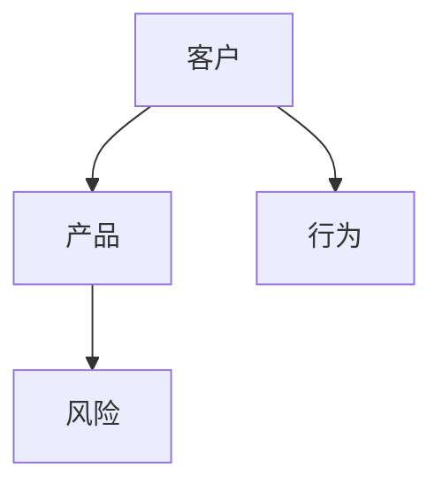
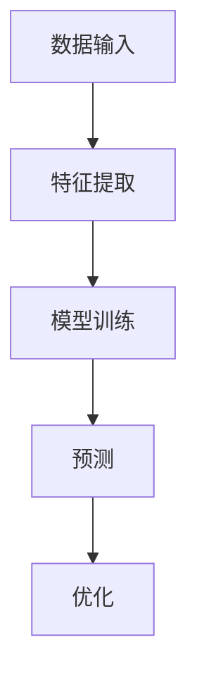
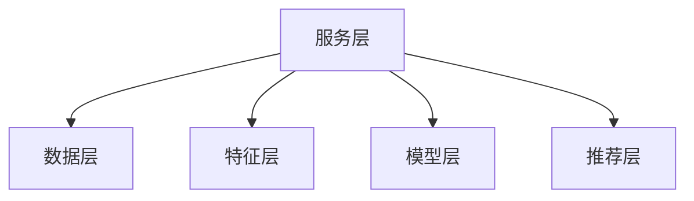
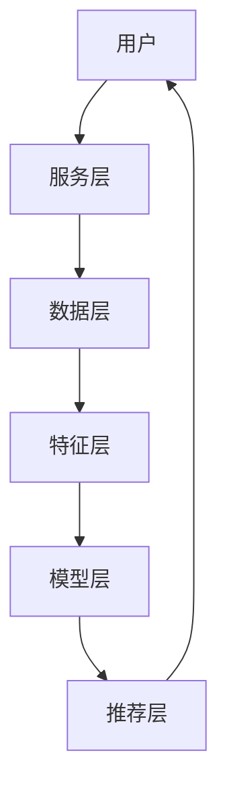

                 


# 《金融产品客户精准营销引擎》

## 关键词：客户精准营销、大数据、人工智能、机器学习、金融产品

## 摘要：  
金融产品客户精准营销引擎是一种基于大数据和人工智能技术的智能营销系统，旨在通过分析客户的特征、行为和市场环境，精准匹配合适的金融产品，从而提高营销效率和客户满意度。本文从背景、核心概念、算法原理、系统架构到项目实战，全面解析客户精准营销引擎的构建与应用，帮助读者理解其技术原理和实际价值。

---

## 第一部分：背景介绍

### 第1章：金融产品客户精准营销引擎概述

#### 1.1 问题背景  
在金融行业中，传统的营销模式往往依赖人工经验或简单的规则筛选，难以应对客户群体多样化、市场变化快的挑战。金融机构需要一种更高效、精准的营销方式，以降低营销成本，提高客户转化率和满意度。

#### 1.2 问题描述  
- 客户需求多样化：不同客户对金融产品的偏好各异，传统营销难以满足个性化需求。  
- 营销成本高昂：通过传统渠道获取客户的成本较高，且难以量化营销效果。  
- 营销效果难以量化：缺乏数据支持，难以评估营销活动的实际效果。  

#### 1.3 问题解决  
客户精准营销引擎通过大数据分析和人工智能技术，实现客户画像构建、产品推荐和营销策略优化，从而提高营销效率和客户满意度。

#### 1.4 边界与外延  
- 精准营销的边界：仅关注客户与产品的匹配关系，不涉及具体的营销执行（如渠道选择）。  
- 相关概念的外延：与客户画像、金融产品推荐、营销自动化等密切相关。  
- 核心要素组成：客户数据、产品数据、算法模型、推荐系统。  

#### 1.5 概念结构与核心要素  
- **客户数据**：包括客户的基本信息、行为数据、资产数据等。  
- **产品数据**：包括金融产品的属性、风险等级、收益预期等。  
- **算法模型**：包括分类、聚类、推荐等算法，用于客户与产品的匹配。  
- **推荐系统**：基于算法输出的推荐结果，生成具体的营销策略。  

---

## 第二部分：核心概念与联系

### 第2章：客户精准营销引擎的核心概念

#### 2.1 核心概念原理  
客户精准营销引擎的核心在于将客户数据和产品数据进行深度分析，通过特征工程提取关键特征，并利用机器学习算法进行客户与产品的匹配。  

- **数据采集与处理**：通过API、数据库等方式获取客户和产品数据，并进行清洗和预处理。  
- **特征工程**：提取客户的年龄、职业、资产规模等特征，以及产品的风险等级、收益类型等特征。  
- **模型训练与优化**：基于特征数据，训练分类或推荐模型，并通过交叉验证优化模型性能。  

#### 2.2 核心概念属性特征对比表  
下表对比了客户特征和产品特征的关键属性：  

| 特征类型 | 属性 | 描述 |  
|----------|------|------|  
| 客户特征 | 年龄 | 客户的年龄 |  
|          | 收入水平 | 客户的年收入 |  
| 产品特征 | 风险等级 | 产品的风险等级（低、中、高） |  

#### 2.3 ER实体关系图  
以下是一个简单的ER图，展示了客户、产品和行为之间的关系：  



---

## 第三部分：算法原理讲解

### 第3章：客户精准营销算法原理

#### 3.1 算法原理  
客户精准营销引擎的核心算法包括分类算法（如逻辑回归）和推荐算法（如协同过滤）。以下分别介绍这些算法的原理和实现步骤。  

- **逻辑回归**：用于分类任务，如客户是否适合某个金融产品。  
- **随机森林**：用于特征重要性分析和分类任务。  
- **XGBoost**：用于分类和回归任务，性能优于逻辑回归。  
- **神经网络**：用于复杂非线性关系的建模。  

#### 3.2 算法流程图  
以下是逻辑回归算法的流程图：  



#### 3.3 算法实现代码  
以下是一个简单的逻辑回归实现代码示例：  

```python
import pandas as pd
from sklearn.linear_model import LogisticRegression

# 数据加载
data = pd.read_csv('customer_data.csv')

# 特征提取
X = data[['age', 'income', 'risk']]
y = data['product适合性']

# 模型训练
model = LogisticRegression()
model.fit(X, y)

# 预测
predictions = model.predict(X)
print("预测结果:", predictions)
```

#### 3.4 数学公式  
逻辑回归的损失函数可以表示为：  
$$
L(y, y') = -\sum_{i=1}^{n} [y_i \ln y'_i + (1 - y_i)\ln (1 - y'_i)]
$$  

其中，$y$ 是真实标签，$y'$ 是模型预测的概率。

---

## 第四部分：系统分析与架构设计

### 第4章：系统分析与架构设计

#### 4.1 问题场景介绍  
本文将构建一个客户精准营销引擎，用于某银行的信用卡营销。目标是通过客户数据和信用卡产品数据，推荐适合客户的信用卡产品。  

#### 4.2 系统功能设计  
系统功能包括：  
- 数据采集与处理  
- 特征工程  
- 模型训练与部署  
- 推荐结果输出  

#### 4.3 系统架构设计  
以下是系统的架构图：  



#### 4.4 接口设计  
系统提供以下接口：  
- 数据接口：从数据库获取客户和产品数据。  
- 推荐接口：根据客户ID返回推荐的产品列表。  

#### 4.5 交互设计  
以下是推荐系统的交互流程图：  



---

## 第五部分：项目实战

### 第5章：项目实战：构建客户精准营销引擎

#### 5.1 环境安装  
需要安装以下工具：  
- Python 3.8+  
- Pandas、Scikit-learn、XGBoost  

#### 5.2 核心实现代码  
以下是客户分类模型的实现代码：  

```python
import pandas as pd
from sklearn.ensemble import RandomForestClassifier
from sklearn.metrics import accuracy_score

# 数据加载
data = pd.read_csv('customer_data.csv')

# 特征提取
X = data.drop('target', axis=1)
y = data['target']

# 模型训练
model = RandomForestClassifier()
model.fit(X, y)

# 模型评估
predictions = model.predict(X)
print("准确率:", accuracy_score(y, predictions))
```

#### 5.3 代码解读与分析  
- 数据加载：从CSV文件中读取客户数据。  
- 特征提取：去除目标列，提取其他特征。  
- 模型训练：使用随机森林算法训练分类模型。  
- 模型评估：计算准确率，评估模型性能。  

#### 5.4 实际案例分析  
以某银行的信用卡营销为例，通过客户数据和信用卡产品数据，训练一个分类模型，预测客户是否适合某款信用卡。  

#### 5.5 项目小结  
通过本项目，读者可以掌握客户精准营销引擎的基本构建方法，包括数据处理、特征工程、模型训练和部署。

---

## 第六部分：最佳实践

### 第6章：最佳实践与总结

#### 6.1 最佳实践 tips  
- 数据清洗和特征工程是关键，直接影响模型性能。  
- 模型选择应根据业务需求和数据特点进行调整。  
- 在生产环境中，应考虑模型的可解释性和实时性。  

#### 6.2 小结  
本文详细介绍了客户精准营销引擎的构建过程，从背景、核心概念到算法实现和系统设计，为读者提供了全面的技术指导。

#### 6.3 注意事项  
- 数据隐私和安全是金融行业的重要考虑因素。  
- 模型的可解释性在实际应用中尤为重要。  

#### 6.4 拓展阅读  
- 《机器学习实战》  
- 《Python机器学习》  

---

## 作者信息  
作者：AI天才研究院（AI Genius Institute）  
地址：禅与计算机程序设计艺术（Zen And The Art of Computer Programming）

