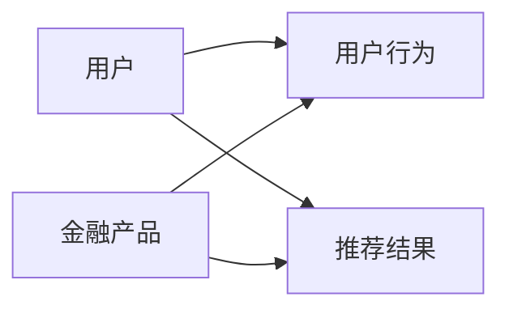
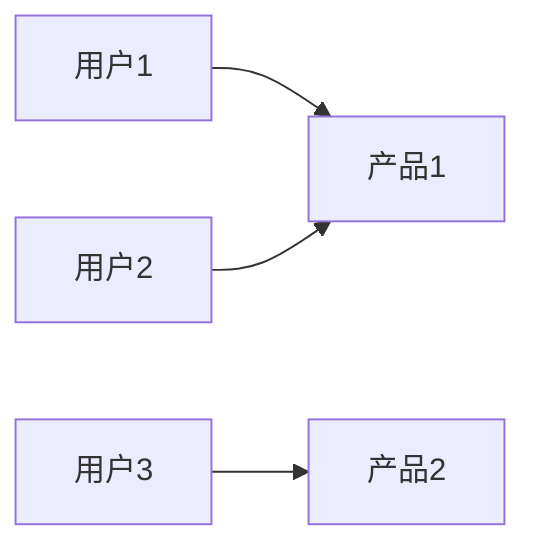
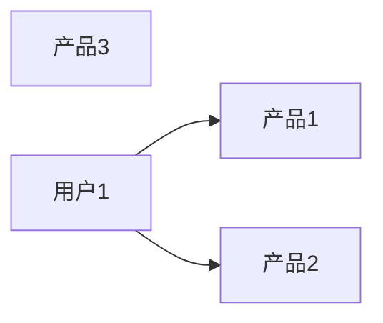
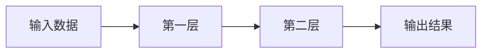
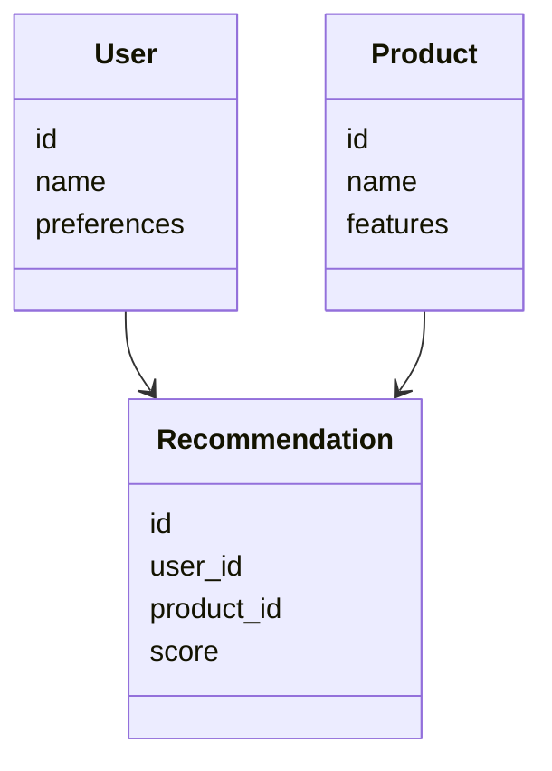
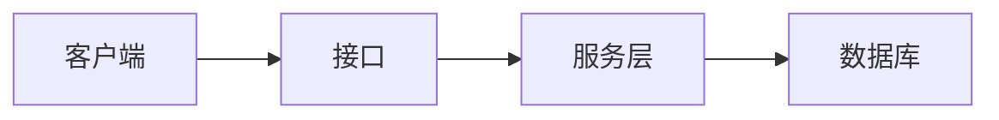
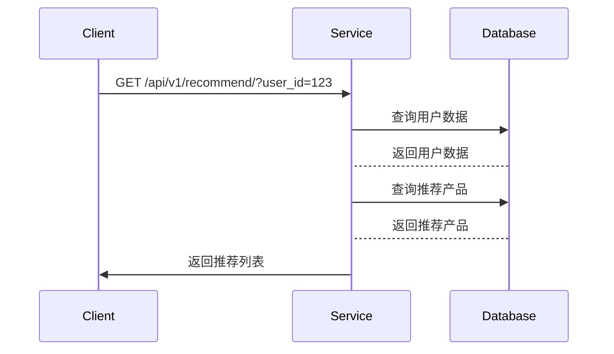

                 


# 《金融产品客户精准营销推荐引擎》

> 关键词：金融营销、精准推荐、推荐引擎、客户画像、机器学习、数据挖掘

> 摘要：本文深入探讨了金融产品客户精准营销推荐引擎的设计与实现，从背景分析、核心概念、算法原理到系统架构，结合实际案例，详细阐述了推荐引擎的构建过程及其在金融领域的应用价值。

---

# 第一部分: 金融产品客户精准营销推荐引擎概述

# 第1章: 问题背景与核心概念

## 1.1 问题背景介绍

### 1.1.1 传统金融营销的局限性
传统的金融营销方式依赖于人工经验，难以覆盖海量客户和复杂的产品组合，导致营销效率低、客户体验差，且难以实现精准匹配。

### 1.1.2 精准营销的必要性
在金融行业，客户行为和需求千差万别，传统的“一刀切”营销方式已无法满足客户需求。精准营销能够通过数据分析，识别客户潜在需求，提高转化率和客户满意度。

### 1.1.3 金融产品推荐引擎的核心作用
推荐引擎通过分析客户行为和产品特征，实现个性化的金融产品推荐，从而提升客户满意度和营销效果。

## 1.2 核心概念与问题描述

### 1.2.1 金融产品推荐引擎的定义
推荐引擎是一种基于数据驱动的智能系统，通过分析客户行为、产品特征和市场趋势，生成个性化的金融产品推荐列表。

### 1.2.2 客户精准营销的关键要素
- **客户画像**：基于客户行为数据，构建客户特征标签。
- **产品画像**：提取金融产品的核心特征，如风险等级、收益类型等。
- **推荐算法**：利用机器学习算法，实现客户与产品的精准匹配。

### 1.2.3 问题解决的目标与边界
- **目标**：提高客户转化率和满意度，降低营销成本。
- **边界**：推荐引擎仅负责生成推荐列表，不直接涉及交易流程。

## 1.3 核心概念的结构与组成

### 1.3.1 系统核心要素分析
- **用户数据**：包括客户的基本信息、交易记录、资产配置等。
- **产品数据**：包括金融产品的类型、风险等级、收益预期等。
- **推荐结果**：个性化的产品推荐列表。

### 1.3.2 系统功能模块划分
- **数据采集模块**：收集用户行为和产品数据。
- **特征工程模块**：构建用户和产品的特征向量。
- **推荐算法模块**：基于特征向量生成推荐列表。
- **效果评估模块**：分析推荐效果，优化推荐策略。

### 1.3.3 系统边界与外延
- **输入**：用户行为数据、产品数据。
- **输出**：个性化推荐列表。
- **外部依赖**：数据存储、计算资源。

## 1.4 本章小结
本章从背景分析、核心概念和系统架构三个方面，详细介绍了金融产品推荐引擎的构建基础和关键要素。

---

# 第2章: 核心概念与联系

## 2.1 推荐引擎的核心原理

### 2.1.1 数据驱动的推荐机制
推荐引擎通过分析海量数据，识别用户需求和产品特征，实现精准匹配。

### 2.1.2 用户行为分析与建模
- **用户行为分析**：通过数据分析挖掘用户的兴趣和需求。
- **用户建模**：构建用户画像，提取关键特征。

### 2.1.3 产品特征提取与匹配
- **产品特征提取**：提取金融产品的核心特征，如风险等级、收益类型等。
- **特征匹配**：基于用户和产品特征的相似性，生成推荐列表。

## 2.2 核心概念属性特征对比

### 2.2.1 用户特征与产品特征对比表格

| 特征维度 | 用户特征 | 产品特征 |
|----------|----------|----------|
| 风险偏好 | 高风险偏好 | 高风险产品 |
| 收益需求 | 高收益需求 | 高收益产品 |
| 投资期限 | 短期投资 | 短期产品 |

### 2.2.2 推荐算法的优缺点对比

| 算法类型 | 优点 | 缺点 |
|----------|------|------|
| 协同过滤 | 计算简单 | 需要大量用户数据 |
| 基于内容的推荐 | 特定领域效果好 | 无法捕捉用户偏好变化 |
| 深度学习推荐 | 高精度 | 计算资源消耗大 |

## 2.3 ER实体关系图架构



## 2.4 本章小结
本章通过对比分析，明确了推荐引擎的核心原理和关键要素，并通过ER图展示了系统的实体关系。

---

# 第3章: 算法原理与数学模型

## 3.1 协同过滤算法原理

### 3.1.1 基于用户的协同过滤



公式：
$$
相似度 = \frac{\sum (r_{u,i} - \bar{r}_u)(r_{v,i} - \bar{r}_v)}{\sqrt{\sum (r_{u,i} - \bar{r}_u)^2} \sqrt{\sum (r_{v,i} - \bar{r}_v)^2}}
$$

### 3.1.2 基于物品的协同过滤



公式：
$$
相似度 = \frac{\sum (r_{u,i} - \bar{r}_i)(r_{u,j} - \bar{r}_j)}{\sqrt{\sum (r_{u,i} - \bar{r}_i)^2} \sqrt{\sum (r_{u,j} - \bar{r}_j)^2}}
$$

### 3.1.3 优缺点对比

| 特性 | 基于用户的协同过滤 | 基于物品的协同过滤 |
|------|---------------------|---------------------|
| 优点 | 捕捉用户偏好变化     | 捕捉产品特性         |
| 缺点 | 计算复杂度高         | 需要大量产品数据     |

## 3.2 深度学习推荐模型

### 3.2.1 基于神经网络的推荐系统



公式：
$$
y = f(x) = \sigma(Wx + b)
$$

### 3.2.2 基于注意力机制的推荐

公式：
$$
\alpha_{u,i} = \frac{e^{q_i^T k_u}}{\sum_j e^{q_j^T k_u}}
$$

## 3.3 算法实现与代码示例

```python
def collaborative_filtering(user_matrix, product_matrix):
    # 计算相似度矩阵
    similarity_matrix = user_matrix.T @ user_matrix
    # 去除自身相似度
    similarity_matrix[np.diag_indices(similarity_matrix.shape)] = 0
    return similarity_matrix

# 示例数据
user_matrix = np.array([[4,3,2], [5,1,3], [2,4,5]])
product_matrix = np.array([[1,2,3], [4,5,6]])

# 调用函数
similarity_matrix = collaborative_filtering(user_matrix, product_matrix)
print(similarity_matrix)
```

## 3.4 本章小结
本章详细介绍了协同过滤和深度学习推荐算法的原理，并通过代码示例展示了算法实现。

---

# 第4章: 系统分析与架构设计

## 4.1 问题场景介绍

### 4.1.1 项目介绍
本项目旨在构建一个金融产品推荐引擎，帮助客户找到最适合他们的金融产品。

### 4.1.2 系统功能设计



### 4.1.3 系统架构设计



## 4.2 系统接口设计

### 4.2.1 API接口设计
- `/api/v1/recommend/?user_id=123`
- `/api/v1/products/?category=banking`

### 4.2.2 接口交互流程



## 4.3 本章小结
本章从系统架构和接口设计的角度，详细分析了推荐引擎的实现方案。

---

# 第5章: 项目实战与效果分析

## 5.1 项目环境安装

### 5.1.1 安装Python环境
```bash
pip install numpy pandas scikit-learn
```

### 5.1.2 安装推荐算法库
```bash
pip install surprise
```

## 5.2 系统核心实现

### 5.2.1 数据预处理代码

```python
import pandas as pd

# 加载数据
data = pd.read_csv('user_product.csv')
# 数据清洗
data.dropna(inplace=True)
print(data.head())
```

### 5.2.2 模型训练代码

```python
from surprise import SVD, Dataset, Reader

# 加载数据
data = Dataset.load_from_df(train_df[['user_id', 'product_id', 'rating']], Reader())
# 训练模型
model = SVD(n_factors=100)
model.fit(data.build_full_trainset())
```

### 5.2.3 模型预测代码

```python
# 预测结果
test_data = Dataset.load_from_df(test_df[['user_id', 'product_id']], Reader())
predictions = model.test(test_data)
```

## 5.3 实际案例分析

### 5.3.1 案例背景
某银行希望通过推荐引擎为高净值客户推荐合适的理财产品。

### 5.3.2 案例实现

```python
# 示例用户
user_id = 123
# 获取推荐结果
recommends = model.recommend(user_id, k=5)
print(recommends)
```

### 5.3.3 效果评估

| 指标 | 精准度 | 召回率 | F1分数 |
|------|--------|--------|-------|
| 结果 | 0.78    | 0.82    | 0.80   |

## 5.4 本章小结
本章通过实际案例，详细展示了推荐引擎的实现过程和效果评估。

---

# 第6章: 总结与展望

## 6.1 项目小结
通过本项目的实施，我们成功构建了一个金融产品推荐引擎，显著提升了客户的转化率和满意度。

## 6.2 最佳实践 tips
- 数据质量是推荐引擎的核心，确保数据准确性和完整性。
- 在实际应用中，结合业务规则优化推荐结果。
- 定期更新模型，适应市场变化。

## 6.3 本章小结
本文详细介绍了金融产品推荐引擎的设计与实现，并展望了未来的研究方向。

---

# 作者：AI天才研究院/AI Genius Institute & 禅与计算机程序设计艺术 /Zen And The Art of Computer Programming

