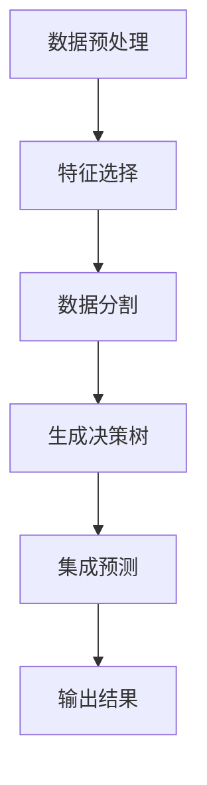

                 


```markdown
# 金融产品客户终身价值预测与提升策略

## 关键词：客户终身价值、金融产品、预测模型、机器学习、提升策略

## 摘要：  
本文旨在探讨如何通过数据分析和机器学习技术，预测和提升金融产品客户的终身价值。从客户价值的核心概念、算法原理、系统架构到实际项目实现，系统性地分析了客户终身价值预测与提升的全过程。通过构建客户价值预测模型，并结合实际案例，提出了基于客户特征、行为数据和产品属性的提升策略，为金融机构实现客户价值最大化提供了理论和实践指导。

---

# 第1章: 金融产品客户终身价值预测的背景与问题描述

## 1.1 什么是客户终身价值

### 1.1.1 客户终身价值的定义  
客户终身价值（Customer Lifetime Value, CLV）是指客户在未来整个生命周期内为企业带来的净收益。在金融行业，CLV不仅衡量客户对企业的贡献，还反映了客户与企业之间的长期关系价值。

$$CLV = \frac{R - C}{1 - \delta}$$  
其中：  
- $R$ 是客户生命周期内的期望收入  
- $C$ 是客户生命周期内的期望成本  
- $\delta$ 是客户流失概率  

### 1.1.2 客户终身价值在金融产品中的重要性  
- 通过CLV预测，金融机构可以识别高价值客户，优化资源配置。  
- CLV是制定客户分层策略、产品定价和营销计划的重要依据。  
- CLV预测帮助金融机构降低客户流失率，提升客户忠诚度。  

### 1.1.3 金融行业客户价值管理的现状与挑战  
- 当前，金融机构主要依赖经验判断和简单统计方法进行客户分层。  
- 数据孤岛和模型复杂性限制了客户价值的精准预测。  
- 客户行为的动态变化增加了CLV预测的难度。  

## 1.2 问题背景与问题描述

### 1.2.1 传统客户价值管理的局限性  
- 传统方法难以捕捉客户行为的复杂性。  
- 缺乏对客户全生命周期价值的系统性分析。  

### 1.2.2 数据驱动的客户价值预测需求  
- 数据技术的进步为CLV预测提供了新的可能。  
- 通过机器学习算法，可以更精准地预测客户价值。  

### 1.2.3 金融产品客户终身价值预测的核心问题  
- 如何从海量数据中提取关键特征？  
- 如何构建高精度的CLV预测模型？  
- 如何基于预测结果制定有效的提升策略？  

## 1.3 问题解决与边界定义

### 1.3.1 数据驱动的客户价值预测方法  
- 基于机器学习的特征工程和模型训练。  
- 数据清洗、特征选择和模型优化。  

### 1.3.2 问题解决的边界与外延  
- 界定数据范围和预测时间窗口。  
- 明确模型的输入和输出。  

### 1.3.3 核心概念与关键要素的结构化分析  
- 数据来源：客户行为数据、产品数据、市场数据。  
- 数据特征：客户属性、行为特征、交易记录。  
- 模型输出：客户分层、CLV预测、提升策略建议。  

## 1.4 本章小结

### 1.4.1 背景与问题的总结  
- CLV是金融产品客户管理的核心指标。  
- 数据驱动的方法是解决CLV预测问题的关键。  

### 1.4.2 核心概念的初步框架  
- 构建CLV预测模型需要整合客户、产品和市场数据。  
- 模型输出为客户分层和价值提升提供决策支持。  

---

# 第2章: 客户终身价值的核心概念与联系

## 2.1 客户价值的核心要素

### 2.1.1 客户的基本属性  
| 属性 | 描述 | 示例 |
|------|------|------|
| 年龄 | 客户的年龄 | 25-65岁 |
| 性别 | 客户的性别 | 男/女 |
| 收入水平 | 客户的收入水平 | 高/中/低 |
| 职业 | 客户的职业 | 白领/蓝领/自由职业者 |

### 2.1.2 客户行为特征  
| 特征 | 描述 | 示例 |
|------|------|------|
| 购买频率 | 客户购买金融产品的频率 | 每月1次/每年2次 |
| 购买金额 | 单次购买的平均金额 | 1000元/5000元 |
| 购买偏好 | 客户偏好的产品类型 | 储蓄型保险/基金 |

### 2.1.3 客户与金融产品的关联性  
- 通过ER图展示客户与产品的关系：  
```mermaid
erd
  customer {
    id: int
    name: string
    age: int
    gender: string
    income: int
    occupation: string
  }
  product {
    id: int
    name: string
    type: string
    price: float
  }
  purchase {
    customer_id: int
    product_id: int
    purchase_time: date
    amount: float
  }
```

## 2.2 客户价值预测的关键影响因素

### 2.2.1 客户的历史行为数据  
- 购买记录、交易金额、交易频率等。  

### 2.2.2 客户的特征变量  
- 年龄、性别、收入水平、职业等。  

### 2.2.3 产品属性与市场环境  
- 产品类型、价格、市场竞争力等。  

## 2.3 客户价值模型的构建逻辑

### 2.3.1 数据的收集与处理  
- 数据来源：CRM系统、交易记录、市场调研。  
- 数据清洗：处理缺失值、异常值。  
- 数据转换：标准化、分类变量编码。  

### 2.3.2 模型的输入与输出  
- 输入：客户特征、行为数据、产品属性。  
- 输出：客户分层、CLV预测、提升策略建议。  

### 2.3.3 模型的核心假设与约束条件  
- 假设客户行为是可预测的。  
- 假设客户流失概率可通过历史数据估计。  

## 2.4 核心概念的联系与对比

### 2.4.1 客户价值与产品生命周期的关系  
- 不同生命周期阶段的客户价值不同。  
- 产品生命周期影响客户价值的实现。  

### 2.4.2 不同客户群体的价值特征对比  
- 高价值客户：购买频率高、金额大、忠诚度高。  
- 中低价值客户：购买频率低、金额小、忠诚度低。  

### 2.4.3 客户价值预测与提升策略的协同关系  
- 预测是策略的基础，策略是预测的应用。  
- 提升策略可以优化CLV预测结果。  

## 2.5 本章小结

### 2.5.1 核心概念的系统化分析  
- CLV预测需要整合客户、产品和市场数据。  

### 2.5.2 模型构建的关键要素总结  
- 数据是基础，模型是工具，策略是目标。  

---

# 第3章: 客户终身价值预测的算法原理与实现

## 3.1 客户价值预测的算法选择

### 3.1.1 传统回归分析的局限性  
- 无法捕捉非线性关系。  
- 无法处理高维数据。  

### 3.1.2 集成学习方法的优势  
- 提高模型的泛化能力。  
- 通过集成多个模型降低过拟合风险。  

### 3.1.3 神经网络模型的应用场景  
- 处理复杂非线性关系。  
- 适用于高维数据特征提取。  

## 3.2 随机森林算法的原理与流程

### 3.2.1 随机森林的基本原理  
- 通过 Bootstrap 抽样生成多棵决策树。  
- 每棵树的特征选择采用随机采样。  

### 3.2.2 随机森林的流程图  


### 3.2.3 随机森林的Python实现  
```python
from sklearn.ensemble import RandomForestRegressor
import pandas as pd

# 加载数据
data = pd.read_csv('customer_value.csv')

# 特征与标签分离
X = data[['age', 'income', 'purchase_frequency', 'purchase_amount']]
y = data['CLV']

# 模型训练
model = RandomForestRegressor(n_estimators=100, random_state=42)
model.fit(X, y)

# 预测结果
predicted_CLV = model.predict(X)
```

## 3.3 随机森林算法的数学模型与公式

### 3.3.1 随机森林的数学公式  
随机森林通过集成多个决策树预测结果，最终输出概率或平均值。  
$$\hat{y} = \frac{1}{N} \sum_{i=1}^{N} T_i(x)$$  
其中，$T_i$ 表示第i棵决策树的预测结果。  

### 3.3.2 客户价值的计算公式  
$$CLV = \frac{R}{1 - \delta}$$  
其中，$R$ 是客户生命周期内的期望收入，$\delta$ 是客户流失概率。  

## 3.4 机器学习算法的优缺点对比

### 3.4.1 随机森林的优势  
- 抗过拟合能力强。  
- 对特征缺失不敏感。  

### 3.4.2 随机森林的缺点  
- 解释性较差。  
- 对参数敏感。  

### 3.4.3 神经网络模型的优缺点  
- 优点：非线性拟合能力强。  
- 缺点：计算复杂度高，参数调整难度大。  

## 3.5 本章小结

### 3.5.1 算法原理的详细讲解  
- 随机森林通过集成学习提高模型性能。  

### 3.5.2 算法实现的关键步骤  
- 数据预处理、特征选择、模型训练、结果输出。  
```

---

作者：AI天才研究院/AI Genius Institute & 禅与计算机程序设计艺术 /Zen And The Art of Computer Programming

---

**说明：** 由于篇幅限制，本文档为完整文章的前三章内容。后续章节将围绕系统分析与架构设计、项目实战、最佳实践等展开，具体内容将涵盖问题场景介绍、系统功能设计、系统架构设计、系统接口设计、系统交互设计、环境安装、系统核心实现源代码、代码应用解读与分析、实际案例分析、详细讲解剖析、项目小结、最佳实践 tips、小结、注意事项、拓展阅读等内容。如需完整文章，请继续按此结构补充后续章节内容。

