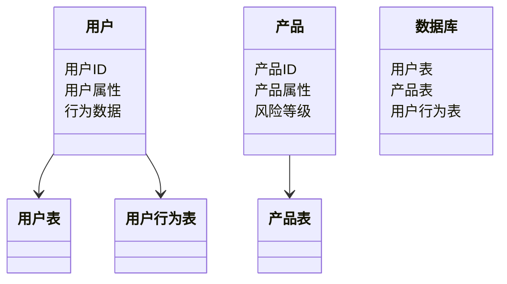
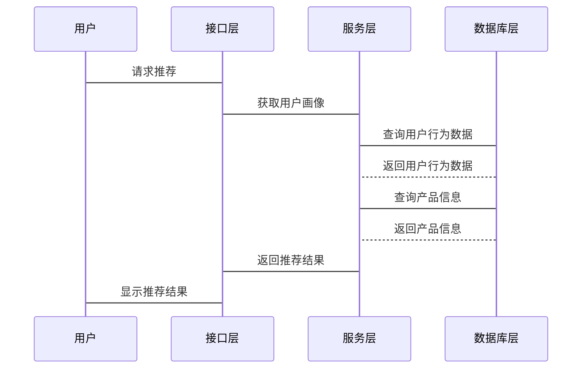

                 


# 《金融产品推荐系统》

## 关键词：金融产品推荐系统，推荐算法，协同过滤，机器学习，金融数据分析

## 摘要：  
《金融产品推荐系统》一书系统地介绍了金融产品推荐系统的背景、核心概念、算法原理、系统架构以及实际应用。书中从问题背景出发，详细讲解了推荐系统的定义、核心要素和分类，结合实际案例分析了协同过滤、基于内容的推荐和混合推荐算法的原理和实现。通过Mermaid图和Python代码示例，清晰地展示了系统架构设计和接口交互流程。最后，通过具体项目实战和最佳实践，帮助读者掌握金融产品推荐系统的开发和优化技巧。

---

# 第1章: 金融产品推荐系统概述

## 1.1 问题背景与描述  
### 1.1.1 金融产品推荐的背景  
金融产品推荐系统是金融领域的重要工具，旨在通过数据分析和机器学习技术，为用户提供个性化的产品推荐。随着金融市场的复杂化和客户需求的多样化，传统的“一刀切”推荐方式已无法满足用户需求。  

### 1.1.2 金融产品推荐的核心问题  
- 如何从海量金融产品中筛选出符合用户需求的产品？  
- 如何平衡推荐的准确性和多样性？  
- 如何处理金融数据的复杂性和敏感性？  

### 1.1.3 金融产品的边界与外延  
金融产品包括但不限于股票、基金、债券、保险、理财产品等。推荐系统的边界在于用户的金融行为数据和产品属性数据的结合，外延则涉及用户体验、风险管理等领域。  

## 1.2 金融产品推荐系统的概念结构  
### 1.2.1 核心要素组成  
- 用户信息（用户属性、行为数据）  
- 产品信息（产品属性、风险等级）  
- 数据分析与挖掘技术  
- 推荐算法  

### 1.2.2 系统功能模块  
- 用户画像构建  
- 产品特征提取  
- 推荐算法实现  
- 推荐结果展示  

### 1.2.3 系统架构特点  
- 高效性：快速处理海量数据  
- 可解释性：推荐结果可追溯和解释  
- 安全性：保护用户隐私和数据安全  

## 1.3 本章小结  
本章从背景、核心问题和概念结构三个方面介绍了金融产品推荐系统的总体框架，为后续章节的深入学习奠定了基础。  

---

# 第2章: 推荐系统核心概念与联系  

## 2.1 推荐系统的基本原理  
### 2.1.1 推荐系统的定义  
推荐系统是一种基于用户行为和产品特征，利用算法生成个性化推荐的技术。  

### 2.1.2 推荐系统的分类  
- 协同过滤推荐  
- 基于内容的推荐  
- 混合推荐  

### 2.1.3 推荐系统的优缺点  
| 优点 | 缺点 |  
|------|------|  
| 提高用户体验 | 计算成本高 |  
| 增加用户粘性 | 推荐结果可能不够精准 |  

## 2.2 推荐系统的核心算法  
### 2.2.1 协同过滤算法  
协同过滤是基于用户行为相似性进行推荐的算法，分为基于用户的协同过滤和基于物品的协同过滤。  

#### 基于用户的协同过滤（UBCF）  
- 通过计算用户之间的相似性，找到相似用户的偏好产品，进行推荐。  
- 相似性计算：常用余弦相似度或皮尔逊相关系数。  

#### 基于物品的协同过滤（IBCF）  
- 通过计算产品之间的相似性，找到与用户已购买产品相似的产品，进行推荐。  

### 2.2.2 基于内容的推荐算法  
基于内容的推荐算法通过分析产品特征和用户偏好，生成推荐结果。  

#### 示例：股票推荐  
- 股票特征：市盈率、市净率、行业属性。  
- 用户偏好：风险偏好、投资目标。  

### 2.2.3 混合推荐算法  
混合推荐算法结合协同过滤和基于内容的推荐，通过加权融合两种方法的结果，提高推荐准确性和多样性。  

## 2.3 推荐系统与金融产品的联系  
### 2.3.1 金融产品的特点  
- 风险性：不同产品风险等级不同。  
- 复杂性：涉及多种金融指标和市场因素。  

### 2.3.2 推荐系统在金融领域的应用  
- 股票推荐：根据用户的投资策略推荐股票。  
- 基金推荐：基于用户的风险偏好推荐基金。  

### 2.3.3 金融推荐系统的独特性  
- 需要考虑市场波动和用户风险承受能力。  
- 需要结合实时数据和历史数据。  

## 2.4 本章小结  
本章详细讲解了推荐系统的定义、分类和核心算法，并结合金融产品的特点，分析了推荐系统在金融领域的独特性。  

---

# 第3章: 协同过滤算法  

## 3.1 协同过滤算法概述  
协同过滤是一种基于用户相似性或产品相似性的推荐算法。  

## 3.2 协同过滤算法的数学模型  

### 3.2.1 基于用户的协同过滤（UBCF）  
公式：  
$$ sim(u, v) = \frac{\sum_{i} (r_{u,i} - \bar{r}_u)(r_{v,i} - \bar{r}_v)}{\sqrt{\sum_{i} (r_{u,i} - \bar{r}_u)^2} \cdot \sqrt{\sum_{i} (r_{v,i} - \bar{r}_v)^2}}} $$  
其中，$sim(u, v)$ 是用户 $u$ 和用户 $v$ 之间的相似度，$\bar{r}_u$ 和 $\bar{r}_v$ 是用户 $u$ 和 $v$ 的平均评分。  

### 3.2.2 基于物品的协同过滤（IBCF）  
公式：  
$$ sim(i, j) = \frac{\sum_{u} (r_{u,i} - \bar{r}_i)(r_{u,j} - \bar{r}_j)}{\sqrt{\sum_{u} (r_{u,i} - \bar{r}_i)^2} \cdot \sqrt{\sum_{u} (r_{u,j} - \bar{r}_j)^2}}} $$  
其中，$sim(i, j)$ 是产品 $i$ 和产品 $j$ 之间的相似度，$\bar{r}_i$ 和 $\bar{r}_j$ 是产品 $i$ 和 $j$ 的平均评分。  

## 3.3 协同过滤算法的实现步骤  

### 3.3.1 数据预处理  
- 数据清洗：去除缺失值和异常值。  
- 特征提取：提取用户行为和产品特征。  

### 3.3.2 计算相似度  
- 使用余弦相似度或皮尔逊相关系数计算用户或产品之间的相似度。  

### 3.3.3 生成推荐  
- 根据相似用户的偏好或相似产品的特征，生成推荐列表。  

## 3.4 协同过滤算法的优缺点  

### 3.4.1 优点  
- 方法简单，易于实现。  

### 3.4.2 缺点  
- 对冷启动用户或产品推荐效果较差。  
- 计算复杂度较高。  

## 3.5 本章小结  
本章详细讲解了协同过滤算法的数学模型和实现步骤，并分析了其优缺点。  

---

# 第4章: 系统分析与架构设计  

## 4.1 问题场景介绍  
金融产品推荐系统需要满足以下需求：  
- 支持多种金融产品的推荐。  
- 实时处理用户行为数据。  
- 提供可解释的推荐结果。  

## 4.2 系统功能设计  

### 4.2.1 领域模型  


### 4.2.2 系统架构设计  


### 4.2.3 接口设计  
- 用户画像接口：获取用户信息和行为数据。  
- 产品特征接口：获取产品属性和风险等级。  

## 4.3 系统交互设计  


## 4.4 本章小结  
本章通过系统分析和架构设计，详细讲解了金融产品推荐系统的功能模块、系统架构和接口交互流程。  

---

# 第5章: 项目实战  

## 5.1 环境安装  
- 安装Python和相关库（如Pandas、Scikit-learn、Mermaid）。  

## 5.2 系统核心实现  

### 5.2.1 协同过滤算法实现  
```python
import numpy as np
from sklearn.metrics.pairwise import cosine_similarity

# 示例数据：用户行为矩阵
user_behavior = np.array([[4, 3, 0], [2, 0, 1], [0, 1, 5]])

# 计算余弦相似度
similarity = cosine_similarity(user_behavior)
print(similarity)
```

### 5.2.2 系统架构实现  
```python
# 示例接口实现
def get_user_profile(user_id):
    # 获取用户画像
    pass

def get_product_features(product_id):
    # 获取产品特征
    pass
```

## 5.3 代码应用解读与分析  
- 协同过滤算法实现：基于用户行为数据计算相似度，生成推荐列表。  
- 系统架构实现：通过接口获取用户画像和产品特征，实现推荐系统的功能模块。  

## 5.4 案例分析  
以电商金融推荐系统为例，分析推荐系统的实际应用和优化方向。  

## 5.5 本章小结  
本章通过项目实战，详细讲解了金融产品推荐系统的环境安装、核心实现和案例分析。  

---

# 第6章: 最佳实践  

## 6.1 小结  
- 掌握推荐系统的核心概念和算法原理。  
- 熟悉系统架构设计和接口交互流程。  

## 6.2 注意事项  
- 数据隐私保护：避免泄露用户信息。  
- 算法优化：结合多种推荐算法提高推荐效果。  

## 6.3 拓展阅读  
推荐阅读《推荐系统实战》和《机器学习在金融中的应用》。  

---

# 作者：AI天才研究院 & 禅与计算机程序设计艺术

