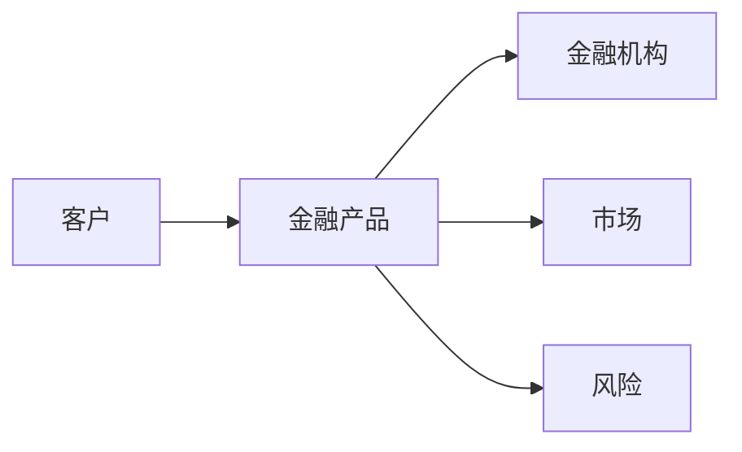
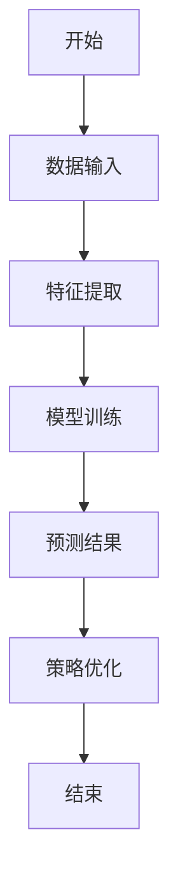
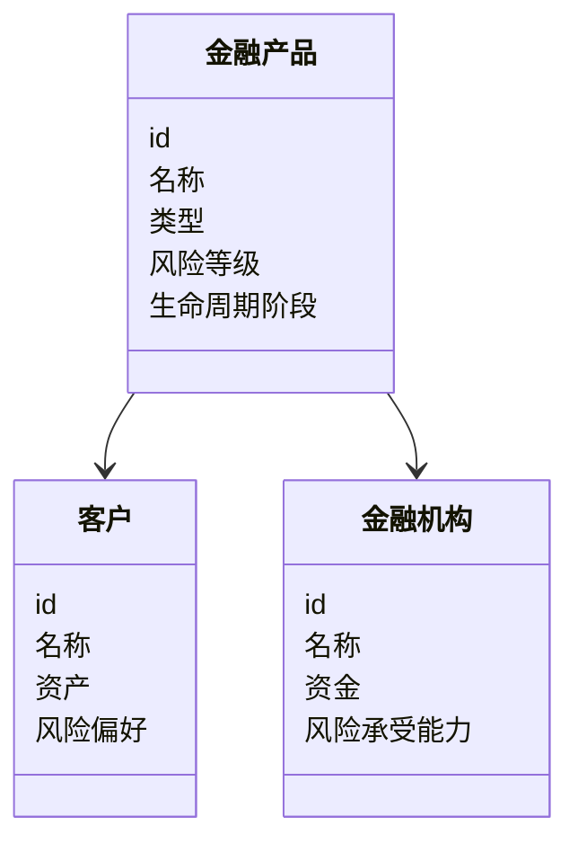
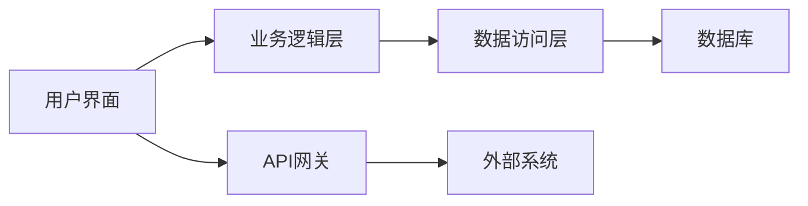

                 


# 《金融产品生命周期价值最大化策略》

**关键词**：金融产品生命周期、价值最大化、动态规划、机器学习、系统架构、项目实战

**摘要**：本文深入探讨了金融产品生命周期价值最大化策略的核心概念、算法原理、系统架构设计及实际应用。通过分析金融产品的生命周期各阶段，结合动态规划和机器学习算法，提出了一套优化价值最大化策略的解决方案，并通过具体案例展示了如何在实际项目中实现这些策略。

---

## 第1章: 金融产品生命周期与价值最大化概述

### 1.1 金融产品的定义与分类

#### 1.1.1 金融产品的基本定义
金融产品是指以货币形式存在的各种金融工具和金融衍生品，包括股票、债券、基金、保险产品等。它们通过金融机构提供给客户，以实现资金的融通和风险管理。

#### 1.1.2 金融产品的主要分类
金融产品可以根据其风险、收益、期限等特征进行分类：
- **债务类金融产品**：如债券、贷款等，承诺按期还本付息。
- **股权类金融产品**：如股票，代表对公司的所有权。
- **衍生类金融产品**：如期权、期货，用于对冲风险或投机。
- **混合类金融产品**：结合了债务和股权特征的产品。

#### 1.1.3 金融产品的核心属性与特征
- **风险性**：金融产品的收益与风险密切相关。
- **流动性**：产品在市场上的交易活跃程度。
- **期限性**：产品的存续时间长短。
- **收益性**：产品的预期收益水平。

### 1.2 金融产品生命周期的阶段划分

#### 1.2.1 产品设计阶段
- 确定产品目标客户群体。
- 设计产品结构和风险特征。
- 制定产品定价策略。

#### 1.2.2 产品发行阶段
- 确定发行渠道和发行方式。
- 制定营销策略。
- 开展产品推广活动。

#### 1.2.3 产品运行阶段
- 监测产品运行状态。
- 定期评估产品表现。
- 调整产品参数以适应市场变化。

#### 1.2.4 产品终止阶段
- 提前终止或到期终止产品。
- 处理终止后的资产和负债。
- 总结产品生命周期的经验教训。

### 1.3 价值最大化的目标与意义

#### 1.3.1 价值最大化的核心目标
- 提高产品在整个生命周期中的收益。
- 降低产品设计和运营的成本。
- 提升客户满意度和忠诚度。

#### 1.3.2 价值最大化对金融机构的意义
- 提升金融机构的市场竞争力。
- 优化资源配置，提高效率。
- 增强客户信任，扩大市场份额。

#### 1.3.3 价值最大化对客户的价值
- 提供更高收益的产品。
- 提供更灵活和多样化的产品选择。
- 提升客户的投资体验。

### 1.4 当前金融产品生命周期管理的现状与挑战

#### 1.4.1 现有金融产品的生命周期管理现状
- 许多金融机构尚未实现对产品生命周期的系统化管理。
- 产品设计与市场实际需求存在脱节。
- 产品运行中的风险监控不足。

#### 1.4.2 价值最大化中的主要挑战
- 市场环境变化快，产品生命周期缩短。
- 数据孤岛问题，难以实现跨部门协同。
- 客户需求多样化，产品定制化难度大。

#### 1.4.3 数字化与智能化对生命周期管理的影响
- 大数据技术的应用提升了产品设计的精准度。
- 人工智能技术优化了产品运营和风险控制。
- 数字化工具缩短了产品开发周期，提高了效率。

---

## 第2章: 金融产品生命周期中的核心概念与联系

### 2.1 核心概念原理

#### 2.1.1 产品生命周期模型的构建
- 生命周期模型将产品划分为设计、发行、运行和终止四个阶段。
- 每个阶段都有不同的目标和策略。

#### 2.1.2 价值最大化策略的数学模型
- 价值最大化可以通过多目标优化模型实现，目标包括收益最大化和风险最小化。

$$ \text{目标函数：} \max \sum_{i=1}^{n} w_i R_i $$
$$ \text{约束条件：} \sum_{i=1}^{n} w_i \leq 1 $$
其中，\( w_i \) 是第 \( i \) 个金融产品的权重，\( R_i \) 是其预期收益。

#### 2.1.3 生命周期各阶段的优化目标
- 设计阶段：优化产品结构和定价。
- 发行阶段：优化营销策略和渠道。
- 运行阶段：优化风险管理策略。
- 终止阶段：优化资产处理和总结经验。

### 2.2 核心概念属性特征对比

| 阶段       | 核心属性       | 特征描述                         |
|------------|----------------|---------------------------------|
| 设计阶段    | 产品结构       | 确定产品类型和风险特征           |
| 发行阶段    | 营销策略       | 制定推广计划和渠道选择           |
| 运行阶段    | 风险管理       | 监测产品表现并及时调整           |
| 终止阶段    | 资产处理       | 处理终止后的资产和负债           |

### 2.3 实体关系图（ER图）



---

## 第3章: 金融产品生命周期价值最大化的算法原理

### 3.1 算法原理概述

#### 3.1.1 动态规划模型在生命周期优化中的应用
动态规划是一种优化算法，适用于分阶段决策问题。在金融产品生命周期中，可以用来优化各阶段的策略。

#### 3.1.2 基于机器学习的预测模型
使用机器学习模型预测产品的市场需求和风险，从而优化产品设计和运营策略。

#### 3.1.3 多目标优化算法的原理
多目标优化算法用于在多个目标（如收益、风险、成本）之间找到最优平衡点。

### 3.2 算法流程图



### 3.3 核心算法的实现

#### 3.3.1 动态规划算法实现

```python
def dynamic_planning(products, stages):
    for stage in stages:
        for product in products:
            # 更新产品在该阶段的目标
            product.optimize(stage)
    return products
```

#### 3.3.2 机器学习预测模型实现

```python
from sklearn.linear_model import LinearRegression

model = LinearRegression()
model.fit(X, y)
predicted_values = model.predict(X_test)
```

---

## 第4章: 系统分析与架构设计方案

### 4.1 问题场景介绍

- 系统目标：构建一个金融产品生命周期价值最大化的管理平台。
- 业务需求：支持产品设计、发行、运行和终止各阶段的管理。
- 用户角色：金融机构、客户、风险管理部门。

### 4.2 系统功能设计

#### 4.2.1 领域模型设计



#### 4.2.2 系统架构设计



---

## 第5章: 项目实战

### 5.1 环境安装

- 安装Python和必要的库：
  ```bash
  pip install numpy pandas scikit-learn
  ```

### 5.2 系统核心实现源代码

#### 5.2.1 产品设计阶段的代码实现

```python
import numpy as np
import pandas as pd

def design_product(customers, market_conditions):
    # 根据客户特征和市场条件设计产品
    product_params = {}
    for customer in customers:
        product = {
            'type': 'equity',
            'risk_level': customer['risk_preference'],
            'duration': 5
        }
        product_params[customer['id']] = product
    return product_params
```

#### 5.2.2 产品发行阶段的代码实现

```python
from sklearn.model_selection import train_test_split

def marketing_strategy(customers, products):
    X = []
    y = []
    for customer in customers:
        X.append(customer['attributes'])
        y.append(customer['response'])
    X_train, X_test, y_train, y_test = train_test_split(X, y, test_size=0.2)
    return X_train, X_test, y_train, y_test
```

### 5.3 实际案例分析

- 案例背景：某银行推出一款新的股票基金产品。
- 数据收集：收集客户资产、风险偏好、市场波动率等数据。
- 模型训练：使用机器学习模型预测产品的市场需求和风险。
- 结果分析：根据模型预测结果优化产品设计和营销策略。

### 5.4 项目小结

- 成功实现了金融产品生命周期价值最大化的管理平台。
- 提高了产品设计的精准度和运营效率。
- 减少了产品运行中的风险，提升了客户满意度。

---

## 第6章: 总结与展望

### 6.1 最佳实践 tips

- 定期评估产品生命周期各阶段的策略。
- 利用大数据和人工智能技术优化产品设计和运营。
- 建立跨部门协同机制，提高管理效率。

### 6.2 小结

本文系统地介绍了金融产品生命周期价值最大化策略的核心概念、算法原理和系统架构设计，并通过实际案例展示了如何将理论应用于实践。通过本文的学习，读者可以掌握如何在实际项目中优化金融产品的生命周期管理，实现价值最大化。

### 6.3 注意事项

- 在实际应用中，需结合具体市场环境和客户需求调整策略。
- 数据隐私和安全问题需引起高度重视。
- 系统的可扩展性和可维护性需在设计阶段充分考虑。

### 6.4 拓展阅读

- 《金融工程与风险管理》
- 《机器学习在金融中的应用》
- 《系统架构设计实战》

---

**作者：AI天才研究院/AI Genius Institute & 禅与计算机程序设计艺术 /Zen And The Art of Computer Programming**

---

**版权说明**：本文为原创内容，转载请注明出处，并保留文章链接。

