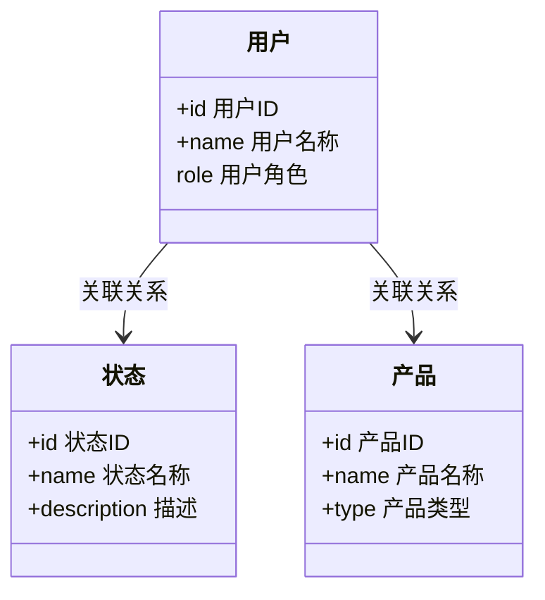
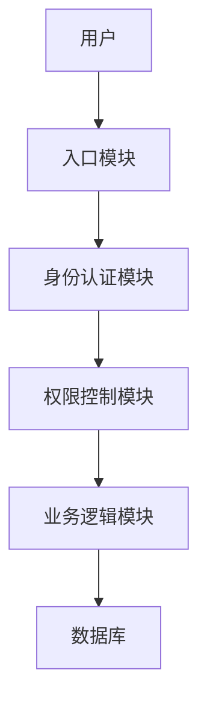
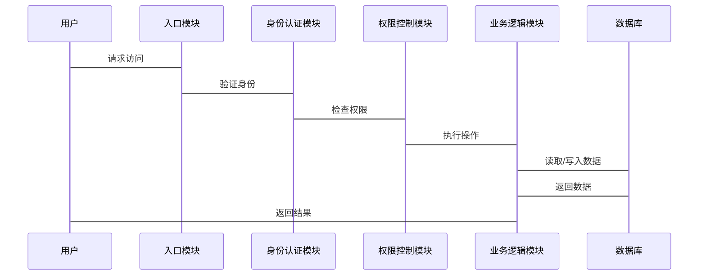

                 


# 《金融产品生命周期管理平台》

> 关键词：金融产品生命周期、平台化管理、系统架构设计、算法原理、风险管理、数字化转型

> 摘要：本文详细探讨了金融产品生命周期管理平台的设计与实现，从背景到系统架构、算法原理、项目实战等多个维度进行了深入分析，为读者提供了全面的技术解读。

---

## 第一部分: 金融产品生命周期管理平台的背景与概念

### 第1章: 金融产品生命周期管理平台的背景

#### 1.1 金融行业数字化转型的背景

近年来，金融行业正经历着深刻的数字化转型。传统金融机构通过技术手段提升效率、降低成本，并通过创新的产品和服务满足客户需求。金融产品生命周期管理平台正是这一背景下的重要产物。

#### 1.2 问题背景与描述

在传统的金融产品管理中，存在以下问题：
- **信息孤岛**：不同部门之间数据分散，难以实现高效协同。
- **管理复杂**：产品生命周期各阶段缺乏统一的管理平台，导致效率低下。
- **风险控制**：产品风险难以全面评估和监控。

#### 1.3 平台化管理的解决思路

平台化管理通过统一的系统实现产品生命周期的全链条管理，包括产品设计、审批、发行、运营和终止等阶段。通过自动化流程和数据整合，显著提升了效率和风险控制能力。

#### 1.4 平台的边界与外延

- **边界**：平台主要关注产品生命周期的核心环节，包括产品设计、审批、发行和终止。
- **外延**：延伸至数据分析、风险评估和客户管理等领域。

### 第2章: 核心概念与实体关系

#### 2.1 核心概念原理

- **金融产品生命周期模型**：包括产品设计、审批、发行、运营和终止五个阶段。
- **平台管理的核心功能模块**：包括产品管理、流程管理、风险管理、数据分析和用户管理。

#### 2.2 实体关系图（ER图）

```mermaid
erDiagram
    actor 用户 {
        +id 用户ID
        +name 用户名称
        role 用户角色
    }
    actor 产品 {
        +id 产品ID
        +name 产品名称
        +type 产品类型
    }
    actor 状态 {
        +id 状态ID
        +name 状态名称
        +description 描述
    }
    用户 --> 状态 : 关联关系
    用户 --> 产品 : 关联关系
```

#### 2.3 核心概念的属性特征对比

| 实体 | 属性 | 数据类型 | 描述 |
|------|------|----------|------|
| 用户 | 用户ID | 整数 | 唯一标识用户 |
| 产品 | 产品ID | 整数 | 唯一标识产品 |
| 状态 | 状态ID | 整数 | 唯一标识状态 |

---

## 第二部分: 核心概念与系统架构

### 第3章: 核心概念与实体关系

#### 3.1 核心概念原理

- **领域模型类图**：展示系统中的核心实体及其关系。
- **系统架构图**：展示系统的模块划分和交互流程。

#### 3.2 系统功能设计

- **领域模型类图**



- **系统架构图**



#### 3.3 接口设计

- **API接口设计**：
  - `/api/users`：用户管理接口。
  - `/api/products`：产品管理接口。
  - `/api/states`：状态管理接口。

#### 3.4 交互流程设计



---

## 第三部分: 算法原理与数学模型

### 第4章: 金融产品生命周期管理的算法原理

#### 4.1 金融风险评估的数学模型

金融风险评估模型可以通过随机森林算法实现：

```mermaid
graph TD
    开始 -> 数据预处理
    数据预处理 -> 特征选择
    特征选择 -> 训练随机森林模型
    训练随机森林模型 -> 预测风险等级
    预测风险等级 -> 结束
```

#### 4.2 随机森林算法的实现

```python
import pandas as pd
from sklearn.ensemble import RandomForestClassifier
from sklearn.model_selection import train_test_split
from sklearn.metrics import accuracy_score

# 加载数据
data = pd.read_csv('data.csv')
X = data.drop('label', axis=1)
y = data['label']

# 划分训练集和测试集
X_train, X_test, y_train, y_test = train_test_split(X, y, test_size=0.2)

# 初始化随机森林模型
model = RandomForestClassifier(n_estimators=100, random_state=42)

# 训练模型
model.fit(X_train, y_train)

# 预测
y_pred = model.predict(X_test)

# 评估准确率
print("Accuracy:", accuracy_score(y_test, y_pred))
```

---

## 第四部分: 项目实战

### 第5章: 金融产品生命周期管理平台的实现

#### 5.1 项目背景

介绍项目的目标和意义。

#### 5.2 核心代码实现

```python
from flask import Flask, request, jsonify

app = Flask(__name__)

@app.route('/api/products', methods=['POST'])
def create_product():
    data = request.json
    # 业务逻辑
    return jsonify({'status': 'success', 'message': 'Product created'})

if __name__ == '__main__':
    app.run(debug=True)
```

#### 5.3 代码解读与分析

- **功能分析**：上述代码实现了产品创建接口。
- **优化建议**：增加输入验证和日志记录。

#### 5.4 案例分析

通过具体案例说明平台的应用场景和效果。

---

## 第五部分: 总结与展望

### 第6章: 总结与展望

#### 6.1 总结

- 本文详细探讨了金融产品生命周期管理平台的设计与实现。
- 通过系统架构设计、算法原理和项目实战，为读者提供了全面的技术解读。

#### 6.2 展望

- 未来，平台可以通过引入人工智能和大数据技术进一步提升效率和风险管理能力。

---

## 作者

**作者：AI天才研究院 & 禅与计算机程序设计艺术**

--- 

这篇文章全面介绍了金融产品生命周期管理平台的设计与实现，涵盖了背景、核心概念、系统架构、算法原理和项目实战等关键部分，为读者提供了深入的技术解读。

