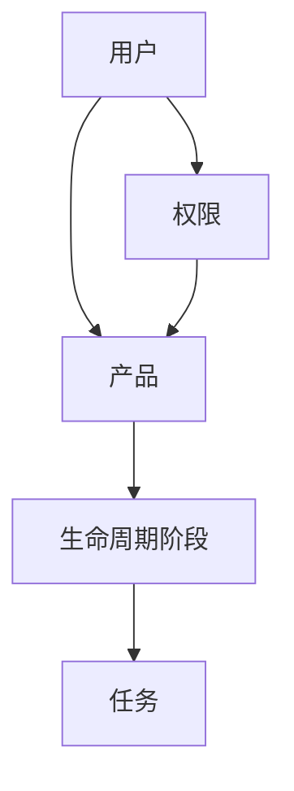
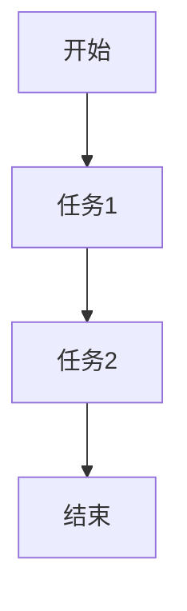
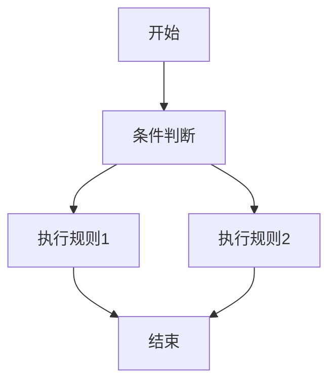
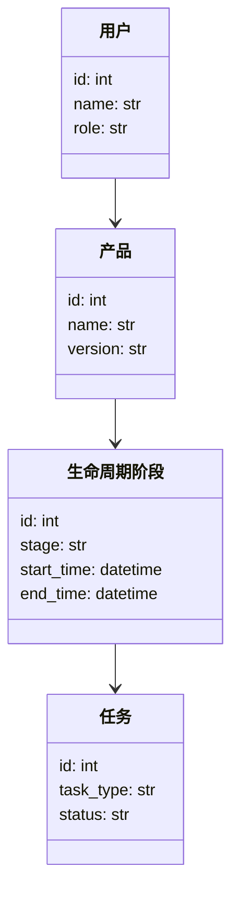
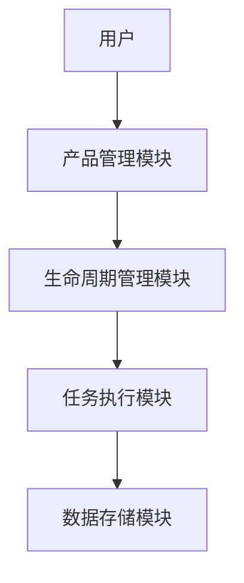
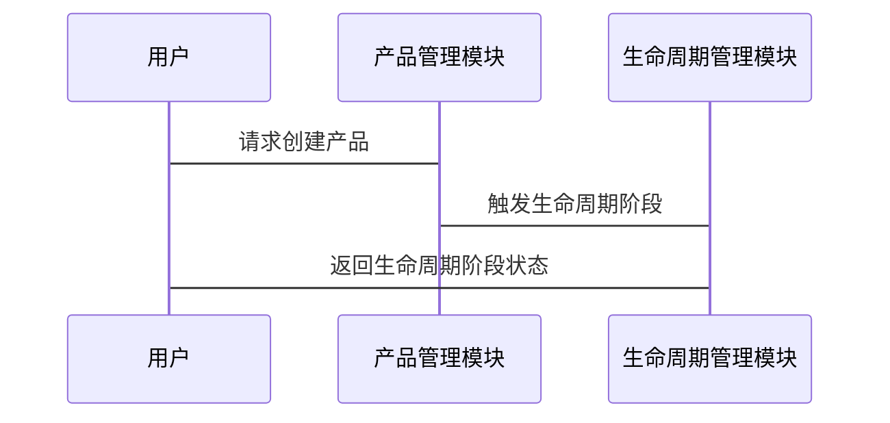

                 


# 《金融产品生命周期管理自动化平台》

## 关键词：金融产品生命周期、自动化管理平台、系统架构设计、工作流引擎、规则引擎、数字化转型

## 摘要：金融产品生命周期管理自动化平台旨在通过自动化技术优化金融产品的管理流程，提升效率和准确性。本文将深入探讨平台的设计背景、核心概念、算法原理、系统架构以及实际应用，为金融行业的数字化转型提供解决方案。

---

## 目录

### 第1章: 金融产品生命周期管理概述

#### 1.1 问题背景与需求分析

- **1.1.1 传统金融产品管理的痛点**
  - 简述传统金融产品管理中的问题，如流程繁琐、人工干预过多、效率低下等。
- **1.1.2 自动化管理的必要性**
  - 强调自动化管理在提升效率、减少错误率和降低运营成本方面的重要性。
- **1.1.3 金融行业数字化转型的驱动力**
  - 探讨数字化转型如何推动金融行业的发展，包括技术进步和市场需求的变化。

#### 1.2 金融产品生命周期模型

- **1.2.1 生命周期阶段划分**
  - 详细描述金融产品的生命周期阶段，如开发、发行、运作、终止等。
- **1.2.2 各阶段的核心任务与挑战**
  - 分析每个阶段的主要任务和潜在挑战，如风险控制、合规性等。
- **1.2.3 生命周期模型的数学表达**
  - 使用数学公式表示生命周期的阶段和任务关系，如状态转移模型。

#### 1.3 平台建设的目标与价值

- **1.3.1 平台的核心目标**
  - 明确平台旨在实现金融产品管理的自动化、智能化和高效化。
- **1.3.2 平台的价值体现**
  - 讨论平台在提升效率、降低成本、增强合规性方面的具体价值。
- **1.3.3 平台的边界与外延**
  - 描述平台的功能边界，明确其与外部系统的接口和交互方式。

---

### 第2章: 核心概念与系统架构

#### 2.1 平台核心概念

- **2.1.1 产品管理模块**
  - 介绍产品信息管理、版本控制和产品状态追踪功能。
- **2.1.2 流程管理模块**
  - 讨论流程定义、执行监控和流程优化的核心概念。
- **2.1.3 数据管理模块**
  - 分析数据采集、存储和分析的关键点。

#### 2.2 核心概念对比表

- **2.2.1 功能模块对比**
  - 列出产品管理、流程管理和数据管理模块的功能对比。
- **2.2.2 数据类型对比**
  - 对比不同模块中的数据类型，如产品信息、流程日志和分析结果。
- **2.2.3 交互方式对比**
  - 分析模块间的交互方式，如API调用、事件触发等。

#### 2.3 实体关系图

- **2.3.1 ER图展示**
  - 使用Mermaid绘制实体关系图，展示用户、产品、生命周期阶段和任务之间的关系。



---

### 第3章: 算法原理与实现

#### 3.1 工作流引擎算法

- **3.1.1 算法流程图**
  - 使用Mermaid绘制工作流引擎的流程图，展示任务执行的顺序和依赖关系。



- **3.1.2 Python实现代码**
  - 提供工作流引擎的Python代码示例，并进行详细解读。

```python
def execute_workflow(tasks):
    for task in tasks:
        if task.dependency met:
            execute_task(task)
    return "完成"
```

#### 3.2 规则引擎算法

- **3.2.1 算法流程图**
  - 使用Mermaid绘制规则引擎的流程图，展示条件判断和规则执行的逻辑。



- **3.2.2 Python实现代码**
  - 提供规则引擎的Python代码示例，展示如何根据条件动态执行规则。

```python
def rule_engine(condition, rules):
    if evaluate_condition(condition):
        apply_rule(rules[0])
    else:
        apply_rule(rules[1])
    return "完成"
```

---

### 第4章: 系统分析与架构设计

#### 4.1 问题场景介绍

- **4.1.1 系统功能设计**
  - 描述系统的整体功能模块，如产品管理、流程管理、数据管理等。

#### 4.2 系统架构设计

- **4.2.1 领域模型设计**
  - 使用Mermaid绘制领域模型图，展示核心实体及其关系。



- **4.2.2 系统架构图**
  - 使用Mermaid绘制系统架构图，展示各模块之间的交互关系。



- **4.2.3 接口设计与交互图**
  - 描述系统的接口设计和交互流程，使用Mermaid绘制序列图。



---

### 第5章: 项目实战

#### 5.1 环境安装与配置

- **5.1.1 安装Python和相关库**
  - 详细说明如何安装Python和必要的库，如Django、Flask、Celery等。

#### 5.2 核心代码实现

- **5.2.1 产品管理模块代码**
  - 提供产品信息管理的Python代码示例，展示如何创建、更新和查询产品信息。

```python
class ProductManager:
    def __init__(self, db_connection):
        self.db = db_connection

    def create_product(self, product_data):
        # 插入产品信息到数据库
        pass

    def update_product(self, product_id, update_data):
        # 更新产品信息
        pass

    def get_product(self, product_id):
        # 查询产品信息
        pass
```

- **5.2.2 工作流引擎实现代码**
  - 展示如何实现一个简单的工作流引擎，处理任务的执行顺序和依赖关系。

```python
class WorkflowEngine:
    def __init__(self, task_list):
        self.tasks = task_list

    def execute_workflow(self):
        for task in self.tasks:
            if task.dependency met:
                execute_task(task)
        return "完成"
```

#### 5.3 实际案例分析与实现

- **5.3.1 案例背景与需求分析**
  - 介绍一个实际案例，如新产品发行的生命周期管理。
- **5.3.2 代码实现与分析**
  - 提供案例的代码实现，并详细解读关键部分。
- **5.3.3 案例测试与结果展示**
  - 讨论如何测试案例，并展示测试结果和日志。

---

### 第6章: 最佳实践与总结

#### 6.1 小结

- 总结全文的核心内容和主要观点。

#### 6.2 注意事项与建议

- 提供在设计和实现平台时需要注意的事项和建议。

#### 6.3 拓展阅读

- 推荐相关的技术书籍和资源，供读者进一步学习。

---

## 作者

作者：AI天才研究院/AI Genius Institute & 禅与计算机程序设计艺术 /Zen And The Art of Computer Programming

