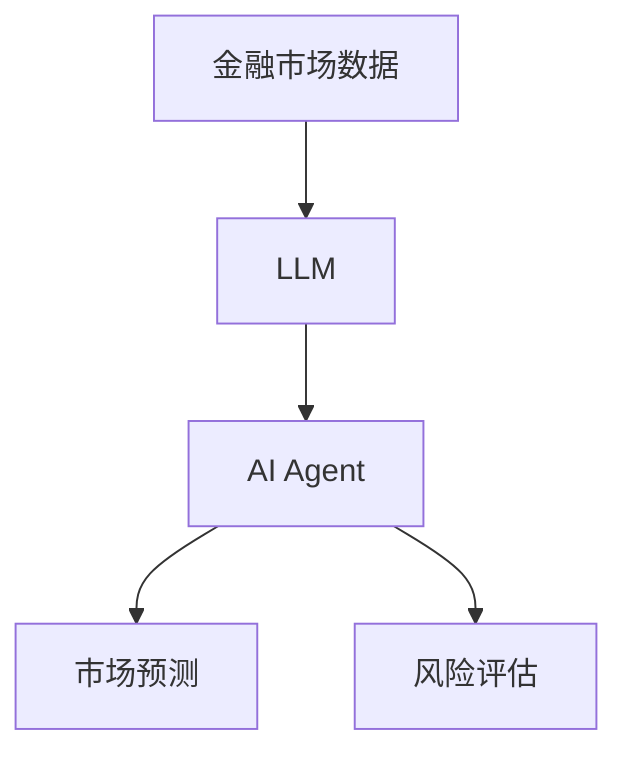
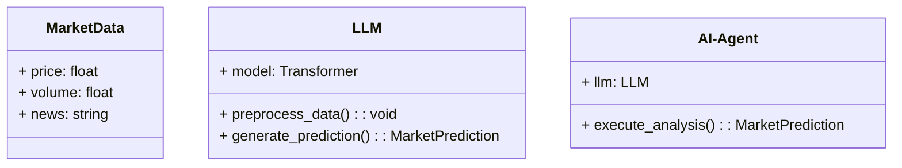
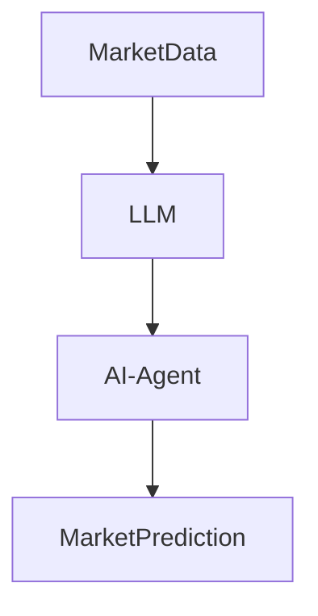
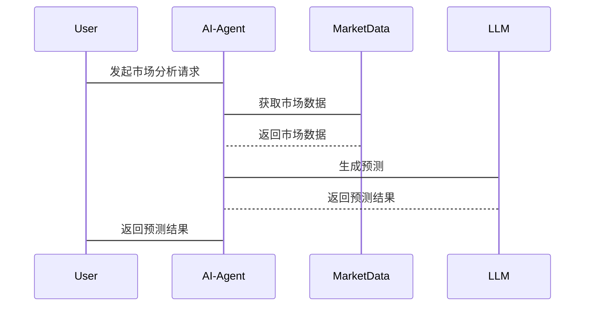

                 


# 《金融分析 AI Agent：利用 LLM 进行市场预测与风险评估》

**关键词：** AI Agent, 大语言模型, 金融分析, 市场预测, 风险评估

**摘要：** 本文探讨了如何利用大语言模型（LLM）构建金融分析 AI Agent，实现市场预测与风险评估。通过背景介绍、核心概念分析、算法原理、系统架构设计、项目实战和最佳实践，系统地阐述了LLM在金融分析中的应用。文章深入分析了AI Agent的优势，并通过具体案例展示了其实际应用，最后总结了未来发展与优化方向。

---

# 第1章: 金融分析 AI Agent 的背景与核心概念

## 1.1 金融分析的现状与挑战

### 1.1.1 传统金融分析方法的局限性
传统金融分析依赖统计分析和机器学习模型，但在处理非结构化数据、捕捉市场情绪和复杂决策方面存在不足。金融市场数据的快速增长和不确定性增加了传统方法的局限性。

### 1.1.2 数据量爆炸与分析需求的增长
金融数据的爆炸性增长，尤其是文本数据（如新闻、社交媒体评论）的增加，使得传统分析方法难以处理。同时，投资者对实时分析和个性化服务的需求日益增长。

### 1.1.3 金融市场的不确定性与风险
金融市场高度依赖于市场情绪和外部事件，这使得预测和风险评估变得复杂。传统模型在捕捉动态变化和非线性关系方面存在局限性。

## 1.2 AI Agent 的基本概念

### 1.2.1 什么是 AI Agent
AI Agent 是一种智能体，能够感知环境、做出决策并执行行动。在金融领域，AI Agent 可以用于自动化交易、风险管理和市场分析。

### 1.2.2 AI Agent 的核心功能与特点
- **感知环境**：通过收集和分析金融市场数据。
- **决策制定**：基于数据进行预测和优化。
- **自主学习**：通过机器学习算法不断改进模型。

### 1.2.3 AI Agent 在金融领域的应用潜力
AI Agent 可以用于实时交易监控、风险评估、市场预测和投资组合管理，帮助投资者做出更明智的决策。

## 1.3 大语言模型（LLM）的基本原理

### 1.3.1 LLM 的定义与技术基础
大语言模型是一种基于深度学习的自然语言处理模型，能够理解和生成人类语言。其核心技术包括 Transformer 架构和大规模数据训练。

### 1.3.2 LLM 的主要应用场景
- 文本生成
- 语义理解
- 知识问答
- 自动摘要

### 1.3.3 LLM 在金融分析中的优势
- 高效处理文本数据
- 捕捉市场情绪
- 提供解释性分析

## 1.4 LLM 与金融分析的结合

### 1.4.1 LLM 在金融文本分析中的应用
通过分析新闻、社交媒体和公司财报，LLM 可以提取情感和关键信息，辅助投资决策。

### 1.4.2 LLM 在市场预测中的潜力
利用历史数据和市场动态，LLM 可以生成预测性分析，帮助投资者预测价格走势。

### 1.4.3 LLM 在风险评估中的创新
通过分析多种数据源，LLM 可以识别潜在风险因素，优化风险评估模型。

## 1.5 本章小结
本章介绍了金融分析的现状与挑战，AI Agent 的基本概念，以及大语言模型的技术基础和在金融分析中的应用潜力。

---

# 第2章: 金融分析 AI Agent 的核心概念与联系

## 2.1 核心概念原理

### 2.1.1 金融数据分析的特征
- 多维度：包括价格、成交量、市场情绪等。
- 高频性：金融市场数据更新迅速。
- 非线性：价格波动往往难以用线性模型解释。

### 2.1.2 LLM 的文本理解和生成能力
- 文本理解：通过编码器提取文本特征。
- 文本生成：通过解码器生成预测文本。

### 2.1.3 AI Agent 的决策机制
基于输入数据和模型预测，AI Agent 生成决策指令。

## 2.2 核心概念属性对比表

| 属性 | 金融数据 | LLM 能力 | AI Agent |
|------|----------|----------|----------|
| 输入类型 | 数值、文本、时间序列 | 文本、结构化数据 | 综合输入 |
| 输出类型 | 预测值、风险指标 | 文本解释、数值预测 | 综合输出 |
| 处理方式 | 统计分析、机器学习 | 语义理解、生成 | 自动决策 |

## 2.3 实体关系图（Mermaid）



## 2.4 本章小结
本章通过对比分析，展示了金融数据分析、LLM 和 AI Agent 之间的关系和协同作用。

---

# 第3章: 基于 LLM 的金融分析 AI Agent 算法原理

## 3.1 算法流程

### 3.1.1 数据预处理
- 清洗数据：去除噪声和异常值。
- 特征提取：从文本数据中提取情感指标。

### 3.1.2 模型训练
- 使用 Transformer 架构训练 LLM。
- 采用监督学习优化模型参数。

### 3.1.3 模型微调
- 在金融领域数据上进行微调，提升模型的领域适应性。

## 3.2 算法实现代码

### 3.2.1 数据预处理代码

```python
def preprocess_data(data):
    # 清洗数据
    cleaned_data = data.dropna()
    # 特征提取
    features = cleaned_data['text'].apply(lambda x: x.lower())
    return features
```

### 3.2.2 模型训练代码

```python
def train_model(features, labels):
    # 构建模型
    model = TransformerModel()
    # 编译模型
    model.compile(optimizer='adam', loss='binary_crossentropy')
    # 训练模型
    model.fit(features, labels, epochs=10, batch_size=32)
    return model
```

## 3.3 算法原理的数学模型

### 3.3.1 损失函数
$$ L = -\frac{1}{n} \sum_{i=1}^{n} y_i \log(p_i) + (1 - y_i) \log(1 - p_i) $$

### 3.3.2 概率计算
$$ p_i = \text{softmax}(x_i W^T) $$

## 3.4 本章小结
本章详细讲解了基于 LLM 的金融分析 AI Agent 的算法流程和实现细节。

---

# 第4章: 金融分析 AI Agent 的系统分析与架构设计

## 4.1 系统功能设计

### 4.1.1 领域模型类图（Mermaid）



## 4.2 系统架构设计

### 4.2.1 整体架构图（Mermaid）



### 4.2.2 接口设计
- 数据接口：接收市场数据输入。
- 预测接口：输出市场预测结果。

## 4.3 系统交互流程图（Mermaid）



## 4.4 本章小结
本章从系统架构的角度，详细设计了金融分析 AI Agent 的整体结构和交互流程。

---

# 第5章: 项目实战：构建金融分析 AI Agent

## 5.1 环境安装

### 5.1.1 安装依赖
```bash
pip install transformers torch numpy pandas
```

## 5.2 核心代码实现

### 5.2.1 数据预处理

```python
import pandas as pd
import numpy as np

def preprocess_data(data):
    # 填充缺失值
    data = data.dropna()
    # 特征提取
    features = data['text'].apply(lambda x: x.lower())
    return features
```

### 5.2.2 模型训练

```python
from transformers import AutoTokenizer, AutoModelForCausalLM
import torch

def train_model(features, labels):
    # 加载模型和分词器
    model_name = "gpt2"
    tokenizer = AutoTokenizer.from_pretrained(model_name)
    model = AutoModelForCausalLM.from_pretrained(model_name)
    # 将特征转换为输入格式
    inputs = tokenizer(features.tolist(), return_tensors='pt', padding=True)
    labels = torch.tensor(labels, dtype=torch.long)
    # 训练模型
    optimizer = torch.optim.Adam(model.parameters(), lr=0.001)
    model.train()
    for epoch in range(10):
        outputs = model(**inputs, labels=labels)
        loss = outputs.loss
        loss.backward()
        optimizer.step()
    return model
```

### 5.2.3 模型预测

```python
def predict_market(model, tokenizer, input_text):
    inputs = tokenizer(input_text, return_tensors='pt', padding=True)
    outputs = model.generate(**inputs, max_length=50)
    return tokenizer.decode(outputs[0], skip_special_tokens=True)
```

## 5.3 项目小结
通过实际项目，我们展示了如何利用 LLM 构建金融分析 AI Agent，并实现市场预测和风险评估。

---

# 第6章: 最佳实践与未来展望

## 6.1 最佳实践 tips
- **数据质量**：确保数据的准确性和完整性。
- **模型调优**：根据实际需求微调模型参数。
- **实时性优化**：采用流数据处理技术，提升实时性。

## 6.2 小结
通过本文的讲解，读者可以系统地掌握利用 LLM 进行金融分析的核心方法和实践技巧。

## 6.3 注意事项
- 模型的泛化能力有限，需持续优化。
- 遵守金融监管规定，确保合规性。

## 6.4 拓展阅读
推荐阅读《大语言模型在金融领域的应用》和《AI Agent 的设计与实现》。

---

# 作者：AI天才研究院/AI Genius Institute & 禅与计算机程序设计艺术 /Zen And The Art of Computer Programming

---

以上是文章的完整目录大纲和部分章节内容的详细讲解。

