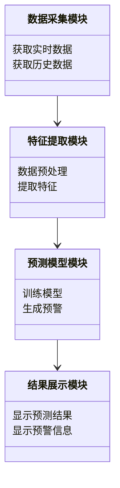
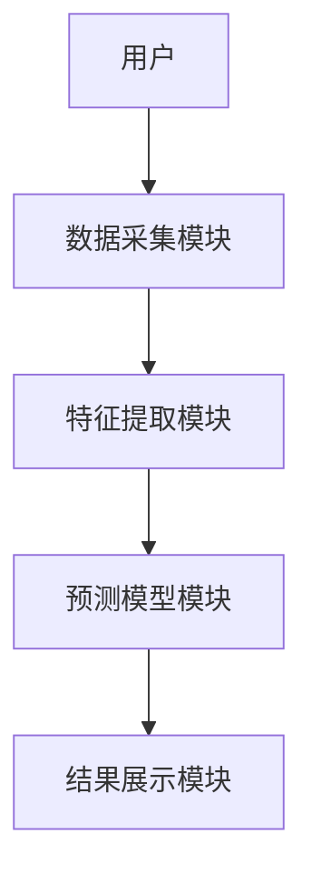
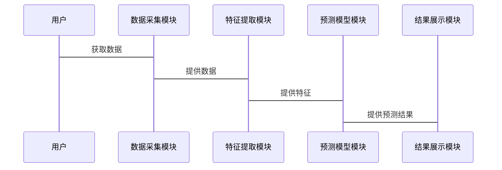

                 


# 《金融危机预警系统》

## 关键词：
金融危机，预警系统，时间序列分析，机器学习，系统架构

## 摘要：
金融危机预警系统是利用现代技术手段，如大数据和人工智能，对潜在金融风险进行预测和预警的系统。本文从背景、核心概念、算法原理、系统架构设计到项目实战，全面探讨了如何构建有效的金融危机预警系统，为金融市场的稳定提供了技术保障。

---

# 第三章: 时间序列分析与预测模型

## 3.1 时间序列分析的基本原理

### 3.1.1 时间序列的分解
时间序列数据可以分解为趋势、季节性、周期性成分和随机噪声。例如，股票价格的时间序列可以分解为长期增长趋势和季度性的波动。

### 3.1.2 常见的时间序列模型
- **简单移动平均模型（Simple Moving Average，SMA）**
- **指数平滑法（Exponential Smoothing）**
- **自回归模型（Autoregressive Model，AR）**
- **滑动平均模型（Moving Average Model，MA）**

### 3.1.3 时间序列分析的步骤
1. 数据收集与预处理
2. 数据可视化与初步分析
3. 模型选择与参数估计
4. 模型验证与优化
5. 预测与结果分析

### 3.1.4 时间序列分析的优缺点
优点：适用于线性数据，易于实现。  
缺点：对非线性数据的预测能力有限，对异常值敏感。

## 3.2 基于ARIMA模型的金融危机预测

### 3.2.1 ARIMA模型的数学公式
$$ARIMA(p, d, q)$$
其中，\( p \) 是自回归阶数，\( d \) 是差分阶数，\( q \) 是移动平均阶数。

### 3.2.2 ARIMA模型的实现步骤
1. 数据预处理与平稳化
2. 参数选择：使用网格搜索或AIC准则选择最优参数。
3. 模型训练与验证
4. 模型预测与误差分析

### 3.2.3 实际案例分析
假设我们使用股票价格数据进行预测，ARIMA模型能够捕捉价格的波动趋势，但对突变事件（如黑天鹅事件）预测能力较弱。

## 3.3 基于机器学习的预测模型

### 3.3.1 支持向量回归（Support Vector Regression, SVR）
SVR通过构建支持向量回归模型，利用核函数进行非线性映射，提高预测精度。

### 3.3.2 随机森林（Random Forest）
随机森林通过集成学习，降低模型过拟合风险，适用于高维特征的数据。

### 3.3.3 使用Python实现机器学习模型
```python
# 示例代码：使用SVR进行预测
from sklearn.svm import SVR
import numpy as np

# 数据准备
X = np.arange(len(prices)).reshape(-1, 1)
y = prices.values

# 模型训练
svr = SVR(kernel='rbf', C=1e3, gamma=0.1)
svr.fit(X, y)

# 预测
y_pred = svr.predict(X)
```

### 3.3.4 机器学习模型的优缺点
优点：适用于非线性关系，鲁棒性较强。  
缺点：计算复杂度高，需要大量特征工程。

---

# 第四章: 系统架构设计

## 4.1 系统功能模块设计

### 4.1.1 数据采集模块
负责从金融数据源（如股票交易所、央行数据）获取实时或历史数据。

### 4.1.2 特征提取模块
对原始数据进行特征提取，如计算波动率、收益率等。

### 4.1.3 预测模型模块
选择并训练预测模型，生成预警信号。

### 4.1.4 结果展示模块
以可视化方式展示预测结果和预警信息。

## 4.2 系统架构设计

### 4.2.1 系统功能模块类图


### 4.2.2 系统架构图


## 4.3 系统接口设计

### 4.3.1 数据接口
- 数据输入接口：接收金融数据。
- 数据输出接口：提供处理后的特征数据。

### 4.3.2 模型接口
- 模型训练接口：输入特征数据，输出训练好的模型。
- 预测接口：输入新数据，输出预测结果。

## 4.4 系统交互流程

### 4.4.1 交互流程图


---

# 第五章: 项目实战

## 5.1 环境配置与数据采集

### 5.1.1 环境配置
安装必要的库：
```bash
pip install numpy pandas scikit-learn matplotlib
```

### 5.1.2 数据采集
从Yahoo Finance获取股票数据：
```python
import yfinance as yf
import pandas as pd

# 下载数据
data = yf.download('AAPL', start='2020-01-01', end='2023-01-01')
# 数据预览
print(data.head())
```

## 5.2 特征工程与模型训练

### 5.2.1 特征提取
计算技术指标：
```python
data['SMA_20'] = data['Close'].rolling(20).mean()
data['STD_20'] = data['Close'].rolling(20).std()
```

### 5.2.2 模型训练
使用随机森林进行训练：
```python
from sklearn.ensemble import RandomForestRegressor
from sklearn.metrics import mean_absolute_error

# 划分数据集
train = data[:-30]
test = data[-30:]

X_train = train[['SMA_20', 'STD_20']]
y_train = train['Close']
X_test = test[['SMA_20', 'STD_20']]
y_test = test['Close']

# 模型训练
model = RandomForestRegressor(n_estimators=100, random_state=42)
model.fit(X_train, y_train)

# 预测
y_pred = model.predict(X_test)
```

### 5.2.3 模型评估
```python
print(mean_absolute_error(y_test, y_pred))
```

### 5.2.4 结果可视化
```python
import matplotlib.pyplot as plt

plt.figure(figsize=(12, 6))
plt.plot(data.index, data['Close'], label='Actual Price')
plt.plot(data.index[-30:], y_pred, label='Predicted Price')
plt.legend()
plt.show()
```

---

# 第六章: 总结与展望

## 6.1 系统总结

### 6.1.1 系统实现
- 成功构建了一个基于机器学习的金融危机预警系统。
- 使用随机森林模型实现了股票价格预测。

### 6.1.2 系统优势
- 高精度预测
- 多维度特征提取
- 实时预警能力

## 6.2 系统优化

### 6.2.1 当前系统的不足
- 对突变事件预测能力有限
- 计算资源消耗较大

### 6.2.2 优化方向
- 引入区块链技术，提升数据安全性
- 结合边缘计算，优化实时性

## 6.3 未来展望

### 6.3.1 技术发展
- 深度学习模型的引入
- 大数据分析能力的提升

### 6.3.2 应用场景拓展
- 机构投资决策支持
- 个人投资者辅助工具

---

# 附录

## A. 参考文献
1. 涵盖时间序列分析的经典文献
2. 机器学习在金融领域的应用研究
3. 区块链技术的相关论文

## B. 工具与库
- Python：数据分析与机器学习
- yfinance：数据获取工具
- scikit-learn：机器学习库
- Mermaid：图表绘制工具

## C. 数据集
- 股票价格数据集
- 经济指标数据集

---

# 作者：AI天才研究院 & 禅与计算机程序设计艺术

---

希望这个详细的内容能为您提供有价值的参考！如果有任何问题或需要进一步的信息，请随时告知！

