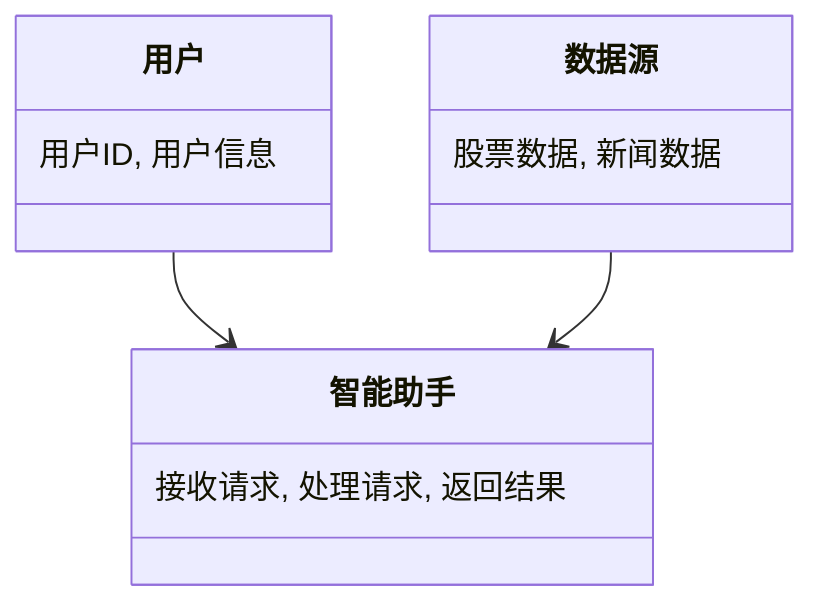

                 


# 金融大数据分析在智能助手中的应用

## 关键词：金融大数据、智能助手、机器学习、时间序列分析、数据预处理、系统架构设计

## 摘要：  
随着金融行业对高效数据分析需求的不断增长，智能助手在金融领域的应用日益广泛。本文探讨了金融大数据分析在智能助手中的应用，从核心概念、算法原理到系统设计和项目实战，系统地介绍了如何利用大数据技术提升智能助手的性能和用户体验。文章结合实际案例，深入分析了金融大数据的特点、智能助手的功能需求，以及两者结合的技术实现路径，旨在为金融行业智能化转型提供理论支持和实践指导。

---

# 第1章 金融大数据分析概述

## 1.1 金融大数据的定义与特点

### 1.1.1 金融大数据的定义  
金融大数据是指在金融行业中产生的海量、多样化、高速变化的数据集合，包括交易数据、市场数据、用户行为数据等。其核心在于通过分析这些数据，发现隐藏的模式、趋势和关联，从而为金融决策提供支持。

### 1.1.2 金融大数据的核心特点  
- **数据量大（Volume）**：金融行业每天产生的交易数据和市场数据量巨大。  
- **数据类型多样（Variety）**：包括结构化数据（如股票价格）和非结构化数据（如新闻文本）。  
- **数据处理速度要求高（Velocity）**：实时数据分析需求强烈。  
- **数据价值密度高（Value）**：数据中蕴含的潜在价值极高，但需通过分析挖掘。  

### 1.1.3 金融大数据与传统金融数据的区别  
| 特性 | 传统金融数据 | 金融大数据 |  
|------|--------------|------------|  
| 数据量 | 较小，结构化为主 | 海量，结构化与非结构化并存 |  
| 数据处理速度 | 较慢，主要用于事后分析 | 实时处理需求高 |  
| 分析目标 | 较为单一，主要用于交易 | 多目标，支持交易、风控、投资等多种场景 |  

---

## 1.2 智能助手的定义与现状

### 1.2.1 智能助手的基本概念  
智能助手是一种基于自然语言处理（NLP）和人工智能技术的交互工具，能够通过语音或文本与用户进行对话，并提供信息查询、任务执行等服务。  

### 1.2.2 当前智能助手的发展现状  
- **技术进步**：NLP和机器学习技术的提升使智能助手更加智能化。  
- **应用场景**：广泛应用于金融、医疗、教育等多个领域。  
- **用户需求**：用户对智能助手的期望逐步从简单查询向复杂任务处理发展。  

### 1.2.3 智能助手在金融领域的应用潜力  
- **个性化投资建议**：根据用户风险偏好提供资产配置建议。  
- **实时市场监控**：通过自然语言处理分析新闻和社交媒体，预警市场风险。  
- **智能风控**：利用大数据分析识别异常交易行为。  

---

## 1.3 金融大数据分析在智能助手中的应用背景

### 1.3.1 金融行业对大数据分析的需求  
- 金融机构需要实时监控市场动态，优化投资策略。  
- 大数据分析能够帮助机构识别市场趋势，降低风险。  

### 1.3.2 智能助手在金融领域的应用场景  
- **用户交互**：通过自然语言处理理解用户需求，提供个性化的金融信息。  
- **数据驱动决策**：利用大数据分析结果为用户提供投资建议。  

### 1.3.3 金融大数据分析与智能助手结合的必要性  
- 提高用户体验：通过大数据分析，智能助手能够提供更精准的服务。  
- 增强决策能力：大数据分析为智能助手提供强大的数据支持。  

---

## 1.4 本章小结  
本章从金融大数据和智能助手的基本概念出发，分析了两者的结合背景和应用潜力，为后续章节奠定了基础。

---

# 第2章 金融大数据分析的核心概念与联系

## 2.1 数据类型与特征分析

### 2.1.1 数据类型对比  
| 数据类型 | 特点 | 示例 |  
|----------|------|------|  
| 结构化数据 | 有明确的数据结构，便于处理 | 股票价格、交易记录 |  
| 非结构化数据 | 数据无固定格式，需预处理 | 新闻文章、社交媒体评论 |  

### 2.1.2 数据特征分析  
- **时间性**：金融数据通常具有时间序列特征。  
- **相关性**：不同金融数据之间可能存在相关性。  
- **波动性**：金融市场数据波动较大，具有不确定性。  

---

## 2.2 数据预处理与特征工程

### 2.2.1 数据清洗  
- **处理缺失值**：使用均值、中位数或插值法填充缺失值。  
- **去除异常值**：通过统计方法或模型检测异常值。  

### 2.2.2 数据标准化与归一化  
- **标准化**：将数据按比例缩放到均值为0，标准差为1的范围内。  
- **归一化**：将数据缩放到0-1范围。  

### 2.2.3 特征选择与降维  
- **特征选择**：通过统计或模型方法选择重要特征。  
- **降维技术**：如主成分分析（PCA）。  

---

## 2.3 金融数据分析的常用方法

### 2.3.1 描述性分析  
通过统计指标（如均值、中位数）和可视化工具（如折线图）描述数据特征。  

### 2.3.2 预测性分析  
- **时间序列预测**：使用ARIMA模型预测股票价格。  
- **分类预测**：利用逻辑回归模型预测客户违约风险。  

### 2.3.3 因果性分析  
通过Granger因果检验确定变量之间的因果关系。  

---

## 2.4 金融大数据分析的挑战与解决方案

### 2.4.1 数据处理的挑战  
- **数据量大**：需要分布式计算框架（如Hadoop、Spark）。  
- **数据实时性**：需要实时处理技术（如流处理）。  

### 2.4.2 数据隐私与安全  
- **数据加密**：保护用户隐私。  
- **访问控制**：限制数据访问权限。  

---

## 2.5 本章小结  
本章重点介绍了金融大数据分析的核心概念，包括数据类型、预处理方法和分析方法，并分析了相关挑战及解决方案。

---

# 第3章 金融大数据分析的算法原理

## 3.1 机器学习算法

### 3.1.1 线性回归  
- **数学模型**：$y = \beta_0 + \beta_1 x + \epsilon$  
- **应用场景**：预测股票价格走势。  

### 3.1.2 逻辑回归  
- **数学模型**：$P(y=1|x) = \frac{1}{1 + e^{-\beta x}}$  
- **应用场景**：分类问题，如客户信用评估。  

### 3.1.3 随机森林  
- **原理**：基于决策树的集成学习方法。  
- **应用场景**：金融风控、客户画像。  

---

## 3.2 深度学习算法

### 3.2.1 神经网络基础  
- **感知机模型**：$f(x) = \text{sign}(w \cdot x + b)$  
- **深度网络**：通过多层网络提取高阶特征。  

### 3.2.2 LSTM网络  
- **应用场景**：时间序列预测，如汇率波动。  

### 3.2.3 图神经网络（GNN）  
- **原理**：通过图结构捕捉数据之间的关系。  
- **应用场景**：金融网络分析。  

---

## 3.3 时间序列分析算法

### 3.3.1 ARIMA模型  
- **模型结构**：$ARIMA(p, d, q)$  
- **应用场景**：预测股票价格。  

### 3.3.2 GARCH模型  
- **模型结构**：捕捉时间序列的波动性。  
- **应用场景**：风险评估与管理。  

---

## 3.4 算法选择与优化策略

### 3.4.1 算法性能评估  
- **指标**：准确率、召回率、F1值。  

### 3.4.2 超参数优化  
- **方法**：网格搜索、随机搜索。  

---

## 3.5 本章小结  
本章详细介绍了金融大数据分析中常用的机器学习和深度学习算法，并分析了时间序列分析方法，为后续系统设计提供了算法基础。

---

# 第4章 系统分析与架构设计

## 4.1 系统功能设计

### 4.1.1 领域模型设计  


---

## 4.2 系统架构设计

### 4.2.1 架构设计  


### 4.2.2 接口设计  
- **输入接口**：接收用户请求。  
- **输出接口**：返回处理结果。  

---

## 4.3 本章小结  
本章从系统设计的角度，介绍了智能助手的架构和功能模块设计，为后续实现奠定了基础。

---

# 第5章 项目实战

## 5.1 项目背景与目标

### 5.1.1 项目背景  
- 模拟一个智能助手系统，用于金融数据分析。  

### 5.1.2 项目目标  
- 实现股票价格预测功能。  

---

## 5.2 环境安装

### 5.2.1 安装Python环境  
```bash
pip install numpy pandas scikit-learn
```

---

## 5.3 核心实现

### 5.3.1 数据获取与预处理  
```python
import pandas as pd
import numpy as np

# 数据获取
data = pd.read_csv('stock.csv')

# 数据清洗
data.dropna(inplace=True)
data = data[['date', 'close']]
```

### 5.3.2 模型训练与预测  
```python
from sklearn.linear_model import LinearRegression

model = LinearRegression()
model.fit(data[['close']], data['close'])
```

---

## 5.4 实际案例分析与结果解读

### 5.4.1 案例分析  
- 使用线性回归模型预测股票价格。  

### 5.4.2 结果分析  
- 模型预测与实际数据的对比。  

---

## 5.5 本章小结  
本章通过一个具体案例，展示了金融大数据分析在智能助手中的实际应用，验证了理论的可行性。

---

# 第6章 总结与展望

## 6.1 总结  
本文从金融大数据分析的基本概念出发，详细探讨了其在智能助手中的应用，涵盖了算法原理、系统设计和项目实现等环节。  

## 6.2 展望  
未来，随着人工智能和大数据技术的进一步发展，金融大数据分析在智能助手中的应用将更加广泛，可能会涉及更多的新兴技术，如区块链和量子计算。

---

# 作者：AI天才研究院 & 禅与计算机程序设计艺术

