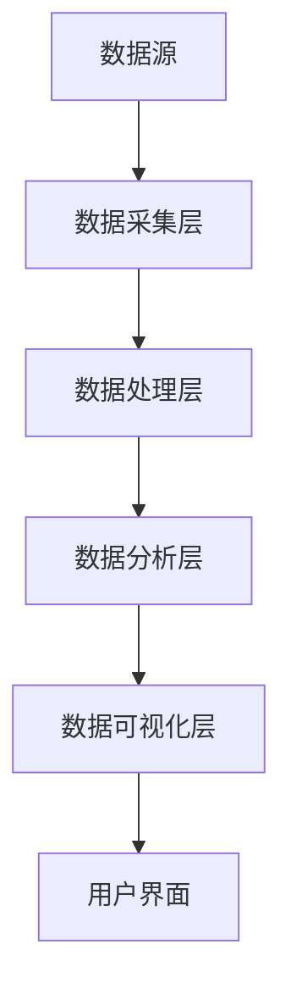

                 


# 金融大数据实时处理与分析平台

> 关键词：金融大数据、实时处理、数据分析、系统架构、Flink、Kafka、机器学习

> 摘要：本文深入探讨了金融大数据实时处理与分析平台的设计与实现，从背景介绍、核心技术、系统架构到项目实战，全面解析了如何利用大数据技术解决金融领域的实时数据分析问题。通过详细的技术分析和代码示例，本文为读者提供了一个从理论到实践的完整指南。

---

## 第一部分: 金融大数据的背景与挑战

### 第1章: 金融大数据的现状与发展趋势

#### 1.1 金融大数据的现状与发展趋势

- **1.1.1 金融行业数据的特点与挑战**
  - 数据量大：金融行业每天产生的交易数据、市场数据等海量信息。
  - 数据类型多样：包括结构化数据（如股票价格）和非结构化数据（如新闻文本）。
  - 数据生成速度快：实时交易数据需要快速处理和分析。
  - 数据价值密度高：数据背后隐藏着投资机会和风险。

- **1.1.2 大数据技术在金融领域的应用现状**
  - 数据存储：利用分布式存储系统（如Hadoop、Hive）处理海量数据。
  - 数据分析：通过机器学习和深度学习算法进行风险控制和投资决策。
  - 数据可视化：利用工具（如Tableau）将分析结果以直观的方式呈现。

- **1.1.3 实时数据分析的重要性**
  - 实时数据分析可以帮助金融机构快速响应市场变化，例如实时监控交易异常、及时发现欺诈行为。
  - 在股票交易中，实时数据分析可以提供实时市场趋势，帮助投资者做出决策。

#### 1.2 金融大数据的典型应用场景

- **1.2.1 金融风险控制**
  - 利用实时数据分析技术，监控市场波动，识别潜在风险，帮助机构进行风险评估和管理。

- **1.2.2 股票交易与市场分析**
  - 实时分析股票价格、成交量等数据，预测市场趋势，辅助交易决策。

- **1.2.3 信用评估与欺诈检测**
  - 利用实时数据分析技术，评估客户的信用风险，检测欺诈行为。

#### 1.3 本章小结

- 本章介绍了金融大数据的现状、特点以及实时数据分析的重要性。通过分析典型应用场景，读者可以理解金融大数据在实际应用中的价值。

---

## 第二部分: 金融大数据实时处理的核心技术

### 第2章: 大数据实时处理的技术基础

#### 2.1 实时数据处理的基本概念

- **2.1.1 实时处理与批量处理的对比**
  - 实时处理：数据生成后立即进行处理，响应速度快。
  - 批量处理：将数据累积到一定量后再进行处理，适合历史数据分析。

- **2.1.2 流数据与批数据的区分**
  - 流数据：实时生成并持续流动的数据，如股票交易数据。
  - 批数据：批量生成的数据，如每天的交易记录。

- **2.1.3 实时处理的性能要求**
  - 处理速度：需要在数据生成后几秒内完成处理。
  - 处理能力：能够处理每秒数百万条数据。

#### 2.2 分布式计算框架简介

- **2.2.1 MapReduce与Spark的对比**
  - MapReduce：适合批处理，但在实时处理中效率较低。
  - Spark：支持流处理和批处理，适合实时数据分析。

- **2.2.2 Apache Flink的核心原理**
  - Flink是一个分布式流处理框架，支持事件时间、处理时间和摄入时间等多种时间语义。
  - 核心原理包括事件驱动的处理机制和状态管理。

- **2.2.3 Apache Kafka在实时处理中的作用**
  - Kafka是一个分布式流数据处理平台，常用于实时数据的收集和传输。
  - Kafka的生产者-消费者模式确保了数据的高效传输。

#### 2.3 数据流处理的数学模型

- **2.3.1 数据流的定义与特征**
  - 数据流是由事件组成的时间序列，每个事件包含时间戳和数据内容。
  - 数据流的特征包括无限性、实时性和动态性。

- **2.3.2 数据流处理的数学表达式**
  - 使用滑动窗口处理数据流，例如时间窗口、会话窗口等。
  - 数据流的处理可以用数学公式表示，例如：$f(t) = \sum_{i=1}^{n} w_i x_i$，其中$w_i$是权重，$x_i$是输入数据。

- **2.3.3 数据流处理的复杂度分析**
  - 时间复杂度：$O(n)$，其中$n$是数据量。
  - 空间复杂度：$O(m)$，其中$m$是窗口大小。

### 第3章: 金融大数据实时处理的算法原理

#### 3.1 实时流处理的算法基础

- **3.1.1 基于滑动窗口的流数据处理**
  - 使用滑动窗口技术处理实时数据流，例如计算过去五分钟内的平均值。
  - 算法实现：使用队列或环形缓冲区维护窗口数据。

- **3.1.2 分布式流处理算法的实现**
  - 在分布式系统中，每个节点处理一部分数据流，最终汇总结果。
  - 使用Flink的分布式流处理算法实现。

- **3.1.3 实时流处理的优化策略**
  - 状态压缩：减少存储的中间状态数据。
  - 并行处理：利用多核处理器提高处理速度。

#### 3.2 金融数据分析的数学模型

- **3.2.1 时间序列分析的数学模型**
  - 使用ARIMA模型进行时间序列预测。
  - ARIMA模型公式：$ARIMA(p, d, q)$，其中$p$是自回归阶数，$d$是差分阶数，$q$是移动平均阶数。

- **3.2.2 金融数据预测的回归模型**
  - 使用线性回归模型预测股票价格。
  - 线性回归公式：$y = \beta_0 + \beta_1 x + \epsilon$。

- **3.2.3 聚类分析在金融数据中的应用**
  - 使用K-means算法将客户分成不同的信用等级。
  - K-means算法公式：$\text{argmin}_{k} \sum_{i=1}^{k} \sum_{j} (x_j - c_i)^2$，其中$c_i$是聚类中心。

#### 3.3 算法实现的代码示例

- **3.3.1 使用Flink实现实时流处理的Python代码**
  ```python
  from pyflink.datastream import StreamExecutionEnvironment
  from pyflink.table import *
  
  env = StreamExecutionEnvironment.get_execution_environment()
  table_config = TableConfig()
  tab = Table(env, table_config)
  
  # 定义输入数据源
  input_data = tab.from_path("input.txt", "text")
  
  # 定义处理逻辑
  def process(row):
      return (row.value, row.value)
  
  result = input_data.map(process)
  
  # 执行并输出结果
  result.execute()
  ```

- **3.3.2 时间序列预测的数学公式与代码实现**
  ```python
  from statsmodels.tsa.arima_model import ARIMA
  
  # 假设data是时间序列数据
  model = ARIMA(data, order=(5, 1, 0))
  model_fit = model.fit(disp=0)
  forecast = model_fit.forecast(steps=5)[0]
  ```

- **3.3.3 聚类分析的算法实现与金融数据应用**
  ```python
  from sklearn.cluster import KMeans
  
  # 假设X是特征矩阵
  kmeans = KMeans(n_clusters=3, random_state=0)
  kmeans.fit(X)
  labels = kmeans.labels_
  ```

### 第4章: 金融大数据实时分析的系统架构

#### 4.1 系统架构设计概述

- **4.1.1 系统设计的目标与原则**
  - 目标：实现金融数据的实时采集、处理和分析。
  - 原则：高可用性、可扩展性、实时性。

- **4.1.2 系统架构的分层设计**
  - 数据采集层：负责实时采集金融数据。
  - 数据处理层：对数据进行清洗、转换和计算。
  - 数据分析层：利用机器学习算法进行预测和分析。
  - 数据可视化层：将分析结果以图形化方式展示。

- **4.1.3 系统架构的可扩展性与容错性**
  - 使用分布式架构，确保系统的可扩展性。
  - 采用容错设计，确保系统的高可用性。

#### 4.2 系统功能设计

- **4.2.1 数据采集模块的设计**
  - 使用Kafka作为数据采集工具，实时采集股票价格、交易记录等数据。
  - 数据采集流程：生产者将数据发送到Kafka主题，消费者从主题中消费数据。

- **4.2.2 数据处理模块的实现**
  - 使用Flink进行实时数据处理，计算滑动窗口内的指标，如平均值、最大值。
  - 数据处理逻辑：对每条数据进行解析、转换和计算。

- **4.2.3 数据分析模块的功能**
  - 使用机器学习算法对实时数据进行预测和分析，如股票价格预测、风险评估。
  - 数据分析结果用于指导投资决策。

- **4.2.4 数据可视化模块的设计**
  - 使用Dash或Plotly进行数据可视化，将分析结果以图表形式展示。
  - 可视化界面包括实时监控仪表盘、历史数据趋势图等。

#### 4.3 系统架构的Mermaid图



---

## 第三部分: 项目实战

### 第5章: 项目实战与案例分析

#### 5.1 环境安装与配置

- 安装Flink：`pip install pyflink`
- 安装Kafka：`brew install kafka`
- 安装机器学习库：`pip install scikit-learn`

#### 5.2 系统核心实现源代码

- **数据采集模块**
  ```python
  from kafka import KafkaProducer
  
  producer = KafkaProducer(bootstrap_servers='localhost:9092')
  for data in data_stream:
      producer.send('finance_data', value=data)
  ```

- **数据处理模块**
  ```python
  from pyflink.datastream import StreamExecutionEnvironment
  
  env = StreamExecutionEnvironment.get_execution_environment()
  input = env.from_source(...)
  processed = input.map(lambda x: x * 2)
  processed.execute()
  ```

- **数据分析模块**
  ```python
  from statsmodels.tsa.arima_model import ARIMA
  
  data = get_real_time_data()
  model = ARIMA(data, order=(5, 1, 0))
  forecast = model.forecast(steps=10)
  ```

- **数据可视化模块**
  ```python
  import plotly.express as px
  
  df = get_forecast_data()
  fig = px.line(df, x='time', y='forecast_price')
  fig.show()
  ```

#### 5.3 项目小结

- 本章通过一个具体的项目实战，展示了如何利用Flink、Kafka和机器学习算法构建一个金融大数据实时处理与分析平台。通过实际的代码实现和案例分析，读者可以更好地理解理论知识。

---

## 第四部分: 总结与展望

### 第6章: 总结与展望

#### 6.1 总结

- 本文详细介绍了金融大数据实时处理与分析平台的设计与实现，从背景介绍、核心技术到系统架构，再到项目实战，全面解析了实时数据分析的关键点。
- 通过本文的学习，读者可以掌握如何利用大数据技术解决金融领域的实时数据分析问题。

#### 6.2 展望

- 随着人工智能和大数据技术的不断发展，金融大数据实时处理与分析平台将更加智能化和高效化。
- 未来，可以进一步研究如何利用深度学习技术进行实时数据分析，提升预测的准确性和实时性。

---

## 参考文献

- 《大数据技术与应用》
- Apache Flink官方文档
- Apache Kafka官方文档
- 《时间序列分析与应用》
- 《机器学习实战》

---

作者：AI天才研究院/AI Genius Institute & 禅与计算机程序设计艺术 /Zen And The Art of Computer Programming

