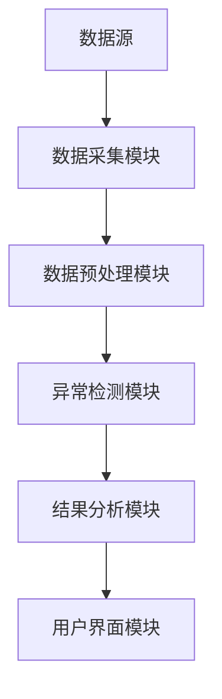
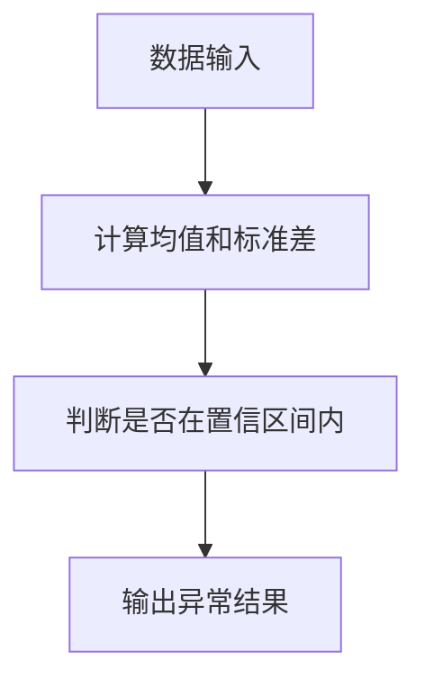

                 


# 《金融大数据实时异常检测平台》

## 关键词：金融大数据，实时异常检测，统计方法，机器学习，系统架构

## 摘要：本文详细介绍了金融大数据实时异常检测平台的建设背景、核心概念、算法原理、系统架构及其实现。通过分析异常检测的典型场景和解决方法，探讨了基于统计、机器学习和深度学习的算法优劣，结合系统架构设计和项目实战，为金融领域的实时异常检测提供了系统的解决方案。

---

## 正文

---

## 第一部分: 金融大数据实时异常检测平台背景与概述

### 第1章: 金融大数据实时异常检测概述

#### 1.1 问题背景与重要性

金融数据的特点包括高频率、高价值、高波动性等，这些特点使得金融大数据的实时处理和分析变得尤为重要。金融领域的异常检测涉及欺诈检测、交易监控、市场风险预警等多个方面，其重要性体现在以下几点：

1. **欺诈检测**：及时发现异常交易行为，防止资金损失。
2. **交易监控**：监控市场行为，预防操纵市场等违法行为。
3. **风险管理**：实时预警潜在的市场风险，帮助机构做出及时决策。

#### 1.2 问题描述与目标

在金融交易中，异常行为可能包括异常的交易量、价格波动、资金流动等。实时异常检测的目标是快速识别这些异常行为，从而在第一时间采取措施，防止损失扩大。常见的异常检测场景包括：

1. **交易欺诈**：检测异常交易行为，识别潜在的欺诈交易。
2. **市场操纵**：监控市场行为，识别可能的市场操纵行为。
3. **风险预警**：实时监控市场波动，预警潜在的系统性风险。

#### 1.3 问题解决与技术路线

为了解决金融大数据实时异常检测的问题，通常采用以下技术路线：

1. **数据采集与预处理**：实时采集金融数据，并进行清洗、转换等预处理。
2. **异常检测算法**：选择合适的算法（如统计方法、机器学习、深度学习）进行异常检测。
3. **实时处理技术**：采用流处理技术，确保数据的实时性。
4. **结果分析与反馈**：对检测结果进行分析，提供决策支持。

#### 1.4 边界与外延

金融大数据实时异常检测的边界在于其处理的实时性和数据的范围。平台需要处理大量的实时数据，并在极短的时间内完成检测。外延则涉及与其他金融系统的集成，如交易系统、风控系统等。

---

### 第2章: 异常检测核心概念与原理

#### 2.1 异常检测算法原理

异常检测算法可以分为以下几类：

1. **基于统计的方法**：如均值标准差法、Grubbs检验等，适用于数据分布已知的情况。
2. **基于机器学习的方法**：如Isolation Forest、One-Class SVM等，适用于复杂数据分布。
3. **基于深度学习的方法**：如Autoencoder、GAN等，适用于高维数据和复杂模式识别。

#### 2.2 核心概念对比分析

以下是几种常见异常检测方法的对比：

| 方法           | 优缺点                           | 适用场景                     |
|----------------|----------------------------------|------------------------------|
| 基于统计方法   | 实现简单，计算高效；但对数据分布敏感 | 数据分布已知的情况           |
| 基于机器学习   | 模型表达能力强；但需要大量数据     | 数据分布复杂的情况           |
| 基于深度学习   | 能处理高维数据；但计算复杂度高     | 高维数据和复杂模式的情况     |

#### 2.3 系统架构与实体关系

以下是系统架构的实体关系图：



---

### 第3章: 基于统计的异常检测算法

#### 3.1 算法原理与流程

基于统计的异常检测方法以数据的统计特性为基础，常见的方法包括：

1. **均值标准差法**：通过计算数据的均值和标准差，判断数据点是否落在一定范围之外。
2. **Grubbs检验**：用于检测异常值，基于t分布的假设。

流程图如下：



#### 3.2 算法实现与代码解读

以下是均值标准差法的Python实现：

```python
import numpy as np

def detect_anomaly(data, confidence=0.95):
    mean = np.mean(data)
    std = np.std(data)
    lower = mean - std * np.sqrt((n-1)/(n*(1-confidence)))
    upper = mean + std * np.sqrt((n-1)/(n*(1-confidence)))
    for point in data:
        if point < lower or point > upper:
            print(f"异常值：{point}")
```

#### 3.3 算法优缺点分析

- **优点**：实现简单，计算高效。
- **缺点**：对数据分布敏感，假设数据服从正态分布。

---

## 第二部分: 核心概念与系统架构

### 第2章: 异常检测核心概念与原理

#### 2.1 异常检测算法原理

- **基于统计的方法**：适用于数据分布已知的情况。
- **基于机器学习的方法**：适用于复杂数据分布。
- **基于深度学习的方法**：适用于高维数据和复杂模式识别。

---

## 第三部分: 项目实战

### 第3章: 环境安装与代码实现

#### 3.1 环境安装

安装必要的Python库：

```bash
pip install numpy pandas scikit-learn pyod
```

#### 3.2 核心代码实现

以下是基于统计方法的异常检测代码：

```python
import numpy as np
from sklearn.ensemble import IsolationForest

def detect_anomaly(data, n_estimators=100):
    model = IsolationForest(n_estimators=n_estimators)
    model.fit(data)
    anomalies = model.predict(data) == -1
    return anomalies
```

---

## 第四部分: 最佳实践

### 第4章: 项目总结与建议

#### 4.1 项目小结

通过本项目的实施，我们掌握了金融大数据实时异常检测的核心技术，包括数据预处理、算法选择和系统架构设计。实践证明，基于统计的异常检测方法在实际应用中具有较高的效率和准确性。

#### 4.2 注意事项

- **数据预处理**：确保数据的完整性和准确性。
- **算法选择**：根据实际场景选择合适的算法。
- **性能优化**：优化算法的计算效率，确保实时性。

---

## 作者

作者：AI天才研究院/AI Genius Institute & 禅与计算机程序设计艺术 /Zen And The Art of Computer Programming

---

# 结语

《金融大数据实时异常检测平台》通过系统的分析和实践，为金融领域的实时异常检测提供了全面的解决方案。从算法选择到系统架构设计，再到项目实战，本文为读者提供了丰富的知识和实践指导。

