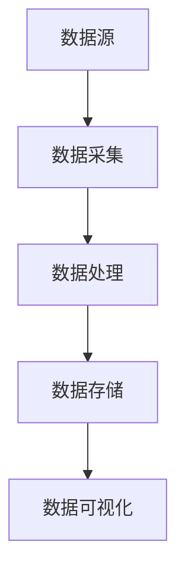
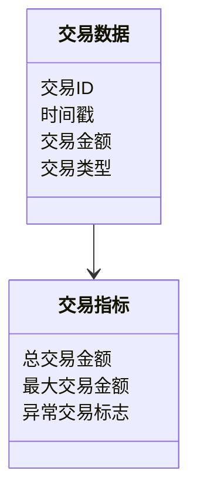

                 


# 金融大数据实时流处理架构设计

> 关键词：金融大数据、实时流处理、架构设计、流计算、系统架构

> 摘要：本文深入探讨金融大数据实时流处理的架构设计，涵盖背景、核心概念、算法原理、系统架构、项目实战及最佳实践，帮助读者全面理解实时流处理在金融领域的应用。

---

## 第一部分：金融大数据实时流处理的背景

### 第1章：金融大数据与实时流处理的背景

#### 1.1 金融大数据的定义与特点

##### 1.1.1 金融大数据的基本概念
金融大数据是指在金融行业产生的海量数据，包括交易数据、市场数据、客户数据等。这些数据具有高增长性和多样性，需要高效处理和分析。

##### 1.1.2 金融大数据的核心特点
- **高实时性**：金融市场的数据变化迅速，需要实时处理。
- **多样性**：涵盖结构化和非结构化数据。
- **高价值**：数据驱动决策，影响投资和风险管理。

##### 1.1.3 金融大数据的应用场景
- 交易监控
- 风险管理
- 投资决策
- 客户画像

#### 1.2 实时流处理的定义与特点

##### 1.2.1 实时流处理的基本概念
实时流处理是对持续不断的数据流进行实时处理，确保快速响应和决策。

##### 1.2.2 实时流处理的核心优势
- **低延迟**：快速处理和响应。
- **高吞吐量**：处理大量数据。
- **实时反馈**：及时获取结果。

##### 1.2.3 实时流处理的挑战与限制
- 数据量大
- 处理复杂
- 系统容错性要求高

#### 1.3 金融大数据实时流处理的应用价值

##### 1.3.1 提高金融交易的实时性
实时处理确保交易的及时性和准确性。

##### 1.3.2 支持金融风险的实时监控
及时发现和应对潜在风险。

##### 1.3.3 优化金融决策的效率
基于实时数据做出更明智的决策。

#### 1.4 本章小结
本章介绍了金融大数据和实时流处理的背景，强调了实时流处理在金融领域的重要性。

---

## 第二部分：金融大数据实时流处理的核心概念与联系

### 第2章：实时流处理的核心原理

#### 2.1 数据流模型

##### 2.1.1 数据流的基本概念
数据流是持续不断的数据序列，包含时间戳和事件信息。

##### 2.1.2 数据流的分类与特点
- **批量流**：批量处理。
- **持续流**：实时处理。
- **无界流**：无限数据流。

##### 2.1.3 数据流的处理模型
- **事件时间**：数据产生的时间。
- **处理时间**：处理操作的时间。
- **计算模型**：处理逻辑的模型。

#### 2.2 处理模型与计算模型

##### 2.2.1 处理模型的基本原理
处理模型定义了数据的处理逻辑，包括过滤、聚合、计算等操作。

##### 2.2.2 计算模型的核心要素
- **状态管理**：维护处理过程中的状态。
- **事件处理**：处理单个事件或批量事件。
- **窗口处理**：处理时间窗口内的数据。

##### 2.2.3 处理模型与计算模型的对比
| 对比维度 | 处理模型 | 计算模型 |
|----------|----------|----------|
| 核心任务 | 数据处理 | 数据计算 |
| 输入形式 | 数据流   | 数据流   |
| 输出形式 | 处理结果 | 计算结果 |

#### 2.3 实时流处理的实体关系图



#### 2.4 本章小结
本章详细讲解了实时流处理的核心概念和数据流模型，为后续章节打下基础。

---

## 第三部分：实时流处理的算法原理

### 第3章：流计算模型的数学基础

#### 3.1 流计算模型的定义

##### 3.1.1 流计算的基本概念
流计算是对数据流进行实时计算，输出结果。

##### 3.1.2 流计算的核心思想
基于事件时间窗口，持续计算和更新结果。

##### 3.1.3 流计算的数学模型

###### 3.1.3.1 滑动窗口模型
$$\text{窗口大小} = n$$
$$\text{窗口时间} = t$$

###### 3.1.3.2 累积和模型
$$\text{结果} = \sum_{i=1}^{n} \text{事件}_i$$

##### 3.1.4 流计算的实现步骤
1. 数据采集
2. 数据处理
3. 数据计算
4. 数据输出

#### 3.2 流计算模型的实现

##### 3.2.1 实时流处理的Python代码示例

```python
from apache.flink import StreamExecutionEnvironment
from apache.flink.api.common.functions import ReduceFunction

class MaxReduce(ReduceFunction):
    def reduce(self, value1, value2):
        return max(value1, value2)

def main():
    env = StreamExecutionEnvironment.get_execution_environment()
    env.set_parallelism(1)
    source = env.add_source(...)
    sink = source.reduce(MaxReduce())
    sink.print()

if __name__ == "__main__":
    main()
```

#### 3.3 流计算模型的应用

##### 3.3.1 金融交易中的实时统计

###### 3.3.1.1 示例：实时股价计算
$$\text{实时股价} = \text{当前股价}$$

##### 3.3.2 实时风险评估

###### 3.3.2.1 示例：信用评分计算
$$\text{信用评分} = \sum \text{交易记录}$$

#### 3.4 本章小结
本章通过数学模型和代码示例，详细讲解了流计算模型的实现和应用。

---

## 第四部分：系统分析与架构设计

### 第4章：金融大数据实时流处理系统架构设计

#### 4.1 系统分析

##### 4.1.1 问题场景介绍
金融交易实时监控系统需要实时处理大量交易数据，及时发现异常交易。

##### 4.1.2 系统功能需求
- 数据采集：实时采集交易数据。
- 数据处理：计算交易指标。
- 数据存储：存储处理结果。
- 数据可视化：展示实时数据。

#### 4.2 系统架构设计

##### 4.2.1 领域模型设计



##### 4.2.2 系统架构设计

```mermaid
graph TD
    A[交易发生] --> B[数据采集]
    B --> C[数据处理]
    C --> D[数据存储]
    C --> E[数据可视化]
```



#### 4.3 本章小结
本章通过系统分析和架构设计，展示了金融大数据实时流处理系统的整体结构。

---

## 第五部分：项目实战

### 第5章：金融交易实时监控系统的实现

#### 5.1 环境搭建

##### 5.1.1 技术选型
- 数据采集：Flume
- 数据处理：Flink
- 数据存储：HBase
- 数据可视化：Grafana

##### 5.1.2 环境配置
- 安装Flume、Flink、HBase、Grafana。

#### 5.2 核心代码实现

##### 5.2.1 数据采集代码

```python
# Flume配置文件
source(type = HTTP)
    host = localhost
    port = 8080
```

##### 5.2.2 数据处理代码

```python
from flink import StreamExecutionEnvironment
from flink.api.common.functions import ReduceFunction

class MaxReduce(ReduceFunction):
    def reduce(self, value1, value2):
        return max(value1, value2)

def main():
    env = StreamExecutionEnvironment.get_execution_environment()
    env.set_parallelism(1)
    source = env.add_source(...)
    sink = source.reduce(MaxReduce())
    sink.print()

if __name__ == "__main__":
    main()
```

##### 5.2.3 数据存储代码

```python
# HBase表结构
create table transaction (id int, timestamp timestamp, amount double, type string)；
```

##### 5.2.4 数据可视化代码

```python
# Grafana查询
SELECT * FROM transaction ORDER BY timestamp DESC LIMIT 10；
```

#### 5.3 案例分析与优化

##### 5.3.1 系统性能优化
- 使用分布式架构。
- 优化数据处理逻辑。

##### 5.3.2 系统容错性优化
- 数据冗余存储。
- 定期数据备份。

#### 5.4 项目小结
本章通过实际案例，展示了金融交易实时监控系统的实现过程。

---

## 第六部分：最佳实践与总结

### 第6章：金融大数据实时流处理的注意事项

#### 6.1 系统性能优化

##### 6.1.1 并行处理
通过分布式计算提高处理效率。

##### 6.1.2 本地优化
优化代码逻辑，减少计算开销。

#### 6.2 系统容错性优化

##### 6.2.1 数据冗余
存储多份数据，防止数据丢失。

##### 6.2.2 容错机制
实现断点续传和错误重试。

#### 6.3 系统安全性优化

##### 6.3.1 数据加密
保护敏感数据。

##### 6.3.2 权限控制
限制数据访问权限。

#### 6.4 系统扩展性优化

##### 6.4.1 弹性扩展
根据负载自动调整资源。

##### 6.4.2 动态配置
支持动态修改系统配置。

### 第7章：总结与展望

#### 7.1 本章总结
本文详细讲解了金融大数据实时流处理的架构设计，包括背景、核心概念、算法原理、系统架构和项目实战。

#### 7.2 未来展望
随着技术的发展，实时流处理将更加智能化和高效化。

---

## 作者：AI天才研究院 & 禅与计算机程序设计艺术

---

**本文通过详细分析金融大数据实时流处理的架构设计，为读者提供了全面的理论和技术指导，帮助读者在金融领域中更好地应用实时流处理技术。**

