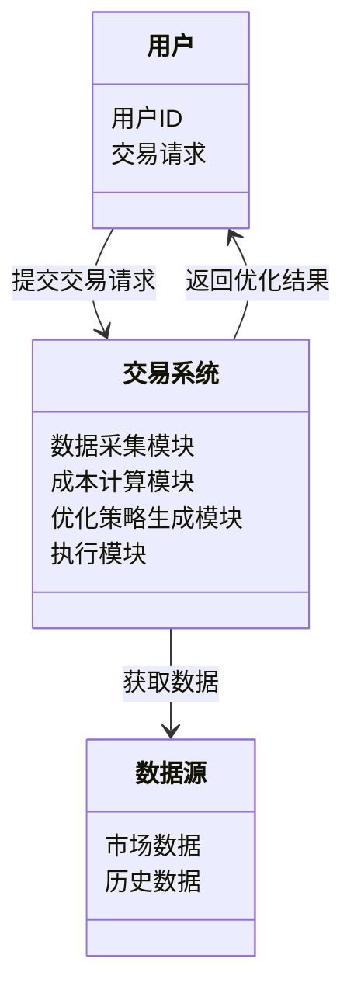
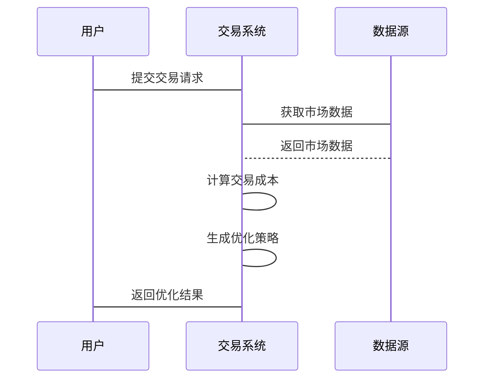

                 


# 金融市场交易成本优化系统

> 关键词：金融市场，交易成本，优化系统，算法，系统设计，项目实战

> 摘要：金融市场交易成本优化系统通过分析和优化交易成本的构成，结合先进的算法和系统设计，提供了一套降低交易成本、提高投资效率的解决方案。本文详细介绍了交易成本的构成、优化系统的核心概念、系统架构设计、优化算法原理、项目实战案例以及优化建议，帮助读者全面理解和掌握如何在金融市场中优化交易成本。

---

# 第1章: 金融市场交易成本优化系统背景

## 1.1 问题背景与描述
### 1.1.1 交易成本的定义与构成
交易成本是指在金融交易过程中产生的各种费用，包括佣金、手续费、市场冲击、流动性成本等。这些成本直接影响投资收益，因此优化交易成本是投资者和机构的重要目标。

### 1.1.2 问题描述
在金融市场中，交易成本高昂或不合理可能导致投资收益下降，甚至影响投资决策的正确性。优化交易成本需要考虑多个因素，包括交易规模、频率、市场结构等。

### 1.1.3 问题解决
通过分析交易成本的构成，结合数学优化算法，设计一个能够实时计算和优化交易成本的系统，帮助投资者降低成本，提高收益。

### 1.1.4 边界与外延
优化交易成本的系统需要在保证交易安全和合规的前提下，尽可能降低成本，同时考虑到市场波动和风险因素。

## 1.2 核心概念与结构
### 1.2.1 核心概念
- 交易成本计算模型
- 优化算法
- 系统架构设计

### 1.2.2 概念结构与核心要素
- 数据输入：市场数据、交易订单、历史交易记录
- 核心功能：成本计算、优化策略生成、执行与监控

---

# 第2章: 交易成本构成分析

## 2.1 显性交易成本
### 2.1.1 佣金与手续费
不同交易品种和交易平台收取的佣金和手续费不同，是显性成本的重要组成部分。

### 2.1.2 市场冲击与流动性成本
大额交易可能引起市场价格波动，增加流动性成本。

### 2.1.3 结算与交割成本
包括结算费、交割费等，这些成本在交易后产生。

## 2.2 隐性交易成本
### 2.2.1 时间成本
等待订单成交的时间越长，机会成本越高。

### 2.2.2 机会成本
由于资金被用于交易，可能错失其他投资机会的成本。

### 2.2.3 风险成本
交易成本可能增加投资组合的风险暴露。

## 2.3 影响交易成本的因素
### 2.3.1 市场结构
市场的流动性、深度和交易规则直接影响交易成本。

### 2.3.2 交易规模与频率
大额交易和高频交易可能增加市场冲击和交易成本。

### 2.3.3 交易策略
不同的策略可能导致不同的交易成本，例如高频交易成本较高，而长期投资成本较低。

---

# 第3章: 交易成本优化系统的核心概念

## 3.1 优化系统的目标与设计原则
### 3.1.1 最小化交易成本
通过优化算法，找到最优的交易策略，降低显性和隐性成本。

### 3.1.2 平衡流动性与成本
在保证流动性需求的同时，尽可能降低交易成本。

### 3.1.3 风险与收益的权衡
优化交易成本的同时，需要考虑投资组合的风险和收益平衡。

## 3.2 优化系统的功能模块
### 3.2.1 数据采集与处理模块
负责收集市场数据、交易订单等信息，并进行预处理。

### 3.2.2 成本计算与分析模块
基于数据计算显性和隐性交易成本，分析成本构成。

### 3.2.3 优化策略生成模块
使用优化算法生成最优交易策略，降低交易成本。

### 3.2.4 执行与监控模块
执行优化后的交易策略，并实时监控交易成本和风险。

## 3.3 系统的核心要素与ER实体关系图
```
```mermaid
erDiagram
    actor 用户
    actor 交易系统
    actor 数据源
    database 交易数据
    database 成本计算模型
    database 优化策略库
    用户 --> 交易系统: 提交交易请求
    交易系统 --> 数据源: 获取市场数据
    交易系统 --> 成本计算模型: 计算交易成本
    交易系统 --> 优化策略库: 生成优化策略
    交易系统 --> 用户: 返回优化结果
```

---

# 第4章: 系统分析与架构设计

## 4.1 系统功能设计
### 4.1.1 领域模型
```


### 4.1.2 系统架构设计
```


### 4.1.3 接口设计
- 用户界面与交易系统接口
- 交易系统与数据源接口
- 优化策略生成模块与执行模块接口

### 4.1.4 交互流程
```


---

# 第5章: 优化算法原理

## 5.1 算法选择与原理
### 5.1.1 遗传算法
- 基于自然选择和遗传机制，通过迭代优化交易策略。

### 5.1.2 粒子群优化算法
- 基于群体智能，通过粒子运动寻找最优解。

## 5.2 数学模型与公式
### 5.2.1 交易成本最小化模型
$$ \text{目标函数} = \sum_{i=1}^{n} c_i \cdot x_i $$
其中，$c_i$为第$i$种交易的成本，$x_i$为交易量。

### 5.2.2 优化约束条件
$$ \sum_{i=1}^{n} x_i = T \quad (T \text{为总交易量}) $$
$$ 0 \leq x_i \leq x_{\text{max}} \quad (x_{\text{max}} \text{为最大交易量}) $$

## 5.3 算法实现与代码示例
```python
def genetic_algorithm(population, fitness_func, mutation_rate=0.1):
    while True:
        # 计算适应度
        fitness = [fitness_func(individual) for individual in population]
        # 选择
        selected = select(population, fitness)
        # 交叉
        crossed = crossover(selected, mutation_rate)
        # 变异
        mutated = mutate(crossed)
        # 更新种群
        population = crossed + mutated
```

---

# 第6章: 项目实战

## 6.1 环境搭建
### 6.1.1 技术选型
- 数据库：MySQL
- 语言：Python
- 框架：Django

## 6.2 核心代码实现
### 6.2.1 数据采集模块
```python
import requests

def get_market_data(api_key):
    response = requests.get(f'https://api.example.com/market-data?api_key={api_key}')
    return response.json()
```

### 6.2.2 成本计算模块
```python
def calculate_cost(data):
    cost = data['commission'] + data['market_impact']
    return cost
```

## 6.3 案例分析与优化总结
通过实际案例分析，验证系统的优化效果，并总结经验教训。

---

# 第7章: 优化与扩展

## 7.1 当前优化技术趋势
### 7.1.1 机器学习的应用
利用机器学习模型预测交易成本，优化交易策略。

### 7.1.2 分布式计算的应用
通过分布式计算提高系统的处理能力，支持更大规模的交易优化。

## 7.2 系统优化方向
### 7.2.1 算法优化
改进优化算法，提高计算效率和精度。

### 7.2.2 系统架构优化
优化系统架构，提高系统的可扩展性和可维护性。

## 7.3 未来展望
随着技术的发展，交易成本优化系统将更加智能化、自动化，帮助投资者实现更高效的交易。

---

# 附录

## 附录A: 参考文献
- 文献1：《金融交易成本分析与优化》
- 文献2：《基于遗传算法的交易成本优化研究》

## 附录B: 工具与资源
- 数据源：常用金融数据API
- 开发工具：PyCharm、Jupyter Notebook

---

# 作者：AI天才研究院 & 禅与计算机程序设计艺术

