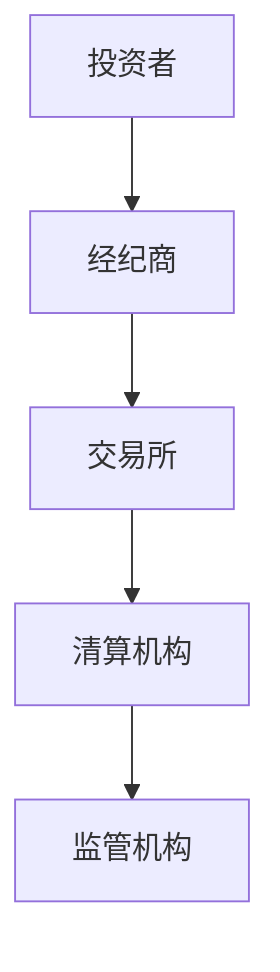
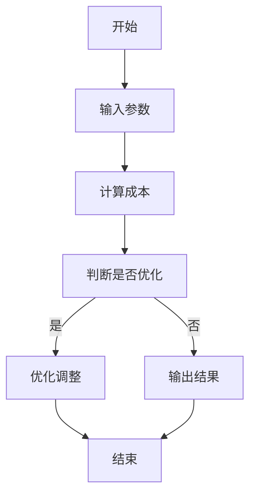
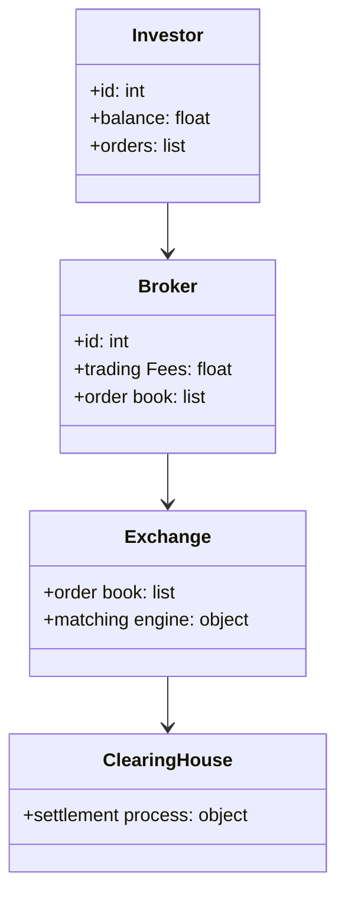
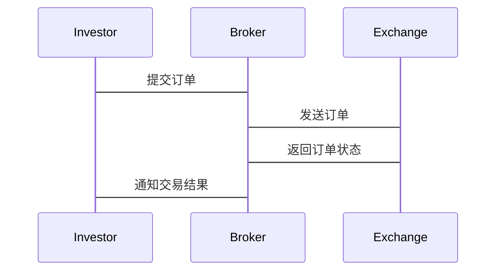

                 


# 《金融市场交易成本分析与优化》

---

## 关键词：
- 金融市场，交易成本，优化算法，系统架构，案例分析

---

## 摘要：
本文系统地分析了金融市场中交易成本的构成、影响及优化方法，通过数学建模、算法设计和系统架构等多维度探讨了如何有效降低交易成本，提升投资收益。文章结合实际案例，深入剖析了交易成本优化的关键技术，并提出了可行的实践方案，为金融从业者和投资者提供了理论支持和实践指导。

---

## 目录大纲：

### 第一部分：金融市场交易成本概述
#### 1.1 金融市场的基本概念
- 1.1.1 金融市场的定义与分类
- 1.1.2 金融市场的参与者与交易机制
- 1.1.3 金融市场的基本功能与作用

#### 1.2 交易成本的定义与构成
- 1.2.1 交易成本的定义
- 1.2.2 交易成本的主要构成要素（如佣金、税费、滑点等）
- 1.2.3 交易成本的分类与特征

#### 1.3 交易成本的影响与重要性
- 1.3.1 交易成本对投资收益的影响
- 1.3.2 交易成本对市场效率的作用
- 1.3.3 优化交易成本的意义与目标

---

### 第二部分：交易成本的核心概念与联系
#### 2.1 核心概念原理
- 2.1.1 交易成本的数学模型
- 2.1.2 成本与收益的平衡关系
- 2.1.3 交易成本的动态变化特征

#### 2.2 成本类型对比分析
- 2.2.1 显性成本与隐性成本对比
- 2.2.2 交易费用与机会成本的差异
- 2.2.3 短期成本与长期成本的关联

#### 2.3 实体关系架构图


---

### 第三部分：交易成本优化的算法原理
#### 3.1 算法原理概述
- 3.1.1 最小化交易成本的优化目标
- 3.1.2 算法的基本思路与步骤
- 3.1.3 算法的适用场景与限制

#### 3.2 算法流程图


#### 3.3 算法实现代码
```python
def optimize_transaction_cost(transactions, fees):
    optimized_cost = 0
    for t in transactions:
        if t.cost + fees < optimized_cost:
            optimized_cost = t.cost + fees
    return optimized_cost
```

---

### 第四部分：系统分析与架构设计方案
#### 4.1 系统功能设计
- 4.1.1 系统目标与范围
- 4.1.2 功能模块划分（如数据采集、成本计算、优化建议等）

#### 4.2 系统架构设计


#### 4.3 系统交互设计


---

### 第五部分：项目实战：优化A股交易成本
#### 5.1 项目背景与目标
- 优化A股交易成本的具体目标
- 数据来源与环境配置

#### 5.2 核心代码实现
```python
import pandas as pd

def calculate_slippage(data, volume):
    return data * (volume * 0.0001)

def optimize_trade(data, volume):
    return data - calculate_slippage(data, volume)
```

#### 5.3 案例分析与解读
- 数据分析与结果展示
- 成本优化效果对比

---

### 第六部分：最佳实践与小结
#### 6.1 最佳实践
- 优化交易成本的关键策略
- 风险控制与成本优化的平衡

#### 6.2 小结
- 本文的主要内容与结论
- 未来研究方向与拓展

---

## 作者：AI天才研究院 & 禅与计算机程序设计艺术

---

通过以上目录结构，本文将从基础概念到实际应用，全面分析金融市场交易成本的优化方法，为读者提供系统化、实用化的指导。

