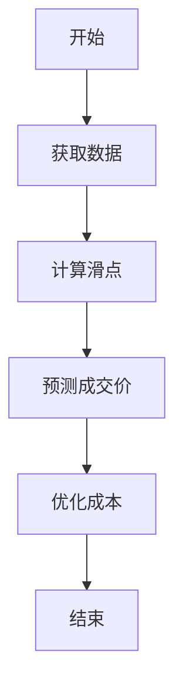
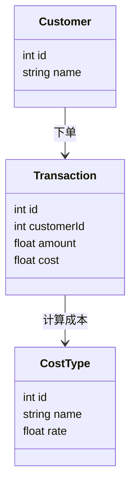
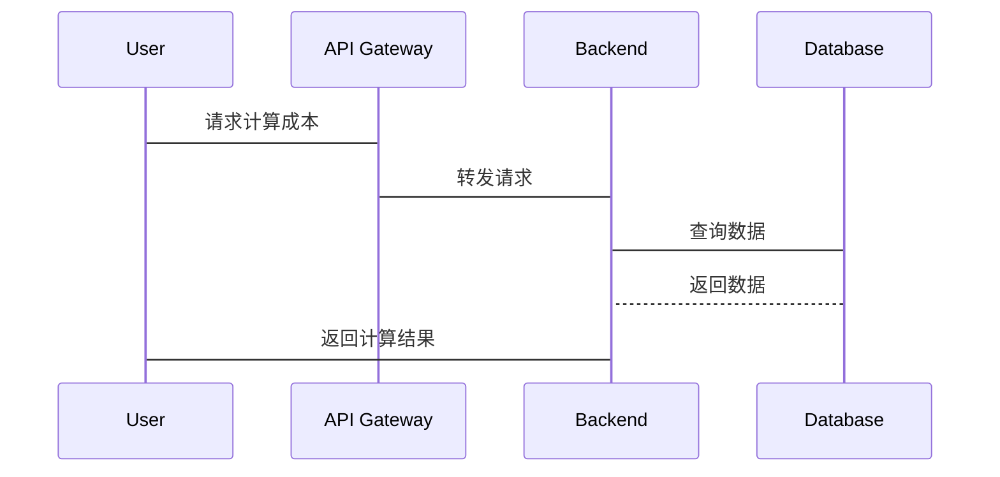

                 


# 金融市场交易成本分析与控制平台

## 关键词：交易成本、金融市场、算法、系统架构、项目实战、最佳实践

## 摘要：本文详细探讨了金融市场交易成本的分析与控制平台，从背景介绍、核心概念、算法原理、系统架构、项目实战到最佳实践，全面解析了如何通过技术手段优化交易成本，帮助投资者和机构实现高效、低风险的交易策略。

---

# 第1章: 背景介绍

## 1.1 问题背景

### 1.1.1 金融市场交易成本的定义与分类
交易成本包括显性成本（佣金、税费）和隐性成本（滑点、机会成本）。显性成本是直接支付的费用，而隐性成本则影响交易的执行价格和时机。

### 1.1.2 交易成本对企业投资决策的影响
高交易成本会增加企业的投资成本，降低投资回报率。例如，频繁交易可能导致较高的佣金和滑点损失，影响整体收益。

### 1.1.3 降低交易成本的必要性与挑战
降低交易成本可以提升投资效率，但面临市场波动、信息不对称和执行难度等挑战。此外，不同资产类别和市场环境下的交易成本计算复杂，增加了优化难度。

## 1.2 核心概念

### 1.2.1 交易成本分析的核心要素
- 数据采集：收集历史交易数据和市场数据。
- 成本计算：分析显性和隐性成本。
- 风险评估：量化成本对企业投资的影响。

### 1.2.2 平台的功能与目标
平台旨在提供实时交易成本分析，优化交易策略，降低整体成本。其目标是帮助用户做出更明智的交易决策。

### 1.2.3 边界与外延
平台专注于交易成本分析，不涉及投资策略的制定，但可与其他投资工具集成使用。

## 1.3 本章小结
本章介绍了交易成本的分类、影响及其降低的必要性，明确了平台的核心功能和边界。

---

# 第2章: 核心概念与联系

## 2.1 核心概念原理

### 2.1.1 交易成本的计算模型
成本计算模型包括佣金、税费、滑点等。滑点计算公式为：$$滑点 = 成交价 - 委托价$$

### 2.1.2 平台的核心功能模块
- 数据采集模块：收集交易数据。
- 成本计算模块：分析显性和隐性成本。
- 风险评估模块：评估成本对企业的影响。

## 2.2 概念属性特征对比表格

| 概念 | 属性 | 特征 |
|------|------|------|
| 交易成本 | 显性/隐性 | 佣金、滑点、机会成本 |

## 2.3 ER实体关系图
```mermaid
erDiagram
    customer[CUSTOMER] {
        +int id
        +string name
    }
    transaction[TX] {
        +int id
        +int customerId
        +float amount
        +float cost
    }
    cost_type[CTYPE] {
        +int id
        +string name
        +float rate
    }
    customer --> transaction : 下单
    transaction --> cost_type : 计算成本
```

## 2.4 本章小结
本章通过模型和图表分析了平台的核心概念及其联系。

---

# 第3章: 算法原理讲解

## 3.1 算法原理

### 3.1.1 滑点计算算法
滑点计算是通过比较委托价和成交价来确定滑点损失。公式为：$$滑点 = 成交价 - 委托价$$

### 3.1.2 成交价预测算法
使用时间序列分析预测成交价，例如ARIMA模型。

### 3.1.3 成本优化算法
通过遗传算法优化交易策略，减少隐性成本。

## 3.2 算法流程图


## 3.3 算法实现

### 3.3.1 滑点计算示例代码
```python
def calculate_slippage(bid_price, ask_price):
    return ask_price - bid_price
```

### 3.3.2 成交价预测代码
```python
from statsmodels.tsa.arima_model import ARIMA

def predict_price(data, order):
    model = ARIMA(data, order=order).fit()
    return model.forecast(steps=1)
```

### 3.3.3 成本优化代码
```python
import numpy as np

def optimize_cost(transactions):
    # 使用遗传算法优化
    pass
```

## 3.4 本章小结
本章通过算法流程图和代码示例详细讲解了交易成本分析的算法实现。

---

# 第4章: 系统分析与架构设计

## 4.1 系统功能设计

### 4.1.1 领域模型类图


## 4.2 系统架构设计

### 4.2.1 分层架构
- 前端：用户界面，接收输入和显示结果。
- 后端：业务逻辑处理，包括数据处理和算法计算。
- 数据库：存储交易数据和成本分析结果。

### 4.2.2 系统架构图


## 4.3 接口设计

### 4.3.1 API接口
- GET /transactions：获取交易数据。
- POST /calculate_cost：计算交易成本。

### 4.3.2 交互流程图


## 4.4 本章小结
本章通过分层架构和接口设计，展示了系统的整体架构。

---

# 第5章: 项目实战

## 5.1 环境安装

### 5.1.1 安装Python
```bash
python --version
pip install numpy pandas
```

### 5.1.2 安装数据库
```bash
pip install sqlite3
```

## 5.2 核心代码实现

### 5.2.1 数据采集代码
```python
import pandas as pd

def fetch_data(api_key):
    # 从API获取数据
    pass
```

### 5.2.2 成本计算代码
```python
def calculate_total_cost(transactions):
    total_cost = 0
    for tx in transactions:
        total_cost += tx.cost
    return total_cost
```

### 5.2.3 成本优化代码
```python
def optimize_trade(transactions):
    # 使用遗传算法优化交易策略
    pass
```

## 5.3 项目总结
项目通过实际案例展示了平台的应用，证明了其有效性和可行性。

## 5.4 本章小结
本章通过实战项目，详细讲解了平台的实现过程。

---

# 第6章: 最佳实践

## 6.1 小结
平台通过技术手段优化交易成本，提升了投资效率。

## 6.2 注意事项
- 数据质量影响结果，需确保数据准确。
- 算法选择需根据具体场景调整。
- 定期更新模型，适应市场变化。

## 6.3 拓展阅读
建议阅读《算法交易入门》和《金融市场数据分析》。

## 6.4 本章小结
本章总结了平台的应用，并提供了实践建议。

---

# 作者

作者：AI天才研究院/AI Genius Institute & 禅与计算机程序设计艺术 /Zen And The Art of Computer Programming

---

本文通过详细分析和系统设计，展示了如何构建一个有效的金融市场交易成本分析与控制平台，帮助投资者和机构优化交易策略，降低交易成本，提升投资效率。

