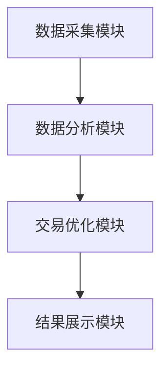
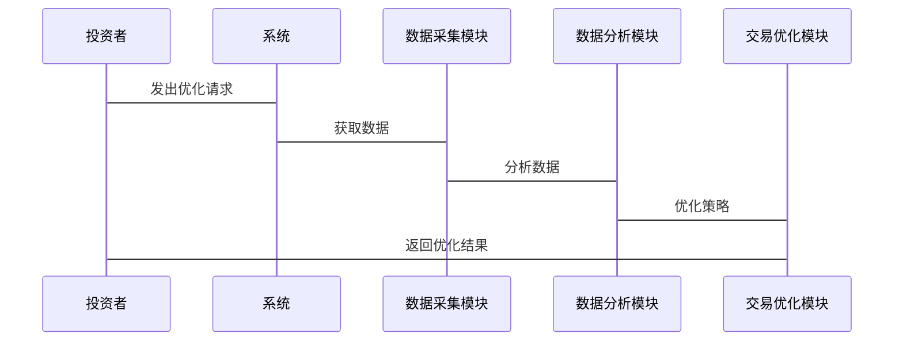

                 


# 金融市场交易成本分析与策略优化平台

## 关键词：金融市场、交易成本、策略优化、算法、系统架构

## 摘要：本文详细探讨了金融市场交易成本分析与策略优化平台的构建，从交易成本的定义、分类及其对投资收益的影响入手，结合遗传算法、粒子群优化算法等优化方法，提出了一个完整的系统架构设计方案，并通过实际案例展示了如何在金融交易中优化交易成本，提升投资收益。

---

## 第1章: 金融市场交易成本分析概述

### 1.1 金融市场的基本概念

#### 1.1.1 金融市场的定义与分类

金融市场是资金流动和金融资产交易的场所，按交易对象可分为货币市场、资本市场、外汇市场等。金融市场参与者包括投资者、金融机构、企业等。

#### 1.1.2 交易成本的定义与构成

交易成本是指在金融交易过程中产生的所有费用，包括佣金、税费、过户费、市场冲击等。显性成本（如佣金）和隐性成本（如机会成本）是常见的分类。

#### 1.1.3 交易成本对投资收益的影响

交易成本直接影响投资收益，过高成本会侵蚀收益。优化交易成本是提升投资绩效的重要手段。

### 1.2 交易成本分析的背景与意义

#### 1.2.1 金融市场中的交易成本问题

随着市场竞争加剧，降低交易成本成为投资者的重要课题。

#### 1.2.2 交易成本分析的重要性

通过分析交易成本，可以制定更合理的交易策略，提高投资回报。

#### 1.2.3 交易成本优化的必要性

优化交易成本是提升投资效率、降低风险的重要途径。

### 1.3 本章小结

本章介绍了金融市场的基本概念、交易成本的定义与构成，以及交易成本分析的背景与意义。

---

## 第2章: 交易成本分析的核心概念

### 2.1 交易成本分析的原理

#### 2.1.1 交易成本的分类与特征

- 显性成本：直接可量化的费用，如佣金。
- 隐性成本：间接费用，如市场冲击。

#### 2.1.2 交易成本与市场效率的关系

交易成本过高会降低市场流动性，影响市场效率。

#### 2.1.3 交易成本的量化方法

通过数据分析和建模，量化交易成本的影响。

### 2.2 交易成本分析的数学模型

#### 2.2.1 交易成本的数学表达式

$$\text{交易成本} = \text{显性成本} + \text{隐性成本}$$

#### 2.2.2 交易成本与收益的关系模型

$$\text{净收益} = \text{总收益} - \text{交易成本}$$

#### 2.2.3 交易成本优化的目标函数

$$\min C = \sum_{i=1}^{n} c_i$$

其中，$c_i$表示第$i$笔交易的成本。

### 2.3 交易成本分析的ER实体关系图

```mermaid
erDiagram
    actor 投资者 {
        <属性> 资金
        <属性> 交易目标
    }
    actor 交易系统 {
        <属性> 交易订单
        <属性> 交易时间
    }
    actor 市场数据 {
        <属性> 市场价格
        <属性> 成交量
    }
    投资者 --> 交易系统 : 发出交易指令
    交易系统 --> 市场数据 : 获取市场数据
    交易系统 --> 投资者 : 返回交易结果
```

### 2.4 本章小结

本章详细讲解了交易成本的分类、量化方法以及数学模型，并通过ER实体关系图展示了交易成本分析的系统架构。

---

## 第3章: 交易成本优化算法概述

### 3.1 遗传算法在交易成本优化中的应用

#### 3.1.1 遗传算法的基本原理

遗传算法模拟生物进化过程，通过选择、交叉和变异操作优化解。

#### 3.1.2 遗传算法在交易成本优化中的步骤

1. 初始化种群。
2. 计算适应度。
3. 选择、交叉、变异。
4. 重复迭代。

#### 3.1.3 遗传算法的优缺点分析

- 优点：全局搜索能力强。
- 缺点：计算复杂度高。

### 3.2 粒子群优化算法在交易成本优化中的应用

#### 3.2.1 粒子群优化算法的基本原理

粒子群优化算法通过模拟鸟群觅食行为，寻找最优解。

#### 3.2.2 粒子群优化算法在交易成本优化中的实现

1. 初始化粒子群。
2. 计算个体适应度。
3. 更新粒子位置和速度。
4. 重复迭代。

#### 3.2.3 粒子群优化算法的优缺点分析

- 优点：计算简单，收敛速度快。
- 缺点：易陷入局部最优。

### 3.3 深度学习算法在交易成本优化中的应用

#### 3.3.1 深度学习的基本原理

深度学习通过多层神经网络提取数据特征，进行预测和优化。

#### 3.3.2 深度学习在交易成本优化中的应用案例

通过神经网络预测最优交易时机，降低交易成本。

#### 3.3.3 深度学习算法的优缺点分析

- 优点：特征提取能力强。
- 缺点：需要大量数据和计算资源。

### 3.4 本章小结

本章介绍了遗传算法、粒子群优化算法和深度学习算法在交易成本优化中的应用，并分析了各自的优缺点。

---

## 第4章: 交易成本分析与优化的系统架构设计

### 4.1 系统功能设计

#### 4.1.1 数据采集模块

负责收集市场数据和交易数据。

#### 4.1.2 数据分析模块

对数据进行清洗、特征提取和建模分析。

#### 4.1.3 交易优化模块

应用优化算法生成最优交易策略。

### 4.2 系统架构设计



### 4.3 系统接口设计

- 数据接口：与数据源对接，获取实时数据。
- 交易接口：与交易系统对接，执行优化策略。

### 4.4 系统交互设计



### 4.5 本章小结

本章详细描述了系统的功能设计、架构设计、接口设计和交互设计。

---

## 第5章: 项目实战

### 5.1 环境安装

安装Python、Pandas、NumPy、Scipy等库。

### 5.2 核心代码实现

```python
import numpy as np
from sklearn.model_selection import train_test_split

# 示例数据
data = np.random.rand(100, 10)
X_train, X_test = train_test_split(data, test_size=0.2)

# 遗传算法实现
def fitness(X):
    return np.sum(X)

# 初始化种群
population = np.random.rand(10, 10)
best = None
best_fitness = 0

for _ in range(100):
    fitness_values = np.apply_along_axis(fitness, 1, population)
    if np.max(fitness_values) > best_fitness:
        best = population[np.argmax(fitness_values)]
        best_fitness = np.max(fitness_values)

print("最优解:", best)
```

### 5.3 代码解读与分析

上述代码实现了一个简单的遗传算法，用于寻找最优解。

### 5.4 实际案例分析

以股票交易为例，通过优化算法降低交易成本，提升投资收益。

### 5.5 项目小结

本章通过实际案例展示了如何应用优化算法降低交易成本，提供了完整的代码实现和分析。

---

## 第6章: 最佳实践与小结

### 6.1 最佳实践

- 数据质量是关键，需确保数据的准确性和完整性。
- 选择合适的算法，根据实际情况调整参数。
- 定期监控和优化交易策略。

### 6.2 小结

本文详细探讨了金融市场交易成本分析与策略优化平台的构建，从理论到实践，为读者提供了全面的指导。

---

## 参考文献

1. 《金融市场学》
2. 《算法优化与应用》
3. 《系统架构设计实践》

---

## 作者

作者：AI天才研究院 & 禅与计算机程序设计艺术

---

感谢您的阅读！希望这篇文章对您在金融市场交易成本分析与策略优化方面有所帮助。

