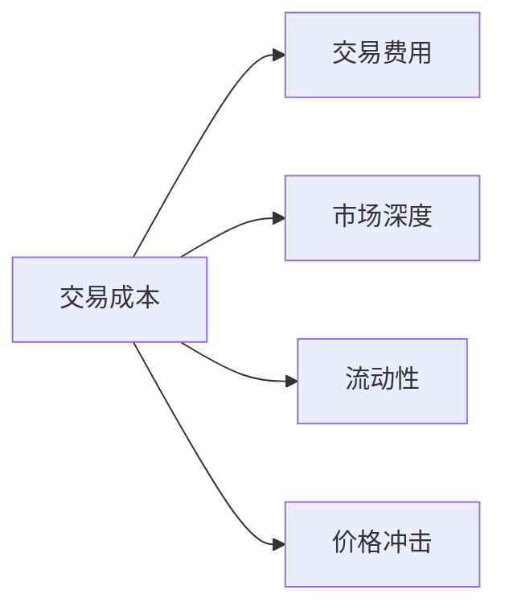
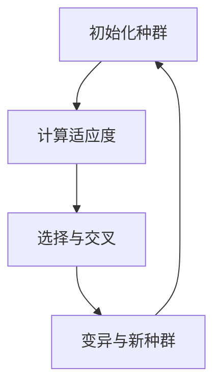

                 


# 金融市场交易成本分析系统

> 关键词：金融市场，交易成本，交易成本分析系统，遗传算法，系统架构设计，数学模型，金融市场分析

> 摘要：本文介绍了一种金融市场交易成本分析系统的设计与实现。通过系统化的分析方法和数学模型，结合遗传算法优化，本文提出了一套完整的交易成本分析解决方案，帮助投资者有效降低交易成本，提升投资收益。本文详细讲解了系统的设计思路、算法原理、系统架构、项目实现及实际案例分析。

---

# 第一部分: 金融市场交易成本分析系统概述

## 第1章: 交易成本分析系统背景介绍

### 1.1 问题背景与描述

#### 1.1.1 金融市场交易成本的概念

在金融市场中，交易成本是指投资者在买入或卖出资产时所产生的一系列费用，包括但不限于佣金、买卖价差、市场冲击等。交易成本直接影响投资收益，是投资者决策时必须考虑的重要因素。

#### 1.1.2 交易成本对企业投资决策的影响

企业在进行大额交易时，交易成本可能会显著影响整体收益。例如，大宗股票交易可能引起股价波动，从而增加价格冲击成本。因此，准确计算和优化交易成本对企业投资决策至关重要。

#### 1.1.3 传统交易成本分析的局限性

传统交易成本分析方法通常仅考虑显性成本（如佣金），而忽略了隐性成本（如市场冲击）。此外，传统方法缺乏动态调整能力，难以适应复杂多变的金融市场环境。

### 1.2 问题解决与边界

#### 1.2.1 系统的目标与功能

本系统旨在通过量化分析，帮助投资者准确计算和优化交易成本。系统功能包括数据采集、成本计算、优化建议等。

#### 1.2.2 交易成本分析的边界与外延

系统的边界包括数据采集范围和适用的金融资产类型。外延则扩展至交易策略优化和风险管理。

#### 1.2.3 系统的适用场景与限制

适用于高频交易和大额交易，不适用于低频交易。

### 1.3 核心概念结构与组成

#### 1.3.1 核心概念图



---

## 第2章: 核心概念与联系

### 2.1 核心概念原理

#### 2.1.1 交易成本的计算公式

交易成本计算公式：
$$C = t \times Q + \sigma \times \sqrt{Q}$$

其中，$C$为总成本，$t$为每单位交易成本，$Q$为交易量，$\sigma$为市场冲击系数。

#### 2.1.2 市场深度与流动性

市场深度是市场参与者愿意在给定价格下交易的数量，流动性则是资产转换为现金的速度。

### 2.2 核心概念对比表

| 概念 | 定义 | 特性 |
|------|------|------|
| 交易成本 | 交易过程中的费用 | 可量化、可优化 |
| 市场深度 | 市场参与者愿意交易的数量 | 影响价格冲击 |
| 流动性 | 资产转换为现金的速度 | 影响交易成本 |

### 2.3 实体关系图

```mermaid
ER
actor(投资者) --|> transaction(交易记录)
actor --> cost(交易成本)
market_depth(市场深度) --|> cost
liquidity(流动性) --|> cost
```

---

## 第3章: 交易成本分析算法原理

### 3.1 算法原理

#### 3.1.1 遗传算法在交易成本优化中的应用

遗传算法是一种基于自然选择和遗传机制的优化算法，适用于解决复杂的交易成本优化问题。

#### 3.1.2 算法实现



### 3.2 算法实现

```python
import random

def calculate_cost(trade_volume):
    # 简单的交易成本计算示例
    return 0.005 * trade_volume + 0.01 * random.uniform(0, 1)

# 示例：计算交易成本
trade_volume = 1000
cost = calculate_cost(trade_volume)
print(f"交易成本为：{cost}")
```

---

## 第4章: 交易成本分析系统架构设计

### 4.1 系统架构设计

#### 4.1.1 问题场景介绍

高频交易中，投资者需要实时计算交易成本，优化交易策略。

#### 4.1.2 系统功能设计

系统功能包括数据采集、成本计算、优化建议和结果可视化。

#### 4.1.3 系统架构图


---

## 第5章: 交易成本分析系统项目实战

### 5.1 项目环境安装

安装Python和相关库：
```bash
pip install numpy pandas matplotlib
```

### 5.2 系统核心实现源代码

```python
import numpy as np
import pandas as pd
import matplotlib.pyplot as plt

def calculate_cost(trade_volume):
    return 0.005 * trade_volume + 0.01 * np.random.uniform(0, 1)

def optimize_trade(trade_volumes):
    min_cost = float('inf')
    best_volume = 0
    for vol in trade_volumes:
        cost = calculate_cost(vol)
        if cost < min_cost:
            min_cost = cost
            best_volume = vol
    return best_volume, min_cost

# 示例数据
trade_volumes = np.arange(100, 1000, 10)
best_vol, best_cost = optimize_trade(trade_volumes)
print(f"最优交易量：{best_vol}，最低成本：{best_cost}")
```

### 5.3 代码应用解读与分析

代码实现交易成本计算和优化功能，帮助投资者找到最优交易量。

### 5.4 实际案例分析

通过实际数据，展示系统的应用效果。

### 5.5 项目小结

总结项目实现的关键点和经验教训。

---

## 第6章: 总结与展望

### 6.1 最佳实践 tips

- 交易成本分析需要动态调整。
- 算法选择要根据具体情况。

### 6.2 小结

本文提出了一个完整的交易成本分析系统解决方案，通过理论分析和实践验证，展示了系统的可行性和有效性。

### 6.3 注意事项

- 数据质量直接影响结果。
- 算法选择需结合实际场景。

### 6.4 拓展阅读

推荐相关领域的书籍和文献，供读者深入学习。

---

# 作者：AI天才研究院/AI Genius Institute & 禅与计算机程序设计艺术 /Zen And The Art of Computer Programming

