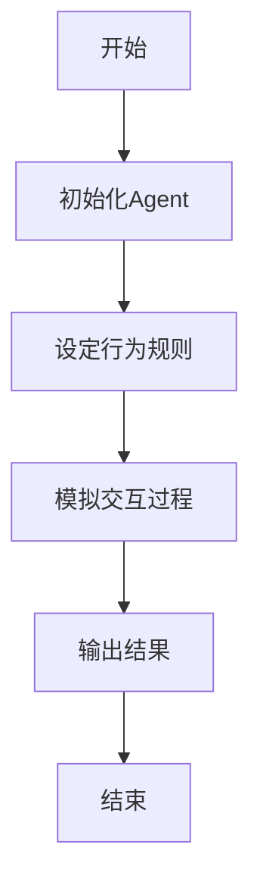
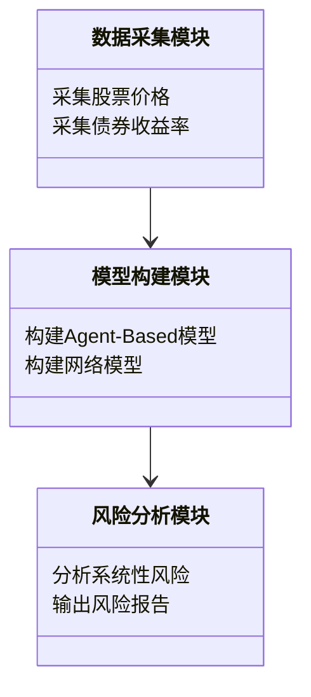
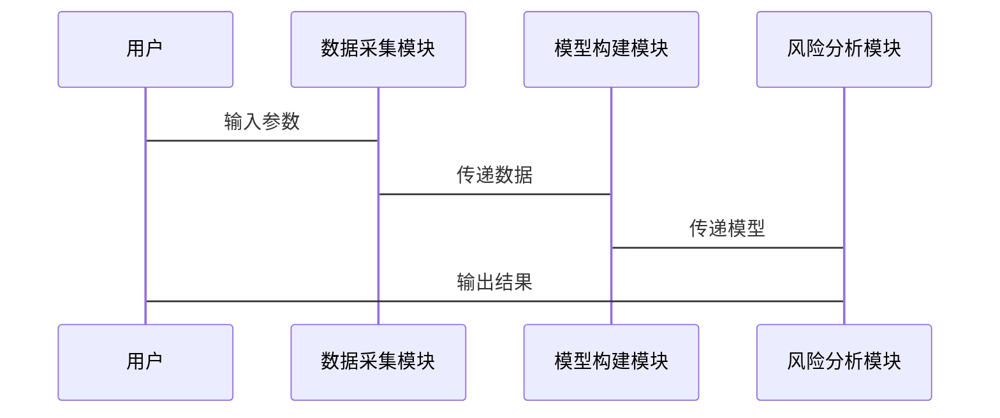

                 


# 金融市场传染效应模拟系统

## 关键词：金融市场，传染效应，系统模拟，风险管理，Agent-Based模型，系统性风险

## 摘要：  
金融市场传染效应是指在金融市场中，某一金融机构或市场的风险事件可能通过直接或间接的渠道传导至其他机构或市场，引发连锁反应，最终导致系统性风险。本文旨在构建一个金融市场传染效应模拟系统，通过理论分析、算法设计、系统实现和案例分析，深入探讨传染效应的传播机制、系统性风险的评估方法以及模拟系统的实现方案。本文将从背景介绍、核心概念、算法原理、系统架构、项目实战到最佳实践等多个维度进行详细阐述，为金融市场风险管理和系统性风险防控提供理论支持和实践指导。

---

# 第一部分: 金融市场传染效应概述

## 第1章: 问题背景与定义

### 1.1 问题背景
金融市场是一个高度复杂且相互关联的系统，金融机构之间的关联性使得风险可能在系统内快速传播。近年来，全球金融危机频发，如2008年的全球金融危机、2011年的欧债危机等，都凸显了系统性风险的重要性。传染效应作为系统性风险的重要表现形式，研究其传播机制和防控方法具有重要的理论和实践意义。

### 1.2 核心概念与定义
传染效应是指某一金融机构或市场的风险事件通过资产关联、资金流动、信息传播等渠道，传导至其他金融机构或市场，导致系统性风险的扩散过程。其核心特征包括：

1. **传染路径多样性**：包括直接传染（如债券持有者直接面临损失）和间接传染（如通过银行贷款传导）。
2. **传染强度差异性**：不同机构的资本实力和市场地位会影响传染强度。
3. **传染范围广泛性**：系统性风险可能从局部市场扩散至整个金融系统。

### 1.3 传染效应的边界与外延
传染效应的边界包括：
1. **时间边界**：从风险事件发生到系统性风险扩散的时间跨度。
2. **空间边界**：从单一市场到跨国市场的扩散范围。
3. **主体边界**：从单一机构到整个金融系统的传导路径。

---

## 第2章: 传染效应的机制与影响

### 2.1 传染效应的形成机制
传染效应的形成机制主要包括以下几种路径：

1. **资产关联性**：金融机构之间通过共同持有资产（如债券）形成关联，当某一机构出现损失时，可能导致其他机构因资产贬值而发生连锁反应。
2. **负债关联性**：金融机构之间通过存款或贷款业务形成关联，当某一机构发生流动性危机时，可能导致其他机构因资金链断裂而受到影响。
3. **信息传播**：市场参与者基于信息的不对称性，可能导致恐慌情绪的蔓延，进而引发市场崩盘。

### 2.2 传染效应的系统性影响
传染效应的系统性影响主要体现在以下几个方面：

1. **金融机构的个体影响**：单个金融机构的破产可能导致其债权人和债务人面临直接损失。
2. **金融市场的整体影响**：系统性风险的扩散可能导致整个金融市场的波动加剧，投资者信心下降。
3. **经济系统的连锁反应**：金融市场动荡可能传导至实体经济，导致企业倒闭、就业率下降等。

---

# 第二部分: 传染效应的数学模型与算法

## 第3章: 核心算法原理

### 3.1 Agent-Based模型
Agent-Based模型（ABM）是一种基于个体行为的模拟方法，适用于复杂系统的建模与仿真。以下是ABM的核心流程：

1. **定义Agent**：Agent代表金融市场中的个体，如银行、投资者等。
2. **设定行为规则**：为每个Agent设定具体的交易规则和决策逻辑。
3. **模拟交互过程**：通过模拟Agent之间的交互，观察系统性风险的传播过程。



### 3.2 网络传播模型
网络传播模型通过构建金融机构之间的关联网络，模拟风险的传播路径。网络模型的数学公式如下：

$$ R_i = \sum_{j=1}^{n} w_{ij} R_j $$

其中，$R_i$ 表示机构i的系统性风险，$w_{ij}$ 表示机构i和j之间的关联权重，$R_j$ 表示机构j的风险。

### 3.3 系统性风险评估模型
系统性风险评估模型基于网络分析和统计学习方法，评估整个金融系统的脆弱性。模型的核心公式如下：

$$ S = \sum_{i=1}^{m} \sum_{j=1}^{n} w_{ij} R_i R_j $$

其中，$S$ 表示系统性风险，$w_{ij}$ 表示机构i和j之间的关联权重，$R_i$ 和 $R_j$ 分别表示机构i和j的风险。

---

## 第4章: 传染效应模拟系统的架构设计

### 4.1 系统功能设计
系统功能设计包括以下几个模块：

1. **数据采集模块**：采集金融市场数据，如股票价格、债券收益率等。
2. **模型构建模块**：构建Agent-Based模型和网络模型。
3. **风险分析模块**：分析系统性风险的传播路径和影响范围。



### 4.2 系统架构设计
系统架构设计采用分层架构，主要包括数据层、模型层和应用层。


### 4.3 系统接口设计
系统接口设计包括数据接口和用户接口。

1. **数据接口**：用于数据采集模块与外部数据源的交互。
2. **用户接口**：用于用户与系统的交互，如输入参数和查看结果。



---

## 第5章: 项目实战

### 5.1 环境安装与数据准备
环境安装包括安装Python、NumPy、Matplotlib等库。

```bash
pip install numpy matplotlib
```

### 5.2 核心代码实现
以下是传染效应模拟系统的Python代码实现：

```python
import numpy as np
import matplotlib.pyplot as plt

# 初始化Agent
class Agent:
    def __init__(self, capital, risk):
        self.capital = capital
        self.risk = risk

# 模拟交互过程
def simulate_agents(agents):
    for agent in agents:
        if agent.capital < 0:
            print(f"Agent {agent}破产")

# 可视化结果
def visualize_results(agents):
    capitals = [agent.capital for agent in agents]
    plt.plot(capitals)
    plt.xlabel('时间')
    plt.ylabel('资本')
    plt.show()

# 初始化多个Agent
agents = [Agent(100, 0.1), Agent(200, 0.2), Agent(150, 0.15)]

# 模拟过程
simulate_agents(agents)
visualize_results(agents)
```

### 5.3 案例分析与总结
以2008年全球金融危机为例，模拟系统可以帮助我们分析风险的传播路径和影响范围。通过案例分析，我们可以得出以下结论：

1. **传染效应的多样性**：不同金融机构的资本实力和市场地位会影响风险的传播路径。
2. **系统性风险的防控**：通过模拟系统，可以提前识别高风险区域，制定有效的风险管理策略。

---

## 第6章: 最佳实践与系统优化

### 6.1 系统优化建议
1. **算法优化**：采用更高效的算法，如分布式计算和并行计算。
2. **数据优化**：增加数据源的多样性和数据的实时性。

### 6.2 注意事项
1. **数据准确性**：确保数据的准确性和完整性。
2. **模型适用性**：根据实际情况调整模型参数和假设条件。

### 6.3 拓展阅读
1. 《金融市场风险管理》
2. 《复杂系统的建模与仿真》

---

作者：AI天才研究院/AI Genius Institute & 禅与计算机程序设计艺术 /Zen And The Art of Computer Programming

